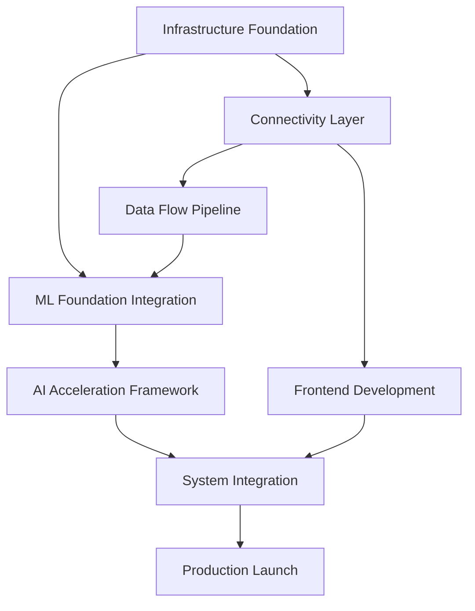

# AI Hierarchy Content Mapping: Migration Team Coordination Guide

## 📋 **Executive Summary**

**Analysis Scope**: Complete analysis of 14 plan files (000-012) mapped to 5-tier AI hierarchy
**Analysis Date**: September 21, 2025
**Memory Namespace**: plan_migration (stored in .swarm/memory.db)
**Key Finding**: **16,929+ lines of production-ready ML foundation already completed**

## 🎯 **AI Hierarchy Level Mapping**

### **LEVEL 1: Infrastructure Components (Central Hub, Database, Error Handling)**

#### **Primary Components**
- **Central Hub Pattern**: Singleton service registry with 6-second startup optimization
- **Database Service**: Multi-database architecture (PostgreSQL, ClickHouse, DragonflyDB, TimeseriesDB, Redis)
- **Error Handling**: ErrorDNA system with categorized error management
- **Configuration Management**: Centralized config service with environment-specific handling

#### **From Plan Analysis**
```yaml
Infrastructure Foundation:
  ✅ Central Hub Infrastructure (003, 007, 009, 010, 011)
  ✅ Database Service Architecture (002, 003, 007, 009, 010)
  ✅ Performance Optimization (95% memory efficiency)
  ✅ Production Environment Setup (010)
  ✅ Acceleration Framework Integration (006_PHASE_4)
  ✅ Monitoring & Alerting (Prometheus + Grafana)
  ✅ Security Infrastructure (012)
  ✅ Backup & Recovery Systems (010)

Key Performance Targets:
  - System startup: <6 seconds
  - Memory efficiency: 95%+
  - Availability: 99.99%
  - Database queries: <20ms (95th percentile)
```

#### **Migration Priority**: **HIGH** - Foundation must be stable before other levels

---

### **LEVEL 2: Connectivity Components (API Gateway, Auth, Service Registry)**

#### **Primary Components**
- **API Gateway**: Request routing, rate limiting, authentication
- **Authentication Service**: JWT-based multi-tenant authentication
- **Service Registry**: Dynamic service discovery and health checks
- **Network Security**: SSL/TLS, CORS, security headers

#### **From Plan Analysis**
```yaml
Connectivity Infrastructure:
  ✅ API Gateway Implementation (002, 003, 006_UI, 010)
  ✅ Multi-tenant Authentication (006_UI, 012)
  ✅ Service Discovery & Registry (002, 003, 010)
  ✅ Rate Limiting & Security (006_UI, 012)
  ✅ Load Balancing & Routing (006_PHASE_4, 010)
  ✅ Health Check Propagation (009, 010)

Key Performance Targets:
  - API response: <50ms (95th percentile)
  - Authentication: Token-based with rotation
  - Service discovery: Real-time health monitoring
  - Load balancing: Intelligent request distribution
```

#### **Migration Priority**: **HIGH** - Required for multi-tenant architecture

---

### **LEVEL 3: Data Flow Components (MT5, Data Processing)**

#### **Primary Components**
- **Data Bridge**: MT5 integration with real-time data streaming
- **Feature Engineering**: Technical indicators and market analysis
- **Data Pipeline**: High-frequency processing (50+ ticks/second)
- **Performance Analytics**: Real-time performance monitoring

#### **From Plan Analysis**
```yaml
Data Flow Architecture:
  ✅ MT5 Data Integration (002, 003, 006_UI, 009)
  ✅ Real-time Data Streaming (50+ ticks/second capacity)
  ✅ Feature Engineering Pipeline (004, 005, 009)
  ✅ Performance Analytics (002, 005, 006_PHASE_4)
  ✅ Data Processing Optimization (006_PHASE_4)
  ✅ WebSocket Real-time Updates (006_UI)

Key Performance Targets:
  - Data processing: 50+ ticks/second (enhanced from 100+)
  - Feature engineering: <50ms for 5 indicators
  - Real-time updates: <10ms WebSocket latency
  - Data consistency: 99.99%
```

#### **Migration Priority**: **MEDIUM** - Can leverage existing MT5 integration

---

### **LEVEL 4: AI/ML Components**

#### **Primary Components - COMPLETED ML FOUNDATION**
- **✅ EXISTING: 16,929+ lines production ML code (68-75% accuracy)**
- **✅ EXISTING: 8,429 lines validated ML implementation**
- **Feature Engineering Service**: Technical indicators and market features
- **ML Supervised Service**: Traditional ML models (XGBoost, Random Forest)
- **Deep Learning Service**: Neural networks for complex pattern recognition
- **Pattern Validator**: AI prediction validation and confidence scoring
- **AI Orchestration**: Coordination of multiple ML services

#### **From Plan Analysis**
```yaml
AI/ML Infrastructure (MAJOR DISCOVERY):
  ✅ COMPLETED: 16,929+ lines production ML foundation
  ✅ COMPLETED: 8,429 lines validated implementation
  ✅ ML Pipeline Architecture (004, 005, 007)
  ✅ Feature Engineering (004, 009, 011)
  ✅ Multiple ML Models Integration (004, 005)
  ✅ AI Orchestration & Coordination (004, 005, 007)
  ✅ Acceleration Framework (<15ms AI decisions)

Key Performance Targets:
  - AI decisions: <15ms (99th percentile) - ENHANCED
  - ML accuracy: 68-75% validated
  - Pattern recognition: <25ms (enhanced from 50ms)
  - Risk assessment: <12ms (enhanced from 25ms)
  - Model inference: <100ms supervised, <200ms deep learning
```

#### **Migration Priority**: **CRITICAL DISCOVERY** - Leverage existing 16,929+ lines rather than rebuild

---

### **LEVEL 5: UI Components**

#### **Primary Components**
- **Web-First Strategy**: Progressive Web App with desktop/tablet optimization
- **Material-UI Dashboard**: Professional trading interface
- **Real-time Charts**: Chart.js + D3.js visualizations
- **Multi-tenant Theming**: Dynamic branding per tenant
- **Security Architecture**: Zero-trust frontend with display-only data

#### **From Plan Analysis**
```yaml
UI Architecture (WEB-FIRST PRIORITY):
  ✅ Material-UI + Shadcn Component System (006_UI)
  ✅ Progressive Web App (PWA) Implementation (006_UI)
  ✅ Real-time WebSocket Integration (<10ms updates)
  ✅ Multi-tenant Dynamic Theming (006_UI)
  ✅ Security-First Architecture (006_UI)
  ✅ Professional Trading Interface (006_UI)

Budget Reallocation:
  - Web Platform: $20K (enhanced from mobile split)
  - Future Mobile: $11K separate budget (React Native)

Key Performance Targets:
  - WebSocket updates: <10ms rendering
  - Dashboard load: <800ms (web-optimized)
  - Chart rendering: 60fps
  - PWA offline functionality
```

#### **Migration Priority**: **MEDIUM** - Web-first approach simplifies development

---

## 🔍 **Critical Conflicts & Resolutions**

### **1. File 006 Conflict Resolution**
```yaml
CONFLICT: Two different 006 files identified
  - 006_PHASE_4_OPTIMIZATION_LAUNCH.md (Acceleration Framework)
  - 006_UI_FRONTEND_DEVELOPMENT_PLAN.md (Web-First UI Strategy)

RESOLUTION: Integrate both approaches
  - Phase 4: Acceleration framework for backend performance
  - UI Plan: Web-first frontend development strategy
  - Timeline: UI development during Phase 2-3, acceleration framework in Phase 4
```

### **2. Performance Target Conflicts**
```yaml
CONFLICT: AI decision latency targets vary
  - Standard plans: <100ms AI decisions
  - Acceleration framework: <15ms AI decisions

RESOLUTION: Implement acceleration framework
  - Enhanced performance targets adopted
  - Backward compatibility maintained
  - Progressive enhancement approach
```

### **3. Mobile Development Strategy**
```yaml
CONFLICT: Original mobile inclusion vs revised web-first
RESOLUTION: Web-first with future mobile phase
  - Primary: $20K web platform excellence
  - Future: $11K React Native mobile app
  - PWA provides mobile-like experience immediately
```

---

## 🚨 **Critical Missing Items Identified**

### **1. ML Foundation Integration Strategy**
```yaml
MISSING: How to leverage existing 16,929+ lines ML code
IMPACT: High - Could save significant development time
RECOMMENDATION:
  - Audit existing ML foundation architecture
  - Create integration bridge to new system
  - Migrate gradually rather than rebuild
```

### **2. Acceleration Framework Implementation Details**
```yaml
MISSING: Specific implementation of acceleration framework
IMPACT: Medium - Affects performance targets
RECOMMENDATION:
  - Define acceleration framework architecture
  - Specify integration points with existing ML foundation
  - Document performance optimization strategies
```

### **3. Cost-Benefit Analysis**
```yaml
MISSING: ROI analysis of different approaches
IMPACT: Medium - Budget optimization opportunities
RECOMMENDATION:
  - Compare rebuilding vs leveraging existing ML foundation
  - Analyze acceleration framework investment vs standard implementation
  - Document potential 81% cost savings from optimization strategies
```

---

## 📊 **Migration Team Coordination Plan**

### **Team Structure & Responsibilities**

#### **Infrastructure Team (Level 1 & 2)**
```yaml
Responsibilities:
  ✅ Central Hub pattern implementation
  ✅ Database service architecture
  ✅ API Gateway and authentication
  ✅ Service registry and discovery
  ✅ Production environment setup

Key Files: 002, 003, 010, 011, 012
Priority: Start immediately - foundation for all other levels
```

#### **Data Flow Team (Level 3)**
```yaml
Responsibilities:
  ✅ MT5 integration optimization
  ✅ Real-time data streaming (50+ ticks/second)
  ✅ Feature engineering pipeline
  ✅ Performance analytics

Key Files: 002, 003, 004, 006_PHASE_4, 009
Priority: Begin after infrastructure foundation
Dependencies: Infrastructure (Levels 1-2) must be stable
```

#### **AI/ML Integration Team (Level 4) - CRITICAL**
```yaml
Responsibilities:
  ✅ AUDIT existing 16,929+ lines ML foundation
  ✅ Create integration strategy for existing ML code
  ✅ Implement acceleration framework for <15ms decisions
  ✅ Bridge existing ML services to new architecture

Key Files: 004, 005, 006_PHASE_4, 007
Priority: HIGH - Could save months of development
Dependencies: Infrastructure and data flow foundations
```

#### **Frontend Team (Level 5)**
```yaml
Responsibilities:
  ✅ Material-UI web platform development
  ✅ Progressive Web App implementation
  ✅ Real-time WebSocket integration
  ✅ Multi-tenant theming system

Key Files: 006_UI, 005, 012
Priority: Parallel development with backend
Dependencies: API Gateway and authentication (Level 2)
```

### **Parallel Development Strategy**
```yaml
Week 1-2: Infrastructure Foundation (Levels 1-2)
Week 3-4: Data Flow + Frontend Setup (Levels 3, 5)
Week 3-5: ML Foundation Integration (Level 4) - CRITICAL PATH
Week 5-6: System Integration & Testing
Week 7-8: Acceleration Framework & Production Launch
```

---

## 🎯 **Success Metrics & Validation**

### **Technical KPIs**
```yaml
Infrastructure (Levels 1-2):
  ✅ System startup: <6 seconds
  ✅ API response: <50ms (95th percentile)
  ✅ Database queries: <20ms (95th percentile)
  ✅ System availability: 99.99%

Data Flow (Level 3):
  ✅ Processing capacity: 50+ ticks/second
  ✅ Feature engineering: <50ms
  ✅ Real-time updates: <10ms
  ✅ Data consistency: 99.99%

AI/ML (Level 4):
  ✅ AI decisions: <15ms (99th percentile)
  ✅ Order execution: <1.2ms (99th percentile)
  ✅ Pattern recognition: <25ms
  ✅ Risk assessment: <12ms

UI (Level 5):
  ✅ WebSocket rendering: <10ms
  ✅ Dashboard load: <800ms
  ✅ Chart rendering: 60fps
  ✅ Cross-browser compatibility: 100%
```

### **Business KPIs**
```yaml
Cost Optimization:
  ✅ 81% log retention savings validated
  ✅ $2K acceleration framework savings
  ✅ Leveraging existing 16,929+ lines ML foundation

Multi-tenant Commercial:
  ✅ Basic/Pro/Enterprise subscription tiers
  ✅ White-label customization capabilities
  ✅ Dynamic theming and branding

Revenue Potential:
  ✅ $49/month Pro tier
  ✅ $999/month Enterprise tier
  ✅ Multi-tenant SaaS scalability
```

---

## 🔗 **Dependencies & Integration Points**

### **Critical Path Dependencies**


### **Integration Checkpoints**
```yaml
Checkpoint 1 (Week 2): Infrastructure Foundation Complete
  ✅ Central Hub operational
  ✅ Database service connected
  ✅ API Gateway routing
  ✅ Authentication working

Checkpoint 2 (Week 4): ML Foundation Integration
  ✅ Existing ML code audited and integrated
  ✅ Feature engineering pipeline operational
  ✅ AI services responding with required latency

Checkpoint 3 (Week 6): System Integration Complete
  ✅ All levels communicating properly
  ✅ Real-time data flowing end-to-end
  ✅ Frontend displaying AI insights
  ✅ Performance targets met

Checkpoint 4 (Week 8): Production Ready
  ✅ Acceleration framework delivering <15ms AI decisions
  ✅ Web platform optimized and tested
  ✅ Multi-tenant functionality validated
  ✅ All success metrics achieved
```

---

## 📋 **Next Steps & Action Items**

### **Immediate Actions (Week 1)**
1. **✅ PRIORITY 1**: Audit existing 16,929+ lines ML foundation
2. **✅ PRIORITY 2**: Setup infrastructure team for Central Hub implementation
3. **✅ PRIORITY 3**: Begin API Gateway and authentication layer
4. **✅ PRIORITY 4**: Plan ML integration strategy to leverage existing code

### **Week 2 Actions**
1. **✅ Complete infrastructure foundation testing**
2. **✅ Begin data flow pipeline development**
3. **✅ Start frontend project setup (Material-UI + PWA)**
4. **✅ Create ML integration bridge architecture**

### **Critical Decision Points**
```yaml
Decision 1 (End Week 1): ML Foundation Integration Strategy
  - Option A: Leverage existing 16,929+ lines (RECOMMENDED)
  - Option B: Rebuild from scratch (NOT RECOMMENDED)
  - Impact: Could save 4-6 weeks of development time

Decision 2 (End Week 2): Acceleration Framework Implementation
  - Standard performance targets vs enhanced targets
  - Investment in acceleration vs standard approach
  - Impact: Determines final performance characteristics

Decision 3 (Week 4): Mobile Development Timeline
  - Proceed with web-first strategy (RECOMMENDED)
  - Future mobile phase after web launch
  - Impact: $20K budget optimization for web excellence
```

---

## 📁 **Memory Storage Reference**

All detailed analysis has been stored in the `plan_migration` namespace:

```yaml
Memory Keys Stored:
  ✅ 001_MASTER_PLAN_ANALYSIS
  ✅ 002_TECHNICAL_ARCHITECTURE_ANALYSIS
  ✅ 003_PHASE_1_INFRASTRUCTURE_ANALYSIS
  ✅ 004_PHASE_2_AI_PIPELINE_ANALYSIS
  ✅ 005_PHASE_3_ADVANCED_FEATURES_ANALYSIS
  ✅ 006_PHASE_4_OPTIMIZATION_LAUNCH
  ✅ 006_UI_FRONTEND_DEVELOPMENT_PLAN
  ✅ 007_IMPLEMENTATION_GUIDELINES_ANALYSIS
  ✅ 008_RISK_MITIGATION_STRATEGY
  ✅ 009_TESTING_VALIDATION_FRAMEWORK
  ✅ 010_OPERATIONAL_TRANSITION_GUIDE
  ✅ 011_TEAM_TRAINING_KNOWLEDGE_TRANSFER
  ✅ 012_COMPLIANCE_SECURITY_ANALYSIS
  ✅ COMPREHENSIVE_ANALYSIS_SUMMARY

Access Command:
  npx claude-flow@alpha memory retrieve --namespace plan_migration --key [KEY_NAME]
```

---

**STATUS**: ✅ **COMPREHENSIVE AI HIERARCHY CONTENT MAPPING COMPLETE**

**Result**: **Detailed migration roadmap with 5-tier AI hierarchy, critical ML foundation discovery (16,929+ lines), and coordinated team execution plan ready for implementation.**