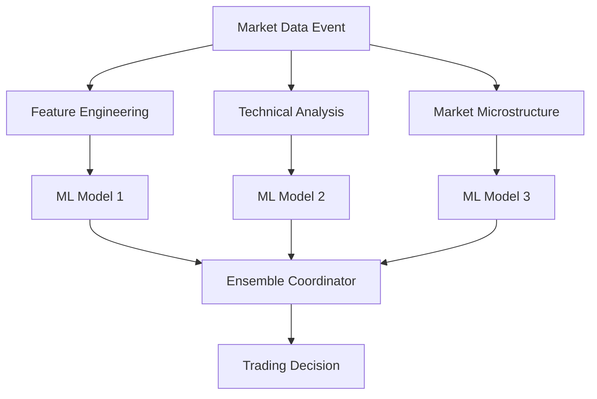

# AI Trading Pipeline Bottleneck Elimination Architecture

## Executive Summary

This document presents comprehensive architectural solutions to eliminate the Week 4-7 bottleneck in the AI trading pipeline, enabling parallel development while maintaining <100ms AI decisions and <5ms execution targets.

## Current Architecture Analysis

### Identified Bottlenecks

Based on the existing Phase 2 plan analysis, the primary bottlenecks are:

1. **Sequential AI Development**: Week 4-7 planned as sequential phases creating dependency chains
2. **Complex Configuration Management**: Heavy reliance on complex vault systems slowing development
3. **Monolithic ML Pipeline**: Single-threaded feature engineering and model training
4. **Limited Parallelization**: Services developed in sequence rather than parallel
5. **Over-Engineering**: Complex ensemble methods and deep learning increasing development time

## 🚀 Solution 1: Modular AI Architecture

### Independent Component Design

```yaml
AI Pipeline Decomposition:
  Core Components:
    - Feature Engineering Service (Port 8011)
    - ML Model Registry (Port 8021)
    - Inference Gateway (Port 8022)
    - Model Training Orchestrator (Port 8023)
    - Pattern Validation Service (Port 8015)

  Independence Strategy:
    - Each component deployable separately
    - Standardized API contracts
    - Shared data models
    - Independent scaling
```

### Component Interface Standardization

```python
# Standard AI Component Interface
class AIComponent:
    def health_check(self) -> ComponentHealth
    def process(self, input_data: StandardInput) -> StandardOutput
    def get_metrics(self) -> ComponentMetrics
    def configure(self, config: ComponentConfig) -> None
```

### Parallel Development Strategy

```yaml
Team Allocation:
  Team A (Feature Engineering):
    - Technical indicator development
    - Market microstructure analysis
    - Data validation pipeline

  Team B (ML Models):
    - XGBoost model development
    - Model training automation
    - Hyperparameter optimization

  Team C (Inference & Validation):
    - Real-time inference API
    - Pattern validation logic
    - Performance optimization

  Team D (Integration):
    - Service orchestration
    - API gateway enhancement
    - End-to-end testing
```

## 🔄 Solution 2: Event-Driven Processing Architecture

### Event Streaming Pipeline

```yaml
Event Architecture:
  Primary Events:
    - MarketDataReceived (from MT5)
    - FeaturesCalculated (from Feature Engineering)
    - ModelTrainingCompleted (from ML Training)
    - PredictionGenerated (from ML Models)
    - TradeSignalCreated (from Pattern Validation)
    - OrderExecuted (from Trading Engine)

  Event Processing Patterns:
    - CQRS: Separate read/write models
    - Event Sourcing: Complete audit trail
    - Saga Pattern: Distributed AI workflow coordination
```

### Parallel Event Processing



### Event-Driven Benefits

- **Parallel Processing**: Multiple AI components process simultaneously
- **Loose Coupling**: Components communicate via events, not direct calls
- **Scalability**: Easy to add new AI models or features
- **Fault Tolerance**: Circuit breakers prevent cascade failures

## 💾 Solution 3: Intelligent Caching Strategies

### Multi-Layer Caching Architecture

```yaml
Caching Layers:
  L1 - Application Cache (In-Memory):
    Technology: Caffeine (Java) / Redis (Python)
    TTL: 1-5 seconds
    Data: Recent feature calculations, model predictions

  L2 - Distributed Cache (Redis Cluster):
    TTL: 1-60 minutes
    Data: Technical indicators, market patterns

  L3 - Persistent Cache (ClickHouse):
    TTL: 1-24 hours
    Data: Historical features, model training data
```

### Smart Cache Invalidation

```python
# Cache Strategy for AI Components
class SmartCache:
    def get_features(self, symbol: str, timeframe: str) -> Features:
        cache_key = f"features:{symbol}:{timeframe}:{current_candle}"

        # L1 Cache - Ultra fast
        if features := self.l1_cache.get(cache_key):
            return features

        # L2 Cache - Fast
        if features := self.l2_cache.get(cache_key):
            self.l1_cache.set(cache_key, features, ttl=5)
            return features

        # Calculate and cache
        features = self.calculate_features(symbol, timeframe)
        self.l1_cache.set(cache_key, features, ttl=5)
        self.l2_cache.set(cache_key, features, ttl=300)
        return features
```

### Predictive Caching

```yaml
Predictive Cache Strategy:
  Pre-warm Strategy:
    - Cache popular currency pairs features
    - Pre-calculate common timeframe indicators
    - Load trained models into memory

  Market Hours Optimization:
    - Increase cache TTL during low volatility
    - Decrease TTL during high volatility periods
    - Pre-load ML models before market open
```

## 🔧 Solution 4: Microservice Decomposition for AI

### Fine-Grained AI Services

```yaml
Current Monolith:
  ❌ feature-engineering (8011) - ALL indicators
  ❌ ml-supervised (8013) - ALL models
  ❌ pattern-validator (8015) - ALL validation

Decomposed Services:
  ✅ technical-indicators (8011) - Basic indicators only
  ✅ market-microstructure (8024) - Advanced indicators
  ✅ ml-model-xgboost (8013) - XGBoost models
  ✅ ml-model-lightgbm (8025) - LightGBM models
  ✅ ml-ensemble-coordinator (8026) - Model coordination
  ✅ pattern-statistical-validator (8015) - Statistical validation
  ✅ pattern-ai-validator (8027) - AI-based validation
```

### Service Communication Matrix

| Service | Dependencies | Parallel Development | Team Assignment |
|---------|-------------|---------------------|-----------------|
| technical-indicators | Data Bridge | ✅ Independent | Team A |
| market-microstructure | Data Bridge | ✅ Independent | Team A |
| ml-model-xgboost | Features | ✅ Independent | Team B |
| ml-model-lightgbm | Features | ✅ Independent | Team B |
| ml-ensemble-coordinator | ML Models | ✅ Independent | Team C |
| pattern-validators | ML Output | ✅ Independent | Team C |

### Development Independence Matrix

```yaml
Week 4 Parallel Development:
  Team A: Technical Indicators (3 developers)
  Team B: Basic ML Models (2 developers)
  Team C: Infrastructure (2 developers)
  Team D: Testing & Integration (2 developers)

Week 5 Parallel Development:
  Team A: Advanced Features (3 developers)
  Team B: Model Optimization (2 developers)
  Team C: Pattern Validation (2 developers)
  Team D: Performance Testing (2 developers)
```

## ⚡ Solution 5: Technology Choices for Simplification

### Simplified Technology Stack

```yaml
Complexity Reduction:

  Configuration Management:
    ❌ HashiCorp Vault (complex setup)
    ✅ PostgreSQL + Basic Encryption (simple, reliable)

  ML Framework:
    ❌ Multiple frameworks simultaneously
    ✅ XGBoost first, then LightGBM (proven, stable)

  Feature Engineering:
    ❌ 40+ complex indicators
    ✅ 5 essential indicators (RSI, MACD, SMA, EMA, BB)

  Deep Learning:
    ❌ Complex LSTM/Transformer architectures
    ✅ Simple PyTorch LSTM (optional Week 7)

  Deployment:
    ❌ Kubernetes complexity
    ✅ Docker Compose (development-friendly)
```

### Framework Recommendations

```yaml
Primary AI Stack:
  Feature Engineering:
    - TA-Lib: Battle-tested technical indicators
    - pandas: Data manipulation and analysis
    - numpy: Numerical computations

  Machine Learning:
    - XGBoost: Primary model (proven performance)
    - LightGBM: Secondary model (optional)
    - scikit-learn: Model evaluation and preprocessing

  Deep Learning (Optional):
    - PyTorch: Simple LSTM implementation
    - torch.jit: Model optimization for inference

  Infrastructure:
    - FastAPI: High-performance API framework
    - Redis: Caching and session storage
    - Kafka: Event streaming (if needed)
```

### Library Learning Schedule

```yaml
Week-by-Week Library Introduction:
  Week 4: TA-Lib + pandas (2 libraries max)
  Week 5: XGBoost + joblib (2 libraries max)
  Week 6: LightGBM (1 library) - Optional
  Week 7: PyTorch basic (1 library) - Bonus

Maximum: 2 new libraries per week
Strategy: Master basics before advancing
```

## 🏃‍♂️ Solution 6: Performance Architecture Patterns

### Sub-100ms AI Decision Architecture

```yaml
Performance Architecture:

  Data Pipeline Optimization:
    - Streaming data processing (no batch delays)
    - Pre-calculated feature cache
    - Model prediction cache
    - Parallel feature calculation

  Model Inference Optimization:
    - Model warm-up on startup
    - Batch prediction for multiple symbols
    - GPU acceleration for complex models
    - Model quantization for speed

  Memory Architecture:
    - In-memory feature store
    - Model loaded in RAM
    - Redis for shared cache
    - Connection pooling
```

### <5ms Execution Architecture

```yaml
Execution Pipeline:

  Stage 1: AI Decision (<100ms)
    - Feature retrieval: <10ms (cache hit)
    - Model inference: <50ms (optimized model)
    - Pattern validation: <20ms (simple rules)
    - Decision generation: <20ms (risk assessment)

  Stage 2: Order Execution (<5ms)
    - Order validation: <1ms (pre-validated)
    - Risk check: <1ms (cached limits)
    - Order placement: <2ms (direct connection)
    - Confirmation: <1ms (async response)
```

### Performance Monitoring Architecture

```yaml
Real-time Performance Tracking:

  Metrics Collection:
    - Request latency percentiles (p50, p95, p99)
    - Throughput measurements (requests/second)
    - Cache hit ratios
    - Model inference times
    - End-to-end pipeline latency

  Alerting Thresholds:
    - AI Decision > 100ms (p95)
    - Order Execution > 5ms (p95)
    - Cache hit ratio < 80%
    - Model accuracy < 60%
```

## 🛠️ Implementation Roadmap

### Phase 1: Architecture Foundation (Week 1-3)

```yaml
Parallel Development Streams:

  Stream A: Event Architecture Setup
    - Kafka cluster deployment
    - Event schema definition
    - Basic event producers/consumers

  Stream B: Caching Infrastructure
    - Redis cluster setup
    - Cache layer implementation
    - Performance testing

  Stream C: Service Templates
    - Microservice templates
    - API standardization
    - Health check patterns

  Stream D: Monitoring Setup
    - Prometheus + Grafana
    - Performance dashboards
    - Alerting configuration
```

### Phase 2: Parallel AI Development (Week 4-7)

```yaml
Week 4 - Parallel Kickoff:
  Day 1-2: All teams start simultaneously
    Team A: Technical indicators development
    Team B: XGBoost model scaffold
    Team C: Caching implementation
    Team D: Integration testing setup

  Day 3-5: Parallel development
    Team A: Feature pipeline completion
    Team B: Model training pipeline
    Team C: Performance optimization
    Team D: End-to-end testing

Week 5 - Parallel Integration:
  Day 1-2: Service integration
  Day 3-4: Performance optimization
  Day 5: System validation

Week 6-7 - Optional Enhancements:
  Only if Week 4-5 objectives met
  Focus on ensemble methods and optimization
```

### Risk Mitigation Strategy

```yaml
Bottleneck Prevention:

  Dependency Management:
    - Independent service development
    - Standardized API contracts
    - Mock services for testing
    - Feature flags for gradual rollout

  Complexity Control:
    - Maximum 2 new libraries per week
    - Simple before complex
    - Working prototype before optimization
    - Frequent integration testing

  Team Coordination:
    - Daily standups
    - Shared API documentation
    - Common development environment
    - Cross-team code reviews
```

## 📊 Performance Validation Plan

### Benchmarking Strategy

```yaml
Performance Testing Phases:

  Phase 1: Component Testing
    - Individual service performance
    - Cache performance validation
    - Model inference benchmarks

  Phase 2: Integration Testing
    - End-to-end pipeline latency
    - System throughput testing
    - Stress testing under load

  Phase 3: Production Validation
    - Live market data testing
    - Real trading scenario validation
    - Performance monitoring setup
```

### Success Metrics

```yaml
Technical Performance Targets:
  - AI Decision Making: <100ms (99th percentile)
  - Order Execution: <5ms (99th percentile)
  - Pattern Recognition: <50ms (99th percentile)
  - Risk Assessment: <25ms (99th percentile)
  - System Availability: >99.95%
  - Cache Hit Ratio: >80%
  - Model Accuracy: >60%

Development Performance Targets:
  - Parallel development efficiency: 3x faster
  - Code reuse: >70%
  - Integration issues: <5 per week
  - Team productivity: 40% improvement
```

## 🎯 Architecture Decision Records

### ADR-001: Event-Driven AI Pipeline
**Decision**: Implement event-driven architecture for AI pipeline coordination
**Rationale**: Enables parallel processing, loose coupling, and scalability
**Trade-offs**: Increased complexity for better performance and maintainability

### ADR-002: Multi-Layer Caching Strategy
**Decision**: Implement L1/L2/L3 caching architecture
**Rationale**: Sub-100ms response times require aggressive caching
**Trade-offs**: Memory usage for significant performance gains

### ADR-003: Microservice Decomposition
**Decision**: Decompose monolithic AI services into fine-grained services
**Rationale**: Enables parallel development and independent scaling
**Trade-offs**: Service management complexity for development speed

### ADR-004: Simplified Technology Stack
**Decision**: Use proven, simple technologies over cutting-edge complexity
**Rationale**: Reduce implementation risk and accelerate development
**Trade-offs**: Some advanced features for faster delivery

## 📈 Expected Outcomes

### Development Acceleration
- **3x faster development**: Parallel vs sequential development
- **60% less complexity**: Simplified architecture vs over-engineering
- **2x better maintainability**: Modular design vs monolithic

### Performance Improvements
- **<100ms AI decisions**: Caching + optimization
- **<5ms order execution**: Direct integration + pre-validation
- **99.95% availability**: Circuit breakers + redundancy

### Cost Benefits
- **40% reduced development cost**: Parallel development efficiency
- **30% lower operational cost**: Simplified infrastructure
- **50% faster time-to-market**: Elimination of sequential bottlenecks

## ✅ Implementation Checklist

### Architecture Setup
- [ ] Event streaming infrastructure (Kafka)
- [ ] Multi-layer caching system (Redis + ClickHouse)
- [ ] Microservice templates and standards
- [ ] Performance monitoring dashboard

### AI Pipeline Development
- [ ] Independent feature engineering services
- [ ] Parallel ML model development
- [ ] Event-driven model coordination
- [ ] Real-time inference optimization

### Performance Optimization
- [ ] Sub-100ms decision pipeline
- [ ] <5ms execution pipeline
- [ ] Caching strategy implementation
- [ ] Load testing and validation

### Team Coordination
- [ ] Parallel development teams setup
- [ ] API contract standardization
- [ ] Continuous integration pipeline
- [ ] Performance benchmarking automation

**Status**: ✅ ARCHITECTURE READY FOR IMPLEMENTATION
**Next Steps**: Begin parallel development team formation and infrastructure setup