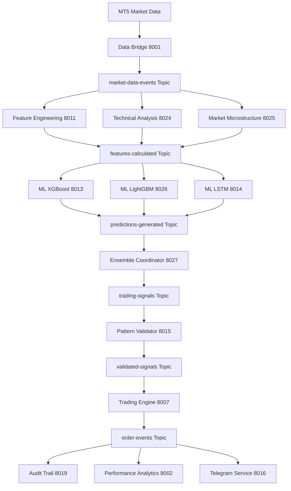

# Detailed Event-Driven Architecture for AI Trading Pipeline

## 🎯 Event-Driven Architecture Design

### Core Event Streaming Infrastructure

```yaml
Event Platform Architecture:
  Primary: Apache Kafka
    - High-throughput trading events
    - Guaranteed message delivery
    - Horizontal scalability
    - Event sourcing capabilities

  Secondary: Redis Streams
    - Low-latency internal messaging
    - Pub/sub for real-time updates
    - Cache-integrated messaging

Event Store:
  Technology: Apache Kafka + Schema Registry
  Retention: 7 years (regulatory compliance)
  Partitioning: By trading symbol and event type
```

### Event Schema Design

```json
{
  "MarketDataReceived": {
    "eventId": "uuid",
    "timestamp": "2024-01-20T10:30:00Z",
    "source": "MT5",
    "symbol": "EURUSD",
    "data": {
      "bid": 1.0850,
      "ask": 1.0852,
      "volume": 1000,
      "timestamp": "2024-01-20T10:30:00Z"
    },
    "metadata": {
      "version": "1.0",
      "producer": "data-bridge-8001"
    }
  },

  "FeaturesCalculated": {
    "eventId": "uuid",
    "timestamp": "2024-01-20T10:30:01Z",
    "correlationId": "market-data-event-id",
    "symbol": "EURUSD",
    "timeframe": "1m",
    "features": {
      "rsi": 65.5,
      "macd": 0.0012,
      "sma_20": 1.0845,
      "ema_50": 1.0847,
      "bb_upper": 1.0860
    },
    "metadata": {
      "calculationTime": "15ms",
      "version": "1.0",
      "producer": "feature-engineering-8011"
    }
  },

  "PredictionGenerated": {
    "eventId": "uuid",
    "timestamp": "2024-01-20T10:30:02Z",
    "correlationId": "features-event-id",
    "symbol": "EURUSD",
    "prediction": {
      "direction": "BUY",
      "confidence": 0.85,
      "targetPrice": 1.0860,
      "stopLoss": 1.0840,
      "timeHorizon": "1h"
    },
    "model": {
      "name": "XGBoost-v1.2",
      "accuracy": 0.72,
      "inferenceTime": "45ms"
    },
    "metadata": {
      "version": "1.0",
      "producer": "ml-xgboost-8013"
    }
  }
}
```

### Event Flow Architecture



## 🔄 Event Processing Patterns

### CQRS (Command Query Responsibility Segregation)

```yaml
Command Side (Write):
  Events: MarketDataReceived, OrderPlaced, ConfigurationUpdated
  Processing: Real-time event handling
  Storage: Event store (Kafka)
  Optimization: High-throughput writes

Query Side (Read):
  Views: Current prices, portfolio positions, performance metrics
  Processing: Event replay and projection
  Storage: ClickHouse (analytics), PostgreSQL (transactional)
  Optimization: Fast read queries
```

### Event Sourcing Implementation

```python
class EventStore:
    def append_event(self, stream_id: str, event: Event) -> None:
        """Append event to stream with guaranteed ordering"""
        kafka_producer.send(
            topic=f"stream-{stream_id}",
            key=stream_id,
            value=event.to_json(),
            timestamp_ms=event.timestamp
        )

    def replay_events(self, stream_id: str, from_timestamp: int) -> Iterator[Event]:
        """Replay events for rebuilding state"""
        consumer = kafka_consumer.subscribe([f"stream-{stream_id}"])
        for message in consumer:
            if message.timestamp >= from_timestamp:
                yield Event.from_json(message.value)
```

### Saga Pattern for Distributed AI Workflows

```python
class AITradingWorkflowSaga:
    def __init__(self):
        self.state = SagaState()
        self.compensations = []

    async def execute_trading_decision(self, market_data_event: Event):
        try:
            # Step 1: Calculate features
            features_event = await self.calculate_features(market_data_event)
            self.compensations.append(self.rollback_feature_calculation)

            # Step 2: Generate predictions
            prediction_event = await self.generate_predictions(features_event)
            self.compensations.append(self.rollback_predictions)

            # Step 3: Validate patterns
            validated_event = await self.validate_patterns(prediction_event)
            self.compensations.append(self.rollback_validation)

            # Step 4: Execute trade
            trade_event = await self.execute_trade(validated_event)

        except Exception as e:
            await self.compensate(e)

    async def compensate(self, error: Exception):
        """Execute compensating actions in reverse order"""
        for compensation in reversed(self.compensations):
            await compensation()
```

## ⚡ High-Performance Event Processing

### Parallel Event Processing

```yaml
Processing Strategy:
  Partitioning:
    - By trading symbol (EURUSD, GBPUSD, etc.)
    - By event type (market-data, features, predictions)
    - By time window (1m, 5m, 15m, 1h)

  Consumer Groups:
    - Feature calculators: 3 consumers per symbol
    - ML models: 2 consumers per model type
    - Validators: 1 consumer per validation type
    - Trading engine: 1 consumer (critical path)

  Parallelization:
    - Feature engineering: Parallel indicator calculation
    - ML inference: Parallel model execution
    - Pattern validation: Parallel rule evaluation
```

### Stream Processing Optimization

```python
class HighPerformanceEventProcessor:
    def __init__(self):
        self.feature_cache = LRUCache(maxsize=10000)
        self.model_cache = {}
        self.batch_processor = BatchProcessor(batch_size=100, timeout_ms=50)

    async def process_market_data_stream(self):
        async for batch in self.batch_processor:
            # Parallel feature calculation
            feature_tasks = [
                self.calculate_features_async(event)
                for event in batch
            ]
            features = await asyncio.gather(*feature_tasks)

            # Parallel ML inference
            prediction_tasks = [
                self.predict_async(feature)
                for feature in features
            ]
            predictions = await asyncio.gather(*prediction_tasks)

            # Batch emit events
            await self.emit_predictions_batch(predictions)

    async def calculate_features_async(self, market_data: Event) -> Features:
        cache_key = f"{market_data.symbol}:{market_data.timestamp//60000}"

        if cached := self.feature_cache.get(cache_key):
            return cached

        # Parallel indicator calculation
        indicators = await asyncio.gather(
            self.calculate_rsi(market_data),
            self.calculate_macd(market_data),
            self.calculate_sma(market_data),
            self.calculate_ema(market_data),
            self.calculate_bollinger(market_data)
        )

        features = Features.from_indicators(indicators)
        self.feature_cache[cache_key] = features
        return features
```

### Event-Driven Circuit Breaker

```python
class EventDrivenCircuitBreaker:
    def __init__(self, failure_threshold: int = 5, recovery_timeout: int = 60):
        self.failure_count = 0
        self.failure_threshold = failure_threshold
        self.recovery_timeout = recovery_timeout
        self.state = CircuitState.CLOSED
        self.last_failure_time = 0

    async def process_event(self, event: Event, processor: Callable):
        if self.state == CircuitState.OPEN:
            if time.time() - self.last_failure_time > self.recovery_timeout:
                self.state = CircuitState.HALF_OPEN
            else:
                # Circuit open - fallback processing
                return await self.fallback_processing(event)

        try:
            result = await processor(event)
            if self.state == CircuitState.HALF_OPEN:
                self.state = CircuitState.CLOSED
                self.failure_count = 0
            return result

        except Exception as e:
            self.failure_count += 1
            self.last_failure_time = time.time()

            if self.failure_count >= self.failure_threshold:
                self.state = CircuitState.OPEN
                await self.emit_circuit_breaker_event("OPEN", str(e))

            raise

    async def fallback_processing(self, event: Event):
        """Fallback to cached predictions or simple rules"""
        if event.type == "MarketDataReceived":
            # Use cached prediction or simple trend following
            return await self.get_cached_prediction(event.symbol)
```

## 📊 Event Monitoring and Observability

### Event Metrics Collection

```yaml
Key Metrics:
  Throughput:
    - Events per second per topic
    - Consumer lag per partition
    - Processing rate per service

  Latency:
    - End-to-end event processing time
    - Service processing time
    - Network latency between services

  Quality:
    - Event processing success rate
    - Circuit breaker activation rate
    - Data validation failure rate

  Business:
    - Trading signal accuracy
    - Trade execution success rate
    - Portfolio performance metrics
```

### Real-time Event Dashboard

```python
class EventMetricsCollector:
    def __init__(self):
        self.prometheus = PrometheusMetrics()
        self.event_counter = Counter('events_processed_total', ['topic', 'service'])
        self.processing_time = Histogram('event_processing_seconds', ['service'])
        self.circuit_breaker_state = Gauge('circuit_breaker_state', ['service'])

    async def track_event_processing(self, service: str, event: Event):
        start_time = time.time()

        try:
            await self.process_event(event)
            self.event_counter.labels(topic=event.topic, service=service).inc()

        except Exception as e:
            self.circuit_breaker_state.labels(service=service).set(1)  # OPEN
            raise

        finally:
            processing_time = time.time() - start_time
            self.processing_time.labels(service=service).observe(processing_time)
```

### Event-Driven Alerting

```yaml
Alert Conditions:
  Performance:
    - Event processing time > 100ms (AI decision requirement)
    - Consumer lag > 1000 messages
    - Circuit breaker opened

  Quality:
    - Event validation failure rate > 5%
    - ML prediction accuracy < 60%
    - Trading signal accuracy < 70%

  Business:
    - Portfolio drawdown > 2%
    - Trade execution failure rate > 1%
    - Regulatory compliance violations
```

## 🔗 Service Integration Patterns

### Event-Driven API Gateway

```python
class EventDrivenAPIGateway:
    def __init__(self):
        self.event_bus = EventBus()
        self.response_cache = ResponseCache()

    async def handle_request(self, request: APIRequest) -> APIResponse:
        # Generate request event
        request_event = Event(
            type="APIRequestReceived",
            data=request.to_dict(),
            correlation_id=request.id
        )

        # Emit event for async processing
        await self.event_bus.emit(request_event)

        # For synchronous APIs, wait for response event
        if request.sync_required:
            response_event = await self.event_bus.wait_for_response(
                correlation_id=request.id,
                timeout=5.0
            )
            return APIResponse.from_event(response_event)

        # For async APIs, return immediately
        return APIResponse(status="accepted", request_id=request.id)

    async def handle_response_event(self, event: Event):
        """Handle response events from services"""
        if cached_request := self.response_cache.get(event.correlation_id):
            # Send response to waiting client
            await self.send_response(cached_request, event)
```

### Event-Driven Database Updates

```python
class EventDrivenDatabaseService:
    def __init__(self):
        self.event_handlers = {
            "OrderExecuted": self.handle_order_execution,
            "PerformanceCalculated": self.handle_performance_update,
            "ConfigurationUpdated": self.handle_configuration_change
        }

    async def handle_order_execution(self, event: Event):
        """Update portfolio and trade history"""
        async with self.db_transaction() as tx:
            # Update portfolio positions
            await tx.execute("""
                UPDATE portfolios
                SET balance = balance + %s,
                    last_trade = %s
                WHERE user_id = %s
            """, (event.data.profit_loss, event.timestamp, event.data.user_id))

            # Insert trade record
            await tx.execute("""
                INSERT INTO trades (symbol, direction, volume, price, timestamp)
                VALUES (%s, %s, %s, %s, %s)
            """, (event.data.symbol, event.data.direction,
                  event.data.volume, event.data.price, event.timestamp))

            # Emit confirmation event
            await self.event_bus.emit(Event(
                type="DatabaseUpdated",
                correlation_id=event.correlation_id,
                data={"status": "success", "trade_id": trade_id}
            ))
```

## 🎯 Performance Optimization Strategies

### Event Batching and Compression

```python
class OptimizedEventProducer:
    def __init__(self, batch_size: int = 1000, batch_timeout: float = 0.1):
        self.batch_size = batch_size
        self.batch_timeout = batch_timeout
        self.event_batch = []
        self.last_batch_time = time.time()

    async def emit_event(self, event: Event):
        self.event_batch.append(event)

        # Batch size threshold
        if len(self.event_batch) >= self.batch_size:
            await self.flush_batch()

        # Time threshold
        elif time.time() - self.last_batch_time > self.batch_timeout:
            await self.flush_batch()

    async def flush_batch(self):
        if not self.event_batch:
            return

        # Compress batch for network efficiency
        compressed_batch = gzip.compress(
            json.dumps([e.to_dict() for e in self.event_batch]).encode()
        )

        # Send batch as single Kafka message
        await self.kafka_producer.send(
            topic="batched-events",
            value=compressed_batch,
            headers={"compression": "gzip", "count": str(len(self.event_batch))}
        )

        self.event_batch.clear()
        self.last_batch_time = time.time()
```

### Event Replay and Recovery

```python
class EventReplayService:
    def __init__(self):
        self.checkpoints = CheckpointStore()
        self.event_store = EventStore()

    async def replay_from_checkpoint(self, service_name: str):
        """Replay events from last known checkpoint"""
        last_checkpoint = await self.checkpoints.get_last(service_name)

        events = self.event_store.get_events_since(
            timestamp=last_checkpoint.timestamp,
            service=service_name
        )

        async for event in events:
            try:
                await self.process_event(event)
                # Update checkpoint periodically
                if event.sequence_number % 1000 == 0:
                    await self.checkpoints.save(service_name, event.sequence_number)

            except Exception as e:
                logger.error(f"Replay failed at event {event.sequence_number}: {e}")
                # Implement retry logic or manual intervention
                break

    async def fast_forward_to_current(self, service_name: str):
        """Quickly catch up to current state"""
        # Get latest snapshot
        snapshot = await self.get_latest_snapshot(service_name)

        # Replay only recent events
        recent_events = self.event_store.get_events_since(
            timestamp=snapshot.timestamp,
            service=service_name
        )

        # Apply events to snapshot
        current_state = snapshot.state
        async for event in recent_events:
            current_state = await self.apply_event(current_state, event)

        return current_state
```

## ✅ Implementation Benefits

### Development Acceleration
- **Parallel Development**: Teams can work independently on different event handlers
- **Loose Coupling**: Services communicate via events, reducing integration complexity
- **Testing**: Easy to test individual components with mock events

### Performance Benefits
- **Asynchronous Processing**: Non-blocking event handling
- **Horizontal Scaling**: Add more consumers for increased throughput
- **Circuit Breakers**: Automatic failure handling and recovery

### Operational Benefits
- **Observability**: Complete event audit trail
- **Debugging**: Event replay capabilities for troubleshooting
- **Compliance**: Immutable event store for regulatory requirements

**Status**: ✅ EVENT-DRIVEN ARCHITECTURE DETAILED AND READY FOR IMPLEMENTATION