# C4 Model: Container Diagram
## AI Trading Platform - Microservices Architecture

```mermaid
C4Container
    title Container Diagram - AI Trading Platform Microservices

    Person(user, "Trading User", "Professional trader using the platform")

    Container_Boundary(platform, "AI Trading Platform") {
        Container(gateway, "API Gateway", "FastAPI", "Multi-tenant routing, rate limiting, authentication")

        Container_Boundary(data_tier, "Data Processing Tier") {
            Container(data_bridge, "Data Bridge", "Python", "MT5 integration, 18+ ticks/sec")
            Container(market_data, "Market Data Service", "Python", "Real-time data processing")
            Container(feature_eng, "Feature Engineering", "Python", "Technical indicators, ML features")
        }

        Container_Boundary(ai_tier, "AI Processing Tier") {
            Container(ai_orchestration, "AI Orchestration", "Python", "Multi-model coordination")
            Container(ml_supervised, "ML Supervised", "Python", "XGBoost, LightGBM, Random Forest")
            Container(deep_learning, "Deep Learning", "PyTorch", "LSTM, Transformer, CNN")
            Container(ai_provider, "AI Provider", "Python", "OpenAI, DeepSeek, Google AI")
            Container(pattern_validator, "Pattern Validator", "Python", "Ensemble validation")
        }

        Container_Boundary(business_tier, "Business Logic Tier") {
            Container(trading_engine, "Trading Engine", "Python", "Order execution, risk management")
            Container(strategy_opt, "Strategy Optimization", "Python", "Backtesting, optimization")
            Container(performance, "Performance Analytics", "Python", "Metrics, monitoring")
        }

        Container_Boundary(foundation_tier, "Foundation Services") {
            Container(user_service, "User Service", "FastAPI", "User management, authentication")
            Container(database_service, "Database Service", "Python", "Multi-DB coordinator")
        }

        Container_Boundary(data_storage, "Data Storage Layer") {
            ContainerDb(postgres, "PostgreSQL", "Database", "Primary OLTP, user data")
            ContainerDb(clickhouse, "ClickHouse", "Database", "Time-series analytics")
            ContainerDb(dragonfly, "DragonflyDB", "Cache", "High-performance caching")
            ContainerDb(weaviate, "Weaviate", "Vector DB", "AI embeddings")
            ContainerDb(arango, "ArangoDB", "Graph DB", "Multi-model queries")
        }

        Container(event_broker, "Event Broker", "Kafka/NATS", "Event streaming, async messaging")
        Container(redis, "Redis Cluster", "Cache", "Session management, rate limiting")
    }

    System_Ext(mt5, "MetaTrader 5", "Market data source")
    System_Ext(external_ai, "External AI APIs", "OpenAI, DeepSeek, Google")

    Rel(user, gateway, "HTTPS API calls", "REST/WebSocket")

    Rel(gateway, user_service, "Authentication", "HTTP")
    Rel(gateway, trading_engine, "Trading operations", "HTTP")
    Rel(gateway, performance, "Analytics", "HTTP")

    Rel(data_bridge, mt5, "Market data", "TCP/API")
    Rel(data_bridge, event_broker, "Data events", "Async")
    Rel(data_bridge, clickhouse, "Raw data storage", "HTTP")
    Rel(data_bridge, dragonfly, "Real-time cache", "Redis Protocol")

    Rel(event_broker, feature_eng, "Market events", "Async")
    Rel(event_broker, ai_orchestration, "Processing events", "Async")

    Rel(feature_eng, ml_supervised, "Features", "HTTP")
    Rel(feature_eng, deep_learning, "Features", "HTTP")
    Rel(feature_eng, weaviate, "Vector storage", "HTTP")

    Rel(ai_orchestration, ml_supervised, "Model coordination", "HTTP")
    Rel(ai_orchestration, deep_learning, "Model coordination", "HTTP")
    Rel(ai_orchestration, ai_provider, "External AI", "HTTP")
    Rel(ai_provider, external_ai, "AI inference", "HTTPS")

    Rel(pattern_validator, ai_orchestration, "Validation requests", "HTTP")
    Rel(pattern_validator, trading_engine, "Validated signals", "HTTP")

    Rel(trading_engine, strategy_opt, "Strategy data", "HTTP")
    Rel(trading_engine, performance, "Trade metrics", "HTTP")
    Rel(trading_engine, postgres, "Trade storage", "SQL")

    Rel(database_service, postgres, "OLTP operations", "SQL")
    Rel(database_service, clickhouse, "Analytics queries", "HTTP")
    Rel(database_service, arango, "Graph queries", "HTTP")

    Rel_Back(redis, gateway, "Rate limiting", "Redis Protocol")
    Rel_Back(redis, user_service, "Session management", "Redis Protocol")

    UpdateElementStyle(gateway, $bgColor="lightblue", $borderColor="blue")
    UpdateElementStyle(ai_orchestration, $bgColor="lightyellow", $borderColor="orange")
    UpdateElementStyle(trading_engine, $bgColor="lightgreen", $borderColor="green")
    UpdateElementStyle(event_broker, $bgColor="lightcoral", $borderColor="red")
```

### Container Responsibilities

#### API Gateway (Port 8000)
- **Multi-tenant routing**: User-specific service access
- **Rate limiting**: Tier-based request throttling
- **Authentication**: JWT token validation
- **Load balancing**: Request distribution

#### Data Processing Tier
- **Data Bridge**: MT5 integration, real-time data ingestion
- **Market Data Service**: Data normalization and distribution
- **Feature Engineering**: Technical indicators, ML feature extraction

#### AI Processing Tier
- **AI Orchestration**: Coordinates multiple AI models
- **ML Supervised**: Traditional machine learning models
- **Deep Learning**: Neural networks and transformer models
- **Pattern Validator**: Ensemble validation and confidence scoring

#### Business Logic Tier
- **Trading Engine**: Order execution and risk management
- **Strategy Optimization**: Backtesting and parameter optimization
- **Performance Analytics**: Real-time metrics and reporting

### Performance Characteristics

#### Latency Requirements
- **AI Decision Pipeline**: <15ms end-to-end
- **Order Execution**: <1.2ms execution time
- **Data Processing**: 50+ ticks/second throughput
- **API Response**: <100ms for user operations

#### Scalability Targets
- **Concurrent Users**: 2000+ simultaneous traders
- **Requests/Second**: 20,000+ API calls
- **Data Throughput**: 15,000+ WebSocket messages/second
- **Storage Growth**: 100GB+ daily market data

### Inter-Service Communication

#### Synchronous (HTTP/REST)
- User-facing operations requiring immediate response
- Service-to-service coordination calls
- Administrative and configuration operations

#### Asynchronous (Event Streaming)
- Market data distribution
- AI processing pipeline
- Trade execution workflows
- System monitoring and alerts

#### Caching Strategy
- **Redis**: Session data, rate limiting, real-time cache
- **DragonflyDB**: High-frequency trading data cache
- **Application Cache**: In-memory caching for models and configurations