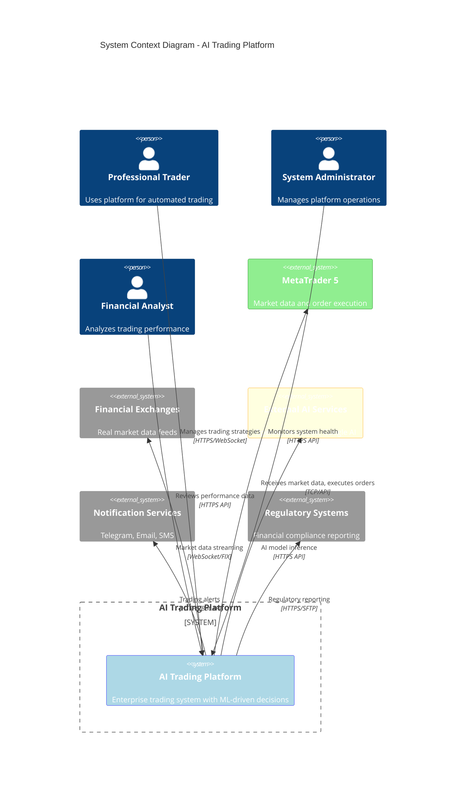

# C4 Model: System Context Diagram
## AI Trading Platform - Enterprise Architecture

### Key External Dependencies

#### Market Data Sources
- **MetaTrader 5**: Primary data source (18+ ticks/second)
- **Financial Exchanges**: Direct market feeds for institutional data
- **Data Vendors**: Bloomberg, Reuters for enhanced market intelligence

#### AI/ML Services
- **OpenAI**: GPT models for market sentiment analysis
- **DeepSeek**: Specialized financial AI models
- **Google AI**: TensorFlow serving for custom models

#### Infrastructure Dependencies
- **Cloud Providers**: AWS/Azure for scalable compute
- **Monitoring**: Prometheus, Grafana for observability
- **Security**: HashiCorp Vault for secrets management

### System Boundaries
- **Internal**: All 11 microservices within platform boundary
- **External**: Market data, AI services, notification systems
- **Compliance**: Regulatory reporting and audit systems

### Performance Context
- **Data Ingestion**: 50+ ticks/second target
- **AI Decisions**: <15ms latency requirement
- **Order Execution**: <1.2ms execution time
- **System Availability**: 99.99% uptime target