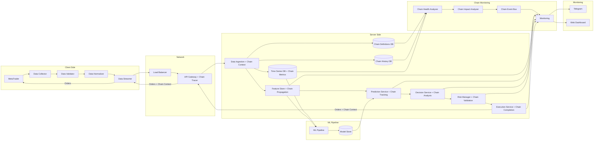

# AI Trading System - Data Flow Design

## Overview

This document details the comprehensive data flow architecture for the AI trading system, covering real-time data processing, batch processing, and inter-service communication patterns.

## Data Flow Architecture

### 1. Primary Data Flow Pipeline (Enhanced with Chain Tracking)



### 2. Detailed Data Processing Flow

#### Stage 1: Data Collection and Validation
```
┌─────────────────┐    ┌─────────────────┐    ┌─────────────────┐
│   MetaTrader    │───►│ Data Collector  │───►│ Data Validator  │
│                 │    │                 │    │                 │
│ • Live Ticks    │    │ • Aggregation   │    │ • Schema Check  │
│ • OHLCV Data    │    │ • Buffering     │    │ • Range Check   │
│ • Order Book    │    │ • Deduplication │    │ • Null Check    │
│ • Account Info  │    │ • Timestamping  │    │ • Type Check    │
└─────────────────┘    └─────────────────┘    └─────────────────┘
```

#### Stage 2: Data Enrichment and Normalization
```
┌─────────────────┐    ┌─────────────────┐    ┌─────────────────┐
│ Data Validator  │───►│ Data Enricher   │───►│ Data Normalizer │
│                 │    │                 │    │                 │
│ • Valid Data    │    │ • Technical     │    │ • Standard      │
│ • Clean Format  │    │   Indicators    │    │   Format        │
│                 │    │ • External      │    │ • Unit          │
│                 │    │   Data Join     │    │   Conversion    │
│                 │    │ • News Data     │    │ • Scaling       │
└─────────────────┘    └─────────────────┘    └─────────────────┘
```

#### Stage 3: Data Streaming and Ingestion
```
┌─────────────────┐    ┌─────────────────┐    ┌─────────────────┐
│ Data Normalizer │───►│ Data Streamer   │───►│ Data Ingestion  │
│                 │    │                 │    │                 │
│ • Normalized    │    │ • Compression   │    │ • Load          │
│   Data          │    │ • Batching      │    │   Balancing     │
│                 │    │ • Error         │    │ • Routing       │
│                 │    │   Handling      │    │ • Persistence   │
└─────────────────┘    └─────────────────┘    └─────────────────┘
```

## Chain-Aware Real-time Data Processing

### Chain Context Propagation

```python
class ChainContext:
    def __init__(self, chain_id: str = None):
        self.chain_id = chain_id or str(uuid.uuid4())
        self.request_id = str(uuid.uuid4())
        self.start_time = datetime.utcnow()
        self.services = []
        self.dependencies = []
        self.performance_metrics = {}
        self.error_context = None
        self.metadata = {}

    def add_service(self, service_name: str, endpoint: str = None):
        service_entry = {
            'service_name': service_name,
            'endpoint': endpoint,
            'start_time': datetime.utcnow(),
            'duration_ms': None,
            'status': 'processing'
        }
        self.services.append(service_entry)
        return len(self.services) - 1  # Return index for later updates

    def complete_service(self, service_index: int, status: str = 'success'):
        if service_index < len(self.services):
            service = self.services[service_index]
            service['duration_ms'] = (
                datetime.utcnow() - service['start_time']
            ).total_seconds() * 1000
            service['status'] = status

    def add_dependency(self, target_service: str, call_info: dict):
        dependency = {
            'target_service': target_service,
            'timestamp': datetime.utcnow(),
            **call_info
        }
        self.dependencies.append(dependency)

    def record_performance_metric(self, metric_name: str, value: float):
        self.performance_metrics[metric_name] = {
            'value': value,
            'timestamp': datetime.utcnow()
        }

    def to_chain_event(self, event_type: str, service_name: str) -> dict:
        return {
            'chain_id': self.chain_id,
            'request_id': self.request_id,
            'service_name': service_name,
            'event_type': event_type,
            'timestamp': datetime.utcnow().isoformat(),
            'duration_ms': self.get_total_duration(),
            'metadata': {
                **self.metadata,
                'service_count': len(self.services),
                'dependency_count': len(self.dependencies),
                'performance_metrics': self.performance_metrics
            },
            'dependencies': self.dependencies,
            'error_context': self.error_context
        }

    def get_total_duration(self) -> float:
        if not self.services:
            return 0
        return (datetime.utcnow() - self.start_time).total_seconds() * 1000
```

## Real-time Data Processing

### 1. Market Data Stream Processing

#### Data Collection Layer
```python
class ChainAwareMarketDataCollector:
    def __init__(self):
        self.mt_connector = MetaTraderConnector()
        self.data_buffer = CircularBuffer(size=10000)
        self.validator = ChainAwareDataValidator()
        self.enricher = ChainAwareDataEnricher()
        self.chain_registry = ChainRegistry()
        self.event_bus = ChainEventBus()

    async def collect_market_data_with_chain_tracking(self):
        """Collect and process market data in real-time with chain tracking"""
        while True:
            chain_context = None
            try:
                # Start new chain for data collection
                chain_context = ChainContext()
                service_index = chain_context.add_service(
                    'data-collector', 'collect_market_data'
                )

                # Collect raw data
                raw_data = await self.mt_connector.get_latest_tick()

                # Add data metadata to chain
                chain_context.metadata.update({
                    'symbol': raw_data.get('symbol'),
                    'data_source': 'metatrader',
                    'data_size_bytes': len(str(raw_data))
                })

                # Validate data with chain context
                if await self.validator.is_valid_with_chain(raw_data, chain_context):
                    # Enrich with technical indicators
                    enriched_data = await self.enricher.enrich_with_chain(
                        raw_data, chain_context
                    )

                    # Buffer for streaming
                    self.data_buffer.append(enriched_data)

                    # Stream to server with chain context
                    await self.stream_to_server_with_chain(
                        enriched_data, chain_context
                    )

                    # Complete service successfully
                    chain_context.complete_service(service_index, 'success')

                    # Publish chain completion event
                    await self.event_bus.publish(
                        'chain.events',
                        chain_context.to_chain_event('complete', 'data-collector')
                    )

            except Exception as e:
                if chain_context:
                    chain_context.error_context = {
                        'error_code': type(e).__name__,
                        'error_message': str(e),
                        'recovery_actions': ['retry_data_collection', 'check_mt5_connection']
                    }

                    # Publish error event
                    await self.event_bus.publish(
                        'chain.errors',
                        chain_context.to_chain_event('error', 'data-collector')
                    )

                logger.error(f"Data collection error: {e}")
                await asyncio.sleep(0.1)

    async def stream_to_server_with_chain(self, data, chain_context: ChainContext):
        """Stream data to server with retry logic and chain tracking"""
        dependency_index = len(chain_context.dependencies)
        max_retries = 3

        for attempt in range(max_retries):
            start_time = time.time()
            try:
                # Add dependency tracking
                chain_context.add_dependency('api-gateway', {
                    'endpoint': '/api/v1/data/ingest',
                    'attempt': attempt + 1,
                    'max_retries': max_retries
                })

                # Send data with chain context headers
                headers = {
                    'X-Chain-ID': chain_context.chain_id,
                    'X-Request-ID': chain_context.request_id,
                    'X-Source-Service': 'data-collector'
                }

                await self.grpc_client.send_market_data_with_headers(
                    data, headers
                )

                # Record successful dependency call
                duration = (time.time() - start_time) * 1000
                chain_context.dependencies[dependency_index]['duration_ms'] = duration
                chain_context.dependencies[dependency_index]['status'] = 'success'

                return

            except Exception as e:
                duration = (time.time() - start_time) * 1000
                chain_context.dependencies[dependency_index]['duration_ms'] = duration
                chain_context.dependencies[dependency_index]['status'] = 'error'
                chain_context.dependencies[dependency_index]['error'] = str(e)

                if attempt == max_retries - 1:
                    # Store locally for later retry with chain context
                    await self.local_storage.store_failed_data_with_chain(
                        data, chain_context
                    )

                    # Publish chain failure event
                    await self.event_bus.publish(
                        'chain.errors',
                        chain_context.to_chain_event('dependency_failure', 'data-collector')
                    )

                await asyncio.sleep(2 ** attempt)
```

#### Data Validation and Enrichment
```python
class DataValidator:
    def __init__(self):
        self.schema = self.load_schema()
        self.range_checks = self.load_range_checks()

    def is_valid(self, data):
        """Comprehensive data validation"""
        # Schema validation
        if not self.validate_schema(data):
            return False

        # Range validation
        if not self.validate_ranges(data):
            return False

        # Business logic validation
        if not self.validate_business_rules(data):
            return False

        return True

    def validate_schema(self, data):
        """Check data structure and types"""
        required_fields = ['symbol', 'timestamp', 'bid', 'ask', 'volume']
        return all(field in data for field in required_fields)

    def validate_ranges(self, data):
        """Check data value ranges"""
        if data['bid'] <= 0 or data['ask'] <= 0:
            return False
        if data['ask'] < data['bid']:
            return False
        if data['volume'] < 0:
            return False
        return True

class DataEnricher:
    def __init__(self):
        self.technical_indicators = TechnicalIndicators()
        self.market_data_cache = LRUCache(maxsize=1000)

    def enrich(self, raw_data):
        """Add technical indicators and derived features"""
        enriched = raw_data.copy()

        # Calculate technical indicators
        symbol = raw_data['symbol']
        historical_data = self.get_historical_data(symbol)

        # Add moving averages
        enriched['sma_20'] = self.technical_indicators.sma(historical_data, 20)
        enriched['ema_12'] = self.technical_indicators.ema(historical_data, 12)
        enriched['ema_26'] = self.technical_indicators.ema(historical_data, 26)

        # Add volatility indicators
        enriched['atr'] = self.technical_indicators.atr(historical_data, 14)
        enriched['volatility'] = self.technical_indicators.volatility(historical_data, 20)

        # Add momentum indicators
        enriched['rsi'] = self.technical_indicators.rsi(historical_data, 14)
        enriched['macd'] = self.technical_indicators.macd(historical_data)

        return enriched
```

### 2. Server-Side Data Ingestion

#### Kafka Stream Processing
```python
class DataIngestionService:
    def __init__(self):
        self.kafka_consumer = KafkaConsumer(
            'market-data',
            bootstrap_servers=['kafka1:9092', 'kafka2:9092'],
            value_deserializer=lambda x: json.loads(x.decode('utf-8'))
        )
        self.feature_store = FeatureStoreClient()
        self.time_series_db = InfluxDBClient()

    async def process_stream(self):
        """Process incoming data stream"""
        async for message in self.kafka_consumer:
            try:
                data = message.value

                # Parallel processing
                await asyncio.gather(
                    self.store_time_series(data),
                    self.update_features(data),
                    self.trigger_predictions(data)
                )

            except Exception as e:
                logger.error(f"Stream processing error: {e}")

    async def store_time_series(self, data):
        """Store raw data in time series database"""
        point = {
            "measurement": "market_data",
            "tags": {
                "symbol": data['symbol'],
                "source": data['source']
            },
            "fields": {
                "bid": data['bid'],
                "ask": data['ask'],
                "volume": data['volume'],
                "spread": data['ask'] - data['bid']
            },
            "time": data['timestamp']
        }
        await self.time_series_db.write_point(point)

    async def update_features(self, data):
        """Update feature store with new data"""
        features = self.compute_features(data)
        await self.feature_store.update_online_features(
            entity_key=data['symbol'],
            features=features
        )
```

## Feature Engineering Pipeline

### 1. Real-time Feature Computation

```python
class FeatureEngine:
    def __init__(self):
        self.feature_registry = FeatureRegistry()
        self.cache = RedisCache()
        self.window_managers = {
            'M1': WindowManager(60),
            'M5': WindowManager(300),
            'M15': WindowManager(900),
            'H1': WindowManager(3600)
        }

    def compute_features(self, market_data):
        """Compute features for different timeframes"""
        symbol = market_data['symbol']
        features = {}

        for timeframe, window_manager in self.window_managers.items():
            # Add data to appropriate window
            window_manager.add_data(market_data)

            # Compute features for this timeframe
            window_data = window_manager.get_window_data()
            timeframe_features = self.compute_timeframe_features(
                window_data, timeframe
            )

            # Merge features
            features.update({
                f"{feature}_{timeframe}": value
                for feature, value in timeframe_features.items()
            })

        return features

    def compute_timeframe_features(self, window_data, timeframe):
        """Compute features for specific timeframe"""
        if len(window_data) < 20:
            return {}

        prices = [d['close'] for d in window_data]
        volumes = [d['volume'] for d in window_data]

        features = {
            # Price-based features
            'price_change': (prices[-1] - prices[-2]) / prices[-2],
            'price_volatility': np.std(prices[-20:]) / np.mean(prices[-20:]),
            'price_momentum': (prices[-1] - prices[-10]) / prices[-10],

            # Volume-based features
            'volume_change': (volumes[-1] - volumes[-2]) / volumes[-2],
            'volume_avg_ratio': volumes[-1] / np.mean(volumes[-20:]),

            # Technical indicators
            'rsi': self.calculate_rsi(prices),
            'macd_signal': self.calculate_macd_signal(prices),
            'bollinger_position': self.calculate_bollinger_position(prices),

            # Market microstructure
            'bid_ask_spread': window_data[-1]['ask'] - window_data[-1]['bid'],
            'spread_volatility': np.std([d['ask'] - d['bid'] for d in window_data[-10:]]),
        }

        return features
```

### 2. Batch Feature Processing

```python
class BatchFeatureProcessor:
    def __init__(self):
        self.spark_session = self.create_spark_session()
        self.feature_store = FeatureStore()

    def process_historical_features(self, start_date, end_date):
        """Process historical data for feature creation"""

        # Load historical data
        df = self.load_historical_data(start_date, end_date)

        # Compute features using Spark
        feature_df = self.compute_batch_features(df)

        # Store in feature store
        self.feature_store.write_offline_features(feature_df)

    def compute_batch_features(self, df):
        """Compute features using Spark DataFrame operations"""
        from pyspark.sql import functions as F
        from pyspark.sql.window import Window

        # Define windows for different periods
        window_20 = Window.partitionBy("symbol").orderBy("timestamp").rowsBetween(-19, 0)
        window_50 = Window.partitionBy("symbol").orderBy("timestamp").rowsBetween(-49, 0)

        # Compute rolling features
        feature_df = df.withColumn(
            "sma_20", F.avg("close").over(window_20)
        ).withColumn(
            "volatility_20", F.stddev("close").over(window_20)
        ).withColumn(
            "volume_sma_20", F.avg("volume").over(window_20)
        ).withColumn(
            "price_change_20",
            (F.col("close") - F.first("close").over(window_20)) / F.first("close").over(window_20)
        )

        return feature_df
```

## ML Pipeline Data Flow

### 1. Training Data Pipeline

```python
class TrainingDataPipeline:
    def __init__(self):
        self.feature_store = FeatureStore()
        self.label_generator = LabelGenerator()
        self.data_splitter = TimeSeriesDataSplitter()

    def create_training_dataset(self, symbols, start_date, end_date):
        """Create training dataset with features and labels"""

        # Get features from feature store
        features_df = self.feature_store.get_historical_features(
            entity_df=self.create_entity_df(symbols, start_date, end_date),
            features=[
                "price_features:price_change_M1",
                "price_features:volatility_M5",
                "technical_features:rsi_M15",
                "volume_features:volume_ratio_M1"
            ]
        )

        # Generate labels
        labels_df = self.label_generator.generate_labels(
            features_df,
            prediction_horizon='15min',
            label_type='direction'
        )

        # Join features and labels
        training_df = features_df.join(labels_df, on=['symbol', 'timestamp'])

        # Split data
        train_df, val_df, test_df = self.data_splitter.split(
            training_df,
            train_ratio=0.7,
            val_ratio=0.15,
            test_ratio=0.15
        )

        return {
            'train': train_df,
            'validation': val_df,
            'test': test_df
        }

class LabelGenerator:
    def generate_labels(self, df, prediction_horizon, label_type):
        """Generate labels for supervised learning"""

        if label_type == 'direction':
            # Binary classification: price goes up (1) or down (0)
            horizon_minutes = self.parse_horizon(prediction_horizon)

            df = df.withColumn(
                "future_price",
                F.lead("close", horizon_minutes).over(
                    Window.partitionBy("symbol").orderBy("timestamp")
                )
            ).withColumn(
                "label",
                F.when(F.col("future_price") > F.col("close"), 1).otherwise(0)
            )

        elif label_type == 'regression':
            # Regression: predict actual price change
            horizon_minutes = self.parse_horizon(prediction_horizon)

            df = df.withColumn(
                "future_price",
                F.lead("close", horizon_minutes).over(
                    Window.partitionBy("symbol").orderBy("timestamp")
                )
            ).withColumn(
                "label",
                (F.col("future_price") - F.col("close")) / F.col("close")
            )

        return df.select("symbol", "timestamp", "label")
```

### 2. Inference Data Pipeline

```python
class InferenceDataPipeline:
    def __init__(self):
        self.feature_store = FeatureStore()
        self.model_store = ModelStore()
        self.prediction_cache = PredictionCache()

    async def generate_prediction(self, symbol, timestamp):
        """Generate prediction for a symbol at specific time"""

        # Get real-time features
        features = await self.feature_store.get_online_features(
            entity_keys=[f"{symbol}:{timestamp}"],
            feature_names=[
                "price_features:price_change_M1",
                "price_features:volatility_M5",
                "technical_features:rsi_M15",
                "volume_features:volume_ratio_M1"
            ]
        )

        # Check prediction cache
        cache_key = self.create_cache_key(symbol, features)
        cached_prediction = await self.prediction_cache.get(cache_key)

        if cached_prediction:
            return cached_prediction

        # Load models
        models = await self.model_store.get_active_models(symbol)

        # Generate predictions from ensemble
        predictions = []
        for model in models:
            prediction = await model.predict(features)
            predictions.append({
                'model_id': model.id,
                'prediction': prediction,
                'confidence': model.confidence
            })

        # Combine predictions
        ensemble_prediction = self.combine_predictions(predictions)

        # Cache result
        await self.prediction_cache.set(
            cache_key,
            ensemble_prediction,
            ttl=30  # 30 seconds TTL
        )

        return ensemble_prediction

    def combine_predictions(self, predictions):
        """Combine predictions from multiple models"""
        if not predictions:
            return None

        # Weighted average based on model confidence
        total_weight = sum(p['confidence'] for p in predictions)
        weighted_prediction = sum(
            p['prediction'] * p['confidence'] for p in predictions
        ) / total_weight

        # Calculate ensemble confidence
        ensemble_confidence = np.mean([p['confidence'] for p in predictions])

        return {
            'prediction': weighted_prediction,
            'confidence': ensemble_confidence,
            'model_count': len(predictions),
            'timestamp': datetime.utcnow().isoformat()
        }
```

## Decision and Execution Data Flow

### 1. Decision Pipeline

```python
class DecisionPipeline:
    def __init__(self):
        self.prediction_service = PredictionServiceClient()
        self.risk_manager = RiskManager()
        self.position_manager = PositionManager()
        self.signal_aggregator = SignalAggregator()

    async def make_trading_decision(self, symbol):
        """Make trading decision based on predictions and risk"""

        # Get predictions
        prediction = await self.prediction_service.get_prediction(symbol)

        # Get current position
        current_position = await self.position_manager.get_position(symbol)

        # Aggregate signals
        signals = await self.signal_aggregator.aggregate_signals(symbol, prediction)

        # Apply risk management
        risk_adjusted_signal = await self.risk_manager.apply_risk_management(
            signal=signals,
            position=current_position,
            symbol=symbol
        )

        # Generate trading decision
        decision = self.generate_decision(risk_adjusted_signal, current_position)

        return decision

    def generate_decision(self, signal, current_position):
        """Generate final trading decision"""
        decision = {
            'symbol': signal['symbol'],
            'action': 'HOLD',  # Default action
            'quantity': 0,
            'confidence': signal['confidence'],
            'reasoning': []
        }

        # Decision logic
        if signal['strength'] > 0.7:  # Strong buy signal
            if current_position is None or current_position['side'] != 'BUY':
                decision['action'] = 'BUY'
                decision['quantity'] = signal['position_size']
                decision['reasoning'].append('Strong buy signal detected')

        elif signal['strength'] < -0.7:  # Strong sell signal
            if current_position is None or current_position['side'] != 'SELL':
                decision['action'] = 'SELL'
                decision['quantity'] = signal['position_size']
                decision['reasoning'].append('Strong sell signal detected')

        elif abs(signal['strength']) < 0.3:  # Weak signal
            if current_position is not None:
                decision['action'] = 'CLOSE'
                decision['quantity'] = current_position['quantity']
                decision['reasoning'].append('Weak signal, closing position')

        return decision
```

### 2. Execution Pipeline

```python
class ExecutionPipeline:
    def __init__(self):
        self.order_manager = OrderManager()
        self.execution_tracker = ExecutionTracker()
        self.slippage_monitor = SlippageMonitor()

    async def execute_decision(self, decision):
        """Execute trading decision"""

        # Validate decision
        if not self.validate_decision(decision):
            return {'status': 'REJECTED', 'reason': 'Invalid decision'}

        # Create order
        order = self.create_order(decision)

        # Submit order
        execution_result = await self.order_manager.submit_order(order)

        # Track execution
        await self.execution_tracker.track_execution(order, execution_result)

        # Monitor slippage
        await self.slippage_monitor.record_slippage(order, execution_result)

        return execution_result

    def create_order(self, decision):
        """Create order from decision"""
        return {
            'symbol': decision['symbol'],
            'side': decision['action'],
            'quantity': decision['quantity'],
            'order_type': 'MARKET',
            'timestamp': datetime.utcnow(),
            'decision_id': decision['id']
        }
```

## Monitoring and Feedback Data Flow

### 1. Performance Monitoring

```python
class PerformanceMonitor:
    def __init__(self):
        self.metrics_collector = MetricsCollector()
        self.alerting_system = AlertingSystem()
        self.dashboard_updater = DashboardUpdater()

    async def monitor_system_performance(self):
        """Monitor overall system performance"""

        while True:
            # Collect metrics from all services
            metrics = await self.collect_all_metrics()

            # Check for anomalies
            anomalies = self.detect_anomalies(metrics)

            # Send alerts if needed
            if anomalies:
                await self.alerting_system.send_alerts(anomalies)

            # Update dashboards
            await self.dashboard_updater.update(metrics)

            await asyncio.sleep(10)  # Monitor every 10 seconds

    async def collect_all_metrics(self):
        """Collect metrics from all system components"""
        return {
            'data_ingestion': await self.get_ingestion_metrics(),
            'feature_store': await self.get_feature_store_metrics(),
            'ml_pipeline': await self.get_ml_metrics(),
            'prediction_service': await self.get_prediction_metrics(),
            'execution': await self.get_execution_metrics(),
            'system': await self.get_system_metrics()
        }
```

### 2. Feedback Loop

```python
class FeedbackLoop:
    def __init__(self):
        self.trade_analyzer = TradeAnalyzer()
        self.model_updater = ModelUpdater()
        self.feature_selector = FeatureSelector()

    async def process_trade_feedback(self, trade_result):
        """Process feedback from completed trades"""

        # Analyze trade performance
        analysis = await self.trade_analyzer.analyze_trade(trade_result)

        # Update model performance metrics
        await self.update_model_metrics(analysis)

        # Trigger model retraining if needed
        if analysis['performance_degradation']:
            await self.trigger_model_retraining(analysis)

        # Update feature importance
        await self.feature_selector.update_importance(analysis)

    async def update_model_metrics(self, analysis):
        """Update model performance metrics"""
        model_id = analysis['model_id']

        # Update accuracy metrics
        await self.model_store.update_metrics(
            model_id=model_id,
            metrics={
                'accuracy': analysis['accuracy'],
                'precision': analysis['precision'],
                'recall': analysis['recall'],
                'profit_factor': analysis['profit_factor'],
                'sharpe_ratio': analysis['sharpe_ratio']
            }
        )
```

## Chain-Aware Database Schema Extensions

### Chain Definitions Table
```sql
CREATE TABLE chain_definitions (
    id BIGSERIAL PRIMARY KEY,
    chain_id UUID NOT NULL UNIQUE,
    chain_name VARCHAR(255),
    service_topology JSONB NOT NULL, -- Service dependency graph
    expected_services TEXT[] NOT NULL,
    max_duration_ms INTEGER,
    critical_path TEXT[],
    health_check_rules JSONB,
    created_at TIMESTAMP DEFAULT NOW(),
    updated_at TIMESTAMP DEFAULT NOW(),
    is_active BOOLEAN DEFAULT TRUE
);

CREATE INDEX idx_chain_definitions_chain_id ON chain_definitions(chain_id);
CREATE INDEX idx_chain_definitions_active ON chain_definitions(is_active);
```

### Chain History Table
```sql
CREATE TABLE chain_history (
    id BIGSERIAL PRIMARY KEY,
    chain_id UUID NOT NULL,
    request_id UUID NOT NULL,
    service_name VARCHAR(100) NOT NULL,
    event_type VARCHAR(50) NOT NULL, -- start, process, complete, error
    timestamp TIMESTAMP NOT NULL,
    duration_ms INTEGER,
    endpoint VARCHAR(255),
    user_id VARCHAR(100),
    metadata JSONB,
    error_context JSONB,
    dependencies JSONB, -- Array of dependency calls
    performance_metrics JSONB,
    created_at TIMESTAMP DEFAULT NOW()
);

CREATE INDEX idx_chain_history_chain_id ON chain_history(chain_id);
CREATE INDEX idx_chain_history_timestamp ON chain_history(timestamp);
CREATE INDEX idx_chain_history_service_event ON chain_history(service_name, event_type);
CREATE INDEX idx_chain_history_user_id ON chain_history(user_id);
```

### Chain Metrics Table
```sql
CREATE TABLE chain_metrics (
    id BIGSERIAL PRIMARY KEY,
    chain_id UUID NOT NULL,
    metric_name VARCHAR(100) NOT NULL,
    metric_value DECIMAL(18,6) NOT NULL,
    metric_unit VARCHAR(50),
    service_name VARCHAR(100),
    timestamp TIMESTAMP NOT NULL,
    aggregation_period VARCHAR(20), -- 1m, 5m, 15m, 1h, 1d
    tags JSONB,
    created_at TIMESTAMP DEFAULT NOW()
);

CREATE INDEX idx_chain_metrics_chain_id ON chain_metrics(chain_id);
CREATE INDEX idx_chain_metrics_name_timestamp ON chain_metrics(metric_name, timestamp);
CREATE INDEX idx_chain_metrics_service_timestamp ON chain_metrics(service_name, timestamp);
```

### Chain Query Engine
```python
class ChainQueryEngine:
    def __init__(self, db_connection):
        self.db = db_connection
        self.cache = Redis()

    async def get_chain_analysis(self, chain_id: str) -> ChainAnalysisResult:
        """Get comprehensive chain analysis"""
        # Get chain events
        events = await self.get_chain_events(chain_id)

        # Get performance metrics
        metrics = await self.get_chain_metrics(chain_id)

        # Analyze dependency graph
        dependency_analysis = self.analyze_dependencies(events)

        # Calculate performance statistics
        performance_stats = self.calculate_performance_stats(events, metrics)

        # Identify bottlenecks
        bottlenecks = self.identify_bottlenecks(events, metrics)

        return ChainAnalysisResult(
            chain_id=chain_id,
            total_duration=performance_stats['total_duration'],
            service_count=len(dependency_analysis['services']),
            dependency_graph=dependency_analysis['graph'],
            bottlenecks=bottlenecks,
            critical_path=dependency_analysis['critical_path'],
            performance_metrics=performance_stats,
            health_score=self.calculate_health_score(events, metrics)
        )

    async def find_similar_chains(self, chain_pattern: dict) -> List[str]:
        """Find chains with similar patterns for analysis"""
        query = """
        SELECT DISTINCT ch.chain_id
        FROM chain_history ch
        JOIN chain_definitions cd ON ch.chain_id = cd.chain_id
        WHERE cd.service_topology @> %s
        AND ch.timestamp >= NOW() - INTERVAL '7 days'
        ORDER BY ch.timestamp DESC
        LIMIT 100
        """

        result = await self.db.fetch(query, json.dumps(chain_pattern))
        return [row['chain_id'] for row in result]

    async def get_chain_impact_prediction(self,
                                        service_name: str,
                                        change_type: str) -> ImpactPrediction:
        """Predict impact of changes on chain performance"""
        # Get historical data for service
        historical_data = await self.get_service_historical_performance(
            service_name, days=30
        )

        # Find chains that include this service
        affected_chains = await self.get_chains_using_service(service_name)

        # Analyze historical impact of similar changes
        similar_changes = await self.get_similar_change_impacts(
            service_name, change_type
        )

        # Calculate predicted impact
        return self.ai_impact_analyzer.predict_impact(
            service_name=service_name,
            change_type=change_type,
            historical_data=historical_data,
            affected_chains=affected_chains,
            similar_changes=similar_changes
        )
```

This comprehensive chain-aware data flow design ensures efficient, real-time processing of market data while maintaining data integrity, supporting machine learning workflows, and providing robust monitoring and feedback mechanisms with complete request traceability and dependency analysis.