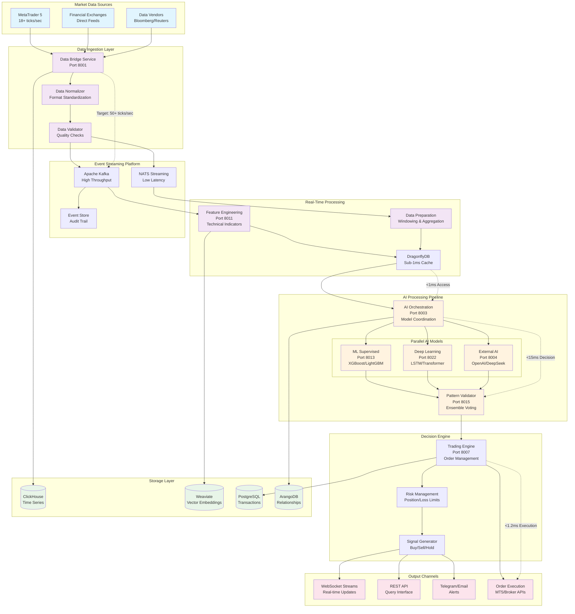

# Real-Time Data Pipeline Architecture
## MT5 → WebSocket → AI → Trading Signals



## Performance Characteristics

### Data Ingestion Layer
- **Current Throughput**: 18+ ticks/second from MT5
- **Target Throughput**: 50+ ticks/second enhanced processing
- **Latency**: <5ms data validation and normalization
- **Reliability**: 99.99% uptime with automatic failover

### Event Streaming Platform
- **Kafka**: High-throughput market data distribution
  - Throughput: 100,000+ events/second
  - Latency: <10ms event delivery
  - Retention: 7 days for audit compliance
- **NATS**: Low-latency internal messaging
  - Latency: <1ms message delivery
  - Throughput: 50,000+ messages/second
  - Pattern: Request-reply for synchronous operations

### Real-Time Processing
- **Feature Engineering**: <10ms technical indicator calculation
- **Data Preparation**: <5ms windowing and aggregation
- **Cache Access**: <1ms DragonflyDB retrieval
- **Memory Usage**: 95% efficiency under load

### AI Processing Pipeline
- **Model Coordination**: <2ms orchestration overhead
- **Parallel Processing**: 3-6 models executing concurrently
- **Decision Latency**: <15ms end-to-end AI decision
- **Accuracy Target**: >65% prediction accuracy

### Decision Engine
- **Risk Assessment**: <12ms position validation
- **Signal Generation**: <3ms decision output
- **Order Execution**: <1.2ms order placement
- **Trade Settlement**: <100ms confirmation

## Data Flow Patterns

### Stream Processing
```python
# Example data flow pattern
async def process_market_tick(tick_data):
    # 1. Validate and normalize (1-2ms)
    normalized = await validate_tick(tick_data)

    # 2. Generate features (5-8ms)
    features = await generate_features(normalized)

    # 3. Cache for AI models (0.5ms)
    await cache_features(features)

    # 4. Trigger AI processing (parallel, 10-12ms)
    predictions = await orchestrate_ai_models(features)

    # 5. Validate and generate signal (2-3ms)
    signal = await validate_and_decide(predictions)

    # 6. Execute if approved (<1.2ms)
    if signal.confidence > threshold:
        await execute_trade(signal)
```

### Event Patterns
1. **Market Data Events**: Raw tick data from multiple sources
2. **Feature Events**: Processed technical indicators
3. **Prediction Events**: AI model outputs and confidence scores
4. **Decision Events**: Trading signals with risk assessment
5. **Execution Events**: Order placement and confirmation
6. **Monitoring Events**: Performance metrics and alerts

## Fault Tolerance and Recovery

### Circuit Breaker Pattern
- **AI Model Failures**: Fallback to ensemble voting
- **Data Source Failures**: Switch to backup feeds
- **Cache Failures**: Direct database access with degraded performance
- **Network Failures**: Message queuing with retry logic

### Data Consistency
- **Event Sourcing**: Complete audit trail of all decisions
- **Eventual Consistency**: Acceptable for analytics data
- **Strong Consistency**: Required for trade execution
- **Compensating Transactions**: For failed trade operations

### Monitoring and Alerting
- **Performance Metrics**: Real-time latency and throughput
- **Business Metrics**: Trading accuracy and profitability
- **System Health**: Service availability and error rates
- **Predictive Alerts**: AI-powered anomaly detection

## Scalability Strategy

### Horizontal Scaling
- **Stateless Services**: All processing services scale horizontally
- **Partitioned Streams**: Kafka partitioning by symbol/user
- **Load Balancing**: Round-robin with health checks
- **Auto-scaling**: CPU/memory based scaling triggers

### Data Partitioning
- **Time-based**: Historical data partitioned by date
- **Symbol-based**: Market data partitioned by trading symbol
- **User-based**: Multi-tenant data isolation
- **Geographic**: Data locality for reduced latency

### Caching Strategy
- **L1 Cache**: In-memory application cache
- **L2 Cache**: DragonflyDB for shared cache
- **L3 Cache**: Redis for session and rate limiting
- **CDN**: Static content and configuration data

## Quality Assurance

### Data Quality
- **Validation Rules**: Price, volume, timestamp consistency
- **Outlier Detection**: Statistical anomaly identification
- **Source Verification**: Multiple source cross-validation
- **Data Lineage**: Complete tracking from source to decision

### Performance Testing
- **Load Testing**: Sustained high-frequency data simulation
- **Stress Testing**: Peak load and failure scenarios
- **Latency Testing**: End-to-end timing validation
- **Chaos Engineering**: Fault injection and recovery testing

### Compliance and Audit
- **Transaction Logging**: Complete audit trail
- **Regulatory Reporting**: Real-time compliance monitoring
- **Data Retention**: 7-year historical data storage
- **Security Scanning**: Continuous vulnerability assessment