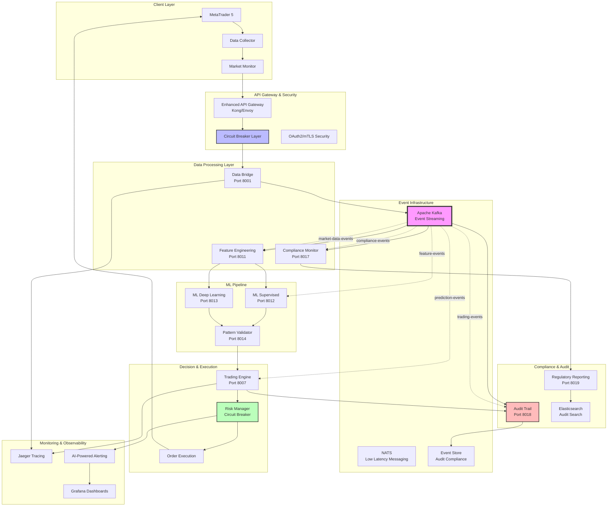
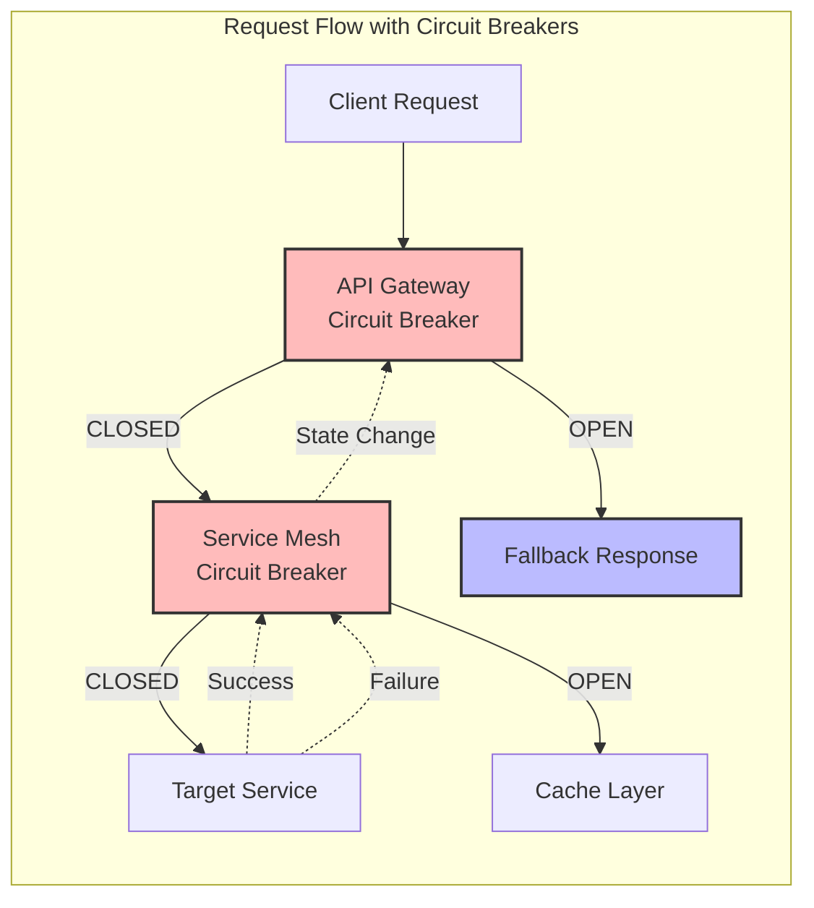
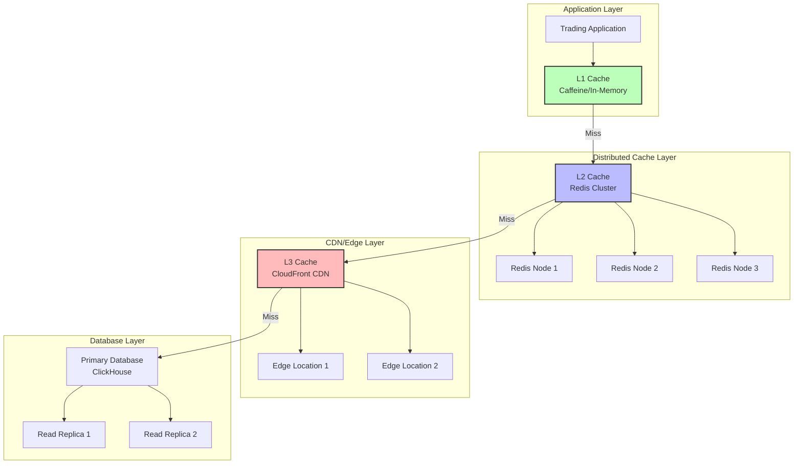
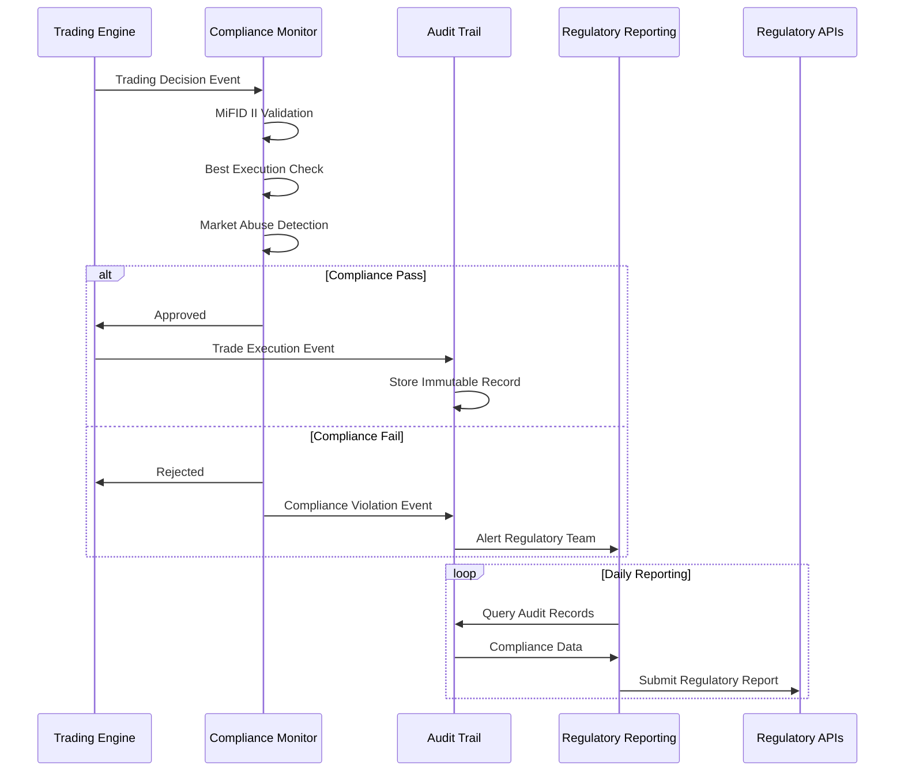
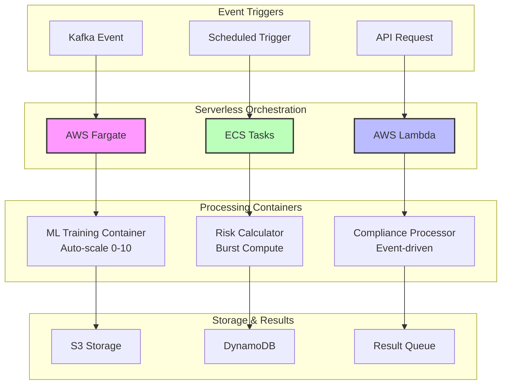
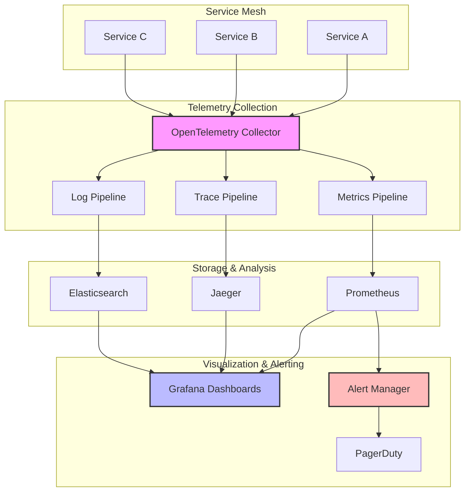

# Enhanced Data Flow Architecture - 2024

## Event-Driven Data Flow Optimization

### Real-Time Trading Pipeline with Event Streaming



## Event Streaming Topics Architecture

### Kafka Topic Strategy

```yaml
Topic Configuration:
  market-data-events:
    partitions: 12
    replication-factor: 3
    retention: 7 days
    consumer-groups:
      - feature-engineering
      - compliance-monitor
      - audit-trail

  feature-events:
    partitions: 8
    replication-factor: 3
    retention: 24 hours
    consumer-groups:
      - ml-supervised
      - ml-deep-learning
      - pattern-validator

  prediction-events:
    partitions: 6
    replication-factor: 3
    retention: 12 hours
    consumer-groups:
      - trading-engine
      - risk-manager

  trading-events:
    partitions: 4
    replication-factor: 3
    retention: 30 days (compliance)
    consumer-groups:
      - audit-trail
      - performance-analytics
      - regulatory-reporting

  compliance-events:
    partitions: 2
    replication-factor: 3
    retention: 7 years (regulatory)
    consumer-groups:
      - regulatory-reporting
      - audit-trail
```

## Circuit Breaker Data Flow

### Resilience Patterns Implementation



## Performance Optimization Data Flow

### Multi-Level Caching Strategy



## Regulatory Compliance Data Flow

### Real-Time Compliance Monitoring



## Serverless Container Data Flow

### Auto-Scaling Event Processing



## Data Flow Performance Metrics

### Target Performance Benchmarks

```yaml
Latency Targets:
  Order Execution: <5ms (99th percentile)
  Event Processing: <10ms (95th percentile)
  Circuit Breaker Response: <100ms
  Cache Hit Rate: >85%

Throughput Targets:
  Kafka Events: 100,000 events/second
  API Gateway: 50,000 requests/second
  Database Writes: 10,000 writes/second
  ML Predictions: 1,000 predictions/second

Availability Targets:
  System Availability: 99.95%
  Event Stream Uptime: 99.99%
  Database Availability: 99.9%
  Circuit Breaker Effectiveness: >99%
```

## Observability Data Flow

### Distributed Tracing & Monitoring



This enhanced data flow architecture provides:

1. **Event-Driven Processing**: Real-time event streaming with Kafka
2. **Resilience Patterns**: Circuit breakers and fallback mechanisms
3. **Regulatory Compliance**: Automated compliance monitoring and reporting
4. **Performance Optimization**: Multi-level caching and serverless scaling
5. **Modern Observability**: Distributed tracing and intelligent alerting

The architecture supports the 18.6% CAGR growth in microservices adoption while maintaining sub-5ms trading latency and 99.95% system availability.