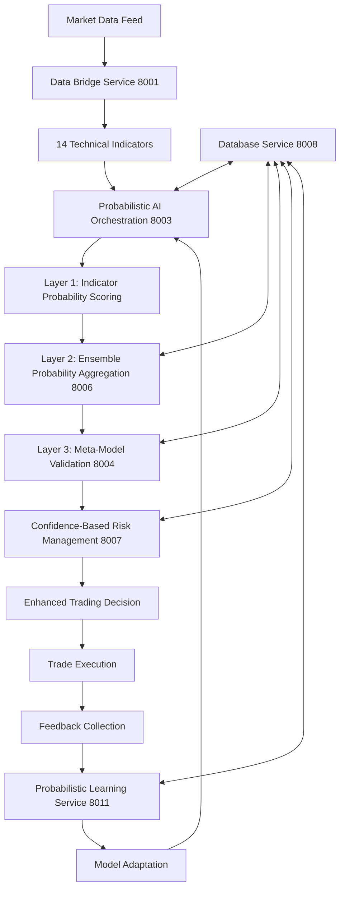
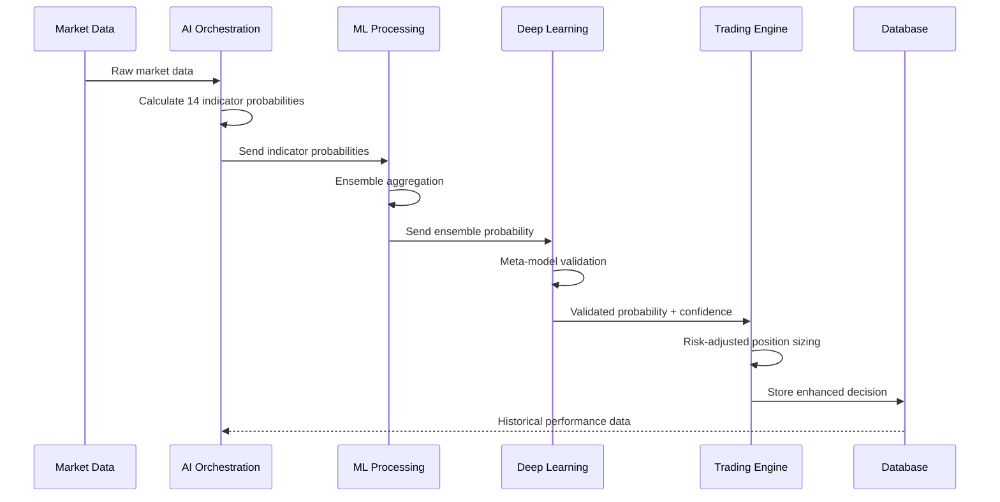
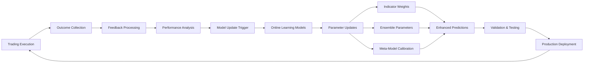
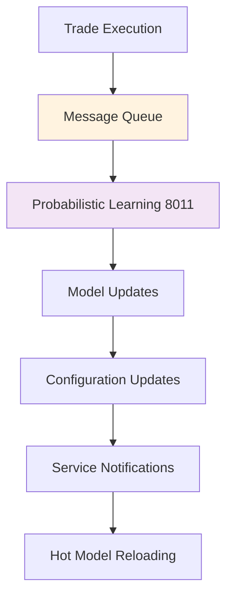
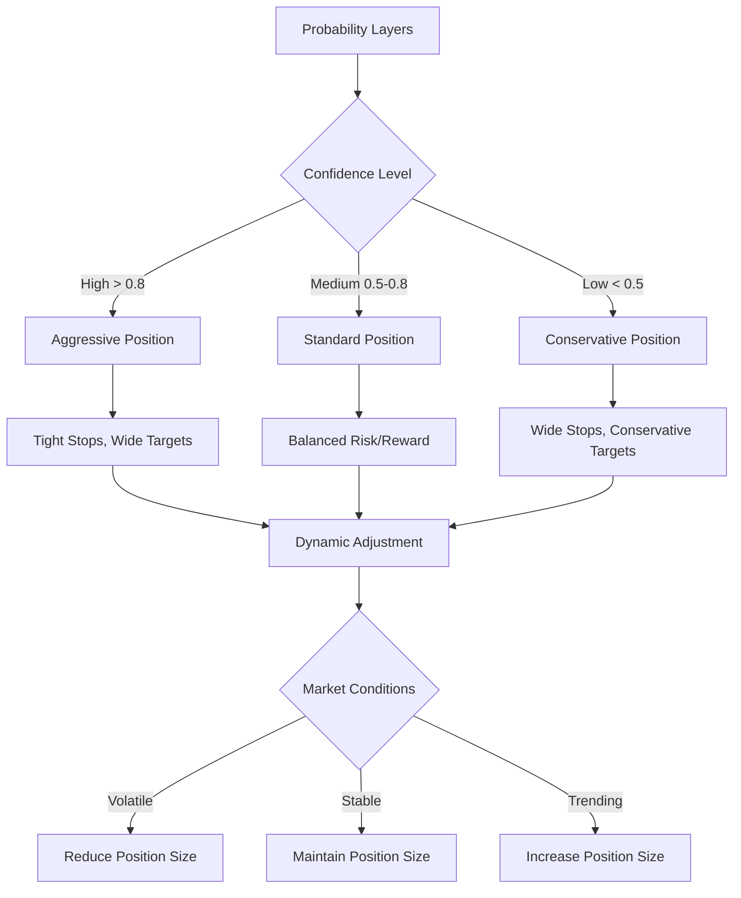
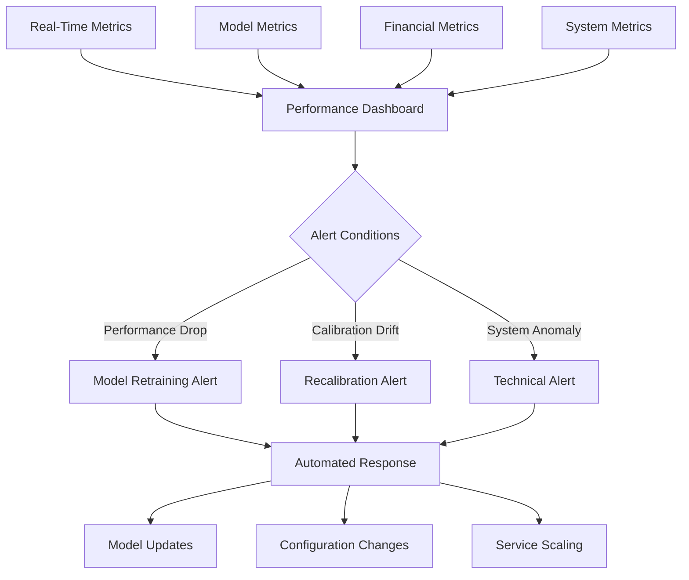
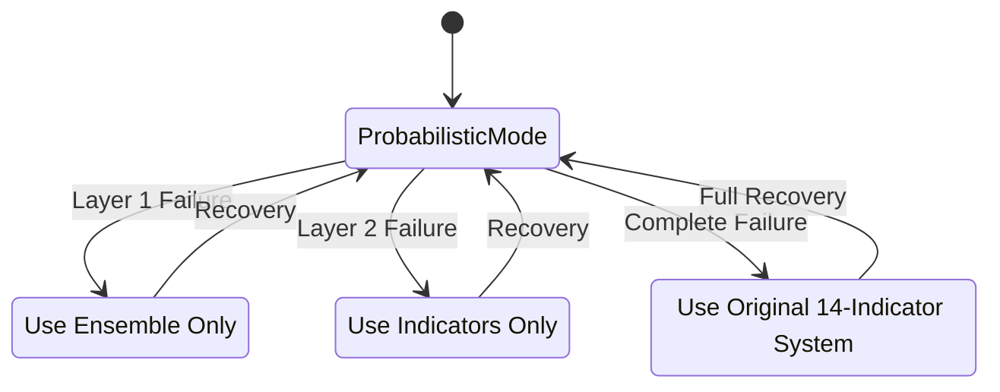
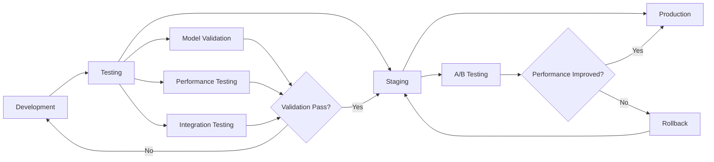

# Probabilistic Enhancement - Component Interaction Diagrams

## System Component Interaction Flow

### 1. Enhanced Data Flow Architecture

### 2. Multi-Layer Probability Confirmation System

### 3. Real-Time Adaptive Learning Architecture

### 4. Service Interaction Matrix

| Service | Probability Calc | Ensemble Agg | Meta Validation | Risk Mgmt | Learning |
|---------|-----------------|---------------|-----------------|-----------|----------|
| **AI Orchestration (8003)** | ✅ Primary | ➡️ Sends | ➡️ Sends | ➡️ Sends | ⬅️ Receives |
| **ML Processing (8006)** | ⬅️ Receives | ✅ Primary | ➡️ Sends | ➡️ Sends | ⬅️ Receives |
| **Deep Learning (8004)** | ⬅️ Receives | ⬅️ Receives | ✅ Primary | ➡️ Sends | ⬅️ Receives |
| **Trading Engine (8007)** | ⬅️ Receives | ⬅️ Receives | ⬅️ Receives | ✅ Primary | ➡️ Sends |
| **Probabilistic Learning (8011)** | ➡️ Updates | ➡️ Updates | ➡️ Updates | ⬅️ Receives | ✅ Primary |

### 5. Database Integration Architecture

```mermaid
erDiagram
    MARKET_DATA {
        timestamp datetime
        symbol string
        price decimal
        volume decimal
    }

    INDICATOR_PROBABILITIES {
        id uuid
        timestamp datetime
        symbol string
        indicator string
        probability decimal
        confidence decimal
        uncertainty decimal
    }

    ENSEMBLE_DECISIONS {
        id uuid
        timestamp datetime
        symbol string
        aggregated_probability decimal
        consensus_strength decimal
        divergence_score decimal
    }

    META_VALIDATIONS {
        id uuid
        decision_id uuid
        meta_probability decimal
        anomaly_score decimal
        validation_result string
    }

    TRADING_DECISIONS {
        id uuid
        timestamp datetime
        symbol string
        action string
        position_size decimal
        confidence decimal
        risk_level string
    }

    FEEDBACK_DATA {
        id uuid
        decision_id uuid
        actual_outcome decimal
        expected_outcome decimal
        performance_score decimal
    }

    MARKET_DATA ||--o{ INDICATOR_PROBABILITIES : generates
    INDICATOR_PROBABILITIES ||--o{ ENSEMBLE_DECISIONS : aggregates_to
    ENSEMBLE_DECISIONS ||--o{ META_VALIDATIONS : validates_to
    META_VALIDATIONS ||--o{ TRADING_DECISIONS : results_in
    TRADING_DECISIONS ||--o{ FEEDBACK_DATA : produces
```

### 6. Microservice Communication Patterns

#### 6.1 Synchronous Communication (Critical Path)

#### 6.2 Asynchronous Communication (Learning & Feedback)

### 7. Risk Management Integration

### 8. Performance Monitoring Architecture

### 9. Fallback Mechanism Architecture

### 10. Deployment Pipeline Architecture

## Key Architectural Principles

### 1. Service Independence
- Each service maintains its own probabilistic infrastructure
- No shared dependencies between services
- Independent deployment and scaling

### 2. Data Flow Efficiency
- Synchronous critical path for trading decisions
- Asynchronous learning and feedback loops
- Optimized database queries and caching

### 3. Fault Tolerance
- Multiple fallback levels
- Graceful degradation
- Automatic recovery mechanisms

### 4. Performance Optimization
- Layer-specific caching strategies
- Model optimization techniques
- Real-time monitoring and adjustment

### 5. Continuous Improvement
- Automated model updates
- Performance-driven optimization
- A/B testing framework

---

*This diagram set provides comprehensive visualization of the probabilistic enhancement architecture's component interactions, data flows, and system integration patterns.*