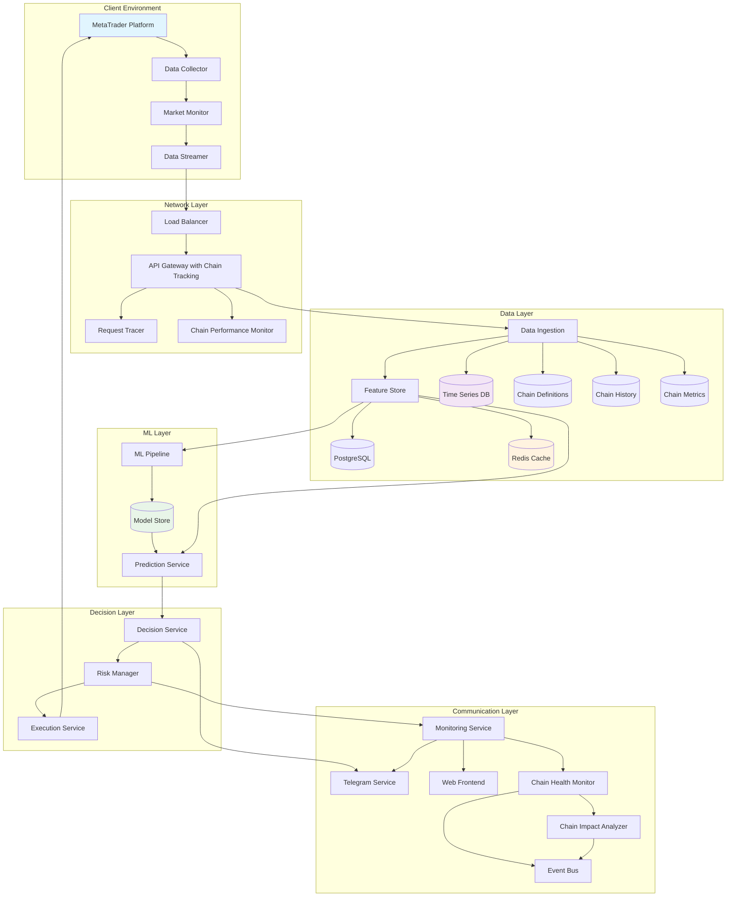

# AI Trading System - High-Level System Architecture

## System Overview

The AI Trading System is a distributed, microservices-based platform designed for real-time algorithmic trading with advanced machine learning capabilities. The system processes live market data, applies ML models for prediction, and executes trades automatically while maintaining strict risk management controls.

## Core Architecture Principles

### 1. Separation of Concerns
- **Client-Side**: Data collection and order execution
- **Server-Side**: Data processing, ML inference, and decision making
- **Infrastructure**: Monitoring, logging, and system management

### 2. Scalability & Performance
- **Horizontal Scaling**: Microservices can scale independently
- **Low Latency**: Sub-200ms end-to-end processing
- **High Throughput**: Handle thousands of trades per second
- **Resource Efficiency**: Optimized resource utilization

### 3. Reliability & Resilience
- **Fault Tolerance**: Circuit breakers and graceful degradation
- **Data Integrity**: ACID transactions for critical operations
- **Disaster Recovery**: Multi-region deployment capabilities
- **Monitoring**: Comprehensive observability and alerting

## High-Level Architecture Diagram



## Embedded Chain Mapping Architecture

### Chain Mapping Components

#### Central Hub Enhancements (Port 8000)
```
┌─────────────────────────────────────────────┐
│              Central Hub Service            │
├─────────────────────────────────────────────┤
│  ┌─────────────┐  ┌─────────────────────┐   │
│  │   Chain     │  │    Dependency       │   │
│  │  Registry   │  │     Tracker         │   │
│  └─────────────┘  └─────────────────────┘   │
│  ┌─────────────┐  ┌─────────────────────┐   │
│  │    Chain    │  │      Chain          │   │
│  │   Health    │  │     Impact          │   │
│  │  Monitor    │  │    Analyzer         │   │
│  └─────────────┘  └─────────────────────┘   │
│  ┌─────────────────────────────────────────┐│
│  │          Internal Event Bus             ││
│  └─────────────────────────────────────────┘│
└─────────────────────────────────────────────┘
```

#### API Gateway Enhancements (Port 8000)
```
┌─────────────────────────────────────────────┐
│             API Gateway Service             │
├─────────────────────────────────────────────┤
│  ┌─────────────┐  ┌─────────────────────┐   │
│  │   Request   │  │      Chain          │   │
│  │   Tracer    │  │   Performance       │   │
│  │ Middleware  │  │    Monitor          │   │
│  └─────────────┘  └─────────────────────┘   │
│  ┌─────────────┐  ┌─────────────────────┐   │
│  │    Flow     │  │      Chain          │   │
│  │   Logger    │  │     Metrics         │   │
│  │             │  │    Collector        │   │
│  └─────────────┘  └─────────────────────┘   │
└─────────────────────────────────────────────┘
```

#### Database Service Enhancements (Port 8008)
```
┌─────────────────────────────────────────────┐
│            Database Service                 │
├─────────────────────────────────────────────┤
│  ┌─────────────┐  ┌─────────────────────┐   │
│  │    Chain    │  │      Chain          │   │
│  │ Definitions │  │     History         │   │
│  │    Table    │  │      Table          │   │
│  └─────────────┘  └─────────────────────┘   │
│  ┌─────────────┐  ┌─────────────────────┐   │
│  │    Chain    │  │      Chain          │   │
│  │   Metrics   │  │      Query          │   │
│  │    Table    │  │     Engine          │   │
│  └─────────────┘  └─────────────────────┘   │
└─────────────────────────────────────────────┘
```

#### Performance Analytics Enhancements (Port 8002)
```
┌─────────────────────────────────────────────┐
│          Performance Analytics              │
├─────────────────────────────────────────────┤
│  ┌─────────────┐  ┌─────────────────────┐   │
│  │    Chain    │  │      Chain          │   │
│  │     AI      │  │     Anomaly         │   │
│  │  Analyzer   │  │    Detector         │   │
│  └─────────────┘  └─────────────────────┘   │
│  ┌─────────────┐  ┌─────────────────────┐   │
│  │    Chain    │  │      Chain          │   │
│  │ Optimizer   │  │    Reporting        │   │
│  │             │  │                     │   │
│  └─────────────┘  └─────────────────────┘   │
└─────────────────────────────────────────────┘
```

## Component Architecture Details

### 1. Client-Side Architecture

#### MetaTrader Integration Layer
```
┌─────────────────────────────────────────────┐
│              MetaTrader Platform            │
├─────────────────────────────────────────────┤
│  ┌─────────────┐  ┌─────────────┐          │
│  │   MQL5 EA   │  │ Data Export │          │
│  │   (Trading) │  │   Module    │          │
│  └─────────────┘  └─────────────┘          │
├─────────────────────────────────────────────┤
│              TCP/Named Pipes                │
├─────────────────────────────────────────────┤
│  ┌─────────────────────────────────────────┐│
│  │        C++ Integration Layer           ││
│  │  ┌─────────────┐  ┌─────────────────┐  ││
│  │  │ Data Reader │  │ Order Executor  │  ││
│  │  └─────────────┘  └─────────────────┘  ││
│  └─────────────────────────────────────────┘│
└─────────────────────────────────────────────┘
```

#### Data Processing Pipeline
```
Market Data → Validation → Normalization → Enrichment → Streaming
     ↓             ↓           ↓              ↓           ↓
  Raw OHLCV    Schema     Standard      Technical    gRPC/WebSocket
   Ticks       Check      Format        Indicators    to Server
```

### 2. Server-Side Architecture

#### API Gateway Layer
```
┌─────────────────────────────────────────────┐
│                API Gateway                  │
├─────────────────────────────────────────────┤
│  Authentication │ Rate Limiting │ Routing   │
│  Authorization  │ Load Balance  │ Logging   │
├─────────────────────────────────────────────┤
│  gRPC Services  │ REST APIs     │ WebSocket │
└─────────────────────────────────────────────┘
```

#### Data Processing Architecture
```
┌─────────────────────────────────────────────┐
│             Data Ingestion Service          │
├─────────────────────────────────────────────┤
│  ┌─────────────┐  ┌─────────────────────┐   │
│  │   Schema    │  │     Duplicate       │   │
│  │ Validation  │  │    Detection        │   │
│  └─────────────┘  └─────────────────────┘   │
│  ┌─────────────┐  ┌─────────────────────┐   │
│  │   Data      │  │      Routing        │   │
│  │ Enrichment  │  │     Engine          │   │
│  └─────────────┘  └─────────────────────┘   │
└─────────────────────────────────────────────┘
                     │
                     ▼
┌─────────────────────────────────────────────┐
│              Feature Store                  │
├─────────────────────────────────────────────┤
│  Online Features │ Offline Features         │
│  (Redis)         │ (PostgreSQL)             │
│                  │                          │
│  Real-time       │ Historical               │
│  Computation     │ Batch Processing         │
└─────────────────────────────────────────────┘
```

#### ML Pipeline Architecture
```
┌─────────────────────────────────────────────┐
│              ML Pipeline Service            │
├─────────────────────────────────────────────┤
│  ┌─────────────┐  ┌─────────────────────┐   │
│  │   Feature   │  │     Model           │   │
│  │ Engineering │  │    Training         │   │
│  └─────────────┘  └─────────────────────┘   │
│  ┌─────────────┐  ┌─────────────────────┐   │
│  │    Model    │  │     Model           │   │
│  │ Validation  │  │   Registration      │   │
│  └─────────────┘  └─────────────────────┘   │
└─────────────────────────────────────────────┘
                     │
                     ▼
┌─────────────────────────────────────────────┐
│             Prediction Service              │
├─────────────────────────────────────────────┤
│  Model Loading │ Inference Engine           │
│  A/B Testing   │ Prediction Caching         │
│  Monitoring    │ Performance Metrics        │
└─────────────────────────────────────────────┘
```

### 3. Decision and Execution Architecture

#### Decision Engine
```
┌─────────────────────────────────────────────┐
│             Decision Service                │
├─────────────────────────────────────────────┤
│  ┌─────────────┐  ┌─────────────────────┐   │
│  │   Signal    │  │      Rules          │   │
│  │ Aggregation │  │     Engine          │   │
│  └─────────────┘  └─────────────────────┘   │
│  ┌─────────────┐  ┌─────────────────────┐   │
│  │  Position   │  │    Portfolio        │   │
│  │   Sizing    │  │   Optimization      │   │
│  └─────────────┘  └─────────────────────┘   │
└─────────────────────────────────────────────┘
                     │
                     ▼
┌─────────────────────────────────────────────┐
│              Risk Manager                   │
├─────────────────────────────────────────────┤
│  Position Limits │ Drawdown Protection      │
│  Exposure Calc   │ Correlation Analysis     │
│  VaR Monitoring  │ Stress Testing           │
└─────────────────────────────────────────────┘
                     │
                     ▼
┌─────────────────────────────────────────────┐
│            Execution Service                │
├─────────────────────────────────────────────┤
│  Order Routing  │ Execution Quality         │
│  Slippage Track │ Position Reconciliation   │
│  Fill Matching  │ Trade Reporting           │
└─────────────────────────────────────────────┘
```

## Data Architecture

### 1. Data Storage Strategy

#### Time Series Data (InfluxDB)
```
measurement: market_data
tags:
  - symbol: EURUSD, GBPUSD, etc.
  - timeframe: M1, M5, M15, H1, etc.
  - source: mt4, mt5, external
fields:
  - open, high, low, close: float64
  - volume: int64
  - spread: float64
  - timestamp: timestamp
```

#### Relational Data (PostgreSQL)
```sql
-- Trades table
CREATE TABLE trades (
    id BIGSERIAL PRIMARY KEY,
    symbol VARCHAR(10) NOT NULL,
    side VARCHAR(4) NOT NULL, -- 'BUY', 'SELL'
    quantity DECIMAL(18,8) NOT NULL,
    price DECIMAL(18,8) NOT NULL,
    executed_at TIMESTAMP NOT NULL,
    pnl DECIMAL(18,8),
    commission DECIMAL(18,8),
    strategy_id VARCHAR(50),
    signal_id VARCHAR(50)
);

-- Models registry
CREATE TABLE ml_models (
    id BIGSERIAL PRIMARY KEY,
    name VARCHAR(100) NOT NULL,
    version VARCHAR(20) NOT NULL,
    algorithm VARCHAR(50) NOT NULL,
    hyperparameters JSONB,
    performance_metrics JSONB,
    created_at TIMESTAMP DEFAULT NOW(),
    is_active BOOLEAN DEFAULT FALSE
);
```

#### Cache Layer (Redis)
```
# Feature cache
feature:{symbol}:{timestamp} -> {feature_vector}

# Prediction cache
prediction:{model_id}:{feature_hash} -> {prediction_result}

# Session data
session:{user_id} -> {session_data}

# Real-time metrics
metrics:{service}:{metric_name} -> {value}
```

### 2. Data Flow Patterns

#### Real-time Data Flow
```
┌─────────────┐    ┌─────────────┐    ┌─────────────┐
│  Live Data  │───►│   Kafka     │───►│  Feature    │
│   Sources   │    │   Stream    │    │   Store     │
└─────────────┘    └─────────────┘    └─────────────┘
                          │                    │
                          ▼                    ▼
┌─────────────┐    ┌─────────────┐    ┌─────────────┐
│ Time Series │    │ Processing  │    │ Prediction  │
│  Database   │◄───│  Pipeline   │───►│  Service    │
└─────────────┘    └─────────────┘    └─────────────┘
```

#### Batch Data Flow
```
┌─────────────┐    ┌─────────────┐    ┌─────────────┐
│ Historical  │───►│   ETL       │───►│  Feature    │
│    Data     │    │ Pipeline    │    │ Engineering │
└─────────────┘    └─────────────┘    └─────────────┘
                                             │
                                             ▼
┌─────────────┐    ┌─────────────┐    ┌─────────────┐
│   Model     │◄───│  Training   │◄───│  Training   │
│   Store     │    │  Pipeline   │    │    Data     │
└─────────────┘    └─────────────┘    └─────────────┘
```

## Security Architecture

### 1. Authentication & Authorization
```
┌─────────────────────────────────────────────┐
│               Security Layer                │
├─────────────────────────────────────────────┤
│  ┌─────────────┐  ┌─────────────────────┐   │
│  │    OAuth2   │  │        JWT          │   │
│  │   Provider  │  │      Tokens         │   │
│  └─────────────┘  └─────────────────────┘   │
│  ┌─────────────┐  ┌─────────────────────┐   │
│  │    RBAC     │  │     API Keys        │   │
│  │   System    │  │    Management       │   │
│  └─────────────┘  └─────────────────────┘   │
└─────────────────────────────────────────────┘
```

### 2. Network Security
- **TLS 1.3**: All inter-service communication
- **VPC**: Isolated network segments
- **Firewall**: Strict ingress/egress rules
- **VPN**: Secure admin access
- **Chain Security**: End-to-end request integrity validation

### 3. Data Security
- **Encryption at Rest**: AES-256 for databases
- **Encryption in Transit**: TLS for all communication
- **Key Management**: HashiCorp Vault
- **Audit Logging**: All access attempts logged
- **Chain Audit**: Complete request flow tracking and validation

## Chain Mapping Data Flow

### 1. Request Flow with Chain Tracking
```
┌───────────────┐    ┌───────────────┐    ┌───────────────┐
│  Client Request  │───►│  API Gateway    │───►│  Target Service │
│  + Chain ID     │    │  + Request      │    │  + Chain       │
│                 │    │    Tracer       │    │    Context       │
└───────────────┘    └───────────────┘    └───────────────┘
       │                        │                        │
       │                        │                        │
       v                        v                        v
┌───────────────┐    ┌───────────────┐    ┌───────────────┐
│  Flow Logger    │    │  Chain          │    │  Event Bus      │
│                 │    │  Performance    │    │                 │
│                 │    │  Monitor        │    │                 │
└───────────────┘    └───────────────┘    └───────────────┘
```

### 2. Chain Event Schema
```json
{
  "chain_id": "uuid",
  "request_id": "uuid",
  "service_name": "string",
  "event_type": "start|process|complete|error",
  "timestamp": "ISO8601",
  "duration_ms": "number",
  "metadata": {
    "endpoint": "string",
    "user_id": "string",
    "parent_chain_id": "uuid",
    "dependency_count": "number",
    "performance_metrics": {
      "cpu_usage": "number",
      "memory_usage": "number",
      "network_latency": "number"
    }
  },
  "error_context": {
    "error_code": "string",
    "error_message": "string",
    "stack_trace": "string",
    "recovery_actions": ["string"]
  }
}
```

### 3. Chain Health Monitoring
```
Chain Health Metrics:
│
├── Service Dependencies
│   ├── Dependency Graph Analysis
│   ├── Circular Dependency Detection
│   └── Critical Path Identification
│
├── Performance Impact
│   ├── Chain Latency Analysis
│   ├── Bottleneck Detection
│   └── Resource Utilization Tracking
│
├── Error Propagation
│   ├── Error Chain Analysis
│   ├── Failure Pattern Recognition
│   └── Recovery Time Tracking
│
└── Change Impact
    ├── Deployment Impact Prediction
    ├── Configuration Change Effects
    └── Service Version Compatibility
```

## Monitoring & Observability

### 1. Metrics Collection
```
┌─────────────────────────────────────────────┐
│             Monitoring Stack               │
├─────────────────────────────────────────────┤
│  ┌─────────────┐  ┌─────────────────────┐   │
│  │ Prometheus  │  │      Grafana        │   │
│  │  Metrics    │  │    Dashboards       │   │
│  └─────────────┘  └─────────────────────┘   │
│  ┌─────────────┐  ┌─────────────────────┐   │
│  │    Jaeger   │  │    ELK Stack        │   │
│  │   Tracing   │  │     Logging         │   │
│  └─────────────┘  └─────────────────────┘   │
└─────────────────────────────────────────────┘
```

### 2. Key Metrics
- **System Metrics**: CPU, memory, disk, network
- **Application Metrics**: Response time, throughput, error rate
- **Business Metrics**: PnL, Sharpe ratio, max drawdown
- **ML Metrics**: Model accuracy, prediction latency, drift

### 3. Alerting Strategy
- **Critical**: System failures, security breaches
- **High**: Performance degradation, model drift
- **Medium**: Resource usage warnings
- **Low**: Information notifications

## Deployment Architecture

### 1. Container Orchestration
```
┌─────────────────────────────────────────────┐
│              Kubernetes Cluster            │
├─────────────────────────────────────────────┤
│  ┌─────────────┐  ┌─────────────────────┐   │
│  │   Ingress   │  │     Services        │   │
│  │ Controller  │  │   (ClusterIP)       │   │
│  └─────────────┘  └─────────────────────┘   │
│  ┌─────────────┐  ┌─────────────────────┐   │
│  │    Pods     │  │   ConfigMaps &      │   │
│  │ (Services)  │  │     Secrets         │   │
│  └─────────────┘  └─────────────────────┘   │
│  ┌─────────────┐  ┌─────────────────────┐   │
│  │ Persistent  │  │    StatefulSets     │   │
│  │  Volumes    │  │   (Databases)       │   │
│  └─────────────┘  └─────────────────────┘   │
└─────────────────────────────────────────────┘
```

### 2. Environment Strategy
- **Development**: Single-node cluster, mock data
- **Staging**: Multi-node cluster, realistic data
- **Production**: High-availability cluster, live data

### 3. CI/CD Pipeline
```
┌─────────────┐    ┌─────────────┐    ┌─────────────┐
│   Source    │───►│    Build    │───►│    Test     │
│   Control   │    │  & Package  │    │   Suite     │
└─────────────┘    └─────────────┘    └─────────────┘
                          │                    │
                          ▼                    ▼
┌─────────────┐    ┌─────────────┐    ┌─────────────┐
│  Production │◄───│   Staging   │◄───│   Deploy    │
│  Deployment │    │  Validation │    │  Artifacts  │
└─────────────┘    └─────────────┘    └─────────────┘
```

## Scalability Strategy

### 1. Horizontal Scaling
- **Stateless Services**: Scale based on load
- **Database Sharding**: Partition by symbol/time
- **Load Balancing**: Distribute traffic evenly
- **Auto-scaling**: Based on metrics thresholds

### 2. Performance Optimization
- **Caching Strategy**: Multi-level caching
- **Database Optimization**: Indexes, query optimization
- **Connection Pooling**: Efficient resource usage
- **Async Processing**: Non-blocking operations

### 3. Resource Management
- **CPU**: Dedicated cores for critical services
- **Memory**: Optimized allocation per service
- **Storage**: Fast SSDs for hot data
- **Network**: High-bandwidth connections

## Chain-Aware Debugging Architecture

### 1. Debug Information Flow
```
┌──────────────────────────────────────────────────────────────────────────────┐
│                             CHAIN-AWARE DEBUGGING                              │
├──────────────────────────────────────────────────────────────────────────────┤
│  Issue Detection        ───►  Chain Analysis       ───►  Impact Assessment     │
│  │                              │                             │                      │
│  ├─ Service Errors              ├─ Dependency Mapping         ├─ Affected Services      │
│  ├─ Performance Degradation     ├─ Request Flow Tracing       ├─ User Impact            │
│  ├─ Resource Exhaustion         ├─ Error Propagation Path     ├─ Business Impact        │
│  └─ Anomaly Detection           └─ Performance Bottlenecks    └─ Recovery Priority      │
│                                                                                 │
│  Root Cause Analysis    ───►  Recovery Actions     ───►  Preventive Measures    │
│  │                              │                             │                      │
│  ├─ Chain Pattern Recognition   ├─ Service Restart/Scale      ├─ Alert Tuning           │
│  ├─ Historical Correlation      ├─ Traffic Rerouting          ├─ Capacity Planning      │
│  ├─ Code/Config Changes         ├─ Circuit Breaker Activation ├─ Code Improvements      │
│  └─ External Dependency Issues  └─ Rollback Procedures        └─ Architecture Updates   │
└──────────────────────────────────────────────────────────────────────────────┘
```

### 2. Chain Monitoring Integration
```
Monitoring Layer Integration:
│
├── Metrics Collection
│   ├── Chain Performance Metrics
│   ├── Service Health Indicators
│   └── Dependency Status Tracking
│
├── Alerting Enhancements
│   ├── Chain-Aware Alert Rules
│   ├── Cascading Failure Detection
│   └── Impact-Based Alert Prioritization
│
└── Dashboard Integration
    ├── Real-time Chain Visualization
    ├── Interactive Dependency Maps
    └── Historical Chain Analysis
```

This enhanced architecture provides a robust, scalable foundation for the AI trading system with embedded chain mapping capabilities that enable comprehensive dependency tracking, performance analysis, and debugging without introducing additional service complexity.