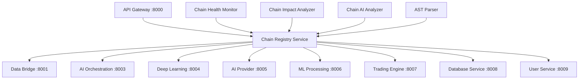

# Embedded Chain Mapping System - Implementation Specifications

## Overview

This document provides comprehensive specifications for implementing an embedded chain mapping system within the existing AI trading platform microservices architecture. The system will map 30 distinct chains across 5 categories through embedded enhancements to existing services.

## Table of Contents

1. [System Architecture](#system-architecture)
2. [Chain Definition Schema](#chain-definition-schema)
3. [Core Components](#core-components)
4. [API Specifications](#api-specifications)
5. [Database Schema](#database-schema)
6. [Chain Categories](#chain-categories)
7. [Automated Discovery](#automated-discovery)
8. [Integration Strategy](#integration-strategy)
9. [Implementation Roadmap](#implementation-roadmap)
10. [Performance Considerations](#performance-considerations)

## System Architecture

### Architecture Overview

The chain mapping system will be embedded as a cross-cutting concern across all existing microservices, providing:

- **Transparent Integration**: No disruption to existing service functionality
- **Real-time Monitoring**: Live chain health and dependency tracking
- **Automated Discovery**: Dynamic chain relationship detection
- **Impact Analysis**: Predictive change impact assessment

### Service Integration Points



## Chain Definition Schema

### Core Data Models

```typescript
interface ChainDefinition {
  id: string;                    // Unique chain identifier (A1, B1, C1, etc.)
  name: string;                  // Human-readable chain name
  category: ChainCategory;       // Data Flow, Service Communication, etc.
  description: string;           // Chain purpose and behavior
  nodes: ChainNode[];            // Chain execution nodes
  edges: ChainEdge[];            // Node connections
  dependencies: ChainDependency[]; // External dependencies
  metadata: ChainMetadata;       // Additional chain information
  status: ChainStatus;           // Current operational status
  metrics: ChainMetrics;         // Performance and health metrics
  created_at: timestamp;
  updated_at: timestamp;
}

interface ChainNode {
  id: string;                    // Node identifier
  type: NodeType;                // Service, Function, API, Database, etc.
  service: string;               // Microservice name
  component: string;             // Specific component/function
  config: NodeConfig;            // Node-specific configuration
  position: NodePosition;        // Graph positioning
  health_check: HealthCheck;     // Node health validation
}

interface ChainEdge {
  id: string;
  source_node: string;           // Source node ID
  target_node: string;           // Target node ID
  type: EdgeType;                // HTTP, WebSocket, Event, Database, etc.
  condition: string;             // Execution condition (optional)
  latency_sla: number;           // Expected latency (ms)
  retry_policy: RetryPolicy;     // Error handling strategy
}

interface ChainDependency {
  id: string;
  type: DependencyType;          // Service, Database, External API, etc.
  target: string;                // Dependency identifier
  criticality: CriticalityLevel; // Critical, High, Medium, Low
  fallback: string;              // Fallback strategy
}

enum ChainCategory {
  DATA_FLOW = "data_flow",
  SERVICE_COMMUNICATION = "service_communication",
  USER_EXPERIENCE = "user_experience",
  AI_ML_PROCESSING = "ai_ml_processing",
  INFRASTRUCTURE = "infrastructure"
}

enum NodeType {
  SERVICE = "service",
  API_ENDPOINT = "api_endpoint",
  DATABASE = "database",
  CACHE = "cache",
  QUEUE = "queue",
  AI_MODEL = "ai_model",
  WEBSOCKET = "websocket",
  EXTERNAL_API = "external_api"
}

enum EdgeType {
  HTTP_REQUEST = "http_request",
  WEBSOCKET_MESSAGE = "websocket_message",
  DATABASE_QUERY = "database_query",
  CACHE_OPERATION = "cache_operation",
  EVENT_PUBLISH = "event_publish",
  AI_INFERENCE = "ai_inference"
}

enum ChainStatus {
  HEALTHY = "healthy",
  DEGRADED = "degraded",
  FAILED = "failed",
  UNKNOWN = "unknown"
}
```

## Core Components

### 1. ChainRegistry

Central registry for all chain definitions and relationships.

```python
class ChainRegistry:
    """
    Central registry for managing chain definitions and relationships.
    Embedded in Database Service (8008) for centralized access.
    """

    def register_chain(self, chain_def: ChainDefinition) -> str:
        """Register a new chain definition"""

    def get_chain(self, chain_id: str) -> ChainDefinition:
        """Retrieve chain definition by ID"""

    def update_chain(self, chain_id: str, updates: dict) -> bool:
        """Update existing chain definition"""

    def list_chains(self, category: ChainCategory = None) -> List[ChainDefinition]:
        """List chains with optional category filter"""

    def find_chains_by_service(self, service_name: str) -> List[ChainDefinition]:
        """Find all chains involving a specific service"""

    def get_dependency_graph(self, chain_id: str) -> DependencyGraph:
        """Get complete dependency graph for a chain"""

    def validate_chain(self, chain_def: ChainDefinition) -> ValidationResult:
        """Validate chain definition for consistency"""
```

### 2. ChainHealthMonitor

Real-time monitoring of chain health and performance.

```python
class ChainHealthMonitor:
    """
    Real-time chain health monitoring with alerting.
    Integrated with existing CoreLogger and performance analytics.
    """

    def start_monitoring(self, chain_id: str) -> bool:
        """Start monitoring a specific chain"""

    def stop_monitoring(self, chain_id: str) -> bool:
        """Stop monitoring a specific chain"""

    def get_chain_health(self, chain_id: str) -> HealthStatus:
        """Get current health status of a chain"""

    def get_node_health(self, chain_id: str, node_id: str) -> NodeHealth:
        """Get health of specific node in chain"""

    def check_sla_compliance(self, chain_id: str) -> SLAReport:
        """Check if chain meets defined SLAs"""

    def trigger_health_check(self, chain_id: str) -> HealthCheckResult:
        """Manually trigger chain health check"""

    def setup_alerts(self, chain_id: str, alert_config: AlertConfig) -> bool:
        """Configure health alerts for chain"""
```

### 3. ChainImpactAnalyzer

Predictive analysis of change impacts across chains.

```python
class ChainImpactAnalyzer:
    """
    Analyze potential impact of changes across chain dependencies.
    Uses AI models for predictive impact assessment.
    """

    def analyze_service_impact(self, service_name: str, change_type: str) -> ImpactReport:
        """Analyze impact of service changes"""

    def analyze_node_impact(self, chain_id: str, node_id: str) -> ImpactReport:
        """Analyze impact of node changes"""

    def predict_cascade_effects(self, chain_id: str, failure_node: str) -> CascadeAnalysis:
        """Predict cascade failure effects"""

    def suggest_mitigation(self, impact_report: ImpactReport) -> List[MitigationStrategy]:
        """Suggest mitigation strategies for identified impacts"""

    def validate_change_safety(self, change_request: ChangeRequest) -> SafetyReport:
        """Validate if a change is safe to deploy"""
```

### 4. ChainAIAnalyzer

AI-powered pattern recognition and optimization.

```python
class ChainAIAnalyzer:
    """
    AI-powered analysis for chain optimization and pattern recognition.
    Integrates with existing AI services.
    """

    def detect_patterns(self, chains: List[ChainDefinition]) -> List[Pattern]:
        """Detect common patterns across chains"""

    def suggest_optimizations(self, chain_id: str) -> List[Optimization]:
        """Suggest chain optimizations using AI analysis"""

    def predict_bottlenecks(self, chain_id: str) -> List[Bottleneck]:
        """Predict potential bottlenecks using ML models"""

    def analyze_performance_trends(self, chain_id: str, timeframe: str) -> TrendAnalysis:
        """Analyze chain performance trends"""

    def recommend_scaling(self, chain_id: str) -> ScalingRecommendation:
        """Recommend scaling strategies"""
```

## API Specifications

### REST API Endpoints

#### Chain Management API

```yaml
# Embedded in API Gateway (8000)
# Base path: /api/v1/chains

GET /api/v1/chains:
  summary: List all chains
  parameters:
    - name: category
      in: query
      schema:
        type: string
        enum: [data_flow, service_communication, user_experience, ai_ml_processing, infrastructure]
    - name: service
      in: query
      schema:
        type: string
    - name: status
      in: query
      schema:
        type: string
        enum: [healthy, degraded, failed, unknown]
  responses:
    200:
      content:
        application/json:
          schema:
            type: object
            properties:
              chains:
                type: array
                items:
                  $ref: '#/components/schemas/ChainDefinition'
              total:
                type: integer
              category_counts:
                type: object

POST /api/v1/chains:
  summary: Create new chain definition
  requestBody:
    content:
      application/json:
        schema:
          $ref: '#/components/schemas/ChainDefinition'
  responses:
    201:
      content:
        application/json:
          schema:
            type: object
            properties:
              chain_id:
                type: string
              message:
                type: string

GET /api/v1/chains/{chain_id}:
  summary: Get chain definition
  parameters:
    - name: chain_id
      in: path
      required: true
      schema:
        type: string
  responses:
    200:
      content:
        application/json:
          schema:
            $ref: '#/components/schemas/ChainDefinition'

PUT /api/v1/chains/{chain_id}:
  summary: Update chain definition
  parameters:
    - name: chain_id
      in: path
      required: true
      schema:
        type: string
  requestBody:
    content:
      application/json:
        schema:
          $ref: '#/components/schemas/ChainDefinition'
  responses:
    200:
      content:
        application/json:
          schema:
            type: object
            properties:
              message:
                type: string
              updated_fields:
                type: array
                items:
                  type: string

DELETE /api/v1/chains/{chain_id}:
  summary: Delete chain definition
  parameters:
    - name: chain_id
      in: path
      required: true
      schema:
        type: string
  responses:
    204:
      description: Chain deleted successfully
```

#### Chain Health API

```yaml
# Health monitoring endpoints
GET /api/v1/chains/{chain_id}/health:
  summary: Get chain health status
  responses:
    200:
      content:
        application/json:
          schema:
            type: object
            properties:
              chain_id:
                type: string
              status:
                type: string
                enum: [healthy, degraded, failed, unknown]
              overall_score:
                type: number
                minimum: 0
                maximum: 100
              node_health:
                type: array
                items:
                  type: object
                  properties:
                    node_id:
                      type: string
                    status:
                      type: string
                    latency:
                      type: number
                    error_rate:
                      type: number
              sla_compliance:
                type: object
                properties:
                  meets_sla:
                    type: boolean
                  latency_sla:
                    type: number
                  actual_latency:
                    type: number
              last_check:
                type: string
                format: date-time

POST /api/v1/chains/{chain_id}/health/check:
  summary: Trigger manual health check
  responses:
    200:
      content:
        application/json:
          schema:
            type: object
            properties:
              check_id:
                type: string
              status:
                type: string
              results:
                type: object

GET /api/v1/chains/{chain_id}/metrics:
  summary: Get chain performance metrics
  parameters:
    - name: timeframe
      in: query
      schema:
        type: string
        enum: [1h, 6h, 24h, 7d, 30d]
        default: 24h
  responses:
    200:
      content:
        application/json:
          schema:
            type: object
            properties:
              timeframe:
                type: string
              metrics:
                type: object
                properties:
                  avg_latency:
                    type: number
                  p95_latency:
                    type: number
                  error_rate:
                    type: number
                  throughput:
                    type: number
                  availability:
                    type: number
```

#### Chain Analysis API

```yaml
# Analysis and optimization endpoints
POST /api/v1/chains/{chain_id}/analyze/impact:
  summary: Analyze change impact
  requestBody:
    content:
      application/json:
        schema:
          type: object
          properties:
            change_type:
              type: string
              enum: [service_update, node_modification, dependency_change]
            target_component:
              type: string
            change_description:
              type: string
  responses:
    200:
      content:
        application/json:
          schema:
            type: object
            properties:
              impact_score:
                type: number
                minimum: 0
                maximum: 10
              affected_chains:
                type: array
                items:
                  type: string
              risk_level:
                type: string
                enum: [low, medium, high, critical]
              mitigation_strategies:
                type: array
                items:
                  type: object
                  properties:
                    strategy:
                      type: string
                    description:
                      type: string
                    effort:
                      type: string

GET /api/v1/chains/{chain_id}/analyze/optimization:
  summary: Get optimization recommendations
  responses:
    200:
      content:
        application/json:
          schema:
            type: object
            properties:
              optimizations:
                type: array
                items:
                  type: object
                  properties:
                    type:
                      type: string
                    description:
                      type: string
                    expected_improvement:
                      type: number
                    implementation_effort:
                      type: string
                    priority:
                      type: string

GET /api/v1/chains/patterns:
  summary: Get detected patterns across chains
  responses:
    200:
      content:
        application/json:
          schema:
            type: object
            properties:
              patterns:
                type: array
                items:
                  type: object
                  properties:
                    pattern_id:
                      type: string
                    name:
                      type: string
                    frequency:
                      type: number
                    chains:
                      type: array
                      items:
                        type: string
                    optimization_potential:
                      type: number
```

### WebSocket API

```yaml
# Real-time chain monitoring (via Data Bridge service)
/ws/chains/{chain_id}/monitor:
  description: Real-time chain health and metrics
  message_types:
    - health_update:
        properties:
          chain_id: string
          status: string
          timestamp: string
          node_status: object
    - metrics_update:
        properties:
          chain_id: string
          metrics: object
          timestamp: string
    - alert:
        properties:
          chain_id: string
          alert_type: string
          severity: string
          message: string
          timestamp: string

/ws/chains/discovery:
  description: Real-time chain discovery events
  message_types:
    - chain_discovered:
        properties:
          chain_id: string
          chain_definition: object
          discovery_method: string
    - dependency_detected:
        properties:
          source_chain: string
          target_chain: string
          dependency_type: string
```

## Database Schema

### PostgreSQL Schema (User/Config Data)

```sql
-- Chain definitions and metadata
CREATE TABLE chain_definitions (
    id VARCHAR(10) PRIMARY KEY,              -- A1, B1, C1, etc.
    name VARCHAR(255) NOT NULL,
    category VARCHAR(50) NOT NULL,
    description TEXT,
    status VARCHAR(20) DEFAULT 'unknown',
    metadata JSONB DEFAULT '{}',
    created_at TIMESTAMP DEFAULT CURRENT_TIMESTAMP,
    updated_at TIMESTAMP DEFAULT CURRENT_TIMESTAMP,
    created_by VARCHAR(100),
    version INTEGER DEFAULT 1
);

-- Chain nodes (components/services)
CREATE TABLE chain_nodes (
    id UUID PRIMARY KEY DEFAULT gen_random_uuid(),
    chain_id VARCHAR(10) REFERENCES chain_definitions(id) ON DELETE CASCADE,
    node_id VARCHAR(100) NOT NULL,
    node_type VARCHAR(50) NOT NULL,
    service_name VARCHAR(100),
    component_name VARCHAR(200),
    config JSONB DEFAULT '{}',
    position JSONB DEFAULT '{}',
    health_check_config JSONB DEFAULT '{}',
    created_at TIMESTAMP DEFAULT CURRENT_TIMESTAMP,
    UNIQUE(chain_id, node_id)
);

-- Chain edges (connections between nodes)
CREATE TABLE chain_edges (
    id UUID PRIMARY KEY DEFAULT gen_random_uuid(),
    chain_id VARCHAR(10) REFERENCES chain_definitions(id) ON DELETE CASCADE,
    edge_id VARCHAR(100) NOT NULL,
    source_node VARCHAR(100) NOT NULL,
    target_node VARCHAR(100) NOT NULL,
    edge_type VARCHAR(50) NOT NULL,
    condition_expr TEXT,
    latency_sla INTEGER,
    retry_policy JSONB DEFAULT '{}',
    created_at TIMESTAMP DEFAULT CURRENT_TIMESTAMP,
    UNIQUE(chain_id, edge_id)
);

-- Chain dependencies
CREATE TABLE chain_dependencies (
    id UUID PRIMARY KEY DEFAULT gen_random_uuid(),
    chain_id VARCHAR(10) REFERENCES chain_definitions(id) ON DELETE CASCADE,
    dependency_id VARCHAR(100) NOT NULL,
    dependency_type VARCHAR(50) NOT NULL,
    target_identifier VARCHAR(200) NOT NULL,
    criticality VARCHAR(20) DEFAULT 'medium',
    fallback_strategy TEXT,
    created_at TIMESTAMP DEFAULT CURRENT_TIMESTAMP,
    UNIQUE(chain_id, dependency_id)
);

-- Chain health monitoring configuration
CREATE TABLE chain_monitoring_config (
    id UUID PRIMARY KEY DEFAULT gen_random_uuid(),
    chain_id VARCHAR(10) REFERENCES chain_definitions(id) ON DELETE CASCADE,
    monitoring_enabled BOOLEAN DEFAULT true,
    check_interval INTEGER DEFAULT 60,        -- seconds
    alert_thresholds JSONB DEFAULT '{}',
    notification_config JSONB DEFAULT '{}',
    created_at TIMESTAMP DEFAULT CURRENT_TIMESTAMP,
    updated_at TIMESTAMP DEFAULT CURRENT_TIMESTAMP,
    UNIQUE(chain_id)
);

-- Chain discovery results
CREATE TABLE chain_discovery_results (
    id UUID PRIMARY KEY DEFAULT gen_random_uuid(),
    discovery_method VARCHAR(50) NOT NULL,   -- ast_parser, runtime_trace, manual
    discovered_at TIMESTAMP DEFAULT CURRENT_TIMESTAMP,
    service_name VARCHAR(100),
    discovery_data JSONB NOT NULL,
    confidence_score DECIMAL(3,2),           -- 0.00 to 1.00
    reviewed BOOLEAN DEFAULT false,
    chain_id VARCHAR(10) REFERENCES chain_definitions(id) ON DELETE SET NULL
);

-- Indexes for performance
CREATE INDEX idx_chain_definitions_category ON chain_definitions(category);
CREATE INDEX idx_chain_definitions_status ON chain_definitions(status);
CREATE INDEX idx_chain_nodes_service ON chain_nodes(service_name);
CREATE INDEX idx_chain_edges_type ON chain_edges(edge_type);
CREATE INDEX idx_chain_dependencies_type ON chain_dependencies(dependency_type);
CREATE INDEX idx_discovery_results_method ON chain_discovery_results(discovery_method);
CREATE INDEX idx_discovery_results_service ON chain_discovery_results(service_name);
```

### ClickHouse Schema (Time-Series Data)

```sql
-- Chain health metrics (high-frequency data)
CREATE TABLE chain_health_metrics (
    timestamp DateTime64(3),
    chain_id String,
    node_id String,
    metric_type String,                      -- latency, error_rate, throughput, etc.
    metric_value Float64,
    status String,                           -- healthy, degraded, failed
    service_name String,
    metadata String                          -- JSON string for additional data
) ENGINE = MergeTree()
PARTITION BY toYYYYMM(timestamp)
ORDER BY (chain_id, node_id, timestamp)
TTL timestamp + INTERVAL 90 DAY DELETE;

-- Chain execution traces
CREATE TABLE chain_execution_traces (
    trace_id String,
    chain_id String,
    node_id String,
    timestamp DateTime64(3),
    execution_start DateTime64(3),
    execution_end DateTime64(3),
    duration_ms UInt32,
    status String,
    error_message String,
    input_size UInt32,
    output_size UInt32,
    metadata String
) ENGINE = MergeTree()
PARTITION BY toYYYYMM(timestamp)
ORDER BY (chain_id, timestamp, trace_id)
TTL timestamp + INTERVAL 30 DAY DELETE;

-- Chain performance aggregates (materialized view)
CREATE MATERIALIZED VIEW chain_performance_hourly
ENGINE = SummingMergeTree()
PARTITION BY toYYYYMM(timestamp)
ORDER BY (chain_id, node_id, timestamp)
AS SELECT
    toStartOfHour(timestamp) as timestamp,
    chain_id,
    node_id,
    service_name,
    avg(metric_value) as avg_value,
    quantile(0.95)(metric_value) as p95_value,
    count() as sample_count,
    sum(case when status = 'failed' then 1 else 0 end) as error_count
FROM chain_health_metrics
WHERE metric_type = 'latency'
GROUP BY timestamp, chain_id, node_id, service_name;

-- Chain impact analysis results
CREATE TABLE chain_impact_analyses (
    analysis_id String,
    chain_id String,
    timestamp DateTime64(3),
    change_type String,
    target_component String,
    impact_score Float32,
    risk_level String,
    affected_chains Array(String),
    prediction_confidence Float32,
    analysis_data String                     -- JSON string with detailed results
) ENGINE = MergeTree()
PARTITION BY toYYYYMM(timestamp)
ORDER BY (chain_id, timestamp)
TTL timestamp + INTERVAL 180 DAY DELETE;
```

## Chain Categories

### Category A: Data Flow Chains (6 chains)

#### A1: Market Data Pipeline
```yaml
chain_id: A1
name: Market Data Pipeline
description: Real-time market data ingestion, processing, and distribution
nodes:
  - id: mt5_source
    type: external_api
    service: client_side
    component: mt5_bridge
  - id: data_ingestion
    type: websocket
    service: data-bridge
    component: mt5_websocket_handler
  - id: data_validation
    type: service
    service: data-bridge
    component: data_validator
  - id: data_storage
    type: database
    service: database-service
    component: clickhouse_writer
  - id: data_distribution
    type: websocket
    service: data-bridge
    component: market_data_broadcaster
edges:
  - source: mt5_source
    target: data_ingestion
    type: websocket_message
    latency_sla: 50
  - source: data_ingestion
    target: data_validation
    type: http_request
    latency_sla: 10
  - source: data_validation
    target: data_storage
    type: database_query
    latency_sla: 20
  - source: data_validation
    target: data_distribution
    type: event_publish
    latency_sla: 5
```

#### A2: AI Decision Pipeline
```yaml
chain_id: A2
name: AI Decision Pipeline
description: AI-driven trading decision making process
nodes:
  - id: market_data_input
    type: service
    service: data-bridge
    component: market_data_provider
  - id: feature_extraction
    type: service
    service: ml-processing
    component: feature_extractor
  - id: model_inference
    type: ai_model
    service: ai-provider
    component: trading_model
  - id: decision_validation
    type: service
    service: ai-orchestration
    component: decision_validator
  - id: signal_output
    type: service
    service: trading-engine
    component: signal_receiver
edges:
  - source: market_data_input
    target: feature_extraction
    type: http_request
    latency_sla: 100
  - source: feature_extraction
    target: model_inference
    type: ai_inference
    latency_sla: 500
  - source: model_inference
    target: decision_validation
    type: http_request
    latency_sla: 50
  - source: decision_validation
    target: signal_output
    type: http_request
    latency_sla: 25
```

### Category B: Service Communication Chains (8 chains)

#### B1: API Request Chain
```yaml
chain_id: B1
name: API Request Chain
description: Standard API request processing across microservices
nodes:
  - id: gateway_entry
    type: api_endpoint
    service: api-gateway
    component: request_handler
  - id: authentication
    type: service
    service: user-service
    component: auth_validator
  - id: rate_limiting
    type: service
    service: api-gateway
    component: rate_limiter
  - id: request_routing
    type: service
    service: api-gateway
    component: request_router
  - id: target_service
    type: service
    service: "*"
    component: endpoint_handler
  - id: response_formatting
    type: service
    service: api-gateway
    component: response_formatter
edges:
  - source: gateway_entry
    target: authentication
    type: http_request
    latency_sla: 50
  - source: authentication
    target: rate_limiting
    type: http_request
    latency_sla: 10
  - source: rate_limiting
    target: request_routing
    type: http_request
    latency_sla: 5
  - source: request_routing
    target: target_service
    type: http_request
    latency_sla: 200
  - source: target_service
    target: response_formatting
    type: http_request
    latency_sla: 10
```

### Category C: User Experience Chains (5 chains)

#### C1: Trading Dashboard Journey
```yaml
chain_id: C1
name: Trading Dashboard Journey
description: End-to-end user trading dashboard experience
nodes:
  - id: user_login
    type: api_endpoint
    service: user-service
    component: login_handler
  - id: dashboard_load
    type: api_endpoint
    service: api-gateway
    component: dashboard_api
  - id: portfolio_data
    type: service
    service: database-service
    component: portfolio_query
  - id: market_stream
    type: websocket
    service: data-bridge
    component: market_websocket
  - id: frontend_render
    type: external_api
    service: frontend
    component: dashboard_component
edges:
  - source: user_login
    target: dashboard_load
    type: http_request
    latency_sla: 100
  - source: dashboard_load
    target: portfolio_data
    type: http_request
    latency_sla: 200
  - source: dashboard_load
    target: market_stream
    type: websocket_message
    latency_sla: 50
  - source: portfolio_data
    target: frontend_render
    type: http_request
    latency_sla: 100
  - source: market_stream
    target: frontend_render
    type: websocket_message
    latency_sla: 25
```

### Category D: AI/ML Processing Chains (4 chains)

#### D1: Model Training Chain
```yaml
chain_id: D1
name: Model Training Chain
description: End-to-end ML model training pipeline
nodes:
  - id: training_trigger
    type: service
    service: ml-processing
    component: training_scheduler
  - id: data_preparation
    type: service
    service: ml-processing
    component: data_preprocessor
  - id: feature_engineering
    type: service
    service: ml-processing
    component: feature_engineer
  - id: model_training
    type: ai_model
    service: deep-learning
    component: neural_trainer
  - id: model_validation
    type: service
    service: deep-learning
    component: model_validator
  - id: model_deployment
    type: service
    service: ai-provider
    component: model_deployer
edges:
  - source: training_trigger
    target: data_preparation
    type: http_request
    latency_sla: 1000
  - source: data_preparation
    target: feature_engineering
    type: http_request
    latency_sla: 5000
  - source: feature_engineering
    target: model_training
    type: ai_inference
    latency_sla: 300000  # 5 minutes
  - source: model_training
    target: model_validation
    type: http_request
    latency_sla: 60000   # 1 minute
  - source: model_validation
    target: model_deployment
    type: http_request
    latency_sla: 30000   # 30 seconds
```

### Category E: Infrastructure Chains (7 chains)

#### E1: Deployment Chain
```yaml
chain_id: E1
name: Deployment Chain
description: Service deployment and rollout process
nodes:
  - id: deployment_trigger
    type: external_api
    service: ci_cd
    component: deployment_webhook
  - id: health_check_pre
    type: service
    service: "*"
    component: health_endpoint
  - id: service_shutdown
    type: service
    service: "*"
    component: graceful_shutdown
  - id: service_deployment
    type: external_api
    service: docker
    component: container_deploy
  - id: health_check_post
    type: service
    service: "*"
    component: health_endpoint
  - id: traffic_routing
    type: service
    service: api-gateway
    component: traffic_manager
edges:
  - source: deployment_trigger
    target: health_check_pre
    type: http_request
    latency_sla: 5000
  - source: health_check_pre
    target: service_shutdown
    type: http_request
    latency_sla: 10000
  - source: service_shutdown
    target: service_deployment
    type: external_api
    latency_sla: 60000
  - source: service_deployment
    target: health_check_post
    type: http_request
    latency_sla: 30000
  - source: health_check_post
    target: traffic_routing
    type: http_request
    latency_sla: 1000
```

## Automated Discovery

### AST Parser Integration

```python
class ChainASTParser:
    """
    Abstract Syntax Tree parser for automatic chain discovery.
    Analyzes Python service code to identify chain patterns.
    """

    def parse_service_directory(self, service_path: str) -> List[ChainCandidate]:
        """Parse entire service directory for chain patterns"""

    def extract_api_endpoints(self, file_path: str) -> List[APIEndpoint]:
        """Extract API endpoint definitions from Python files"""

    def analyze_function_calls(self, file_path: str) -> List[FunctionCall]:
        """Analyze inter-service function calls"""

    def detect_database_operations(self, file_path: str) -> List[DatabaseOperation]:
        """Detect database queries and operations"""

    def extract_websocket_handlers(self, file_path: str) -> List[WebSocketHandler]:
        """Extract WebSocket message handlers"""

    def analyze_import_dependencies(self, file_path: str) -> List[ImportDependency]:
        """Analyze import statements for service dependencies"""
```

### Runtime Tracing

```python
class ChainRuntimeTracer:
    """
    Runtime tracing using OpenTelemetry for dynamic chain discovery.
    Monitors actual execution flows in production.
    """

    def start_tracing(self, service_name: str) -> bool:
        """Start runtime tracing for a service"""

    def stop_tracing(self, service_name: str) -> bool:
        """Stop runtime tracing for a service"""

    def extract_execution_chains(self, trace_data: TraceData) -> List[ExecutionChain]:
        """Extract chain patterns from trace data"""

    def correlate_spans(self, spans: List[Span]) -> List[ChainSequence]:
        """Correlate OpenTelemetry spans into chain sequences"""

    def detect_bottlenecks(self, execution_chains: List[ExecutionChain]) -> List[Bottleneck]:
        """Detect performance bottlenecks in execution chains"""
```

### Service Mesh Analysis

```python
class ServiceMeshAnalyzer:
    """
    Analyze service mesh communication patterns for chain discovery.
    Works with existing Docker networking and service communication.
    """

    def analyze_network_traffic(self, timeframe: str) -> List[NetworkFlow]:
        """Analyze network traffic patterns between services"""

    def extract_service_topology(self) -> ServiceTopology:
        """Extract current service communication topology"""

    def detect_communication_patterns(self, flows: List[NetworkFlow]) -> List[Pattern]:
        """Detect recurring communication patterns"""

    def validate_chain_accuracy(self, chain_def: ChainDefinition) -> ValidationResult:
        """Validate chain definition against actual network behavior"""
```

## Implementation Roadmap

### Phase 1: Foundation (Weeks 1-2)
- [ ] Implement core data models and database schema
- [ ] Create ChainRegistry service component
- [ ] Develop basic API endpoints for chain management
- [ ] Set up monitoring infrastructure integration

### Phase 2: Discovery (Weeks 3-4)
- [ ] Implement AST parser for code analysis
- [ ] Develop runtime tracing integration
- [ ] Create automated chain discovery workflows
- [ ] Build chain validation and consistency checking

### Phase 3: Monitoring (Weeks 5-6)
- [ ] Implement ChainHealthMonitor with real-time tracking
- [ ] Develop alerting and notification system
- [ ] Create health check automation
- [ ] Build performance metrics collection

### Phase 4: Analysis (Weeks 7-8)
- [ ] Implement ChainImpactAnalyzer
- [ ] Develop AI-powered optimization recommendations
- [ ] Create pattern recognition system
- [ ] Build predictive failure analysis

### Phase 5: Integration (Weeks 9-10)
- [ ] Embed chain tracking in all microservices
- [ ] Implement service-specific chain hooks
- [ ] Create dashboard and visualization
- [ ] Perform comprehensive testing

### Phase 6: Optimization (Weeks 11-12)
- [ ] Performance tuning and optimization
- [ ] Advanced AI analysis features
- [ ] Production deployment and monitoring
- [ ] Documentation and training

## Performance Considerations

### Scalability Requirements
- Support for 1000+ concurrent chain executions
- Sub-100ms chain health check response times
- Real-time monitoring with <1 second latency
- Efficient storage for 30-day metric retention

### Resource Optimization
- Minimal overhead on existing service performance
- Efficient database queries with proper indexing
- Intelligent caching for frequently accessed chains
- Asynchronous processing for heavy analysis tasks

### Monitoring Efficiency
- Configurable monitoring intervals per chain
- Smart alerting to reduce noise
- Automated scaling based on chain complexity
- Efficient data aggregation and storage

This comprehensive specification provides the foundation for implementing an embedded chain mapping system that will enhance the existing AI trading platform with sophisticated dependency tracking, real-time monitoring, and predictive analysis capabilities.