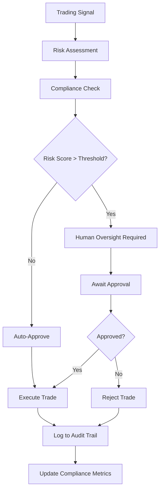
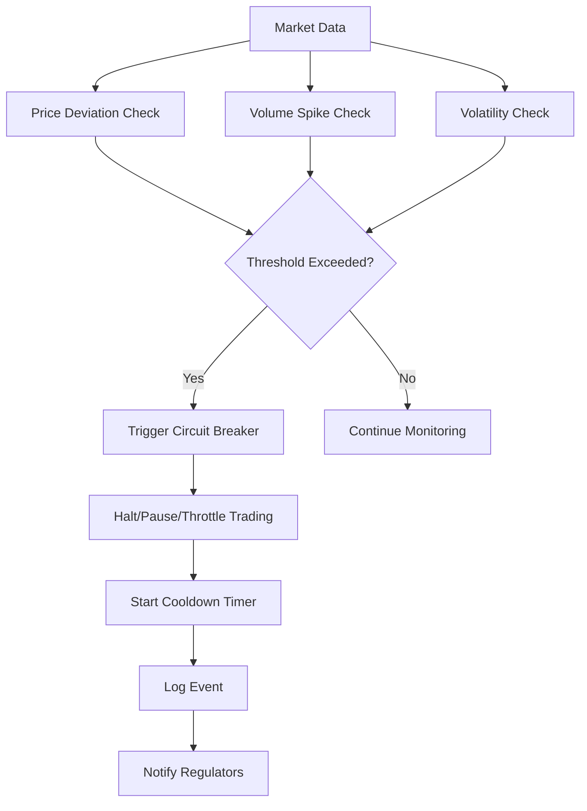
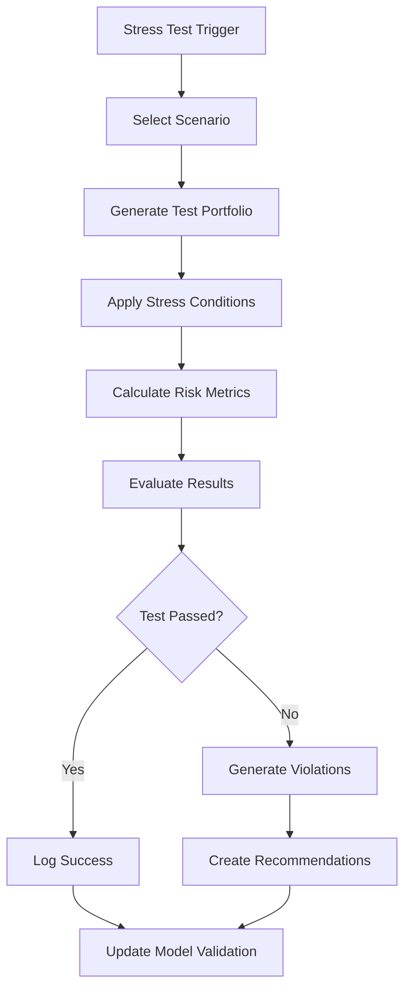
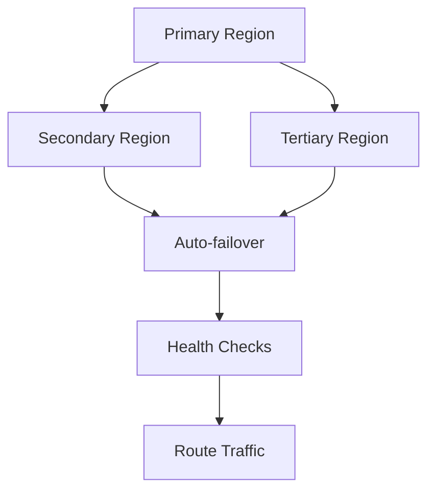

# Compliance Framework Architecture

## Overview

This document describes the architecture of the comprehensive compliance framework designed to meet 2024 SEC and EU regulatory requirements for AI trading systems.

## System Architecture

### High-Level Architecture

```
┌─────────────────────────────────────────────────────────────────────────────────┐
│                           AI Trading System                                     │
├─────────────────────────────────────────────────────────────────────────────────┤
│  Trading Engine  │  Risk Engine  │  Model Engine  │  Position Engine             │
└─────────────────┬───────────────┬─────────────────┬─────────────────────────────┘
                  │               │                 │
┌─────────────────▼───────────────▼─────────────────▼─────────────────────────────┐
│                      Compliance Integration Layer                               │
├─────────────────────────────────────────────────────────────────────────────────┤
│                      Compliance Framework Core                                  │
├─────────────────┬───────────────┬─────────────────┬─────────────────────────────┤
│  Audit Trail    │ Circuit       │ Stress Testing  │ Compliance Monitor          │
│  System         │ Breaker       │ Framework       │ System                      │
├─────────────────┼───────────────┼─────────────────┼─────────────────────────────┤
│                      Regulatory Reporting System                                │
├─────────────────────────────────────────────────────────────────────────────────┤
│  Memory Coordination  │  Event Bus  │  Configuration Management                │
└─────────────────────────────────────────────────────────────────────────────────┘
```

### Component Architecture

#### 1. Compliance Framework Core

The central orchestrator that coordinates all compliance activities:

- **ComplianceFramework.ts**: Main coordination class
- **Event-driven architecture**: Publishes compliance events
- **Configuration management**: Centralized compliance configuration
- **Component lifecycle**: Manages initialization and shutdown

#### 2. Audit Trail System

Implements immutable, encrypted audit logging:

```typescript
AuditTrail
├── Event Storage (Immutable)
├── Cryptographic Integrity (SHA-256 chains)
├── Compression (zlib)
├── Encryption (AES-256)
└── Retention Management
```

**Features:**
- Blockchain-style hash chaining for immutability
- Real-time event logging with sub-second latency
- 7-year retention compliance for SEC requirements
- Point-in-time recovery capabilities

#### 3. Circuit Breaker System

EU Digital Markets Act compliance implementation:

```typescript
CircuitBreaker
├── Price Deviation Monitoring
├── Volume Spike Detection
├── Volatility Surge Detection
├── Multi-level Thresholds (Level 1-3)
└── Progressive Cooldown Periods
```

**Thresholds:**
- Level 1: 5% price deviation → Throttle trading
- Level 2: 10% price deviation → Pause trading
- Level 3: 20% price deviation → Halt trading

#### 4. Stress Testing Framework

Comprehensive stress testing for model validation:

```typescript
StressTesting
├── Historical Scenarios (2008, 2010, 2020)
├── Forward-looking Scenarios
├── Tail Risk Scenarios
├── Monte Carlo Simulations
└── Automated Remediation
```

**Required Scenarios:**
- 2008 Financial Crisis (-40% shock, 3.5x volatility)
- 2010 Flash Crash (-9% rapid decline, 10x volatility)
- COVID-19 Crash (-34% decline, 4x volatility)
- Custom geopolitical and cyber attack scenarios

#### 5. Compliance Monitor

Real-time compliance monitoring and violation detection:

```typescript
ComplianceMonitor
├── Position Limit Monitoring
├── Risk Threshold Monitoring
├── Turnover Limit Monitoring
├── Human Oversight Triggers
└── Violation Management
```

**Monitoring Capabilities:**
- Real-time position size validation
- Risk score threshold monitoring
- Daily turnover limit enforcement
- Restricted symbol checking

#### 6. Regulatory Reporting

Automated report generation and submission:

```typescript
RegulatoryReporting
├── SEC Report Generation
├── EU Report Generation
├── Automated Scheduling
├── Multi-format Export (JSON/XML/CSV)
└── Submission Tracking
```

## Data Flow Architecture

### Trading Decision Flow



### Circuit Breaker Flow



### Stress Testing Flow



## Integration Architecture

### Memory Coordination

The compliance framework integrates with the existing architecture through memory-based coordination:

```typescript
MemoryCoordination {
  sessionId: string;
  complianceKey: string;
  riskKey: string;
  auditKey: string;
  reportingKey: string;
}
```

**Memory Keys:**
- `{sessionId}/compliance/status` - Current compliance status
- `{sessionId}/compliance/violations` - Active violations
- `{sessionId}/compliance/oversight_required` - Pending oversight decisions
- `{sessionId}/compliance/circuit_breaker` - Circuit breaker events
- `{sessionId}/compliance/stress_test` - Latest stress test results

### Event Bus Integration

All compliance events are published to the event bus for system-wide coordination:

```typescript
ComplianceEvents {
  'compliance:initialized': ComponentStatus;
  'compliance:violation': ViolationEvent;
  'compliance:human_oversight_required': OversightEvent;
  'compliance:circuit_breaker': CircuitBreakerEvent;
  'compliance:stress_test_failure': StressTestEvent;
  'audit:event_logged': AuditEvent;
  'reporting:report_generated': ReportEvent;
}
```

## Security Architecture

### Data Protection

1. **Encryption at Rest**: AES-256 encryption for audit data
2. **Encryption in Transit**: TLS 1.3 for all communications
3. **Access Controls**: Role-based access with MFA
4. **Data Masking**: Sensitive data masking for unauthorized users

### Audit Security

1. **Immutable Storage**: Blockchain-style hash chaining
2. **Digital Signatures**: HMAC-SHA256 signatures
3. **Integrity Verification**: Automated integrity checking
4. **Tamper Detection**: Real-time tamper detection alerts

### Network Security

1. **API Security**: OAuth 2.0 with JWT tokens
2. **Rate Limiting**: API rate limiting and throttling
3. **IP Restrictions**: IP-based access controls
4. **DDoS Protection**: Built-in DDoS protection

## Scalability Architecture

### Horizontal Scaling

The compliance framework is designed for horizontal scaling:

1. **Stateless Components**: All components are stateless
2. **Event-driven**: Asynchronous event processing
3. **Load Balancing**: Support for load balancers
4. **Database Sharding**: Support for database sharding

### Performance Requirements

- **Latency**: <5ms average decision processing
- **Throughput**: 10,000+ decisions per second
- **Availability**: 99.99% uptime requirement
- **Recovery**: 4-hour RTO, 15-minute RPO

### Monitoring and Observability

1. **Metrics Collection**: Prometheus-compatible metrics
2. **Distributed Tracing**: OpenTelemetry integration
3. **Log Aggregation**: Structured logging with correlation IDs
4. **Health Checks**: Comprehensive health check endpoints

## Deployment Architecture

### Container Architecture

```dockerfile
# Compliance Framework Container
FROM node:18-alpine
COPY src/ /app/src/
COPY config/ /app/config/
RUN npm install --production
EXPOSE 3000
CMD ["npm", "start"]
```

### Kubernetes Deployment

```yaml
apiVersion: apps/v1
kind: Deployment
metadata:
  name: compliance-framework
spec:
  replicas: 3
  selector:
    matchLabels:
      app: compliance-framework
  template:
    metadata:
      labels:
        app: compliance-framework
    spec:
      containers:
      - name: compliance
        image: compliance-framework:latest
        ports:
        - containerPort: 3000
        env:
        - name: NODE_ENV
          value: "production"
        resources:
          requests:
            memory: "512Mi"
            cpu: "250m"
          limits:
            memory: "1Gi"
            cpu: "500m"
```

### Service Mesh Integration

The compliance framework integrates with service mesh for:

1. **Service Discovery**: Automatic service discovery
2. **Load Balancing**: Intelligent load balancing
3. **Circuit Breaking**: Service-level circuit breaking
4. **Observability**: Automatic metrics and tracing

## Configuration Management

### Environment-based Configuration

```typescript
// Development
DEVELOPMENT_COMPLIANCE_CONFIG {
  reportingInterval: 5, // minutes
  priceDeviationThreshold: 10.0, // %
  retentionPeriodDays: 30
}

// Production
PRODUCTION_COMPLIANCE_CONFIG {
  reportingInterval: 60, // minutes
  priceDeviationThreshold: 5.0, // %
  retentionPeriodDays: 2555 // 7 years
}
```

### Feature Flags

The framework supports feature flags for:

1. **Circuit Breakers**: Enable/disable by asset class
2. **Stress Testing**: Enable/disable scenarios
3. **Reporting**: Enable/disable report types
4. **Monitoring**: Adjust monitoring sensitivity

## Disaster Recovery

### Backup Strategy

1. **Real-time Replication**: Cross-region replication
2. **Point-in-time Recovery**: 15-minute RPO
3. **Encrypted Backups**: AES-256 encrypted backups
4. **Automated Testing**: Quarterly DR testing

### Failover Architecture



This architecture ensures comprehensive compliance while maintaining high performance, security, and availability for AI trading systems.