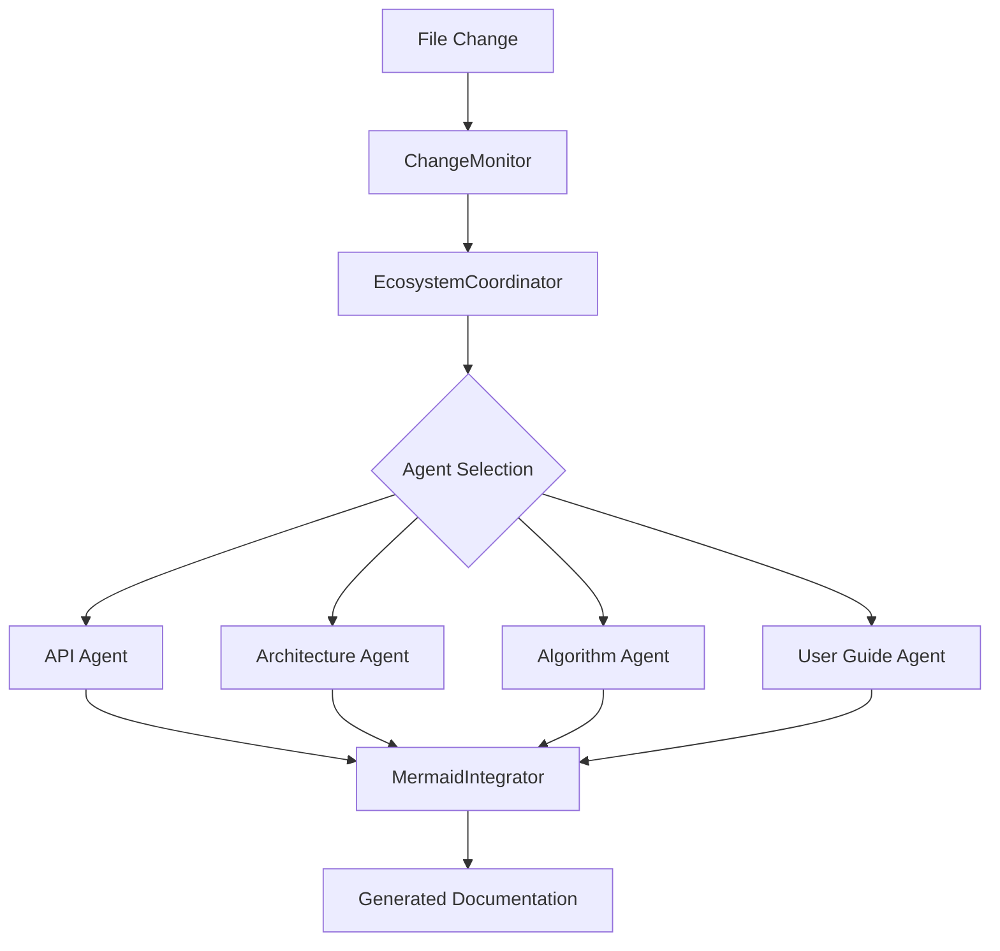

# Collaborative Documentation Ecosystem

A sophisticated system that integrates 4 specialized documentation agents with Mermaid.js MCP system for real-time, context-aware documentation generation.

## 🚀 Quick Start

### Installation

```bash
# Navigate to ecosystem directory
cd src/ecosystem

# Install dependencies
npm install

# Install peer dependencies
npm install -g claude-flow@alpha
```

### For AI Trading Projects

```bash
# Quick setup for AI trading projects
node ../../ecosystem-setup.js
```

### Manual Setup

```bash
# Start the ecosystem
npm start

# Or use the setup script
node index.js ai-trading
```

## 🎯 Features

### 1. Auto-Trigger System
- **File Watcher**: Monitors code changes in real-time using `chokidar`
- **Intelligent Routing**: Routes changes to appropriate documentation agents
- **Batch Processing**: Efficiently handles multiple rapid changes
- **Debounced Updates**: Prevents excessive triggering during rapid file modifications

### 2. Context-Aware Project Detection
- **AI Trading Detection**: Automatically detects trading-related projects
- **Technology Stack Analysis**: Identifies frameworks, libraries, and patterns
- **Project Structure Analysis**: Understands architecture patterns
- **Confidence Scoring**: Provides confidence levels for project type detection

### 3. Parallel Agent Coordination
- **4 Specialized Agents**:
  - **API Agent**: Documents REST endpoints, generates OpenAPI specs
  - **Architecture Agent**: Creates system diagrams, component maps
  - **Algorithm Agent**: Documents trading strategies, flow diagrams
  - **User Guide Agent**: Generates tutorials, examples, guides
- **Claude Flow Integration**: Uses MCP for agent spawning and coordination
- **Swarm Topology**: Mesh network for optimal agent communication

### 4. Real-Time MCP Hooks Integration
- **Pre-Task Hooks**: Initialize context and prepare resources
- **Post-Task Hooks**: Store results and update coordination state
- **Post-Edit Hooks**: Track file changes and update memory
- **Session Management**: Restore context and export metrics

## 🏗️ Architecture

```
CollaborativeEcosystem
├── EcosystemCoordinator     # Main orchestrator
├── ChangeMonitor           # File system watcher
├── ContextDetector         # Project analysis
├── MermaidIntegrator       # Diagram generation
├── HookManager            # MCP hooks coordination
└── EcosystemConfig        # Configuration management
```

## 📋 Usage Examples

### Basic Usage

```javascript
const { createEcosystem, startEcosystem } = require('./src/ecosystem');

// Create and start ecosystem
const ecosystem = await startEcosystem();

// Get status
console.log(ecosystem.getStatus());

// Trigger specific agent
await ecosystem.triggerAgent('api-agent', {
  filePath: 'src/api/routes.js',
  changeType: 'update'
});

// Generate diagram
await ecosystem.generateDiagram({
  type: 'architecture',
  title: 'System Overview',
  data: { components: [...], relationships: [...] }
});
```

### AI Trading Setup

```javascript
const { setupAiTradingEcosystem } = require('./src/ecosystem');

// Specialized setup for AI trading
const ecosystem = await setupAiTradingEcosystem({
  agents: {
    'algorithm-agent': { priority: 'high' },
    'api-agent': { priority: 'high' }
  },
  monitoring: {
    watchPaths: ['strategies/**', 'indicators/**', 'api/**']
  }
});

await ecosystem.start();
```

### CLI Usage

```bash
# Start ecosystem
node src/ecosystem/index.js start

# Check status
node src/ecosystem/index.js status

# AI trading setup
node src/ecosystem/index.js ai-trading

# Stop ecosystem
node src/ecosystem/index.js stop
```

## 🔧 Configuration

### Default Configuration

The ecosystem automatically creates a configuration file at `.swarm/ecosystem-config.json`:

```json
{
  "ecosystem": {
    "name": "collaborative-docs-ecosystem",
    "maxConcurrentAgents": 8,
    "coordinationMode": "adaptive"
  },
  "agents": {
    "api-agent": {
      "enabled": true,
      "priority": "high",
      "patterns": ["**/routes/**", "**/api/**"]
    },
    "algorithm-agent": {
      "enabled": true,
      "patterns": ["**/strategies/**", "**/algorithms/**"]
    }
  },
  "monitoring": {
    "watchPaths": ["src/**", "lib/**"],
    "debounceDelay": 1000,
    "batchChanges": true
  }
}
```

### Project-Specific Configurations

For AI trading projects, the system automatically adjusts:

```json
{
  "projects": {
    "ai-trading": {
      "agents": ["algorithm-agent", "api-agent", "architecture-agent"],
      "specialFeatures": {
        "tradingAnalysis": true,
        "performanceMetrics": true,
        "backtestingDocs": true
      },
      "monitoring": {
        "extraPaths": ["backtests/**", "data/**", "models/**"]
      }
    }
  }
}
```

## 📊 Agent Coordination

### How Agents Are Triggered

1. **File Change Detection**: `ChangeMonitor` detects file modifications
2. **Impact Analysis**: System analyzes which documentation areas are affected
3. **Agent Selection**: Routes to appropriate agents based on file patterns
4. **Parallel Execution**: Multiple agents work simultaneously
5. **Result Coordination**: Results are coordinated through MCP hooks

### Agent Communication Flow



## 🎨 Mermaid Integration

### Automatic Diagram Generation

The system automatically generates Mermaid diagrams based on:

- **Architecture Changes**: Component diagrams, system overviews
- **Algorithm Updates**: Flowcharts, decision trees
- **API Modifications**: Sequence diagrams, endpoint maps
- **User Flow Changes**: Journey maps, interaction diagrams

### Supported Diagram Types

- **Architecture Diagrams**: System components and relationships
- **Algorithm Flowcharts**: Trading strategy flows
- **API Sequence Diagrams**: Request/response flows
- **User Journey Maps**: User interaction flows

## 🔍 Monitoring and Health

### Health Checks

The ecosystem performs regular health checks:

- Component status monitoring
- Agent availability verification
- Memory usage tracking
- Hook execution monitoring

### Statistics

Track ecosystem performance:

```javascript
const stats = ecosystem.getStatistics();
console.log({
  tasksProcessed: stats.tasksProcessed,
  diagramsGenerated: stats.diagramsGenerated,
  agentsTriggered: stats.agentsTriggered,
  uptime: stats.uptime
});
```

## 🚦 Events and Hooks

### Event System

The ecosystem emits various events for monitoring:

```javascript
ecosystem.on('change-processed', (changeEvent) => {
  console.log('Change processed:', changeEvent.filePath);
});

ecosystem.on('diagram-generated', (diagramData) => {
  console.log('Diagram created:', diagramData.type);
});

ecosystem.on('agent-spawned', (agentData) => {
  console.log('Agent spawned:', agentData.type);
});
```

### MCP Hooks Integration

- **Pre-task**: `npx claude-flow@alpha hooks pre-task`
- **Post-task**: `npx claude-flow@alpha hooks post-task`
- **Post-edit**: `npx claude-flow@alpha hooks post-edit`
- **Notifications**: `npx claude-flow@alpha hooks notify`

## 🛠️ Troubleshooting

### Common Issues

1. **Agent not triggering**: Check file patterns in configuration
2. **MCP hooks timeout**: Increase timeout in hook configuration
3. **Memory issues**: Enable cleanup in configuration
4. **Diagram generation fails**: Check Mermaid integrator settings

### Debug Mode

```bash
# Enable debug logging
DEBUG=ecosystem:* node ecosystem-setup.js
```

## 📈 Performance Optimization

### Best Practices

1. **Batch Changes**: Enable batch processing for rapid changes
2. **Agent Limits**: Set appropriate `maxConcurrentAgents`
3. **File Filtering**: Use precise patterns in `watchPaths`
4. **Memory Cleanup**: Enable periodic cleanup
5. **Hook Batching**: Use batched notifications for non-critical hooks

### Monitoring

- Track agent response times
- Monitor memory usage
- Watch hook execution success rates
- Analyze diagram generation performance

## 🔐 Security

### Sandboxing

- File system access controls
- Network request filtering
- Trusted path configurations
- Agent capability restrictions

### Best Practices

- Validate all file inputs
- Sanitize diagram content
- Limit agent resource usage
- Monitor hook executions

## 🤝 Integration with Existing Projects

### Adding to Existing Projects

1. Copy the ecosystem directory to your project
2. Install dependencies
3. Run the setup script
4. Configure for your project type
5. Start monitoring

### Custom Agents

Extend the system with custom agents:

```javascript
const customAgent = {
  type: 'custom-documenter',
  patterns: ['**/custom/**'],
  capabilities: ['custom-analysis'],
  config: { /* custom settings */ }
};

await ecosystem.coordinator.spawnAgent(customAgent);
```

This collaborative ecosystem provides a comprehensive solution for automated, context-aware documentation generation that adapts to your project's specific needs while maintaining real-time responsiveness through intelligent agent coordination.