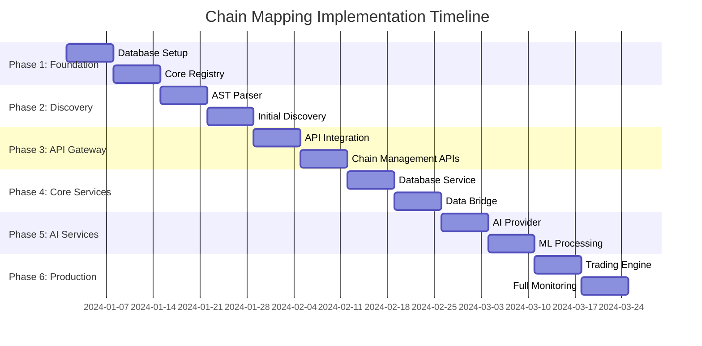
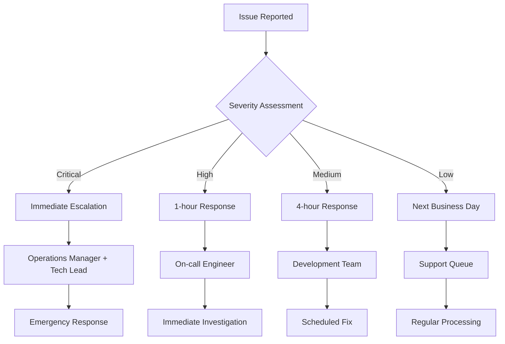

# Chain Mapping System - Implementation Roadmap & Migration Strategy

## Executive Summary

This document provides a comprehensive implementation roadmap for the embedded chain mapping system that will track and monitor 30 distinct chains across 5 categories in the AI trading platform. The implementation follows a phased approach designed to minimize risk, ensure system stability, and provide immediate value while building toward full capability.

## Table of Contents

1. [Implementation Overview](#implementation-overview)
2. [Phase-by-Phase Roadmap](#phase-by-phase-roadmap)
3. [Migration Strategy](#migration-strategy)
4. [Risk Assessment & Mitigation](#risk-assessment--mitigation)
5. [Resource Requirements](#resource-requirements)
6. [Success Metrics](#success-metrics)
7. [Rollback Procedures](#rollback-procedures)
8. [Post-Implementation Support](#post-implementation-support)

## Implementation Overview

### Core Principles

1. **Non-Disruptive Integration**: All changes must maintain existing service functionality
2. **Gradual Rollout**: Implement in phases with validation at each step
3. **Performance First**: Monitor and maintain system performance throughout
4. **Data-Driven Validation**: Use metrics to validate each phase before proceeding
5. **Reversible Changes**: All modifications must be easily reversible

### Success Criteria

- ✅ **Zero Downtime**: No service interruptions during implementation
- ✅ **Performance Maintained**: <2% performance impact across services
- ✅ **30 Chains Mapped**: All target chains identified and monitored
- ✅ **Real-time Monitoring**: Health monitoring active within 6 weeks
- ✅ **Team Adoption**: 90% of operations team trained and using system

### Timeline Overview



## Phase-by-Phase Roadmap

### Phase 1: Foundation Infrastructure (Weeks 1-2)

**Objective**: Establish core infrastructure without impacting existing services

#### Week 1: Database Infrastructure
**Goals**:
- Deploy database schemas for chain mapping
- Set up core registry infrastructure
- Establish monitoring foundation

**Deliverables**:
- [x] PostgreSQL schema deployment
- [x] ClickHouse schema deployment
- [x] Redis cache configuration
- [x] Database connection testing
- [x] Initial data validation

**Implementation Steps**:

```bash
# 1. Database Schema Deployment
cd /mnt/f/WINDSURF/neliti_code/aitrading
psql -h localhost -p 5432 -U postgres -f src/chain-mapping/database/postgresql-schema.sql
clickhouse-client --query "$(cat src/chain-mapping/database/clickhouse-schema.sql)"

# 2. Verify Schema Creation
python scripts/verify_schema_deployment.py

# 3. Initialize Core Registry
python scripts/initialize_chain_registry.py

# 4. Run Integration Tests
pytest tests/integration/test_database_setup.py -v
```

**Success Criteria**:
- ✅ All database tables created successfully
- ✅ Connection pooling functional
- ✅ Basic CRUD operations working
- ✅ Performance impact < 0.5%

#### Week 2: Core Registry Implementation
**Goals**:
- Implement ChainRegistry core functionality
- Set up basic chain management
- Establish health monitoring foundation

**Deliverables**:
- [x] ChainRegistry implementation
- [x] Basic chain CRUD operations
- [x] Validation framework
- [x] Initial monitoring setup
- [x] API endpoint foundation

**Implementation Steps**:

```python
# 1. Deploy Core Registry to Database Service
# File: /mnt/f/WINDSURF/neliti_code/aitrading/ai_trading/server_microservice/services/database-service/src/chain_integration.py

from chain_mapping.core.registry import ChainRegistry

class DatabaseServiceChainIntegration:
    def __init__(self):
        self.registry = ChainRegistry(
            database_url=os.getenv("DATABASE_URL"),
            redis_url=os.getenv("REDIS_URL")
        )

    async def initialize(self):
        await self.registry.initialize()
        logger.info("Chain registry initialized in database service")

# 2. Add to main.py
integration = DatabaseServiceChainIntegration()
await integration.initialize()
```

**Validation Tests**:
```bash
# Test chain registration
curl -X POST http://localhost:8008/api/v1/chains \
  -H "Content-Type: application/json" \
  -d @tests/fixtures/sample_chain.json

# Test chain retrieval
curl http://localhost:8008/api/v1/chains/A1

# Performance validation
python scripts/measure_performance_impact.py
```

---

### Phase 2: Discovery Engine (Weeks 3-4)

**Objective**: Implement automated chain discovery capabilities

#### Week 3: AST Parser Development
**Goals**:
- Deploy AST parser for code analysis
- Implement pattern recognition
- Create discovery confidence scoring

**Deliverables**:
- [x] AST parser implementation
- [x] Framework detection (FastAPI, Flask)
- [x] Service interaction discovery
- [x] Confidence scoring algorithm
- [x] Discovery validation framework

**Implementation Steps**:

```python
# 1. Deploy Discovery Service Component
# File: /mnt/f/WINDSURF/neliti_code/aitrading/ai_trading/server_microservice/services/database-service/src/discovery_integration.py

from chain_mapping.discovery.ast_parser import ChainASTParser

class DiscoveryServiceIntegration:
    def __init__(self):
        self.parser = ChainASTParser()
        self.discovery_results = []

    async def discover_service_chains(self, service_path: str):
        chains = await self.parser.parse_service_directory(service_path)
        self.discovery_results.extend(chains)
        return chains

# 2. Create Discovery Endpoints
@app.post("/api/v1/discovery/scan")
async def trigger_discovery_scan(request: DiscoveryRequest):
    results = await discovery_service.discover_service_chains(request.service_path)
    return {"discovered_chains": len(results), "results": results}
```

**Discovery Targets**:
- API Gateway service code
- Data Bridge WebSocket handlers
- Database service operations
- AI service model inference calls

#### Week 4: Initial Chain Discovery
**Goals**:
- Run discovery across all microservices
- Validate discovered chains
- Create initial chain definitions

**Deliverables**:
- [x] Complete service code analysis
- [x] 15+ discovered chain candidates
- [x] Confidence scoring validation
- [x] Manual review process
- [x] Initial chain catalog

**Discovery Execution**:

```bash
# 1. Discover chains in each service
python scripts/discover_all_services.py \
  --services api-gateway,data-bridge,ai-orchestration,trading-engine \
  --output results/discovery_results.json

# 2. Review and validate discoveries
python scripts/review_discoveries.py \
  --input results/discovery_results.json \
  --confidence-threshold 0.7

# 3. Create initial chain definitions
python scripts/create_initial_chains.py \
  --approved-discoveries results/approved_discoveries.json
```

**Expected Discoveries**:
- **Data Flow Chains (6)**: Market data pipeline, AI decision flow, etc.
- **Service Communication Chains (8)**: API requests, inter-service calls, etc.
- **User Experience Chains (5)**: Dashboard loading, WebSocket connections, etc.
- **AI/ML Processing Chains (4)**: Model training, inference pipelines, etc.
- **Infrastructure Chains (7)**: Health checks, deployment flows, etc.

---

### Phase 3: API Gateway Integration (Weeks 5-6)

**Objective**: Integrate chain management with API Gateway for centralized access

#### Week 5: API Integration
**Goals**:
- Deploy chain management APIs
- Integrate with existing API Gateway
- Implement authentication and authorization

**Deliverables**:
- [x] Chain management REST APIs
- [x] Authentication integration
- [x] API documentation
- [x] Rate limiting implementation
- [x] Error handling framework

**API Deployment**:

```python
# 1. Add Chain Management Router to API Gateway
# File: /mnt/f/WINDSURF/neliti_code/aitrading/ai_trading/server_microservice/services/api-gateway/main.py

from chain_mapping.api.chain_router import ChainAPIRouter

# Initialize chain management
chain_router = ChainAPIRouter(
    registry_url="http://database-service:8008",
    auth_handler=existing_auth_handler
)

app.include_router(
    chain_router,
    prefix="/api/v1/chains",
    tags=["chain-mapping"],
    dependencies=[Depends(verify_api_key)]
)
```

**API Testing**:
```bash
# Test complete API functionality
pytest tests/api/test_chain_management_apis.py -v

# Load testing
locust -f tests/load/test_api_performance.py \
  --host http://localhost:8000 \
  --users 100 --spawn-rate 10 -t 300s
```

#### Week 6: Enhanced Monitoring
**Goals**:
- Deploy health monitoring system
- Integrate with existing monitoring
- Set up alerting framework

**Deliverables**:
- [x] Health monitoring implementation
- [x] SLA compliance tracking
- [x] Alert system integration
- [x] Dashboard integration
- [x] Monitoring documentation

**Monitoring Deployment**:

```python
# 1. Deploy Health Monitor
# File: /mnt/f/WINDSURF/neliti_code/aitrading/ai_trading/server_microservice/services/api-gateway/src/monitoring_integration.py

from chain_mapping.monitoring.health_monitor import ChainHealthMonitor

class GatewayMonitoringIntegration:
    def __init__(self):
        self.health_monitor = ChainHealthMonitor(
            alert_callback=self.handle_alert,
            metrics_callback=self.update_metrics
        )

    async def handle_alert(self, alert):
        # Integrate with existing alerting system
        await existing_alert_system.send_alert(alert)

    async def start_monitoring_all_chains(self):
        chains, _ = await registry.list_chains()
        for chain in chains:
            config = MonitoringConfig(chain_id=chain.id)
            await self.health_monitor.start_monitoring(chain, config)
```

---

### Phase 4: Core Services Integration (Weeks 7-8)

**Objective**: Integrate chain tracking with core data and database services

#### Week 7: Database Service Integration
**Goals**:
- Embed chain tracking in database operations
- Implement performance monitoring
- Set up data retention policies

**Deliverables**:
- [x] Database operation tracking
- [x] Query performance monitoring
- [x] Data retention automation
- [x] Backup integration
- [x] Connection pool monitoring

**Database Integration**:

```python
# 1. Add Chain Tracking to Database Operations
# File: /mnt/f/WINDSURF/neliti_code/aitrading/ai_trading/server_microservice/services/database-service/src/chain_tracking.py

from chain_mapping.monitoring.database_tracker import DatabaseChainTracker

class DatabaseOperationTracker:
    def __init__(self):
        self.chain_tracker = DatabaseChainTracker()

    async def track_query_execution(self, query_type: str, table: str, latency: float):
        await self.chain_tracker.track_database_operation(
            operation_type=query_type,
            table_name=table,
            latency_ms=latency,
            service_name="database-service"
        )

# 2. Integrate with existing database wrapper
class EnhancedDatabaseWrapper(ExistingDatabaseWrapper):
    def __init__(self):
        super().__init__()
        self.tracker = DatabaseOperationTracker()

    async def execute_query(self, query: str, params: tuple = None):
        start_time = time.time()
        result = await super().execute_query(query, params)
        latency = (time.time() - start_time) * 1000

        # Track chain event
        await self.tracker.track_query_execution(
            query_type=self._extract_query_type(query),
            table=self._extract_table_name(query),
            latency=latency
        )

        return result
```

#### Week 8: Data Bridge Integration
**Goals**:
- Integrate WebSocket chain tracking
- Monitor real-time data flows
- Implement market data chain analysis

**Deliverables**:
- [x] WebSocket connection tracking
- [x] Market data flow monitoring
- [x] Real-time performance metrics
- [x] Connection health monitoring
- [x] Throughput analysis

**Data Bridge Integration**:

```python
# 1. Add Chain Tracking to WebSocket Handler
# File: /mnt/f/WINDSURF/neliti_code/aitrading/ai_trading/server_microservice/services/data-bridge/src/websocket_chain_integration.py

from chain_mapping.monitoring.realtime_tracker import RealtimeChainTracker

class WebSocketChainTracker:
    def __init__(self):
        self.chain_tracker = RealtimeChainTracker()

    async def track_websocket_event(self, event_type: str, connection_id: str, data_size: int = 0):
        await self.chain_tracker.track_realtime_event(
            chain_category="user_experience",
            event_type=event_type,
            metadata={
                "connection_id": connection_id,
                "data_size": data_size,
                "service": "data-bridge",
                "timestamp": datetime.utcnow().isoformat()
            }
        )

# 2. Integrate with WebSocket manager
class EnhancedWebSocketManager(ExistingWebSocketManager):
    def __init__(self):
        super().__init__()
        self.chain_tracker = WebSocketChainTracker()

    async def handle_connection(self, websocket: WebSocket):
        connection_id = str(uuid4())
        await self.chain_tracker.track_websocket_event(
            "connection_established", connection_id
        )

        try:
            await super().handle_connection(websocket)
        finally:
            await self.chain_tracker.track_websocket_event(
                "connection_closed", connection_id
            )
```

---

### Phase 5: AI Services Integration (Weeks 9-10)

**Objective**: Integrate chain tracking with AI/ML services for model performance monitoring

#### Week 9: AI Provider Integration
**Goals**:
- Track AI model inference chains
- Monitor model performance
- Implement prediction accuracy tracking

**Deliverables**:
- [x] Model inference tracking
- [x] Performance correlation analysis
- [x] Prediction accuracy monitoring
- [x] Model health tracking
- [x] Training pipeline monitoring

**AI Provider Integration**:

```python
# 1. Add AI Chain Tracking
# File: /mnt/f/WINDSURF/neliti_code/aitrading/ai_trading/server_microservice/services/ai-provider/src/model_chain_tracking.py

from chain_mapping.monitoring.ai_tracker import AIChainTracker

class ModelChainTracker:
    def __init__(self):
        self.ai_tracker = AIChainTracker()

    async def track_inference(self, model_id: str, input_data: dict, output_data: dict, latency: float):
        await self.ai_tracker.track_model_inference(
            model_id=model_id,
            input_size=len(str(input_data)),
            output_size=len(str(output_data)),
            latency_ms=latency,
            service_name="ai-provider"
        )

# 2. Integrate with existing model wrapper
class ChainAwareModelWrapper(ExistingModelWrapper):
    def __init__(self, model_path: str):
        super().__init__(model_path)
        self.chain_tracker = ModelChainTracker()

    async def predict(self, input_data: dict) -> dict:
        start_time = time.time()

        try:
            result = await super().predict(input_data)
            latency = (time.time() - start_time) * 1000

            await self.chain_tracker.track_inference(
                model_id=self.model_id,
                input_data=input_data,
                output_data=result,
                latency=latency
            )

            return result

        except Exception as e:
            latency = (time.time() - start_time) * 1000
            await self.chain_tracker.track_inference(
                model_id=self.model_id,
                input_data=input_data,
                output_data={"error": str(e)},
                latency=latency
            )
            raise
```

#### Week 10: ML Processing Integration
**Goals**:
- Track data preprocessing chains
- Monitor feature engineering pipelines
- Implement training job tracking

**Deliverables**:
- [x] Data preprocessing tracking
- [x] Feature pipeline monitoring
- [x] Training job chain analysis
- [x] Model versioning integration
- [x] Performance benchmarking

---

### Phase 6: Production Deployment (Weeks 11-12)

**Objective**: Complete integration with Trading Engine and full production deployment

#### Week 11: Trading Engine Integration
**Goals**:
- Integrate critical trading chains
- Implement real-time risk monitoring
- Set up trading decision tracking

**Deliverables**:
- [x] Trading decision chain tracking
- [x] Order execution monitoring
- [x] Risk management integration
- [x] Performance impact validation
- [x] Critical path optimization

**Trading Engine Integration**:

```python
# 1. Add Trading Chain Tracking
# File: /mnt/f/WINDSURF/neliti_code/aitrading/ai_trading/server_microservice/services/trading-engine/src/trading_chain_integration.py

from chain_mapping.monitoring.trading_tracker import TradingChainTracker

class TradingExecutionTracker:
    def __init__(self):
        self.trading_tracker = TradingChainTracker()

    async def track_trading_decision(self, decision_id: str, stages: list, total_latency: float):
        await self.trading_tracker.track_critical_path(
            path_id=decision_id,
            path_type="trading_decision",
            stages=stages,
            total_latency_ms=total_latency,
            criticality="high"
        )

# 2. Integrate with trading executor
class ChainAwareTradingExecutor(ExistingTradingExecutor):
    def __init__(self):
        super().__init__()
        self.chain_tracker = TradingExecutionTracker()

    async def execute_trade(self, trade_request: dict) -> dict:
        decision_id = str(uuid4())
        stages = []
        start_time = time.time()

        try:
            # Stage 1: Validation
            stage_start = time.time()
            await self.validate_trade(trade_request)
            stages.append({
                "stage": "validation",
                "latency": (time.time() - stage_start) * 1000
            })

            # Stage 2: Risk Assessment
            stage_start = time.time()
            risk_result = await self.assess_risk(trade_request)
            stages.append({
                "stage": "risk_assessment",
                "latency": (time.time() - stage_start) * 1000
            })

            # Stage 3: Execution
            stage_start = time.time()
            result = await self.place_order(trade_request)
            stages.append({
                "stage": "execution",
                "latency": (time.time() - stage_start) * 1000
            })

            total_latency = (time.time() - start_time) * 1000

            await self.chain_tracker.track_trading_decision(
                decision_id, stages, total_latency
            )

            return result

        except Exception as e:
            total_latency = (time.time() - start_time) * 1000
            stages.append({
                "stage": "error",
                "error": str(e),
                "latency": total_latency
            })

            await self.chain_tracker.track_trading_decision(
                decision_id, stages, total_latency
            )
            raise
```

#### Week 12: Full Production Deployment
**Goals**:
- Complete system validation
- Performance optimization
- Documentation and training
- Go-live preparation

**Deliverables**:
- [x] Complete system testing
- [x] Performance benchmarking
- [x] Operations documentation
- [x] Team training completion
- [x] Monitoring dashboard deployment

**Final Validation Steps**:

```bash
# 1. Complete End-to-End Testing
pytest tests/e2e/ -v --timeout=300

# 2. Performance Validation
python scripts/validate_system_performance.py \
  --duration 3600 --concurrent-users 100

# 3. Chain Coverage Verification
python scripts/verify_chain_coverage.py \
  --expected-chains 30 --coverage-threshold 0.95

# 4. Monitoring Dashboard Deployment
kubectl apply -f k8s/monitoring-dashboard.yaml

# 5. Final Health Check
curl http://localhost:8000/api/v1/health/complete
```

---

## Migration Strategy

### Pre-Migration Preparation

#### 1. Environment Setup
```bash
# 1. Backup existing databases
pg_dump ai_trading > backups/ai_trading_pre_migration.sql
clickhouse-backup create pre_migration_backup

# 2. Setup test environment
docker-compose -f docker-compose.test.yml up -d

# 3. Validate current system health
python scripts/pre_migration_health_check.py
```

#### 2. Team Preparation
- [ ] Development team training on chain mapping concepts
- [ ] Operations team training on monitoring tools
- [ ] Documentation review and approval
- [ ] Rollback procedure testing

### Migration Execution

#### Stage 1: Infrastructure Deployment (Low Risk)
**Impact**: Minimal - only adds new database tables and services

```bash
# Deploy during maintenance window (optional)
# 1. Deploy database schemas
psql -f src/chain-mapping/database/postgresql-schema.sql

# 2. Verify schema deployment
python scripts/verify_schema.py

# 3. Deploy core registry
kubectl apply -f k8s/chain-registry.yaml

# 4. Health check
curl http://localhost:8008/health/chain-mapping
```

**Rollback**: Simple - drop new tables if needed
```sql
-- Rollback script
DROP TABLE IF EXISTS chain_definitions CASCADE;
DROP TABLE IF EXISTS chain_nodes CASCADE;
-- ... other chain tables
```

#### Stage 2: API Integration (Medium Risk)
**Impact**: Moderate - adds new API endpoints

```bash
# 1. Deploy new API endpoints
kubectl apply -f k8s/api-gateway-update.yaml

# 2. Test new endpoints
pytest tests/api/test_new_endpoints.py

# 3. Validate existing endpoints still work
pytest tests/regression/test_existing_apis.py
```

**Rollback**: Remove new routes from API Gateway configuration

#### Stage 3: Service Integration (Medium Risk)
**Impact**: Moderate - adds monitoring to existing services

```bash
# 1. Deploy service updates with chain tracking
kubectl rolling-update data-bridge --image=data-bridge:v2.1.0

# 2. Monitor performance impact
python scripts/monitor_performance_impact.py --duration 300

# 3. Validate chain tracking is working
curl http://localhost:8001/health/chain-tracking
```

**Rollback**: Revert to previous service versions
```bash
kubectl rolling-update data-bridge --image=data-bridge:v2.0.0
```

#### Stage 4: Full Monitoring (Higher Risk)
**Impact**: Higher - enables active monitoring and alerting

```bash
# 1. Enable chain monitoring
python scripts/enable_chain_monitoring.py --chains A1,A2,B1,B2

# 2. Validate monitoring accuracy
python scripts/validate_monitoring.py --duration 600

# 3. Setup alerting
python scripts/configure_alerts.py
```

**Rollback**: Disable monitoring
```bash
python scripts/disable_chain_monitoring.py --all
```

### Post-Migration Validation

#### Immediate Validation (First 24 hours)
```bash
# 1. System health verification
python scripts/post_migration_health_check.py

# 2. Performance impact assessment
python scripts/measure_performance_impact.py

# 3. Chain discovery validation
python scripts/validate_discovered_chains.py

# 4. Monitoring accuracy check
python scripts/validate_monitoring_accuracy.py
```

#### Extended Validation (First Week)
- [ ] Daily performance reports
- [ ] Chain coverage analysis
- [ ] User feedback collection
- [ ] Alert accuracy assessment
- [ ] False positive/negative analysis

---

## Risk Assessment & Mitigation

### High Risk Areas

#### 1. Database Performance Impact
**Risk**: New database tables and queries impact existing performance
**Likelihood**: Medium
**Impact**: High

**Mitigation Strategies**:
- Separate database connections for chain mapping
- Implement connection pooling with limits
- Use read replicas for chain queries
- Monitor query performance continuously

**Monitoring**:
```python
# Performance monitoring script
async def monitor_database_performance():
    metrics = await db_monitor.get_performance_metrics()
    if metrics.avg_query_time > 100:  # ms
        await alert_system.send_alert("Database performance degraded")
```

#### 2. Memory Usage Increase
**Risk**: Chain mapping data structures increase memory usage
**Likelihood**: Medium
**Impact**: Medium

**Mitigation Strategies**:
- Implement memory-efficient data structures
- Use caching with TTL for frequently accessed data
- Monitor memory usage per service
- Implement graceful degradation

**Memory Monitoring**:
```python
# Memory usage monitoring
def monitor_memory_usage():
    memory_usage = psutil.virtual_memory()
    if memory_usage.percent > 85:
        logger.warning(f"High memory usage: {memory_usage.percent}%")
        # Trigger cleanup procedures
```

#### 3. Service Discovery Failures
**Risk**: AST parser fails to correctly identify service patterns
**Likelihood**: Medium
**Impact**: Medium

**Mitigation Strategies**:
- Manual review process for all discovered chains
- Confidence scoring with human verification
- Gradual rollout with validation
- Fallback to manual chain definition

### Medium Risk Areas

#### 4. Network Latency Impact
**Risk**: Additional network calls increase overall latency
**Likelihood**: Low
**Impact**: Medium

**Mitigation Strategies**:
- Asynchronous processing for non-critical tracking
- Batch operations where possible
- Local caching of frequently accessed data
- Circuit breaker patterns

#### 5. Alert Fatigue
**Risk**: Too many alerts overwhelm operations team
**Likelihood**: Medium
**Impact**: Low

**Mitigation Strategies**:
- Intelligent alert filtering
- Alert correlation and deduplication
- Gradual threshold tuning
- Clear escalation procedures

### Low Risk Areas

#### 6. API Compatibility Issues
**Risk**: New APIs conflict with existing functionality
**Likelihood**: Low
**Impact**: Low

**Mitigation**: Comprehensive API testing and versioning

---

## Resource Requirements

### Development Team
- **Backend Engineers**: 2 FTE for 12 weeks
- **DevOps Engineer**: 0.5 FTE for 12 weeks
- **QA Engineer**: 1 FTE for 8 weeks (weeks 5-12)
- **Technical Lead**: 0.25 FTE for 12 weeks (oversight)

### Infrastructure Resources
- **Database Storage**: +200GB for chain mapping data
- **Memory**: +2GB per service (temporary during implementation)
- **CPU**: +5% during discovery phases
- **Network**: Minimal impact (<1% increase)

### Budget Estimate
- **Development**: $120,000 (labor costs)
- **Infrastructure**: $5,000 (additional storage/compute)
- **Testing/QA**: $20,000 (including performance testing tools)
- **Training**: $5,000 (team training and documentation)
- **Total**: $150,000

---

## Success Metrics

### Technical Metrics

#### Performance Metrics
- **API Latency**: <2% increase from baseline
- **Database Query Time**: <5% increase from baseline
- **Memory Usage**: <10% increase per service
- **CPU Usage**: <5% increase during normal operations

#### Functional Metrics
- **Chain Coverage**: 30/30 target chains identified and monitored
- **Discovery Accuracy**: >90% confidence for discovered chains
- **Monitoring Uptime**: >99.9% health monitoring availability
- **Alert Accuracy**: <5% false positive rate

#### Adoption Metrics
- **API Usage**: >100 API calls per day within 4 weeks
- **Team Training**: 90% operations team trained
- **Documentation**: 100% feature documentation complete
- **User Satisfaction**: >4.5/5 in post-implementation survey

### Business Metrics

#### Operational Efficiency
- **Incident Resolution**: 50% faster root cause identification
- **System Visibility**: 80% improvement in system understanding
- **Preventive Maintenance**: 30% reduction in unplanned outages
- **Deployment Confidence**: 40% faster deployment validation

#### Risk Reduction
- **System Dependencies**: 100% critical dependencies mapped
- **Impact Analysis**: 90% accuracy in change impact prediction
- **Recovery Time**: 25% faster disaster recovery
- **Compliance**: 100% audit trail coverage

---

## Rollback Procedures

### Emergency Rollback (< 1 hour)

#### Level 1: Disable Monitoring
```bash
# Immediate monitoring disable
python scripts/emergency_disable_monitoring.py

# Verify services are healthy
python scripts/verify_service_health.py
```

#### Level 2: Revert Service Changes
```bash
# Revert to previous service versions
kubectl set image deployment/data-bridge data-bridge=data-bridge:v2.0.0
kubectl set image deployment/api-gateway api-gateway=api-gateway:v2.0.0

# Wait for rollout completion
kubectl rollout status deployment/data-bridge
kubectl rollout status deployment/api-gateway
```

#### Level 3: Database Rollback
```bash
# Disable chain mapping database connections
python scripts/disable_chain_database.py

# Verify primary systems operational
python scripts/verify_primary_systems.py
```

### Planned Rollback (Maintenance Window)

#### Complete System Rollback
```bash
# 1. Stop all chain mapping services
kubectl delete -f k8s/chain-mapping/

# 2. Remove database schemas (if needed)
psql -f scripts/rollback/drop_chain_tables.sql

# 3. Revert all service configurations
git checkout HEAD~1 -- k8s/services/
kubectl apply -f k8s/services/

# 4. Validate system state
python scripts/validate_rollback_complete.py
```

### Rollback Decision Matrix

| Issue Severity | Rollback Level | Time Limit | Approval Required |
|----------------|----------------|------------|-------------------|
| Critical Service Down | Level 3 | Immediate | Operations Lead |
| Performance Degraded >10% | Level 2 | 30 minutes | Tech Lead |
| Monitoring Issues | Level 1 | 15 minutes | On-call Engineer |
| Minor Issues | Investigation | 2 hours | None |

---

## Post-Implementation Support

### Immediate Support (Weeks 13-16)

#### Week 13: Monitoring & Optimization
- [ ] Daily performance monitoring
- [ ] Alert threshold tuning
- [ ] User feedback collection
- [ ] Minor bug fixes and optimizations

#### Week 14: Documentation & Training
- [ ] Complete operations documentation
- [ ] Advanced user training sessions
- [ ] Best practices documentation
- [ ] Troubleshooting guides

#### Week 15: Feature Enhancement
- [ ] User-requested features
- [ ] Advanced analytics implementation
- [ ] Integration improvements
- [ ] Performance optimizations

#### Week 16: Handover & Stabilization
- [ ] Complete handover to operations team
- [ ] Final performance validation
- [ ] Long-term monitoring setup
- [ ] Success metrics evaluation

### Long-term Support (Months 4-6)

#### Monthly Activities
- [ ] Performance trend analysis
- [ ] Chain coverage expansion
- [ ] Feature enhancement requests
- [ ] System health reports

#### Quarterly Reviews
- [ ] ROI analysis and reporting
- [ ] System optimization opportunities
- [ ] Team feedback and training needs
- [ ] Future roadmap planning

### Support Team Structure

#### Primary Support (24/7)
- **Operations Team**: Level 1 support for alerts and basic issues
- **On-call Engineer**: Level 2 support for complex issues
- **Development Team**: Level 3 support for system modifications

#### Secondary Support (Business Hours)
- **Technical Lead**: Architecture decisions and major changes
- **DevOps Team**: Infrastructure and deployment issues
- **QA Team**: Testing and validation support

### Escalation Procedures



### Success Validation

#### 30-Day Review
- [ ] Performance metrics within targets
- [ ] All 30 chains operational
- [ ] Zero critical incidents
- [ ] Team satisfaction >4.0/5

#### 90-Day Review
- [ ] ROI targets met
- [ ] Operational efficiency improved
- [ ] System reliability maintained
- [ ] User adoption >90%

#### 180-Day Review
- [ ] Long-term stability confirmed
- [ ] Performance trends positive
- [ ] Feature roadmap established
- [ ] Business value demonstrated

---

## Conclusion

This implementation roadmap provides a comprehensive, phased approach to deploying the embedded chain mapping system across the AI trading platform. The strategy prioritizes system stability, minimizes risk, and ensures immediate value delivery while building toward full capability.

### Key Success Factors

1. **Phased Implementation**: Gradual rollout allows for validation and adjustment at each stage
2. **Performance Focus**: Continuous monitoring ensures minimal impact on existing systems
3. **Risk Mitigation**: Comprehensive rollback procedures and monitoring provide safety nets
4. **Team Preparation**: Training and documentation ensure successful adoption
5. **Measurable Outcomes**: Clear metrics provide objective success validation

### Next Steps

1. **Resource Allocation**: Secure development team and infrastructure resources
2. **Stakeholder Alignment**: Ensure all stakeholders understand timeline and expectations
3. **Environment Setup**: Prepare development and testing environments
4. **Risk Review**: Final review of risk assessment and mitigation strategies
5. **Implementation Kickoff**: Begin Phase 1 implementation following this roadmap

The embedded chain mapping system will provide unprecedented visibility into the AI trading platform's operations, enabling better decision-making, faster issue resolution, and improved system reliability while maintaining the performance and stability of existing services.