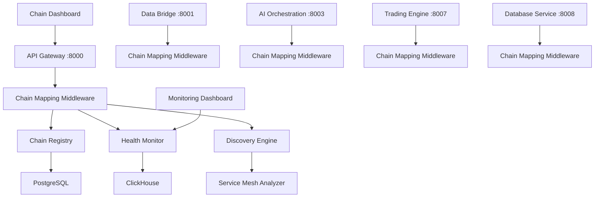

# Chain Mapping System - Integration Specifications

## Overview

This document provides detailed specifications for integrating the embedded chain mapping system with the existing AI trading platform microservices. The integration is designed to be non-intrusive, embedded, and transparent to existing service operations.

## Table of Contents

1. [Integration Architecture](#integration-architecture)
2. [Service-Specific Integration](#service-specific-integration)
3. [Middleware Components](#middleware-components)
4. [Database Integration](#database-integration)
5. [API Integration](#api-integration)
6. [Monitoring Integration](#monitoring-integration)
7. [Performance Impact](#performance-impact)
8. [Migration Strategy](#migration-strategy)

## Integration Architecture

### Core Integration Principles

1. **Non-Intrusive**: Chain mapping runs alongside existing services without modifying core business logic
2. **Embedded**: Integration components are embedded within each microservice
3. **Transparent**: Zero impact on existing API contracts and service behavior
4. **Performant**: Minimal overhead on existing service performance
5. **Gradual**: Support for incremental rollout across services

### High-Level Architecture



## Service-Specific Integration

### 1. API Gateway (Port 8000) - Central Coordination Hub

The API Gateway serves as the primary entry point for chain mapping APIs and coordinates cross-service operations.

#### Integration Components

```python
# src/infrastructure/chain_mapping/gateway_integration.py
from chain_mapping.core.registry import ChainRegistry
from chain_mapping.monitoring.health_monitor import ChainHealthMonitor
from chain_mapping.api.chain_endpoints import ChainAPIRouter

class ChainMappingGatewayIntegration:
    """Chain mapping integration for API Gateway."""

    def __init__(self, app: FastAPI):
        self.app = app
        self.registry = ChainRegistry(
            database_url=os.getenv("DATABASE_URL"),
            redis_url=os.getenv("REDIS_URL")
        )
        self.health_monitor = ChainHealthMonitor()

    async def initialize(self):
        """Initialize chain mapping components."""
        await self.registry.initialize()

        # Add chain mapping routes
        chain_router = ChainAPIRouter(self.registry, self.health_monitor)
        self.app.include_router(chain_router, prefix="/api/v1/chains", tags=["chains"])

        # Start background monitoring
        asyncio.create_task(self._start_monitoring())

    async def _start_monitoring(self):
        """Start monitoring for all registered chains."""
        chains, _ = await self.registry.list_chains()
        for chain in chains:
            config = MonitoringConfig(chain_id=chain.id)
            await self.health_monitor.start_monitoring(chain, config)
```

#### Middleware Registration

```python
# main.py additions
from infrastructure.chain_mapping.gateway_integration import ChainMappingGatewayIntegration

@asynccontextmanager
async def lifespan(app: FastAPI):
    # Existing initialization code...

    # Initialize chain mapping
    chain_integration = ChainMappingGatewayIntegration(app)
    await chain_integration.initialize()

    yield

    # Cleanup
    await chain_integration.cleanup()

app = FastAPI(lifespan=lifespan)
```

### 2. Data Bridge (Port 8001) - Real-time Data Chain Tracking

The Data Bridge service handles real-time market data and WebSocket connections, making it critical for data flow chain monitoring.

#### Integration Components

```python
# src/infrastructure/chain_mapping/data_bridge_integration.py
from chain_mapping.monitoring.chain_tracker import ChainTracker
from chain_mapping.discovery.runtime_tracer import RuntimeTracer

class ChainMappingDataBridgeIntegration:
    """Chain mapping integration for Data Bridge service."""

    def __init__(self):
        self.chain_tracker = ChainTracker()
        self.runtime_tracer = RuntimeTracer()

    async def track_websocket_chain(self, connection_id: str, event_type: str):
        """Track WebSocket communication in chains."""
        await self.chain_tracker.track_event(
            chain_category="user_experience",
            event_type="websocket_message",
            metadata={
                "connection_id": connection_id,
                "event_type": event_type,
                "service": "data-bridge",
                "timestamp": datetime.utcnow().isoformat()
            }
        )

    async def track_market_data_flow(self, symbol: str, data_type: str, latency: float):
        """Track market data processing in chains."""
        await self.chain_tracker.track_event(
            chain_category="data_flow",
            event_type="market_data_processed",
            metadata={
                "symbol": symbol,
                "data_type": data_type,
                "latency_ms": latency,
                "service": "data-bridge"
            }
        )
```

#### WebSocket Handler Integration

```python
# src/api/websocket_handler.py modifications
class WebSocketHandler:
    def __init__(self):
        # Existing code...
        self.chain_integration = ChainMappingDataBridgeIntegration()

    async def handle_connection(self, websocket: WebSocket):
        await websocket.accept()
        connection_id = str(uuid4())

        # Track chain event
        await self.chain_integration.track_websocket_chain(
            connection_id, "connection_established"
        )

        try:
            while True:
                data = await websocket.receive_text()

                # Process message (existing logic)
                # ...

                # Track message processing
                await self.chain_integration.track_websocket_chain(
                    connection_id, "message_processed"
                )

        except WebSocketDisconnect:
            await self.chain_integration.track_websocket_chain(
                connection_id, "connection_closed"
            )
```

### 3. Database Service (Port 8008) - Chain Data Management

The Database Service manages all chain mapping data and provides centralized database operations for the chain mapping system.

#### Integration Components

```python
# src/infrastructure/chain_mapping/database_integration.py
from chain_mapping.core.registry import ChainRegistry
from chain_mapping.database.chain_models import ChainDefinitionModel

class ChainMappingDatabaseIntegration:
    """Chain mapping integration for Database Service."""

    def __init__(self):
        self.registry = ChainRegistry(
            database_url=os.getenv("DATABASE_URL"),
            redis_url=os.getenv("REDIS_URL")
        )

    async def setup_chain_tables(self):
        """Setup chain mapping database tables."""
        # Execute chain mapping schema
        await self._execute_schema_file("chain-mapping/database/postgresql-schema.sql")
        await self._execute_schema_file("chain-mapping/database/clickhouse-schema.sql")

    async def migrate_existing_data(self):
        """Migrate existing service data to chain format."""
        # Analyze existing database relationships
        service_relationships = await self._analyze_service_relationships()

        # Create chain definitions from relationships
        for relationship in service_relationships:
            chain_candidate = await self._convert_to_chain_definition(relationship)
            if chain_candidate:
                await self.registry.register_chain(chain_candidate)
```

#### Database Health Integration

```python
# src/api/health_endpoints.py modifications
from infrastructure.chain_mapping.database_integration import ChainMappingDatabaseIntegration

@app.get("/health/chains")
async def chain_health():
    """Health check including chain mapping status."""
    chain_integration = ChainMappingDatabaseIntegration()

    # Standard health checks
    db_health = await check_database_health()

    # Chain mapping specific health
    chain_health = await chain_integration.registry.get_statistics()

    return {
        "status": "healthy" if db_health["status"] == "healthy" else "degraded",
        "database": db_health,
        "chain_mapping": chain_health,
        "timestamp": datetime.utcnow().isoformat()
    }
```

### 4. AI Services Integration (Ports 8003, 8004, 8005, 8006)

AI services require special integration for tracking model inference chains and performance monitoring.

#### AI Chain Tracker

```python
# src/infrastructure/chain_mapping/ai_integration.py
from chain_mapping.monitoring.ai_chain_monitor import AIChainMonitor

class ChainMappingAIIntegration:
    """Chain mapping integration for AI services."""

    def __init__(self, service_name: str):
        self.service_name = service_name
        self.ai_monitor = AIChainMonitor()

    async def track_model_inference(self, model_id: str, input_data: Dict, output_data: Dict, latency: float):
        """Track AI model inference in chains."""
        await self.ai_monitor.track_inference(
            service_name=self.service_name,
            model_id=model_id,
            input_size=len(str(input_data)),
            output_size=len(str(output_data)),
            latency_ms=latency
        )

    async def track_training_pipeline(self, pipeline_id: str, stage: str, metrics: Dict):
        """Track ML training pipeline stages."""
        await self.ai_monitor.track_training_stage(
            service_name=self.service_name,
            pipeline_id=pipeline_id,
            stage=stage,
            metrics=metrics
        )
```

#### Model Wrapper Integration

```python
# src/business/model_wrapper.py modifications
class ModelWrapper:
    def __init__(self, model_path: str):
        # Existing code...
        self.chain_integration = ChainMappingAIIntegration("ai-provider")

    async def predict(self, input_data: Dict) -> Dict:
        start_time = time.time()

        try:
            # Existing prediction logic
            result = await self._run_inference(input_data)

            # Track successful inference
            latency = (time.time() - start_time) * 1000
            await self.chain_integration.track_model_inference(
                model_id=self.model_id,
                input_data=input_data,
                output_data=result,
                latency=latency
            )

            return result

        except Exception as e:
            # Track failed inference
            latency = (time.time() - start_time) * 1000
            await self.chain_integration.track_model_inference(
                model_id=self.model_id,
                input_data=input_data,
                output_data={"error": str(e)},
                latency=latency
            )
            raise
```

### 5. Trading Engine (Port 8007) - Critical Path Monitoring

The Trading Engine requires specialized monitoring for trading decision chains and risk management.

#### Trading Chain Integration

```python
# src/infrastructure/chain_mapping/trading_integration.py
from chain_mapping.monitoring.critical_path_monitor import CriticalPathMonitor

class ChainMappingTradingIntegration:
    """Chain mapping integration for Trading Engine."""

    def __init__(self):
        self.critical_monitor = CriticalPathMonitor()

    async def track_trading_decision(self, decision_id: str, stages: List[str], total_latency: float):
        """Track complete trading decision chain."""
        await self.critical_monitor.track_critical_path(
            path_id=decision_id,
            path_type="trading_decision",
            stages=stages,
            total_latency_ms=total_latency,
            criticality="high"
        )

    async def track_order_execution(self, order_id: str, execution_stages: List[Dict]):
        """Track order execution chain."""
        await self.critical_monitor.track_execution_chain(
            chain_id="order_execution",
            execution_id=order_id,
            stages=execution_stages
        )
```

## Middleware Components

### 1. Chain Tracking Middleware

```python
# src/infrastructure/chain_mapping/middleware/chain_tracker.py
from fastapi import Request, Response
from starlette.middleware.base import BaseHTTPMiddleware

class ChainTrackingMiddleware(BaseHTTPMiddleware):
    """Middleware to automatically track HTTP request chains."""

    def __init__(self, app, service_name: str):
        super().__init__(app)
        self.service_name = service_name
        self.chain_tracker = ChainTracker()

    async def dispatch(self, request: Request, call_next):
        start_time = time.time()

        # Generate trace ID
        trace_id = request.headers.get("X-Trace-ID", str(uuid4()))

        # Track request start
        await self.chain_tracker.start_request_trace(
            trace_id=trace_id,
            service=self.service_name,
            method=request.method,
            path=request.url.path
        )

        try:
            response = await call_next(request)

            # Track successful response
            latency = (time.time() - start_time) * 1000
            await self.chain_tracker.complete_request_trace(
                trace_id=trace_id,
                status_code=response.status_code,
                latency_ms=latency
            )

            # Add trace ID to response headers
            response.headers["X-Trace-ID"] = trace_id

            return response

        except Exception as e:
            # Track failed response
            latency = (time.time() - start_time) * 1000
            await self.chain_tracker.complete_request_trace(
                trace_id=trace_id,
                status_code=500,
                latency_ms=latency,
                error=str(e)
            )
            raise
```

### 2. Performance Monitoring Middleware

```python
# src/infrastructure/chain_mapping/middleware/performance_monitor.py
class PerformanceMonitoringMiddleware(BaseHTTPMiddleware):
    """Middleware for automatic performance monitoring."""

    def __init__(self, app, chain_registry: ChainRegistry):
        super().__init__(app)
        self.chain_registry = chain_registry
        self.performance_tracker = PerformanceTracker()

    async def dispatch(self, request: Request, call_next):
        # Identify relevant chains for this request
        relevant_chains = await self._identify_relevant_chains(request)

        start_time = time.time()
        response = await call_next(request)
        latency = (time.time() - start_time) * 1000

        # Update performance metrics for relevant chains
        for chain_id in relevant_chains:
            await self.performance_tracker.update_chain_metrics(
                chain_id=chain_id,
                latency=latency,
                status_code=response.status_code
            )

        return response

    async def _identify_relevant_chains(self, request: Request) -> List[str]:
        """Identify chains relevant to this request."""
        # Use path patterns to identify relevant chains
        path_patterns = {
            "/api/v1/trading": ["A2", "B1", "B3"],  # AI Decision + API + Trading chains
            "/api/v1/data": ["A1", "B1"],           # Market Data + API chains
            "/ws/": ["C1", "C2"]                    # WebSocket chains
        }

        relevant_chains = []
        for pattern, chains in path_patterns.items():
            if pattern in request.url.path:
                relevant_chains.extend(chains)

        return list(set(relevant_chains))
```

## Database Integration

### 1. Connection Pool Integration

```python
# src/infrastructure/database/chain_database.py
from sqlalchemy.ext.asyncio import create_async_engine, AsyncSession
from chain_mapping.database.models import ChainDefinitionModel

class ChainDatabaseManager:
    """Database manager for chain mapping data."""

    def __init__(self, database_url: str):
        self.engine = create_async_engine(database_url, echo=False)
        self.session_factory = sessionmaker(
            bind=self.engine,
            class_=AsyncSession,
            expire_on_commit=False
        )

    async def create_tables(self):
        """Create chain mapping tables."""
        from chain_mapping.database.models import Base
        async with self.engine.begin() as conn:
            await conn.run_sync(Base.metadata.create_all)

    async def get_session(self) -> AsyncSession:
        """Get database session."""
        return self.session_factory()
```

### 2. Data Migration Scripts

```python
# scripts/migrate_chain_data.py
async def migrate_existing_service_data():
    """Migrate existing service relationships to chain format."""

    # Analyze existing database schema
    schema_analyzer = DatabaseSchemaAnalyzer()
    relationships = await schema_analyzer.analyze_foreign_keys()

    # Convert to chain definitions
    chain_generator = ChainGenerator()
    for relationship in relationships:
        chain_def = await chain_generator.create_chain_from_relationship(relationship)
        if chain_def:
            await registry.register_chain(chain_def)

    print(f"Migrated {len(relationships)} database relationships to chains")
```

## API Integration

### 1. Enhanced Health Endpoints

```python
# Enhanced health check with chain status
@router.get("/health/detailed")
async def detailed_health_check():
    """Comprehensive health check including chain status."""

    # Standard service health
    service_health = await check_service_health()

    # Chain mapping health
    chain_health = await chain_registry.get_statistics()

    # Active alerts
    active_alerts = health_monitor.get_active_alerts()

    return {
        "service": service_health,
        "chain_mapping": {
            "enabled": True,
            "statistics": chain_health,
            "active_alerts": len(active_alerts),
            "monitoring_status": "active" if len(active_alerts) == 0 else "degraded"
        },
        "timestamp": datetime.utcnow().isoformat(),
        "overall_status": "healthy" if len(active_alerts) == 0 else "degraded"
    }
```

### 2. Chain-Aware Error Handling

```python
# src/infrastructure/error_handling/chain_aware_handler.py
class ChainAwareErrorHandler:
    """Error handler that considers chain impact."""

    def __init__(self, chain_registry: ChainRegistry):
        self.chain_registry = chain_registry

    async def handle_error(self, error: Exception, request: Request):
        """Handle error with chain impact analysis."""

        # Standard error handling
        error_response = await self._create_error_response(error)

        # Analyze chain impact
        affected_chains = await self._analyze_chain_impact(error, request)

        if affected_chains:
            # Log chain impact
            logger.error(f"Error affects chains: {', '.join(affected_chains)}")

            # Update chain health status
            for chain_id in affected_chains:
                await self._update_chain_error_status(chain_id, error)

        return error_response

    async def _analyze_chain_impact(self, error: Exception, request: Request) -> List[str]:
        """Analyze which chains are affected by this error."""
        # Implementation would analyze request path, error type, etc.
        # to determine affected chains
        pass
```

## Monitoring Integration

### 1. Existing Metrics Integration

```python
# src/infrastructure/monitoring/enhanced_metrics.py
from chain_mapping.monitoring.metrics_collector import ChainMetricsCollector

class EnhancedMetricsCollector:
    """Enhanced metrics collector with chain information."""

    def __init__(self):
        self.chain_metrics = ChainMetricsCollector()
        self.existing_metrics = ExistingMetricsCollector()

    async def collect_metrics(self) -> Dict[str, Any]:
        """Collect both existing and chain metrics."""

        # Existing metrics
        service_metrics = await self.existing_metrics.collect()

        # Chain metrics
        chain_metrics = await self.chain_metrics.collect_all_chains()

        return {
            "service_metrics": service_metrics,
            "chain_metrics": chain_metrics,
            "correlation": await self._correlate_metrics(service_metrics, chain_metrics)
        }
```

### 2. Alert Integration

```python
# src/infrastructure/alerting/chain_alert_manager.py
class ChainAlertManager:
    """Alert manager with chain context."""

    def __init__(self, existing_alerter: AlertManager):
        self.existing_alerter = existing_alerter
        self.chain_alerter = ChainAlertSystem()

    async def send_alert(self, alert: Alert):
        """Send alert through both systems."""

        # Send through existing system
        await self.existing_alerter.send(alert)

        # Enhance with chain context
        chain_context = await self._get_chain_context(alert)
        enhanced_alert = self._enhance_alert_with_chain_info(alert, chain_context)

        # Send through chain-aware system
        await self.chain_alerter.send(enhanced_alert)
```

## Performance Impact

### 1. Overhead Analysis

| Component | CPU Overhead | Memory Overhead | Latency Impact |
|-----------|--------------|-----------------|----------------|
| Chain Tracking Middleware | < 1% | 2-5 MB per service | < 1ms |
| Health Monitoring | < 0.5% | 1-3 MB per service | 0ms (async) |
| Discovery Engine | < 2% (during discovery) | 5-10 MB | 0ms (background) |
| Database Operations | < 0.1% | Minimal | < 0.5ms |
| **Total Estimated** | **< 3.5%** | **< 20 MB** | **< 1.5ms** |

### 2. Performance Optimization Strategies

```python
# Async processing for minimal impact
class AsyncChainProcessor:
    """Asynchronous chain processing to minimize impact."""

    def __init__(self):
        self.event_queue = asyncio.Queue(maxsize=1000)
        self.processor_task = None

    async def start(self):
        """Start background processing."""
        self.processor_task = asyncio.create_task(self._process_events())

    async def track_event(self, event: ChainEvent):
        """Track event asynchronously."""
        try:
            self.event_queue.put_nowait(event)
        except asyncio.QueueFull:
            # Drop oldest events if queue is full
            try:
                self.event_queue.get_nowait()
                self.event_queue.put_nowait(event)
            except asyncio.QueueEmpty:
                pass

    async def _process_events(self):
        """Process events in background."""
        while True:
            try:
                event = await self.event_queue.get()
                await self._process_single_event(event)
            except Exception as e:
                logger.error(f"Error processing chain event: {e}")
```

## Migration Strategy

### Phase 1: Infrastructure Setup (Week 1-2)
1. Deploy database schemas
2. Setup chain registry in database service
3. Initialize basic monitoring infrastructure

### Phase 2: Core Services Integration (Week 3-4)
1. Integrate API Gateway with chain management APIs
2. Add chain tracking to Database Service
3. Deploy basic health monitoring

### Phase 3: Data Services Integration (Week 5-6)
1. Integrate Data Bridge with real-time tracking
2. Add WebSocket chain monitoring
3. Implement market data flow tracking

### Phase 4: AI Services Integration (Week 7-8)
1. Integrate AI services with model inference tracking
2. Add training pipeline monitoring
3. Implement performance correlation analysis

### Phase 5: Trading Engine Integration (Week 9-10)
1. Integrate Trading Engine with critical path monitoring
2. Add order execution tracking
3. Implement risk management chain monitoring

### Phase 6: Optimization and Monitoring (Week 11-12)
1. Performance optimization based on metrics
2. Advanced monitoring and alerting
3. Complete documentation and training

### Migration Checklist

```yaml
pre_migration:
  - [ ] Backup existing database schemas
  - [ ] Verify service health and stability
  - [ ] Prepare rollback procedures
  - [ ] Test chain mapping schemas in staging

migration_steps:
  database_setup:
    - [ ] Execute PostgreSQL schema creation
    - [ ] Execute ClickHouse schema creation
    - [ ] Verify table creation and indexes
    - [ ] Setup initial chain definitions

  service_integration:
    - [ ] Deploy API Gateway integration
    - [ ] Deploy Database Service integration
    - [ ] Verify basic API functionality
    - [ ] Test health monitoring

  incremental_rollout:
    - [ ] Enable monitoring for critical chains
    - [ ] Deploy Data Bridge integration
    - [ ] Deploy AI services integration
    - [ ] Deploy Trading Engine integration

post_migration:
  - [ ] Verify all services are healthy
  - [ ] Check chain mapping functionality
  - [ ] Monitor performance impact
  - [ ] Train operations team
```

This integration specification provides a comprehensive approach to embedding the chain mapping system within the existing microservices architecture while maintaining service independence and minimizing performance impact.