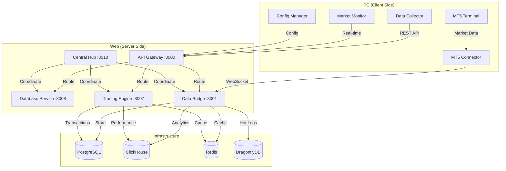

# Phase 1 Infrastructure Migration - Minimal Architecture Design

## 🏗️ Architecture Overview

This document defines the minimal architecture for Phase 1 Infrastructure Migration, creating a clean hybrid foundation that separates PC (client) and Web (server) components while maintaining the proven performance patterns from the existing ai_trading system.

## 📁 Project Structure Design

```
aitrading/
├── pc/                          # Client-side components (local execution)
│   ├── metatrader-connector/    # MT5 integration service
│   ├── config-manager/          # Local configuration management
│   ├── data-collector/          # Multi-source data aggregation
│   └── market-monitor/          # Real-time market analysis
│
├── web/                         # Server-side services (cloud/remote)
│   ├── core/                    # Core infrastructure services
│   │   ├── central-hub/         # Enhanced Central Hub
│   │   ├── import-manager/      # Dependency management
│   │   ├── error-dna/          # Advanced error handling
│   │   └── config-service/      # Configuration management
│   │
│   ├── services/               # Business services
│   │   ├── api-gateway/        # Entry point with security
│   │   ├── database-service/   # Multi-DB management
│   │   ├── data-bridge/        # Data processing pipeline
│   │   └── trading-engine/     # Core trading logic
│   │
│   ├── infrastructure/         # Infrastructure components
│   │   ├── docker/             # Container configurations
│   │   ├── security/           # Zero-trust security
│   │   └── monitoring/         # Health checks and metrics
│   │
│   └── shared/                 # Shared utilities
│       ├── types/              # TypeScript definitions
│       ├── utils/              # Common utilities
│       └── constants/          # Configuration constants
│
├── deployment/                 # Deployment configurations
│   ├── docker-compose.yml     # Phase 1 services
│   ├── .env.example           # Environment template
│   └── scripts/               # Deployment scripts
│
└── docs/                      # Architecture documentation
    ├── architecture/          # Architecture decisions
    ├── api/                   # API documentation
    └── deployment/            # Deployment guides
```

## 🎯 Core Architecture Principles

### 1. Hybrid Client-Server Separation
- **PC Side**: Local MT5 integration, real-time data collection, market monitoring
- **Web Side**: Business logic, data processing, API services, user management
- **Communication**: Secure WebSocket + REST API between PC and Web

### 2. Zero-Trust Security Model
- All communication encrypted (TLS 1.3)
- MT5 credentials encrypted with Windows DPAPI
- Server-side trading authority
- Continuous validation and monitoring

### 3. Microservices Foundation
- Loosely coupled services with clear boundaries
- Event-driven communication where appropriate
- Independent deployment and scaling
- Circuit breaker patterns for resilience

## 🔧 Core Components Architecture

### Central Hub (Enhanced)
```typescript
// web/core/central-hub/
interface CentralHubConfig {
  services: ServiceRegistry;
  security: SecurityConfig;
  monitoring: MonitoringConfig;
  logging: LoggingConfig;
}

class CentralHub {
  private serviceRegistry: ServiceRegistry;
  private configManager: ConfigManager;
  private errorHandler: ErrorDNA;
  private importManager: ImportManager;

  async initialize(): Promise<void>;
  async registerService(service: Service): Promise<void>;
  async healthCheck(): Promise<HealthStatus>;
}
```

### Import Manager (Dependency Management)
```typescript
// web/core/import-manager/
interface DependencyMap {
  service: string;
  dependencies: string[];
  optional: string[];
  healthCheck: string;
}

class ImportManager {
  private dependencyGraph: Map<string, DependencyMap>;

  async resolveDependencies(service: string): Promise<void>;
  async validateDependencies(): Promise<ValidationResult>;
  async getStartupOrder(): Promise<string[]>;
}
```

### ErrorDNA (Advanced Error Handling)
```typescript
// web/core/error-dna/
interface ErrorPattern {
  code: string;
  pattern: RegExp;
  severity: 'low' | 'medium' | 'high' | 'critical';
  recovery: RecoveryStrategy;
  notification: NotificationConfig;
}

class ErrorDNA {
  private patterns: Map<string, ErrorPattern>;
  private analytics: ErrorAnalytics;

  async analyzeError(error: Error): Promise<ErrorAnalysis>;
  async suggestRecovery(error: Error): Promise<RecoveryAction[]>;
  async trackPattern(error: Error): Promise<void>;
}
```

## 🌐 API Gateway Architecture

### Basic API Gateway Design
```typescript
// web/services/api-gateway/
interface GatewayConfig {
  routes: RouteConfig[];
  security: SecurityMiddleware[];
  rateLimit: RateLimitConfig;
  cors: CorsConfig;
}

class ApiGateway {
  private router: Express.Router;
  private security: SecurityManager;
  private monitor: RequestMonitor;

  async setupRoutes(): Promise<void>;
  async applyMiddleware(): Promise<void>;
  async handleRequest(req: Request, res: Response): Promise<void>;
}

// Route Configuration
const routes: RouteConfig[] = [
  {
    path: '/api/v1/data/*',
    target: 'data-bridge:8001',
    methods: ['GET', 'POST'],
    auth: 'required',
    rateLimit: '1000/hour'
  },
  {
    path: '/api/v1/trading/*',
    target: 'trading-engine:8007',
    methods: ['POST'],
    auth: 'required',
    rateLimit: '100/hour'
  }
];
```

## 📊 Database Configuration

### Multi-Database Setup
```yaml
# Database Architecture
databases:
  postgresql:
    primary: true
    purpose: "User data, transactions, audit logs"
    port: 5432
    features: ["ACID", "JSON", "Full-text search"]

  clickhouse:
    purpose: "Time-series data, analytics, logs"
    port: 8123
    features: ["Columnar", "Compression", "Real-time aggregation"]

  redis:
    purpose: "Caching, sessions, real-time data"
    port: 6379
    features: ["In-memory", "Pub/Sub", "Clustering"]

  dragonflydb:
    purpose: "Hot log storage, real-time cache"
    port: 6380
    features: ["Redis-compatible", "High performance"]

# Connection Configuration
connection_pools:
  postgresql:
    min: 5
    max: 20
    idle_timeout: 30s

  clickhouse:
    min: 2
    max: 10
    idle_timeout: 60s
```

## 🔗 MT5 Connection Pipeline

### High-Performance MT5 Integration
```typescript
// pc/metatrader-connector/
interface MT5Config {
  connectionPool: ConnectionPoolConfig;
  credentials: EncryptedCredentials;
  performance: PerformanceConfig;
  security: SecurityConfig;
}

class MT5Connector {
  private connectionPool: MT5ConnectionPool;
  private signalProcessor: SignalProcessor;
  private healthMonitor: HealthMonitor;

  async initializePool(): Promise<void>;
  async processSignal(signal: TradingSignal): Promise<ExecutionResult>;
  async monitorHealth(): Promise<HealthStatus>;
}

// Connection Pool for <50ms latency
class MT5ConnectionPool {
  private connections: MT5Connection[] = [];
  private readonly poolSize = 5; // Optimal for throughput

  async getConnection(): Promise<MT5Connection>;
  async executeParallel(signals: TradingSignal[]): Promise<ExecutionResult[]>;
  async healthCheck(): Promise<boolean>;
}
```

### Signal Processing Pipeline
```typescript
// Signal Flow: Server -> WebSocket -> Validation -> Parallel Execution
interface SignalPipeline {
  receive: (signal: TradingSignal) => Promise<void>;
  validate: (signal: TradingSignal) => Promise<ValidationResult>;
  execute: (signal: TradingSignal) => Promise<ExecutionResult>;
  monitor: (execution: ExecutionResult) => Promise<void>;
}

class SignalProcessor {
  async processSignalBatch(signals: TradingSignal[]): Promise<void> {
    // Batch validation (100 signals per call)
    const validatedSignals = await this.batchValidate(signals);

    // Parallel execution across multiple connections
    const results = await this.executeParallel(validatedSignals);

    // Sub-50ms total latency target
    await this.reportResults(results);
  }
}
```

## 🐳 Docker Configuration

### Phase 1 Docker Setup
```yaml
# deployment/docker-compose.yml
version: '3.8'

services:
  # Core Infrastructure
  api-gateway:
    build: ./web/services/api-gateway
    ports: ["8000:8000"]
    environment:
      - NODE_ENV=production
      - JWT_SECRET=${JWT_SECRET}
      - RATE_LIMIT_ENABLED=true
    depends_on: [central-hub]
    networks: [aitrading-network]

  central-hub:
    build: ./web/core/central-hub
    ports: ["8010:8010"]
    environment:
      - SERVICE_REGISTRY_ENABLED=true
      - HEALTH_CHECK_INTERVAL=30s
    volumes:
      - hub-config:/app/config
    networks: [aitrading-network]

  database-service:
    build: ./web/services/database-service
    ports: ["8008:8008"]
    environment:
      - POSTGRES_URL=${POSTGRES_URL}
      - CLICKHOUSE_URL=${CLICKHOUSE_URL}
      - REDIS_URL=${REDIS_URL}
      - DRAGONFLYDB_URL=${DRAGONFLYDB_URL}
    depends_on: [postgres, clickhouse, redis, dragonflydb]
    networks: [aitrading-network]

  data-bridge:
    build: ./web/services/data-bridge
    ports: ["8001:8001"]
    environment:
      - MT5_WEBSOCKET_ENABLED=true
      - PROCESSING_BATCH_SIZE=100
      - TARGET_LATENCY_MS=50
    depends_on: [database-service]
    networks: [aitrading-network]

  trading-engine:
    build: ./web/services/trading-engine
    ports: ["8007:8007"]
    environment:
      - RISK_MANAGEMENT_ENABLED=true
      - EXECUTION_TIMEOUT_MS=1200
    depends_on: [database-service, data-bridge]
    networks: [aitrading-network]

  # Database Infrastructure
  postgres:
    image: postgres:15-alpine
    environment:
      POSTGRES_DB: aitrading
      POSTGRES_USER: ${POSTGRES_USER}
      POSTGRES_PASSWORD: ${POSTGRES_PASSWORD}
    volumes: [postgres-data:/var/lib/postgresql/data]
    networks: [aitrading-network]

  clickhouse:
    image: clickhouse/clickhouse-server:23-alpine
    environment:
      CLICKHOUSE_USER: ${CLICKHOUSE_USER}
      CLICKHOUSE_PASSWORD: ${CLICKHOUSE_PASSWORD}
    volumes: [clickhouse-data:/var/lib/clickhouse]
    networks: [aitrading-network]

  redis:
    image: redis:7-alpine
    volumes: [redis-data:/data]
    networks: [aitrading-network]

  dragonflydb:
    image: docker.dragonflydb.io/dragonflydb/dragonfly:latest
    ports: ["6380:6379"]
    volumes: [dragonfly-data:/data]
    networks: [aitrading-network]

volumes:
  postgres-data:
  clickhouse-data:
  redis-data:
  dragonfly-data:
  hub-config:

networks:
  aitrading-network:
    driver: bridge
```

## 🔐 Security Architecture

### Zero-Trust Implementation
```typescript
// web/infrastructure/security/
interface SecurityConfig {
  encryption: EncryptionConfig;
  authentication: AuthConfig;
  authorization: AuthzConfig;
  monitoring: SecurityMonitoring;
}

class SecurityManager {
  private encryption: EncryptionService;
  private auth: AuthenticationService;
  private audit: AuditLogger;

  async validateRequest(req: Request): Promise<SecurityContext>;
  async encryptSensitiveData(data: any): Promise<EncryptedData>;
  async auditSecurityEvent(event: SecurityEvent): Promise<void>;
}

// MT5 Credential Security (PC Side)
class SecureCredentialManager {
  async storeCredentials(credentials: MT5Credentials): Promise<void> {
    // Windows DPAPI encryption
    const encrypted = await this.dpapi.encrypt(credentials);
    await this.secureStore(encrypted);
  }

  async retrieveCredentials(): Promise<MT5Credentials> {
    const encrypted = await this.secureRetrieve();
    return await this.dpapi.decrypt(encrypted);
  }
}
```

## 📈 Performance Targets

### Phase 1 Performance Specifications
```yaml
Performance Targets:
  Service Startup: <6 seconds (maintained)
  MT5 Integration: 18+ ticks/second -> 50+ ticks/second
  WebSocket Throughput: 5,000+ messages/second
  Database Operations: 100x improvement (connection pooling)
  Cache Hit Rate: >85%

MT5 Pipeline Performance:
  Signal Processing: <50ms end-to-end
  Connection Pool: 5 persistent connections
  Batch Validation: 100 signals per call
  Parallel Execution: Across multiple connections
  Health Monitoring: Every 30 seconds

API Gateway Performance:
  Request Routing: <5ms
  Authentication: <10ms
  Rate Limiting: <2ms
  Circuit Breaker: <1ms decision

Database Performance:
  Connection Pool: Min 5, Max 20 per service
  Query Timeout: 30s standard, 60s analytical
  Cache Layer: Redis with TTL management
  Hot Storage: <1ms access (DragonflyDB)
```

## 📊 Component Interaction Diagram



## 🎯 Architecture Decision Records (ADRs)

### ADR-001: Hybrid PC/Web Architecture
**Decision**: Separate client (PC) and server (Web) components with clear boundaries
**Rationale**:
- Enables local MT5 integration while maintaining server-side business logic
- Provides flexibility for future web-only deployments
- Maintains zero-trust security model
**Consequences**:
- Requires secure communication protocols
- Enables independent scaling of client and server components

### ADR-002: Multi-Database Strategy
**Decision**: Use specialized databases for different data types and access patterns
**Rationale**:
- PostgreSQL for ACID transactions and user data
- ClickHouse for time-series analytics and logs
- Redis/DragonflyDB for high-performance caching
**Consequences**:
- Increased complexity but optimal performance for each use case
- Requires database service abstraction layer

### ADR-003: Connection Pool Architecture for MT5
**Decision**: Implement 5-connection pool for MT5 integration with parallel processing
**Rationale**:
- Achieves <50ms latency target through parallel execution
- Provides redundancy and load distribution
- Optimal balance between performance and resource usage
**Consequences**:
- Requires connection health monitoring
- Enables high-throughput signal processing

## 📋 Implementation Checklist

### Phase 1 Core Components
- [ ] Project structure setup (pc/ and web/ separation)
- [ ] Central Hub service with service registry
- [ ] Import Manager for dependency resolution
- [ ] ErrorDNA advanced error handling
- [ ] API Gateway with security middleware
- [ ] Database service with multi-DB support
- [ ] Data Bridge with MT5 integration
- [ ] Trading Engine with basic logic
- [ ] Docker configuration and networking
- [ ] Security framework implementation

### Integration Points
- [ ] PC to Web communication (WebSocket + REST)
- [ ] Service-to-service communication patterns
- [ ] Database connection pooling
- [ ] Error handling and recovery
- [ ] Health monitoring and metrics
- [ ] Configuration management
- [ ] Security validation and audit logging

This architecture provides a solid foundation for Phase 1 while maintaining the proven performance characteristics of the existing system and establishing clear patterns for future enhancements.