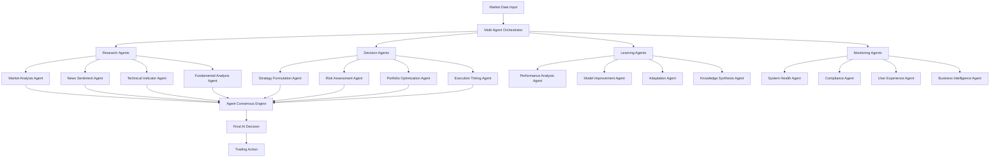

# AI Workflow (Level 4 Intelligence dari Plan2)

## 🤖 Multi-Agent AI Decision Framework

### **AI Intelligence Performance Targets** (dari Plan2):
```yaml
Performance_Targets:
  AI_Decision_Making: "<15ms (85% improvement dari ai_trading 100ms baseline)"
  Multi_Agent_Consensus: "<25ms coordination latency"
  Neural_Processing: "Real-time inference dengan <50ms latency"
  Ensemble_Models: "Combined AI predictions dengan <30ms processing"

Business_AI_Differentiation:
  Decision_Speed_Advantage: "<15ms AI decisions (85% faster than competitors)"
  Multi_Agent_Coordination: "Ensemble AI agents untuk superior trading accuracy"
  Continuous_Learning: "Self-improving system dengan cross-agent knowledge sharing"
  Scalable_Intelligence: "Agent framework supports 2000+ concurrent users"
```

---

## 🧠 Multi-Agent Framework Architecture

### **Agent Specialization Framework** (dari Plan2):


### **Multi-Agent Orchestrator Implementation**:
```python
class MultiAgentOrchestrator:
    def __init__(self):
        self.agent_registry = AgentRegistry()
        self.consensus_engine = ConsensusEngine()
        self.performance_monitor = AgentPerformanceMonitor()

    async def orchestrate_decision(self, market_data: MarketData, user_context: UserContext) -> AIDecision:
        """Orchestrate multi-agent decision dengan <15ms target"""
        start_time = time.time()

        # Get available agents untuk user's subscription tier
        available_agents = self.get_tier_agents(user_context.subscription_tier)

        # Prepare agent execution context
        agent_context = AgentExecutionContext(
            market_data=market_data,
            user_context=user_context,
            execution_deadline=start_time + 0.015  # 15ms deadline
        )

        # Execute agents concurrently untuk speed
        agent_results = await self.execute_agents_parallel(available_agents, agent_context)

        # Generate consensus dari agent results
        consensus_decision = await self.consensus_engine.generate_consensus(
            agent_results, user_context
        )

        # Monitor performance
        execution_time = (time.time() - start_time) * 1000  # Convert to ms
        await self.performance_monitor.record_execution(
            execution_time, len(available_agents), user_context
        )

        # Performance warning jika > 15ms
        if execution_time > 15:
            await self.handle_performance_warning(execution_time, available_agents, user_context)

        return AIDecision(
            consensus=consensus_decision,
            agent_results=agent_results,
            execution_time_ms=execution_time,
            confidence_score=consensus_decision.confidence,
            user_context=user_context
        )

    def get_tier_agents(self, subscription_tier: str) -> List[str]:
        """Get available agents berdasarkan subscription tier"""
        tier_agents = {
            'free': [
                'market_analysis'  # Single basic agent
            ],
            'pro': [
                'market_analysis', 'technical_indicator',
                'risk_assessment', 'strategy_formulation'  # 4 agents
            ],
            'enterprise': [
                # All agents available
                'market_analysis', 'news_sentiment', 'technical_indicator', 'fundamental_analysis',
                'strategy_formulation', 'risk_assessment', 'portfolio_optimization', 'execution_timing',
                'performance_analysis', 'model_improvement', 'adaptation', 'knowledge_synthesis',
                'system_health', 'compliance', 'user_experience', 'business_intelligence'
            ]
        }
        return tier_agents.get(subscription_tier, tier_agents['free'])
```

---

## 🔬 Research Agents Layer

### **Market Analysis Agent**:
```python
class MarketAnalysisAgent:
    def __init__(self):
        self.pattern_recognizer = PatternRecognizer()
        self.trend_analyzer = TrendAnalyzer()
        self.volatility_assessor = VolatilityAssessor()

    async def analyze(self, market_data: MarketData, user_context: UserContext) -> AgentResult:
        """Analyze market conditions dengan pattern recognition"""
        start_time = time.time()

        # Concurrent analysis untuk speed
        analysis_tasks = [
            self.pattern_recognizer.identify_patterns(market_data),
            self.trend_analyzer.analyze_trends(market_data),
            self.volatility_assessor.assess_volatility(market_data)
        ]

        pattern_result, trend_result, volatility_result = await asyncio.gather(*analysis_tasks)

        # Combine analysis results
        market_analysis = MarketAnalysis(
            patterns=pattern_result,
            trends=trend_result,
            volatility=volatility_result,
            market_sentiment=self.calculate_sentiment(pattern_result, trend_result),
            confidence=self.calculate_confidence(pattern_result, trend_result, volatility_result)
        )

        execution_time = (time.time() - start_time) * 1000

        return AgentResult(
            agent_name='market_analysis',
            analysis=market_analysis,
            execution_time_ms=execution_time,
            confidence=market_analysis.confidence
        )

class TechnicalIndicatorAgent:
    def __init__(self):
        self.indicator_calculator = TechnicalIndicatorCalculator()
        self.signal_generator = SignalGenerator()

    async def analyze(self, market_data: MarketData, user_context: UserContext) -> AgentResult:
        """Generate technical analysis signals"""
        # Calculate multiple indicators concurrently
        indicator_tasks = [
            self.indicator_calculator.calculate_rsi(market_data.prices),
            self.indicator_calculator.calculate_macd(market_data.prices),
            self.indicator_calculator.calculate_bollinger_bands(market_data.prices),
            self.indicator_calculator.calculate_stochastic(market_data.high, market_data.low, market_data.close)
        ]

        rsi, macd, bollinger, stochastic = await asyncio.gather(*indicator_tasks)

        # Generate combined signals
        technical_signals = await self.signal_generator.generate_signals({
            'rsi': rsi,
            'macd': macd,
            'bollinger': bollinger,
            'stochastic': stochastic
        })

        return AgentResult(
            agent_name='technical_indicator',
            analysis=technical_signals,
            confidence=technical_signals.overall_confidence
        )
```

### **News Sentiment Agent** (Pro+ only):
```python
class NewsSentimentAgent:
    def __init__(self):
        self.news_fetcher = NewsDataFetcher()
        self.sentiment_analyzer = SentimentAnalyzer()
        self.impact_assessor = NewsImpactAssessor()

    async def analyze(self, market_data: MarketData, user_context: UserContext) -> AgentResult:
        """Analyze news sentiment impact on market"""
        # Get relevant news untuk symbol
        relevant_news = await self.news_fetcher.get_relevant_news(
            symbol=market_data.symbol,
            timeframe='1h'
        )

        # Analyze sentiment concurrently
        sentiment_tasks = [
            self.sentiment_analyzer.analyze_article(article) for article in relevant_news
        ]

        sentiment_results = await asyncio.gather(*sentiment_tasks)

        # Assess overall market impact
        market_impact = await self.impact_assessor.assess_impact(
            sentiment_results, market_data.symbol
        )

        return AgentResult(
            agent_name='news_sentiment',
            analysis=market_impact,
            confidence=market_impact.confidence
        )
```

---

## 🎯 Decision Agents Layer

### **Strategy Formulation Agent**:
```python
class StrategyFormulationAgent:
    def __init__(self):
        self.strategy_library = TradingStrategyLibrary()
        self.strategy_optimizer = StrategyOptimizer()
        self.backtesting_engine = BacktestingEngine()

    async def analyze(self, market_data: MarketData, user_context: UserContext) -> AgentResult:
        """Formulate optimal trading strategy"""
        # Get available strategies untuk user tier
        available_strategies = self.strategy_library.get_strategies_for_tier(
            user_context.subscription_tier
        )

        # Evaluate strategies concurrently
        strategy_tasks = [
            self.evaluate_strategy(strategy, market_data, user_context)
            for strategy in available_strategies
        ]

        strategy_evaluations = await asyncio.gather(*strategy_tasks)

        # Select optimal strategy
        optimal_strategy = await self.strategy_optimizer.select_optimal(
            strategy_evaluations, market_data, user_context
        )

        return AgentResult(
            agent_name='strategy_formulation',
            analysis=optimal_strategy,
            confidence=optimal_strategy.confidence
        )

    async def evaluate_strategy(self, strategy: TradingStrategy, market_data: MarketData, user_context: UserContext):
        """Evaluate single strategy performance"""
        # Quick backtest untuk strategy validation
        backtest_result = await self.backtesting_engine.quick_backtest(
            strategy, market_data.get_historical_data(days=7)
        )

        return StrategyEvaluation(
            strategy=strategy,
            backtest_result=backtest_result,
            suitability_score=self.calculate_suitability(strategy, market_data, user_context)
        )
```

### **Risk Assessment Agent**:
```python
class RiskAssessmentAgent:
    def __init__(self):
        self.risk_calculator = RiskCalculator()
        self.var_calculator = VaRCalculator()
        self.portfolio_analyzer = PortfolioAnalyzer()

    async def analyze(self, market_data: MarketData, user_context: UserContext) -> AgentResult:
        """Comprehensive risk assessment"""
        # Get user's current portfolio
        current_portfolio = await self.get_user_portfolio(user_context.user_id)

        # Calculate multiple risk metrics concurrently
        risk_tasks = [
            self.risk_calculator.calculate_position_risk(market_data, current_portfolio),
            self.var_calculator.calculate_var(current_portfolio, confidence_level=0.95),
            self.portfolio_analyzer.analyze_correlation_risk(current_portfolio, market_data),
            self.calculate_market_risk(market_data)
        ]

        position_risk, var_risk, correlation_risk, market_risk = await asyncio.gather(*risk_tasks)

        # Combine risk assessments
        comprehensive_risk = RiskAssessment(
            position_risk=position_risk,
            var_risk=var_risk,
            correlation_risk=correlation_risk,
            market_risk=market_risk,
            overall_risk_score=self.calculate_overall_risk(
                position_risk, var_risk, correlation_risk, market_risk
            )
        )

        return AgentResult(
            agent_name='risk_assessment',
            analysis=comprehensive_risk,
            confidence=0.9  # High confidence in risk calculations
        )
```

---

## 🧮 Learning Agents Layer (Enterprise Only)

### **Performance Analysis Agent**:
```python
class PerformanceAnalysisAgent:
    def __init__(self):
        self.performance_calculator = PerformanceCalculator()
        self.benchmark_comparator = BenchmarkComparator()
        self.attribution_analyzer = AttributionAnalyzer()

    async def analyze(self, market_data: MarketData, user_context: UserContext) -> AgentResult:
        """Analyze trading performance dan provide insights"""
        # Get user's trading history
        trading_history = await self.get_trading_history(user_context.user_id, days=30)

        # Calculate performance metrics
        performance_metrics = await self.performance_calculator.calculate_metrics(trading_history)

        # Compare dengan benchmarks
        benchmark_comparison = await self.benchmark_comparator.compare(
            performance_metrics, market_data.symbol
        )

        # Analyze performance attribution
        attribution_analysis = await self.attribution_analyzer.analyze(
            trading_history, market_data
        )

        performance_analysis = PerformanceAnalysis(
            metrics=performance_metrics,
            benchmark_comparison=benchmark_comparison,
            attribution=attribution_analysis,
            improvement_suggestions=self.generate_suggestions(
                performance_metrics, attribution_analysis
            )
        )

        return AgentResult(
            agent_name='performance_analysis',
            analysis=performance_analysis,
            confidence=0.85
        )
```

### **Model Improvement Agent**:
```python
class ModelImprovementAgent:
    def __init__(self):
        self.model_evaluator = ModelEvaluator()
        self.hyperparameter_optimizer = HyperparameterOptimizer()
        self.feature_selector = FeatureSelector()

    async def analyze(self, market_data: MarketData, user_context: UserContext) -> AgentResult:
        """Analyze model performance dan suggest improvements"""
        # Get current model performance
        current_models = await self.get_user_models(user_context.user_id)

        # Evaluate model performance
        model_evaluations = await self.model_evaluator.evaluate_models(
            current_models, market_data
        )

        # Suggest improvements
        improvement_suggestions = []

        for model, evaluation in model_evaluations.items():
            if evaluation.performance_score < 0.8:  # Below threshold
                # Suggest hyperparameter optimization
                optimized_params = await self.hyperparameter_optimizer.optimize(
                    model, market_data
                )
                improvement_suggestions.append(
                    ModelImprovement(
                        model=model,
                        improvement_type='hyperparameter_optimization',
                        suggested_params=optimized_params,
                        expected_improvement=0.15
                    )
                )

                # Suggest feature selection
                selected_features = await self.feature_selector.select_best_features(
                    model, market_data
                )
                improvement_suggestions.append(
                    ModelImprovement(
                        model=model,
                        improvement_type='feature_selection',
                        selected_features=selected_features,
                        expected_improvement=0.10
                    )
                )

        return AgentResult(
            agent_name='model_improvement',
            analysis=improvement_suggestions,
            confidence=0.8
        )
```

---

## 🔄 Consensus Engine

### **Agent Consensus Algorithm**:
```python
class ConsensusEngine:
    def __init__(self):
        self.consensus_algorithms = {
            'weighted_voting': WeightedVotingConsensus(),
            'bayesian_fusion': BayesianFusionConsensus(),
            'neural_ensemble': NeuralEnsembleConsensus()
        }

    async def generate_consensus(self, agent_results: List[AgentResult], user_context: UserContext) -> ConsensusDecision:
        """Generate consensus dari multiple agent results"""
        # Choose consensus algorithm berdasarkan user tier
        algorithm_name = self.choose_consensus_algorithm(user_context.subscription_tier)
        algorithm = self.consensus_algorithms[algorithm_name]

        # Calculate agent weights berdasarkan historical performance
        agent_weights = await self.calculate_agent_weights(agent_results, user_context)

        # Generate consensus
        consensus = await algorithm.generate_consensus(agent_results, agent_weights)

        # Validate consensus
        validation_result = await self.validate_consensus(consensus, agent_results)

        return ConsensusDecision(
            decision=consensus.decision,
            confidence=consensus.confidence,
            supporting_agents=consensus.supporting_agents,
            dissenting_agents=consensus.dissenting_agents,
            consensus_algorithm=algorithm_name,
            validation_result=validation_result
        )

    def choose_consensus_algorithm(self, subscription_tier: str) -> str:
        """Choose consensus algorithm berdasarkan tier"""
        tier_algorithms = {
            'free': 'weighted_voting',      # Simple voting
            'pro': 'bayesian_fusion',       # Advanced Bayesian fusion
            'enterprise': 'neural_ensemble' # Neural ensemble method
        }
        return tier_algorithms.get(subscription_tier, 'weighted_voting')

class WeightedVotingConsensus:
    async def generate_consensus(self, agent_results: List[AgentResult], weights: dict) -> Consensus:
        """Simple weighted voting consensus"""
        decisions = {}
        confidence_sum = 0
        weight_sum = 0

        for result in agent_results:
            agent_weight = weights.get(result.agent_name, 1.0)
            decision = result.analysis.decision if hasattr(result.analysis, 'decision') else 'hold'

            if decision not in decisions:
                decisions[decision] = 0

            decisions[decision] += agent_weight * result.confidence
            confidence_sum += result.confidence * agent_weight
            weight_sum += agent_weight

        # Select decision dengan highest weighted score
        consensus_decision = max(decisions.items(), key=lambda x: x[1])

        return Consensus(
            decision=consensus_decision[0],
            confidence=confidence_sum / weight_sum if weight_sum > 0 else 0,
            supporting_agents=[r.agent_name for r in agent_results if hasattr(r.analysis, 'decision') and r.analysis.decision == consensus_decision[0]]
        )
```

---

## 📊 Performance Monitoring & Optimization

### **AI Performance Monitor**:
```python
class AIPerformanceMonitor:
    def __init__(self):
        self.performance_targets = {
            'ai_decision_time': 15,      # <15ms
            'agent_coordination': 25,    # <25ms
            'consensus_generation': 10,  # <10ms
            'model_inference': 50        # <50ms
        }

    async def monitor_ai_performance(self, decision_result: AIDecision, user_context: UserContext):
        """Monitor AI decision performance against targets"""
        # Check execution time against targets
        if decision_result.execution_time_ms > self.performance_targets['ai_decision_time']:
            await self.handle_performance_degradation(
                'ai_decision_time',
                decision_result.execution_time_ms,
                user_context
            )

        # Record performance metrics
        await self.record_performance_metrics(decision_result, user_context)

        # Update agent performance tracking
        await self.update_agent_performance_tracking(decision_result.agent_results, user_context)

    async def optimize_agent_selection(self, user_context: UserContext) -> List[str]:
        """Optimize agent selection berdasarkan performance history"""
        # Get historical performance data
        agent_performance = await self.get_agent_performance_history(user_context.user_id)

        # Select best performing agents untuk user's tier
        available_agents = self.get_tier_agents(user_context.subscription_tier)
        optimized_agents = []

        for agent in available_agents:
            performance_score = agent_performance.get(agent, 0.5)  # Default 50%
            if performance_score >= 0.7:  # Keep high-performing agents
                optimized_agents.append(agent)

        # Ensure minimum number of agents
        if len(optimized_agents) < 2:
            optimized_agents = available_agents[:2]  # Fallback to first 2

        return optimized_agents
```

### **Continuous Learning System**:
```python
class ContinuousLearningSystem:
    def __init__(self):
        self.learning_engine = LearningEngine()
        self.knowledge_base = KnowledgeBase()
        self.model_updater = ModelUpdater()

    async def learn_from_decision(self, decision_result: AIDecision, actual_outcome: TradingOutcome):
        """Learn dari trading decision outcome"""
        # Extract learning data
        learning_data = LearningData(
            decision=decision_result,
            outcome=actual_outcome,
            user_context=decision_result.user_context,
            market_conditions=actual_outcome.market_conditions
        )

        # Update agent performance scores
        await self.update_agent_scores(learning_data)

        # Update models with new data
        await self.model_updater.update_models(learning_data)

        # Store knowledge untuk future decisions
        await self.knowledge_base.store_learning(learning_data)

    async def update_agent_scores(self, learning_data: LearningData):
        """Update agent performance scores berdasarkan outcomes"""
        for agent_result in learning_data.decision.agent_results:
            # Calculate agent accuracy
            agent_accuracy = self.calculate_agent_accuracy(
                agent_result.analysis,
                learning_data.outcome
            )

            # Update agent score
            await self.update_agent_performance_score(
                agent_result.agent_name,
                agent_accuracy,
                learning_data.user_context
            )
```

**AI Workflow Status**: PLANNED - <15ms decision target dengan multi-agent intelligence
**Business Foundation**: Tier-based agent access dengan continuous learning capabilities