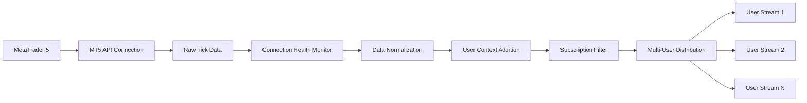
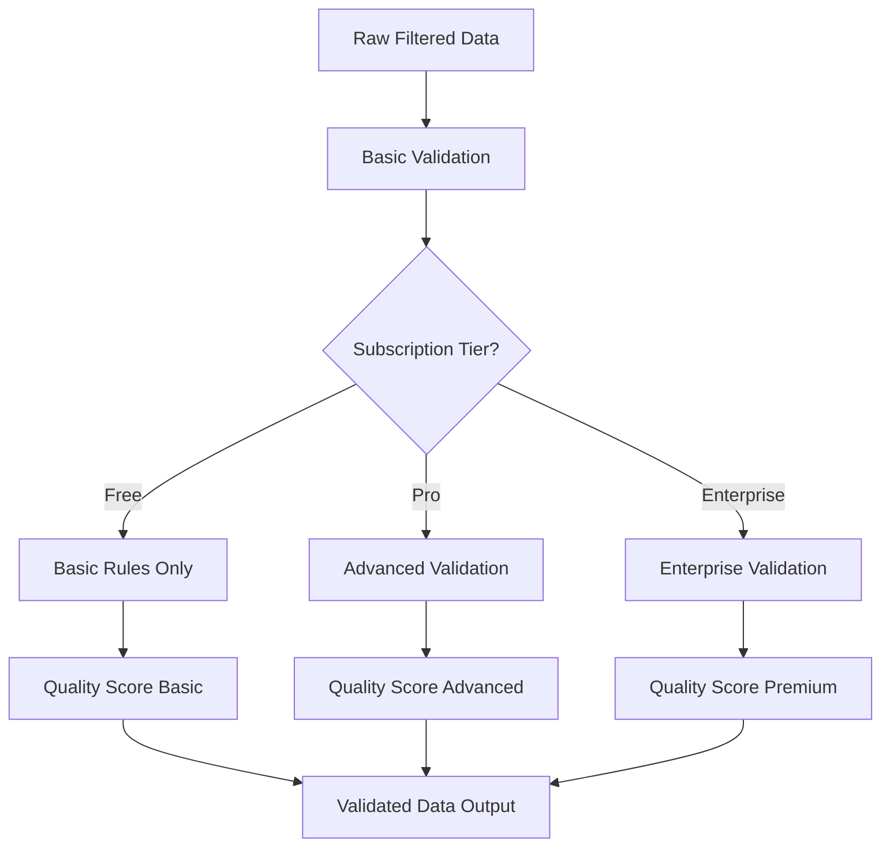
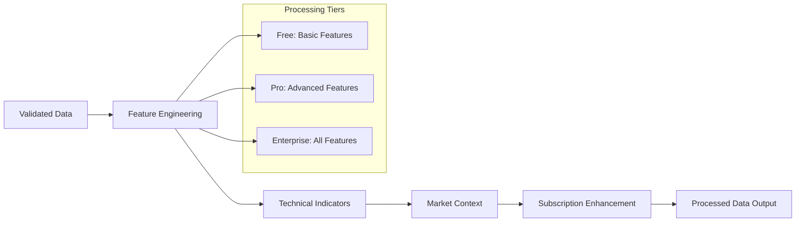
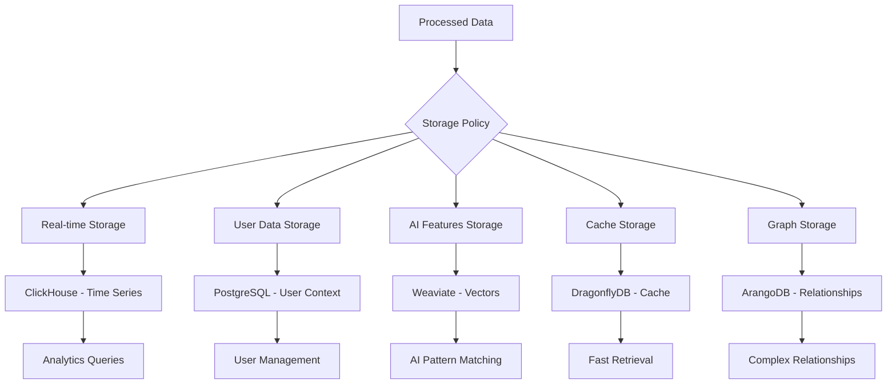

# Data Pipeline Flow (Level 3 Detail dari Plan2)

## 📊 Complete Data Flow Architecture

### **Data Pipeline Overview** (dari Plan2):
```yaml
Data_Flow_Performance_Targets:
  Current_Baseline: "18+ ticks/second dari ai_trading heritage"
  Business_Target: "50+ ticks/second (178% improvement)"
  Latency_Target: "<10ms data processing"
  Availability_Target: "99.99% (business-grade enhancement)"

Multi_Tenant_Data_Processing:
  User_Isolation: "Per-user data streams dengan tenant context"
  Subscription_Filtering: "Data access berdasarkan subscription tier"
  Usage_Tracking: "Real-time usage monitoring untuk billing"
  Quality_Assurance: "Tier-based data validation levels"
```

---

## 🌉 Stage 1: MT5 Data Ingestion (Port 8001)

### **Enhanced Data Bridge Architecture**:


### **Data Ingestion Implementation**:
```python
class EnhancedDataBridge:
    def __init__(self):
        self.mt5_connector = MT5Connector()
        self.data_normalizer = DataNormalizer()
        self.subscription_filter = SubscriptionBasedFilter()
        self.user_distributor = MultiUserDataDistributor()

    async def stream_market_data(self):
        """Main data ingestion loop dengan 50+ ticks/second target"""
        while self.is_connected():
            # Get raw ticks dari MT5
            raw_ticks = await self.mt5_connector.get_ticks_batch(batch_size=100)

            # Normalize data format
            normalized_ticks = await self.data_normalizer.normalize(raw_ticks)

            # Distribute ke all active users
            await self.user_distributor.distribute_to_users(normalized_ticks)

            # Monitor performance
            await self.performance_monitor.record_batch_processing(
                tick_count=len(raw_ticks),
                processing_time=time.time() - start_time
            )
```

### **Subscription-Based Data Filtering**:
```python
class SubscriptionBasedFilter:
    def __init__(self):
        self.tier_limits = {
            'free': {
                'symbols': ['EURUSD', 'GBPUSD', 'USDJPY', 'EURGBP', 'AUDUSD'],
                'update_frequency': 1000,  # 1 second
                'data_quality': 'basic'
            },
            'pro': {
                'symbols': 'major_pairs',  # 28 major pairs
                'update_frequency': 100,   # 100ms
                'data_quality': 'high'
            },
            'enterprise': {
                'symbols': 'all',
                'update_frequency': 10,    # 10ms
                'data_quality': 'premium'
            }
        }

    async def filter_for_user(self, ticks: List[Tick], user_context: UserContext) -> List[Tick]:
        """Filter data berdasarkan user's subscription tier"""
        tier_config = self.tier_limits.get(user_context.subscription_tier, self.tier_limits['free'])

        # Filter symbols
        if tier_config['symbols'] != 'all':
            if isinstance(tier_config['symbols'], list):
                ticks = [tick for tick in ticks if tick.symbol in tier_config['symbols']]
            elif tier_config['symbols'] == 'major_pairs':
                ticks = [tick for tick in ticks if tick.symbol in self.get_major_pairs()]

        # Apply update frequency throttling
        ticks = await self.apply_frequency_throttling(ticks, tier_config['update_frequency'])

        # Apply data quality filtering
        ticks = await self.apply_quality_filter(ticks, tier_config['data_quality'])

        return ticks
```

---

## ✅ Stage 2: Data Validation (3.2)

### **Multi-Tier Validation Pipeline**:


### **Validation Rules Engine**:
```python
class TierBasedValidationEngine:
    def __init__(self):
        self.basic_rules = BasicValidationRules()
        self.advanced_rules = AdvancedValidationRules()
        self.enterprise_rules = EnterpriseValidationRules()

    async def validate_data(self, data: RawData, user_context: UserContext) -> ValidationResult:
        """Apply tier-appropriate validation rules"""
        validation_level = user_context.subscription_tier

        # Basic validation (all tiers)
        basic_result = await self.basic_rules.validate(data)
        if not basic_result.is_valid:
            return ValidationResult(is_valid=False, errors=basic_result.errors)

        # Advanced validation (pro+)
        if validation_level in ['pro', 'enterprise']:
            advanced_result = await self.advanced_rules.validate(data)
            if not advanced_result.is_valid:
                return ValidationResult(is_valid=False, errors=advanced_result.errors)

        # Enterprise validation (enterprise only)
        if validation_level == 'enterprise':
            enterprise_result = await self.enterprise_rules.validate(data)
            if not enterprise_result.is_valid:
                return ValidationResult(is_valid=False, errors=enterprise_result.errors)

        # Calculate quality score
        quality_score = await self.calculate_quality_score(data, validation_level)

        return ValidationResult(
            is_valid=True,
            quality_score=quality_score,
            validation_level=validation_level,
            timestamp=datetime.utcnow()
        )

class BasicValidationRules:
    async def validate(self, data: RawData) -> ValidationResult:
        """Basic validation rules untuk all tiers"""
        errors = []

        # Check for missing data
        if not data.bid or not data.ask:
            errors.append("Missing bid/ask prices")

        # Check for reasonable price ranges
        if data.bid <= 0 or data.ask <= 0:
            errors.append("Invalid price values")

        # Check spread reasonableness
        spread = data.ask - data.bid
        if spread < 0:
            errors.append("Negative spread detected")

        # Check timestamp validity
        if not self.is_valid_timestamp(data.timestamp):
            errors.append("Invalid timestamp")

        return ValidationResult(is_valid=len(errors) == 0, errors=errors)
```

---

## ⚙️ Stage 3: Data Processing (3.3)

### **Tier-Based Processing Pipeline**:


### **Feature Engineering Service**:
```python
class TierBasedFeatureEngineering:
    def __init__(self):
        self.feature_calculators = {
            'basic': BasicFeatureCalculator(),
            'advanced': AdvancedFeatureCalculator(),
            'enterprise': EnterpriseFeatureCalculator()
        }

    async def engineer_features(self, validated_data: ValidatedData, user_context: UserContext) -> ProcessedFeatures:
        """Create features berdasarkan subscription tier"""
        tier = user_context.subscription_tier
        calculator = self.get_calculator_for_tier(tier)

        # Base features untuk all tiers
        base_features = await self.calculate_base_features(validated_data)

        # Tier-specific features
        tier_features = await calculator.calculate_features(validated_data, base_features)

        # Combine features
        all_features = {**base_features, **tier_features}

        return ProcessedFeatures(
            features=all_features,
            tier=tier,
            feature_count=len(all_features),
            processing_timestamp=datetime.utcnow()
        )

    def get_calculator_for_tier(self, tier: str) -> FeatureCalculator:
        """Get appropriate feature calculator untuk tier"""
        calculator_map = {
            'free': self.feature_calculators['basic'],
            'pro': self.feature_calculators['advanced'],
            'enterprise': self.feature_calculators['enterprise']
        }
        return calculator_map.get(tier, self.feature_calculators['basic'])

class BasicFeatureCalculator:
    async def calculate_features(self, data: ValidatedData, base_features: dict) -> dict:
        """Calculate basic features untuk free tier"""
        return {
            'sma_20': await self.calculate_sma(data.prices, 20),
            'price_change': data.current_price - data.previous_price,
            'spread': data.ask - data.bid,
            'volume_avg': await self.calculate_volume_average(data.volume)
        }

class AdvancedFeatureCalculator:
    async def calculate_features(self, data: ValidatedData, base_features: dict) -> dict:
        """Calculate advanced features untuk pro tier"""
        basic_features = await BasicFeatureCalculator().calculate_features(data, base_features)

        advanced_features = {
            'ema_12': await self.calculate_ema(data.prices, 12),
            'ema_26': await self.calculate_ema(data.prices, 26),
            'rsi_14': await self.calculate_rsi(data.prices, 14),
            'macd': await self.calculate_macd(data.prices),
            'bollinger_bands': await self.calculate_bollinger_bands(data.prices),
            'volatility': await self.calculate_volatility(data.prices),
            'momentum': await self.calculate_momentum(data.prices)
        }

        return {**basic_features, **advanced_features}
```

---

## 💾 Stage 4: Storage Strategy (3.4)

### **Multi-Database Storage Flow**:


### **Storage Policy Manager**:
```python
class TierBasedStoragePolicy:
    def __init__(self):
        self.storage_policies = {
            'free': {
                'store_realtime': True,
                'retention_days': 7,
                'enable_caching': False,
                'store_ai_features': False,
                'store_relationships': False
            },
            'pro': {
                'store_realtime': True,
                'retention_days': 90,
                'enable_caching': True,
                'store_ai_features': True,
                'store_relationships': False
            },
            'enterprise': {
                'store_realtime': True,
                'retention_days': 365,
                'enable_caching': True,
                'store_ai_features': True,
                'store_relationships': True
            }
        }

    def get_storage_policy(self, subscription_tier: str) -> StoragePolicy:
        """Get storage policy berdasarkan subscription tier"""
        policy_config = self.storage_policies.get(subscription_tier, self.storage_policies['free'])
        return StoragePolicy(**policy_config)

    async def execute_storage_strategy(self, processed_data: ProcessedData, user_context: UserContext):
        """Execute storage berdasarkan policy"""
        policy = self.get_storage_policy(user_context.subscription_tier)

        storage_tasks = []

        # Real-time data storage (ClickHouse)
        if policy.store_realtime:
            storage_tasks.append(
                self.store_realtime_data(processed_data, user_context, policy.retention_days)
            )

        # User context storage (PostgreSQL)
        storage_tasks.append(
            self.store_user_data(processed_data, user_context)
        )

        # AI features storage (Weaviate)
        if policy.store_ai_features:
            storage_tasks.append(
                self.store_ai_features(processed_data, user_context)
            )

        # Cache storage (DragonflyDB)
        if policy.enable_caching:
            storage_tasks.append(
                self.cache_processed_data(processed_data, user_context)
            )

        # Relationship storage (ArangoDB)
        if policy.store_relationships:
            storage_tasks.append(
                self.store_relationships(processed_data, user_context)
            )

        # Execute all storage operations concurrently
        await asyncio.gather(*storage_tasks)
```

---

## 📈 Performance Monitoring & Optimization

### **Data Pipeline Performance Tracking**:
```python
class DataPipelineMonitor:
    def __init__(self):
        self.performance_metrics = {
            'ingestion_rate': Histogram('data_ingestion_ticks_per_second'),
            'validation_time': Histogram('data_validation_milliseconds'),
            'processing_time': Histogram('data_processing_milliseconds'),
            'storage_time': Histogram('data_storage_milliseconds'),
            'end_to_end_latency': Histogram('data_pipeline_total_milliseconds')
        }

    async def monitor_pipeline_performance(self, pipeline_stage: str, execution_time: float, data_volume: int):
        """Monitor performance for each pipeline stage"""
        # Record metrics
        self.performance_metrics[f'{pipeline_stage}_time'].observe(execution_time)

        # Check performance targets
        performance_targets = {
            'ingestion': 50,    # 50+ ticks/second
            'validation': 5,    # <5ms validation
            'processing': 10,   # <10ms processing
            'storage': 20,      # <20ms storage
            'end_to_end': 50    # <50ms total
        }

        target = performance_targets.get(pipeline_stage, 100)
        if execution_time > target:
            await self.send_performance_alert(pipeline_stage, execution_time, target)

    async def generate_performance_report(self, user_context: UserContext) -> PerformanceReport:
        """Generate performance report untuk user's data pipeline"""
        return PerformanceReport(
            user_id=user_context.user_id,
            subscription_tier=user_context.subscription_tier,
            average_ingestion_rate=await self.get_average_metric('ingestion_rate'),
            average_latency=await self.get_average_metric('end_to_end_latency'),
            data_quality_score=await self.get_data_quality_score(user_context),
            performance_grade=await self.calculate_performance_grade(user_context)
        )
```

### **Data Quality Assurance**:
```python
class DataQualityManager:
    def __init__(self):
        self.quality_thresholds = {
            'free': {'min_quality_score': 0.7, 'max_error_rate': 0.05},
            'pro': {'min_quality_score': 0.85, 'max_error_rate': 0.02},
            'enterprise': {'min_quality_score': 0.95, 'max_error_rate': 0.01}
        }

    async def assess_data_quality(self, processed_data: ProcessedData, user_context: UserContext) -> QualityAssessment:
        """Assess data quality berdasarkan tier standards"""
        thresholds = self.quality_thresholds.get(user_context.subscription_tier)

        quality_checks = {
            'completeness': await self.check_data_completeness(processed_data),
            'accuracy': await self.check_data_accuracy(processed_data),
            'consistency': await self.check_data_consistency(processed_data),
            'timeliness': await self.check_data_timeliness(processed_data)
        }

        overall_score = sum(quality_checks.values()) / len(quality_checks)

        return QualityAssessment(
            overall_score=overall_score,
            individual_scores=quality_checks,
            meets_tier_standards=overall_score >= thresholds['min_quality_score'],
            user_context=user_context
        )
```

---

## 🔄 Error Handling & Recovery

### **Data Pipeline Error Recovery**:
```python
class DataPipelineErrorHandler:
    def __init__(self):
        self.error_recovery_strategies = {
            'mt5_connection_lost': self.handle_mt5_reconnection,
            'validation_failure': self.handle_validation_error,
            'processing_timeout': self.handle_processing_timeout,
            'storage_failure': self.handle_storage_error
        }

    async def handle_pipeline_error(self, error: PipelineError, user_context: UserContext):
        """Handle errors dalam data pipeline dengan appropriate recovery"""
        error_type = self.classify_error(error)
        recovery_strategy = self.error_recovery_strategies.get(error_type)

        if recovery_strategy:
            recovery_result = await recovery_strategy(error, user_context)

            # Log error dan recovery untuk analysis
            await self.log_error_recovery(error, recovery_result, user_context)

            return recovery_result
        else:
            # Fallback ke general error handling
            return await self.handle_general_error(error, user_context)

    async def handle_mt5_reconnection(self, error: MT5ConnectionError, user_context: UserContext):
        """Handle MT5 connection errors dengan automatic reconnection"""
        max_retries = 3
        retry_delay = 5  # seconds

        for attempt in range(max_retries):
            try:
                await self.mt5_connector.reconnect()
                return RecoveryResult(success=True, message="MT5 connection restored")
            except Exception as e:
                if attempt < max_retries - 1:
                    await asyncio.sleep(retry_delay)
                    retry_delay *= 2  # Exponential backoff
                else:
                    return RecoveryResult(
                        success=False,
                        message=f"Failed to reconnect after {max_retries} attempts"
                    )
```

**Data Pipeline Status**: PLANNED - 50+ ticks/second target dengan tier-based processing
**Performance Foundation**: AI Trading 18+ ticks/second baseline dengan 178% improvement target