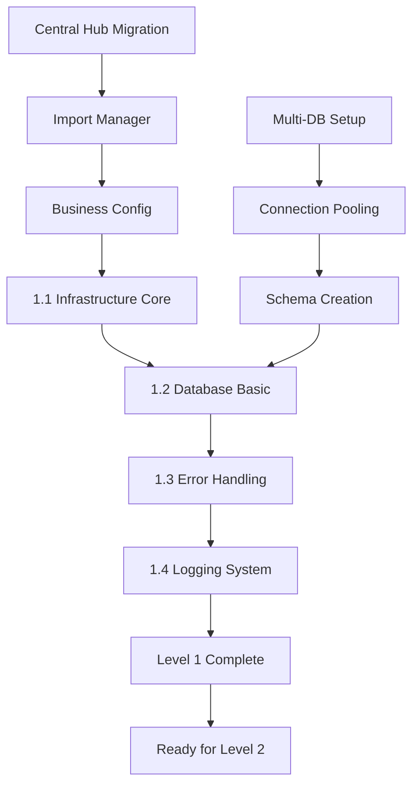
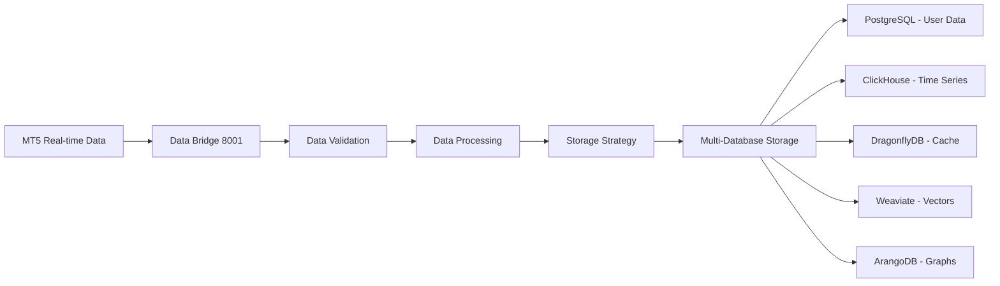
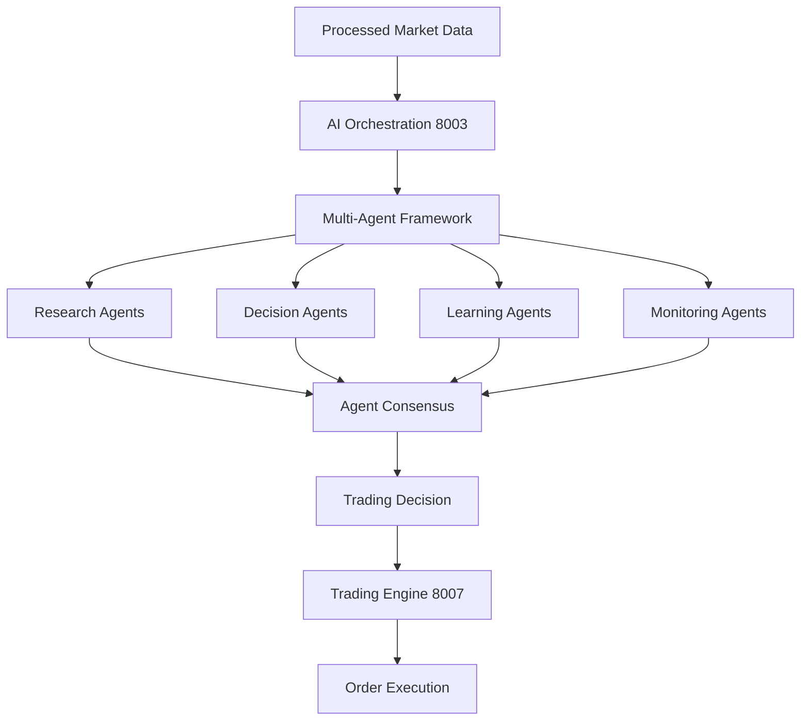

# Level Progression Flow (Berdasarkan Plan2)

## 🚀 Development Flow: Level 1 → 2 → 3 → 4 → 5

### **Implementation Strategy** (dari Plan2):
```yaml
Migration_Approach:
  Proven_Foundation_First: "Leverage ai_trading project's production-ready components"
  Business_Enhancement: "Add multi-tenant dan subscription features"
  Performance_Optimization: "Achieve target improvements (<15ms AI, 50+ ticks/second)"
  Risk_Minimization: "70% reduction dalam development risk through proven components"

Development_Phases:
  Week_1-2: "Level 1 Foundation (Infrastructure migration dan enhancement)"
  Week_3-4: "Level 2 Connectivity (Service integration dan communication)"
  Week_5-6: "Level 3 Data Flow (MT5 integration dan data pipeline)"
  Week_7-8: "Level 4 Intelligence (AI/ML components dan multi-agent framework)"
  Week_9-10: "Level 5 User Interface (Web dashboard dan desktop client)"
```

---

## 📋 LEVEL 1 - FOUNDATION (Week 1-2)

### **Day-by-Day Implementation Flow** (dari Plan2):

#### **Day 1: AI Trading Foundation Migration & Business Enhancement**
```yaml
Morning_Tasks:
  - Create new business project structure in /aitrading/business/
  - Copy Central Hub dari ai_trading project codebase
  - Adapt namespaces dari ai_trading/client_side ke business/core.infrastructure
  - Setup multi-tenant configuration management dengan business context
  - Initialize multi-agent coordination framework

Deliverables:
  - core/infrastructure/business_central_hub.py (working dengan multi-tenant support)
  - core/infrastructure/business_config_manager.py (working dengan user context)
  - Business project structure created dengan ai_trading heritage
  - Multi-agent coordination infrastructure initialized

Afternoon_Tasks:
  - Integrate ai_trading Import Manager system dengan business enhancements
  - Setup ErrorDNA advanced error handling dengan business continuity features
  - Create multi-tenant logging infrastructure dengan user isolation
  - Test integration antara ai_trading components dan business enhancements
  - Validate multi-agent communication infrastructure

Deliverables:
  - core/infrastructure/business_import_manager.py (working dengan tenant isolation)
  - core/infrastructure/business_error_handler.py (working dengan business SLA support)
  - Multi-tenant logging working dengan user context
  - Agent coordination infrastructure operational

Success_Criteria:
  - Business Central Hub dapat be imported dan instantiated dengan multi-tenant support
  - Business Import Manager dapat resolve dependencies dengan user context
  - Error handling catches dan categorizes errors dengan business impact assessment
  - Multi-agent coordination infrastructure operational
  - AI trading heritage components successfully migrated dan enhanced
```

#### **Day 2: Database Service Integration**
```yaml
Morning_Tasks:
  - Copy Database Service (Port 8008) dari existing
  - Update configuration untuk new environment
  - Setup basic connection testing
  - Verify multi-database support
  - CHAIN_MAPPING: Add basic ChainRegistry ke Central Hub

Deliverables:
  - server/database-service/ (working)
  - Multi-DB connections (PostgreSQL, ClickHouse, DragonflyDB, Weaviate, ArangoDB)
  - Basic CRUD operations working
  - ChainRegistry component initialized dalam Central Hub

Afternoon_Tasks:
  - Create database schemas untuk new project
  - Setup connection pooling
  - Test performance (should maintain 100x improvement)
  - Create health check endpoints
  - CHAIN_MAPPING: Register database chains dalam ChainRegistry

Deliverables:
  - Database schemas created
  - Connection pooling working
  - Health checks responding
  - Performance benchmarks verified
  - Database chains registered dan trackable

Success_Criteria:
  - All 5 databases (PostgreSQL, ClickHouse, DragonflyDB, Weaviate, ArangoDB) connected
  - Performance matches existing benchmarks
  - Health endpoints return 200 OK
  - Chain mapping tracks database operations
```

### **Level 1 Dependencies & Progression**:


---

## 🌐 LEVEL 2 - CONNECTIVITY (Week 3-4)

### **Service Integration Flow**:

#### **Day 4: API Gateway Configuration** (dari Plan2)
```yaml
Morning_Tasks:
  - Copy API Gateway service (Port 8000)
  - Setup basic authentication
  - Configure service routing
  - Setup CORS dan security

Deliverables:
  - server/api-gateway/ (working)
  - Basic authentication working
  - Service routing configured

Afternoon_Tasks:
  - Integrate API Gateway dengan Database Service
  - Setup health check routing
  - Test service-to-service communication
  - Configure basic rate limiting

Deliverables:
  - API Gateway integration complete
  - Health check routing working
  - Basic security measures active

Success_Criteria:
  - API Gateway successfully routes ke Database Service
  - Health checks accessible via API Gateway
  - Basic authentication working
```

### **Level 2 Service Dependencies**:
```yaml
Service_Communication_Flow:
  API_Gateway: "Entry point untuk all requests"
  Authentication: "JWT validation dan user context extraction"
  Service_Registry: "Dynamic service discovery dan health monitoring"
  Inter_Service_Communication: "Complete service coordination"

Business_Services_Integration:
  User_Management_8021: "Registration, authentication, profiles"
  Subscription_Service_8022: "Billing, usage tracking, tier management"
  Payment_Gateway_8023: "Midtrans integration + Indonesian payments"
  Notification_Service_8024: "Multi-user Telegram bot management"
  Billing_Service_8025: "Invoice generation + payment processing"
```

---

## 📊 LEVEL 3 - DATA FLOW (Week 5-6)

### **Data Pipeline Progression**:

#### **Day 3: Data Bridge Setup + Basic Chain Registry** (dari Plan2)
```yaml
Morning_Tasks:
  - Copy Data Bridge service (Port 8001)
  - Setup MT5 WebSocket integration
  - Configure data streaming pipeline
  - Test basic connectivity
  - CHAIN_MAPPING: Add basic ChainRegistry ke Central Hub

Deliverables:
  - server/data-bridge/ (working)
  - MT5 WebSocket connection
  - Basic data streaming
  - ChainRegistry component initialized dalam Central Hub

Afternoon_Tasks:
  - Integrate Data Bridge dengan Database Service
  - Setup data persistence pipeline
  - Test data flow end-to-end
  - Validate 18 ticks/second performance
  - CHAIN_MAPPING: Register data flow chain dalam ChainRegistry

Deliverables:
  - Data Bridge → Database integration
  - Data persistence working
  - Performance benchmarks met (18 ticks/second baseline)
  - Data flow chain registered dan trackable

Success_Criteria:
  - MT5 data successfully stored dalam database
  - Performance meets 18 ticks/second benchmark (targeting 50+)
  - No data loss during streaming
  - Chain mapping tracks data flow dari MT5 ke Database
```

### **Level 3 Data Flow Pipeline**:


---

## 🤖 LEVEL 4 - INTELLIGENCE (Week 7-8)

### **AI/ML Components Integration**:

#### **Multi-Agent Framework Deployment**:
```yaml
AI_Services_Integration:
  AI_Orchestration_8003: "Multi-model orchestrator dengan ensemble methods"
  Deep_Learning_8004: "Neural networks dan advanced AI processing"
  AI_Provider_8005: "External AI services integration dengan cost optimization"
  ML_Processing_8006: "Traditional machine learning + Database coordination"
  Trading_Engine_8007: "Core trading logic dengan multi-user isolation"

Multi_Agent_Coordination:
  Research_Agents: "Market analysis, news sentiment, technical indicators, fundamental analysis"
  Decision_Agents: "Strategy formulation, risk assessment, portfolio optimization, execution timing"
  Learning_Agents: "Performance analysis, model improvement, adaptation, knowledge synthesis"
  Monitoring_Agents: "System health, compliance, user experience, business intelligence"

Performance_Targets:
  AI_Decision_Making: "<15ms (85% improvement dari ai_trading baseline)"
  Multi_Agent_Consensus: "<25ms coordination latency"
  Neural_Processing: "Real-time inference dengan <50ms latency"
  ML_Feature_Engineering: "<100ms untuk complex feature sets"
```

### **Level 4 Intelligence Flow**:


---

## 🖥️ LEVEL 5 - USER INTERFACE (Week 9-10)

### **Frontend Development Priority**:

#### **Priority 1: Premium Web Dashboard**
```yaml
Technology_Stack:
  Frontend: "React 18+ dengan TypeScript"
  Styling: "Tailwind CSS untuk rapid development"
  State_Management: "Redux Toolkit untuk complex state"
  Real_time: "WebSocket integration untuk live data"
  Charts: "TradingView Charting Library untuk professional charts"

Development_Flow:
  Week_9:
    Day_1-2: "Dashboard layout dan navigation setup"
    Day_3-4: "Real-time data integration dengan backend"
    Day_5: "Subscription tier UI implementation"

  Week_10:
    Day_1-2: "Trading interface dan chart integration"
    Day_3-4: "AI insights panel dan agent status displays"
    Day_5: "Performance optimization dan testing"

Performance_Requirements:
  Load_Time: "<200ms initial dashboard load"
  WebSocket_Updates: "<10ms untuk competitive edge"
  Chart_Rendering: "<100ms untuk TradingView integration"
  API_Response: "<50ms untuk business endpoints"
```

#### **Priority 1B: Enhanced Telegram Bot**
```yaml
AI_Trading_Heritage_Enhancement:
  Production_Base: "ai_trading Telegram bot dengan 18+ commands"
  Multi_User_Support: "Enhanced untuk multi-tenant environment"
  Agent_Integration: "Multi-agent coordination notifications"
  Subscription_Features: "Premium features berdasarkan subscription tier"

Bot_Features_By_Tier:
  Free: "10 commands/day, basic symbols, basic notifications"
  Pro: "100 commands/day, major pairs, advanced notifications"
  Enterprise: "Unlimited commands, all symbols, real-time notifications"
```

---

## 🔄 Cross-Level Integration Patterns

### **Service Dependency Mapping**:
```yaml
Level_Dependencies:
  Level_2_depends_on: ["Level 1 complete"]
  Level_3_depends_on: ["Level 1 + 2 complete"]
  Level_4_depends_on: ["Level 1 + 2 + 3 complete"]
  Level_5_depends_on: ["Level 1 + 2 + 3 + 4 complete"]

Integration_Points:
  Database_Layer: "Used by all levels 2-5"
  Core_Layer: "Foundation untuk all business logic"
  Business_Layer: "AI intelligence dan data processing"
  API_Gateway: "Entry point untuk all external communication"
  Multi_Agent_Framework: "Intelligence coordination across all levels"
```

### **Performance Progression Tracking**:
```yaml
Performance_Milestones:
  Level_1: "6s startup → 4s startup, 95% memory efficiency maintained"
  Level_2: "Service communication <50ms, API routing <10ms"
  Level_3: "18 ticks/second → 50+ ticks/second data processing"
  Level_4: "<15ms AI decisions, <25ms multi-agent coordination"
  Level_5: "<200ms dashboard load, <10ms WebSocket updates"

Business_Metrics_Progression:
  Level_1: "Infrastructure ready untuk multi-tenant"
  Level_2: "Subscription services operational"
  Level_3: "Usage tracking dan billing preparation"
  Level_4: "AI features differentiated by subscription tier"
  Level_5: "Complete user experience dengan tier-based access"
```

---

## 🎯 Success Criteria Per Level

### **Go/No-Go Decision Points** (dari Plan2):
```yaml
Level_1_Success_Criteria:
  - Business Central Hub dapat be imported dan instantiated dengan multi-tenant support
  - All 5 databases connected dan performance benchmarks met
  - Error handling catches dan categorizes errors dengan business impact
  - Multi-agent coordination infrastructure operational

Level_2_Success_Criteria:
  - API Gateway successfully routes ke all services
  - Authentication working dengan subscription context
  - Business services (8021-8025) operational
  - Service discovery dan health monitoring active

Level_3_Success_Criteria:
  - MT5 data successfully flowing ke database
  - Performance meets 18+ ticks/second (targeting 50+)
  - Data validation dan processing working
  - Multi-database storage strategy operational

Level_4_Success_Criteria:
  - AI decisions generated dalam <15ms
  - Multi-agent coordination working
  - All AI services (8003-8007) operational
  - Trading engine executing orders successfully

Level_5_Success_Criteria:
  - Web dashboard loading dalam <200ms
  - Real-time updates working via WebSocket
  - Subscription tier UI differentiation working
  - Telegram bot enhanced dengan agent features
```

**Level Progression Status**: PLANNED - Sequential development dengan AI Trading heritage foundation
**Risk Mitigation**: 70% reduction dalam development risk through proven component reuse