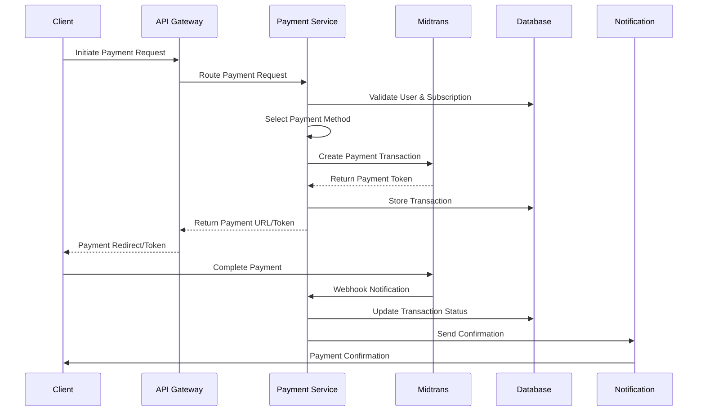
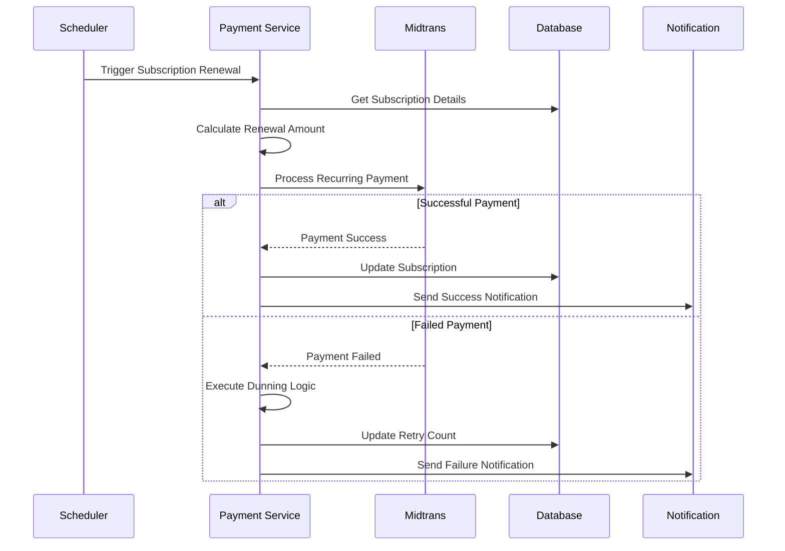

# Unified Midtrans Payment Gateway Architecture

## Executive Summary

This document outlines a comprehensive architecture for implementing a unified Midtrans payment gateway that consolidates all payment processing through a single API integration. The solution replaces multiple payment APIs with one cohesive system supporting Indonesian banking, e-wallets, subscriptions, and compliance requirements.

## Architecture Overview

### Core Design Principles
1. **Single Integration Point**: All payments route through one unified Midtrans service
2. **Payment Method Abstraction**: Consistent interface regardless of underlying payment method
3. **Subscription-First Design**: Built for recurring trading platform subscriptions
4. **Real-time Tracking**: Complete transaction lifecycle monitoring
5. **Compliance Built-in**: PCI DSS and Indonesian financial regulations
6. **Microservices Compatible**: Seamless integration with existing backend services

## System Architecture

### High-Level Component Diagram

```
┌─────────────────────────────────────────────────────────────────┐
│                    Frontend Applications                        │
│  ┌─────────────┐  ┌─────────────┐  ┌─────────────────────────┐ │
│  │ Web Portal  │  │ Mobile App  │  │ Enterprise Dashboard    │ │
│  └─────────────┘  └─────────────┘  └─────────────────────────┘ │
└─────────────────────────────────────────────────────────────────┘
                              │
                              ▼
┌─────────────────────────────────────────────────────────────────┐
│                      API Gateway                                │
│           ┌─────────────────────────────────────┐              │
│           │     Payment Gateway Router          │              │
│           │   - Authentication & Authorization  │              │
│           │   - Rate Limiting & Security        │              │
│           │   - Request Routing                 │              │
│           └─────────────────────────────────────┘              │
└─────────────────────────────────────────────────────────────────┘
                              │
                              ▼
┌─────────────────────────────────────────────────────────────────┐
│                 Unified Payment Service                         │
│  ┌─────────────────────────────────────────────────────────────┐ │
│  │              Payment Orchestrator                           │ │
│  │  ┌─────────────┐ ┌─────────────┐ ┌─────────────────────┐   │ │
│  │  │ Subscription│ │ Transaction │ │ Payment Method      │   │ │
│  │  │ Manager     │ │ Coordinator │ │ Abstraction Layer   │   │ │
│  │  └─────────────┘ └─────────────┘ └─────────────────────┘   │ │
│  └─────────────────────────────────────────────────────────────┘ │
│  ┌─────────────────────────────────────────────────────────────┐ │
│  │              Midtrans Integration Core                      │ │
│  │  ┌─────────────┐ ┌─────────────┐ ┌─────────────────────┐   │ │
│  │  │ Payment API │ │ Webhook     │ │ Security & Crypto   │   │ │
│  │  │ Client      │ │ Handler     │ │ Manager             │   │ │
│  │  └─────────────┘ └─────────────┘ └─────────────────────┘   │ │
│  └─────────────────────────────────────────────────────────────┘ │
└─────────────────────────────────────────────────────────────────┘
                              │
                              ▼
┌─────────────────────────────────────────────────────────────────┐
│                    Midtrans Platform                            │
│  ┌─────────────┐ ┌─────────────┐ ┌─────────────┐ ┌───────────┐ │
│  │ Credit Card │ │ Bank        │ │ E-Wallets   │ │ Virtual   │ │
│  │ Processing  │ │ Transfer    │ │ (OVO, GoPay,│ │ Account   │ │
│  │             │ │ (VA)        │ │ DANA, etc.) │ │           │ │
│  └─────────────┘ └─────────────┘ └─────────────┘ └───────────┘ │
└─────────────────────────────────────────────────────────────────┘
```

## Core Components

### 1. Payment Orchestrator

**Responsibilities:**
- Central coordination of all payment operations
- Business logic enforcement
- Payment flow management
- Error handling and recovery

**Key Features:**
- Payment method selection logic
- Automatic retry mechanisms
- Fraud detection integration
- Multi-currency support (IDR primary)

### 2. Subscription Manager

**Responsibilities:**
- Recurring payment processing
- Subscription lifecycle management
- Billing cycle coordination
- Pro-ration calculations

**Key Features:**
- Automated renewal processing
- Dunning management for failed payments
- Subscription upgrade/downgrade handling
- Grace period management

### 3. Transaction Coordinator

**Responsibilities:**
- Transaction state management
- Payment tracking and reconciliation
- Audit trail maintenance
- Reporting and analytics

**Key Features:**
- Real-time transaction status updates
- Comprehensive transaction logging
- Automatic reconciliation
- Financial reporting

### 4. Payment Method Abstraction Layer

**Responsibilities:**
- Uniform interface for all payment methods
- Payment method availability checking
- Dynamic routing based on user preference
- Fallback mechanism implementation

**Supported Payment Methods:**
- Credit/Debit Cards (Visa, Mastercard, JCB)
- Bank Transfer (BCA, Mandiri, BNI, BRI, CIMB)
- E-Wallets (OVO, GoPay, DANA, LinkAja, ShopeePay)
- Virtual Account
- Convenience Store (Alfamart, Indomaret)

## Service Integration Architecture

### Existing Services Integration

```
┌─────────────────────────────────────────────────────────────────┐
│                  Unified Payment Service                        │
└─────────────┬───────────────────────────────────────────────────┘
              │
              ▼
┌─────────────────────────────────────────────────────────────────┐
│                 Service Integration Layer                       │
│                                                                 │
│  ┌─────────────┐    ┌─────────────┐    ┌─────────────────┐     │
│  │ API Gateway │◄──►│ Central Hub │◄──►│ Database Service│     │
│  │ Integration │    │ Integration │    │ Integration     │     │
│  └─────────────┘    └─────────────┘    └─────────────────┘     │
│                                                                 │
│  ┌─────────────┐    ┌─────────────┐    ┌─────────────────┐     │
│  │ Billing     │◄──►│ Notification│◄──►│ Configuration   │     │
│  │ Service     │    │ Service     │    │ Service         │     │
│  └─────────────┘    └─────────────┘    └─────────────────┘     │
└─────────────────────────────────────────────────────────────────┘
```

### Integration Points

1. **API Gateway Integration**
   - Payment route registration
   - Authentication middleware
   - Rate limiting for payment endpoints

2. **Database Service Integration**
   - Transaction storage
   - User subscription data
   - Payment method preferences

3. **Billing Service Integration**
   - Invoice generation
   - Revenue recognition
   - Tax calculation

4. **Notification Service Integration**
   - Payment confirmations
   - Subscription reminders
   - Failed payment alerts

5. **Configuration Service Integration**
   - Payment gateway settings
   - Feature flags
   - Regional configurations

## Data Flow Architecture

### Payment Processing Flow



### Subscription Management Flow



## Security & Compliance Framework

### PCI DSS Compliance

1. **Data Protection**
   - No storage of sensitive card data
   - Tokenization through Midtrans
   - Encrypted data transmission (TLS 1.3)

2. **Access Control**
   - Role-based access to payment functions
   - API key rotation
   - Audit logging

3. **Network Security**
   - Firewall protection
   - VPN for admin access
   - IP whitelisting for webhooks

### Indonesian Financial Regulations

1. **Bank Indonesia Compliance**
   - Local bank integration requirements
   - Transaction reporting standards
   - AML/KYC compliance

2. **OJK Regulations**
   - Consumer protection measures
   - Dispute resolution procedures
   - Data privacy compliance

3. **Tax Compliance**
   - VAT calculation and reporting
   - Withholding tax for B2B transactions
   - Digital service tax

## API Design

### Core Payment Endpoints

```javascript
// Create Payment
POST /api/v1/payments
{
  "amount": 99000,
  "currency": "IDR",
  "paymentMethod": "credit_card",
  "subscriptionId": "sub_123",
  "metadata": {
    "orderId": "order_456",
    "customerId": "cust_789"
  }
}

// Get Payment Status
GET /api/v1/payments/{paymentId}

// Process Refund
POST /api/v1/payments/{paymentId}/refund
{
  "amount": 50000,
  "reason": "partial_refund"
}

// List Payment Methods
GET /api/v1/payment-methods
{
  "country": "ID",
  "amount": 99000
}
```

### Subscription Management Endpoints

```javascript
// Create Subscription
POST /api/v1/subscriptions
{
  "planId": "premium_monthly",
  "paymentMethod": "auto_debit",
  "customerId": "cust_789"
}

// Update Subscription
PUT /api/v1/subscriptions/{subscriptionId}
{
  "planId": "enterprise_monthly",
  "effectiveDate": "2024-10-01"
}

// Cancel Subscription
DELETE /api/v1/subscriptions/{subscriptionId}
{
  "effectiveDate": "2024-10-31",
  "reason": "customer_request"
}
```

### Webhook Endpoints

```javascript
// Midtrans Webhook Handler
POST /api/v1/webhooks/midtrans
{
  "transaction_time": "2024-09-22 10:30:00",
  "transaction_status": "settlement",
  "transaction_id": "trans_123",
  "order_id": "order_456",
  "gross_amount": "99000.00",
  "payment_type": "credit_card"
}
```

## Error Handling & Retry Strategy

### Error Categories

1. **Temporary Errors** (Retry Eligible)
   - Network timeouts
   - Server unavailable (503)
   - Rate limiting (429)

2. **Permanent Errors** (No Retry)
   - Invalid credentials (401)
   - Insufficient funds
   - Invalid payment method

3. **Business Logic Errors**
   - Subscription already exists
   - Payment amount mismatch
   - Expired payment token

### Retry Strategy

```javascript
const retryStrategy = {
  maxRetries: 3,
  backoffStrategy: 'exponential',
  baseDelay: 1000, // 1 second
  maxDelay: 30000, // 30 seconds
  jitter: true
};

// Retry scenarios
const retryableErrors = [
  'NETWORK_TIMEOUT',
  'SERVICE_UNAVAILABLE',
  'RATE_LIMITED',
  'TEMPORARY_FAILURE'
];
```

## Monitoring & Observability

### Key Metrics

1. **Payment Success Rate**
   - Overall success rate by payment method
   - Success rate by time period
   - Failure reason categorization

2. **Transaction Volume**
   - Daily/Monthly transaction volume
   - Revenue metrics
   - Geographic distribution

3. **Performance Metrics**
   - API response times
   - Webhook processing latency
   - Error rates by endpoint

4. **Business Metrics**
   - Subscription churn rate
   - Average revenue per user (ARPU)
   - Payment method adoption

### Alerting Strategy

```javascript
const alerts = {
  paymentSuccessRate: {
    threshold: 95,
    period: '5m',
    action: 'immediate_alert'
  },

  apiResponseTime: {
    threshold: 5000, // 5 seconds
    period: '1m',
    action: 'escalation_alert'
  },

  webhookFailures: {
    threshold: 10,
    period: '5m',
    action: 'investigation_alert'
  }
};
```

## Deployment Strategy

### Infrastructure Requirements

1. **Container Orchestration**
   - Kubernetes deployment
   - Auto-scaling capabilities
   - Load balancing

2. **Database Requirements**
   - PostgreSQL for transactional data
   - Redis for caching and sessions
   - Backup and disaster recovery

3. **Security Infrastructure**
   - SSL/TLS termination
   - WAF protection
   - API gateway security

### Deployment Pipeline

```yaml
stages:
  - security_scan
  - unit_tests
  - integration_tests
  - staging_deployment
  - performance_tests
  - production_deployment
  - monitoring_verification
```

## Cost Optimization

### Midtrans Pricing Optimization

1. **Transaction Fee Management**
   - Dynamic payment method selection
   - Volume-based rate negotiation
   - Cost analysis per payment method

2. **Infrastructure Efficiency**
   - Auto-scaling based on demand
   - Caching strategies
   - Database query optimization

## Migration Strategy

### Phase 1: Infrastructure Setup (Week 1-2)
- Deploy payment service infrastructure
- Set up Midtrans integration
- Configure monitoring and alerting

### Phase 2: Core Payment Processing (Week 3-4)
- Implement basic payment flows
- Add webhook handling
- Integrate with existing services

### Phase 3: Subscription Management (Week 5-6)
- Implement recurring payments
- Add subscription lifecycle management
- Migration of existing subscriptions

### Phase 4: Advanced Features (Week 7-8)
- Add advanced payment methods
- Implement fraud detection
- Performance optimization

### Phase 5: Production Rollout (Week 9-10)
- Gradual traffic migration
- A/B testing with existing system
- Full production deployment

## Risk Mitigation

### Technical Risks

1. **Payment Processing Failures**
   - Mitigation: Robust retry mechanisms and fallback payment methods

2. **Webhook Reliability**
   - Mitigation: Idempotent webhook processing and manual reconciliation tools

3. **Security Vulnerabilities**
   - Mitigation: Regular security audits and penetration testing

### Business Risks

1. **Payment Method Unavailability**
   - Mitigation: Multiple payment method options and real-time availability checking

2. **Regulatory Changes**
   - Mitigation: Modular architecture allowing quick adaptation to regulation changes

3. **Vendor Lock-in**
   - Mitigation: Abstraction layer allowing future payment provider changes

## Success Metrics

### Technical KPIs
- 99.9% payment service uptime
- <2 second average payment processing time
- 98%+ webhook delivery success rate

### Business KPIs
- 95%+ payment success rate
- 20% reduction in payment processing costs
- 50% reduction in integration complexity

This architecture provides a comprehensive, scalable, and compliant solution for unifying all payment processing through Midtrans while maintaining the flexibility to adapt to future requirements and regulations.