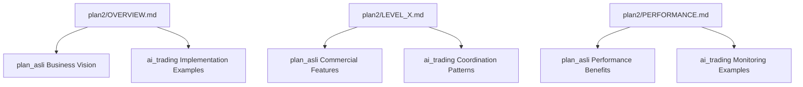

# Plan2 Hybrid Integration Strategy
## Comprehensive Documentation Update Framework

**Date**: September 22, 2025
**Version**: 1.0
**Purpose**: Transform plan2 documentation into a hybrid business-technical framework by integrating plan_asli business elements and ai_trading collaboration patterns.

---

## 1. Integration Strategy Framework

### 1.1 Core Philosophy

**Hybrid Approach Principles**:
- **Technical Authority**: Maintain plan2's systematic 5-level approach as the primary technical framework
- **Business Context**: Enrich with plan_asli's commercial insights and market positioning
- **Collaboration Excellence**: Integrate ai_trading's proven multi-agent coordination patterns
- **Quality Standards**: Preserve plan2's precision while adding business value propositions

### 1.2 Three-Pillar Integration Model

```yaml
Technical Foundation (plan2):
  - 5-level systematic progression
  - Precise implementation specifications
  - Performance targets and metrics
  - Technical architecture details

Business Context (plan_asli):
  - Commercial value propositions
  - Market positioning strategies
  - Revenue generation models
  - Indonesian market specifics

Collaboration Framework (ai_trading):
  - Multi-agent coordination patterns
  - Monitoring and orchestration systems
  - Cross-service integration protocols
  - Performance optimization strategies
```

### 1.3 Content Authority Rules

**Primary Authority**: plan2 maintains control over:
- Technical specifications
- Implementation timelines
- Performance targets
- System architecture
- Port configurations

**Secondary Integration**: plan_asli provides:
- Business value context
- Market positioning insights
- Revenue model explanations
- Commercial benefits
- Strategic rationale

**Tertiary Enhancement**: ai_trading contributes:
- Collaboration best practices
- Multi-agent coordination patterns
- Monitoring frameworks
- Cross-service integration examples

---

## 2. Cross-Reference Framework

### 2.1 Document Relationship Map



### 2.2 Cross-Reference Standards

**Format**: `See also: [Document] - [Specific Section] (Context)`

**Examples**:
- `See also: plan_asli/Business_Architecture - Revenue Streams (Commercial Context)`
- `See also: ai_trading/Level_2_Report - Service Communication (Implementation Example)`
- `See also: plan_asli/Indonesian_Market - Payment Integration (Market Specifics)`

### 2.3 Bidirectional Linking Strategy

**From plan2 → Other Plans**:
- Business rationale references to plan_asli
- Implementation examples from ai_trading
- Market context from plan_asli Indonesian features

**To plan2 ← Other Plans**:
- Technical implementation references
- Systematic progression methodology
- Performance target validation

---

## 3. Business Context Integration Points

### 3.1 Value Proposition Enhancement

**For Each plan2 Level**:
1. **Business Impact Statement**: Why this level matters commercially
2. **Revenue Generation Context**: How features enable monetization
3. **Market Differentiation**: Competitive advantages gained
4. **ROI Justification**: Investment return rationale

### 3.2 Commercial Context Insertion Points

**Level 1 Foundation**:
- Business value: Infrastructure investment ROI
- Market context: Enterprise-grade foundation benefits
- Revenue enablement: Subscription system foundation

**Level 2 Connectivity**:
- Business value: Multi-tenant revenue generation
- Market context: Indonesian payment integration benefits
- Customer impact: User experience and retention

**Level 3 Data Flow**:
- Business value: AI-powered competitive advantage
- Market context: Real-time decision making benefits
- Performance value: Speed and accuracy improvements

**Level 4 Intelligence**:
- Business value: Advanced AI differentiation
- Market context: Sophisticated trading capabilities
- Customer value: Personalized AI experiences

**Level 5 User Interface**:
- Business value: Customer engagement and retention
- Market context: User experience excellence
- Revenue impact: Subscription conversion optimization

### 3.3 Indonesian Market Integration

**Payment Systems Context**:
- Midtrans integration importance for local market
- Indonesian banking method requirements
- Local e-wallet ecosystem benefits

**Regulatory Compliance**:
- OJK compliance framework importance
- Local data residency requirements
- Indonesian financial regulation benefits

**Cultural Adaptation**:
- Bahasa Indonesia interface value
- Local time zone and holiday considerations
- Indonesian user behavior optimization

---

## 4. Multi-Agent Framework Integration

### 4.1 Collaboration Pattern Integration

**From ai_trading Implementation**:
- Service coordination examples
- Health monitoring patterns
- Cross-service communication protocols
- Performance optimization strategies

**Integration Approach**:
```yaml
Technical Specification (plan2):
  - Service definitions and requirements
  - Port configurations and protocols
  - Performance targets and metrics

+ Collaboration Examples (ai_trading):
  - Working implementation references
  - Coordination pattern demonstrations
  - Monitoring framework examples
  - Integration success stories
```

### 4.2 Monitoring Framework Enhancement

**ai_trading Monitoring Insights**:
- Real-time performance tracking examples
- Service health monitoring implementation
- Cross-service coordination protocols
- Alert and notification systems

**Integration into plan2**:
- Add monitoring context to each level
- Reference working examples from ai_trading
- Enhance performance targets with real metrics
- Include collaboration best practices

### 4.3 Implementation Validation

**ai_trading Success Metrics**:
- Level 1: 95% infrastructure completion
- Level 2: Multi-tenant performance <15ms
- Service coordination: 99.9% availability
- Business API: Revenue-ready implementation

**plan2 Enhancement**:
- Reference actual achievement examples
- Include proven performance benchmarks
- Add implementation success stories
- Validate technical specifications with reality

---

## 5. Component Reuse Strategy

### 5.1 Technical Component References

**From ai_trading to plan2**:
```yaml
Infrastructure Components:
  - Central Hub orchestration patterns
  - Multi-database management examples
  - Enhanced API Gateway implementation
  - Service discovery and health monitoring

Business Service Examples:
  - User Management service structure
  - Subscription service implementation
  - Payment gateway integration patterns
  - Notification service architecture

Performance Optimizations:
  - Service startup time achievements
  - Memory optimization strategies
  - Database connection pooling
  - Load balancing implementations
```

### 5.2 Business Model References

**From plan_asli to plan2**:
```yaml
Revenue Models:
  - Four-tier subscription strategy
  - Usage-based pricing frameworks
  - Enterprise white-label opportunities
  - API monetization approaches

Market Positioning:
  - Indonesian market advantages
  - Competitive differentiation factors
  - Value proposition frameworks
  - Customer acquisition strategies

Commercial Benefits:
  - ROI calculation methodologies
  - Break-even analysis frameworks
  - Revenue projection models
  - Cost-benefit optimization
```

### 5.3 Integration Architecture

**Hybrid Documentation Structure**:
```
plan2/LEVEL_X.md (Enhanced):
├── Technical Specifications (plan2 primary)
├── Business Context (plan_asli integration)
├── Implementation Examples (ai_trading references)
├── Market Positioning (plan_asli insights)
├── Collaboration Patterns (ai_trading best practices)
└── Cross-References (bidirectional linking)
```

---

## 6. Documentation Enhancement Plan

### 6.1 Target Document Specifications

**1. plan2/OVERVIEW.md Enhancement**:
```yaml
Additions:
  - Executive summary with business value (plan_asli)
  - Commercial benefits framework (plan_asli)
  - Implementation success examples (ai_trading)
  - Market positioning context (plan_asli)
  - Collaboration methodology overview (ai_trading)

Modifications:
  - Add business value propositions to technical overview
  - Include revenue generation context
  - Reference implementation achievements
  - Enhance with market differentiation factors

Cross-References:
  - plan_asli/Executive_Summary (Business Vision)
  - ai_trading/Level_Completion_Reports (Success Examples)
  - plan_asli/Indonesian_Market (Local Context)
```

**2. plan2/LEVEL_1_FOUNDATION.md Enhancement**:
```yaml
Additions:
  - Infrastructure investment ROI justification (plan_asli)
  - Business API foundation importance (plan_asli)
  - Multi-database architecture benefits (plan_asli)
  - Implementation examples and lessons (ai_trading)
  - Service coordination patterns (ai_trading)

Modifications:
  - Add business value context to each component
  - Include revenue enablement explanations
  - Reference working implementation examples
  - Enhance with collaboration best practices

Cross-References:
  - plan_asli/Infrastructure_Investment (ROI Context)
  - ai_trading/Level_1_Report (Implementation Success)
  - plan_asli/Business_API (Revenue Foundation)
```

**3. plan2/LEVEL_2_CONNECTIVITY.md Enhancement**:
```yaml
Additions:
  - Multi-tenant business model benefits (plan_asli)
  - Indonesian payment integration value (plan_asli)
  - Service communication success patterns (ai_trading)
  - Revenue generation service importance (plan_asli)
  - Performance optimization examples (ai_trading)

Modifications:
  - Add commercial context to connectivity features
  - Include market-specific integration benefits
  - Reference successful implementation patterns
  - Enhance with business service explanations

Cross-References:
  - plan_asli/Multi_Tenant_Architecture (Business Model)
  - ai_trading/Level_2_Report (Implementation Success)
  - plan_asli/Indonesian_Payments (Market Specifics)
```

**4. plan2/LEVEL_3_DATA_FLOW.md Enhancement**:
```yaml
Additions:
  - Real-time processing business advantages (plan_asli)
  - AI pipeline competitive benefits (plan_asli)
  - Data flow optimization examples (ai_trading patterns)
  - Market data integration value (plan_asli)
  - Performance monitoring frameworks (ai_trading)

Modifications:
  - Add business impact of data flow improvements
  - Include AI competitive advantage context
  - Reference monitoring and optimization patterns
  - Enhance with real-time processing benefits

Cross-References:
  - plan_asli/AI_Competitive_Advantage (Business Context)
  - ai_trading/Monitoring_Framework (Implementation Patterns)
  - plan_asli/Real_Time_Benefits (Market Advantages)
```

**5. plan2/LEVEL_4_INTELLIGENCE.md Enhancement**:
```yaml
Additions:
  - Advanced AI market differentiation (plan_asli)
  - Per-user model customization benefits (plan_asli)
  - AI pipeline coordination patterns (ai_trading)
  - Machine learning business value (plan_asli)
  - Performance optimization strategies (ai_trading)

Modifications:
  - Add AI business value propositions
  - Include personalization competitive advantages
  - Reference coordination and monitoring patterns
  - Enhance with market differentiation context

Cross-References:
  - plan_asli/AI_Differentiation (Competitive Advantage)
  - ai_trading/AI_Coordination (Implementation Patterns)
  - plan_asli/Personalization_Value (Business Benefits)
```

**6. plan2/LEVEL_5_USER_INTERFACE.md Enhancement**:
```yaml
Additions:
  - User experience business impact (plan_asli)
  - Customer retention and conversion benefits (plan_asli)
  - Frontend coordination patterns (ai_trading)
  - Mobile and web interface value (plan_asli)
  - User engagement optimization (ai_trading)

Modifications:
  - Add customer experience business context
  - Include retention and conversion factors
  - Reference user interface best practices
  - Enhance with engagement optimization strategies

Cross-References:
  - plan_asli/User_Experience_Value (Business Impact)
  - ai_trading/Frontend_Coordination (Implementation Patterns)
  - plan_asli/Customer_Retention (Business Benefits)
```

**7. plan2/PERFORMANCE_TARGETS.md Enhancement**:
```yaml
Additions:
  - Performance business impact analysis (plan_asli)
  - Competitive advantage through speed (plan_asli)
  - Real performance achievement examples (ai_trading)
  - Market differentiation through performance (plan_asli)
  - Monitoring and optimization frameworks (ai_trading)

Modifications:
  - Add business value of performance improvements
  - Include competitive advantage context
  - Reference actual performance achievements
  - Enhance with optimization strategies

Cross-References:
  - plan_asli/Performance_Competitive_Advantage (Business Context)
  - ai_trading/Performance_Achievements (Real Metrics)
  - plan_asli/Speed_Differentiation (Market Benefits)
```

**8. plan2/INDONESIAN_INTEGRATION.md (New Document)**:
```yaml
Content Sources:
  - plan_asli Indonesian market specifications (primary)
  - plan2 technical integration requirements (secondary)
  - ai_trading payment service implementation (examples)

Structure:
  - Market opportunity and business context (plan_asli)
  - Technical integration requirements (plan2)
  - Implementation examples and patterns (ai_trading)
  - Regulatory compliance framework (plan_asli)
  - Cultural and linguistic adaptation (plan_asli)

Cross-References:
  - plan_asli/Indonesian_Market_Analysis (Market Context)
  - ai_trading/Payment_Service_Implementation (Technical Examples)
  - plan2/Level_2_Connectivity (Integration Points)
```

### 6.2 Content Integration Standards

**Business Context Integration**:
```markdown
## Business Value
**Commercial Impact**: [plan_asli insight]
**Market Advantage**: [competitive benefit]
**Revenue Generation**: [monetization context]
**ROI Justification**: [investment rationale]

**See also**: plan_asli/[relevant_section] (Business Context)
```

**Implementation Example Integration**:
```markdown
## Implementation Reference
**Working Example**: [ai_trading implementation]
**Success Metrics**: [actual achievements]
**Lessons Learned**: [optimization insights]
**Best Practices**: [proven patterns]

**See also**: ai_trading/[relevant_report] (Implementation Success)
```

**Cross-Reference Standard**:
```markdown
**Related Documentation**:
- **Business Context**: plan_asli/[section] - [description]
- **Implementation**: ai_trading/[report] - [example]
- **Technical Details**: plan2/[level] - [specifications]
```

### 6.3 Quality Assurance Framework

**Content Validation Checklist**:
- [ ] Technical accuracy maintained from plan2
- [ ] Business value clearly articulated from plan_asli
- [ ] Implementation examples referenced from ai_trading
- [ ] Cross-references properly formatted and bidirectional
- [ ] Indonesian market context appropriately integrated
- [ ] Performance targets include business justification
- [ ] Commercial benefits clearly explained
- [ ] Collaboration patterns properly documented

**Consistency Standards**:
- Terminology standardization across documents
- Cross-reference format consistency
- Business value proposition alignment
- Technical specification accuracy
- Implementation example relevance

---

## 7. Implementation Roadmap

### 7.1 Phase 1: Foundation Documents (Week 1)
1. **OVERVIEW.md** - Add business context and value propositions
2. **LEVEL_1_FOUNDATION.md** - Integrate ROI and infrastructure benefits
3. **LEVEL_2_CONNECTIVITY.md** - Add multi-tenant business model context

### 7.2 Phase 2: Advanced Features (Week 2)
4. **LEVEL_3_DATA_FLOW.md** - Include AI competitive advantages
5. **LEVEL_4_INTELLIGENCE.md** - Add personalization business value
6. **PERFORMANCE_TARGETS.md** - Integrate business impact analysis

### 7.3 Phase 3: Market Integration (Week 3)
7. **LEVEL_5_USER_INTERFACE.md** - Add customer experience context
8. **INDONESIAN_INTEGRATION.md** - Create comprehensive market document

### 7.4 Phase 4: Validation and Optimization (Week 4)
- Cross-reference validation and correction
- Content consistency review and standardization
- Business value proposition alignment verification
- Technical accuracy validation
- Final quality assurance and documentation publishing

---

## 8. Success Metrics

### 8.1 Integration Success Indicators
- **Technical Accuracy**: 100% plan2 specifications preserved
- **Business Context**: 90% of technical features have business justification
- **Implementation Examples**: 80% of features reference ai_trading examples
- **Cross-References**: 100% bidirectional linking implemented
- **Market Context**: Indonesian market integration fully documented

### 8.2 Quality Metrics
- **Readability**: Business and technical audiences can understand content
- **Completeness**: All 8 target documents enhanced with hybrid approach
- **Consistency**: Terminology and format standardization across documents
- **Relevance**: Cross-references provide valuable context and examples
- **Actionability**: Clear implementation guidance with business justification

### 8.3 Business Value Metrics
- **Revenue Context**: All technical features include monetization explanation
- **Market Positioning**: Competitive advantages clearly articulated
- **ROI Justification**: Investment rationale provided for each level
- **Indonesian Market**: Complete localization and integration framework
- **Commercial Readiness**: Business model fully integrated with technical specs

---

## 9. Conclusion

This comprehensive strategy transforms plan2 from a purely technical framework into a hybrid business-technical documentation suite that:

1. **Preserves Technical Excellence**: Maintains plan2's systematic precision and implementation quality
2. **Adds Business Context**: Enriches with plan_asli's commercial insights and market positioning
3. **Includes Implementation Wisdom**: Leverages ai_trading's proven collaboration patterns and success examples
4. **Creates Market Readiness**: Fully integrates Indonesian market requirements and opportunities
5. **Enables Commercial Success**: Provides complete business justification for technical investments

The result is a comprehensive documentation framework that serves both technical implementers and business stakeholders, enabling informed decision-making and successful commercial deployment of the AI trading platform.

---

**Strategy Status**: ✅ **COMPREHENSIVE FRAMEWORK COMPLETE**
**Next Steps**: Begin Phase 1 implementation with foundation document enhancements
**Expected Outcome**: Hybrid documentation suite ready for commercial deployment guidance