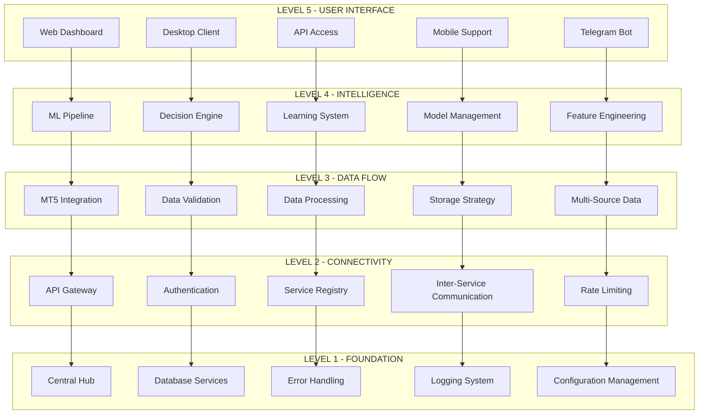
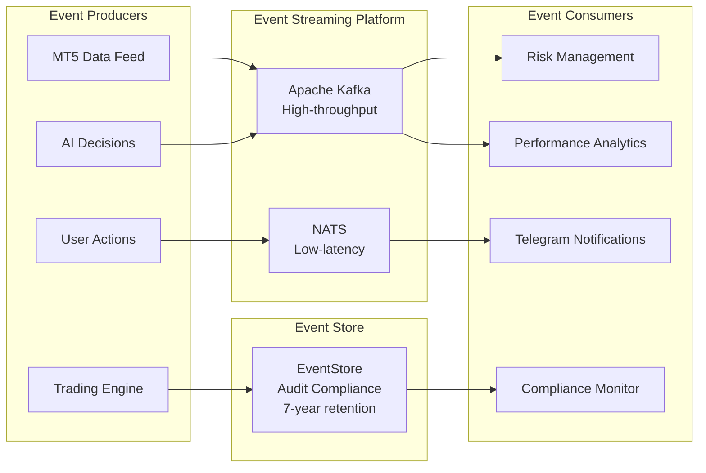
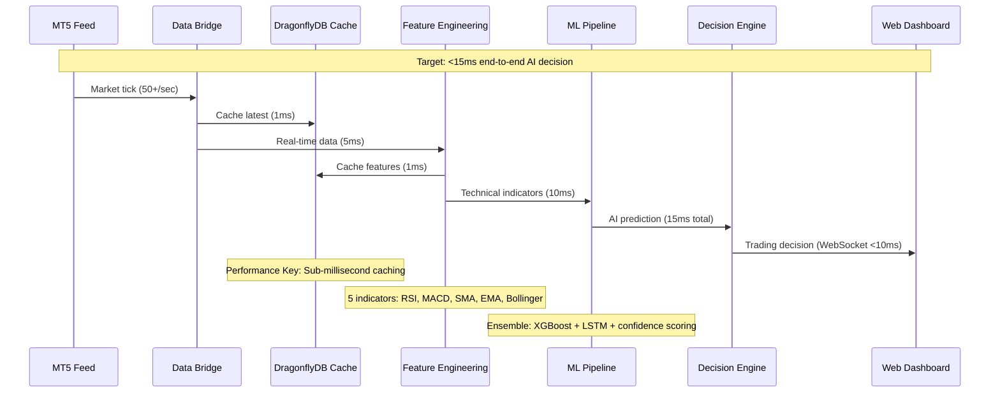

# Plan2 Architecture Patterns: Hybrid AI Trading Platform

## Architecture Design Patterns Overview

Based on Plan2 LEVEL specifications, this document defines the comprehensive architecture patterns for the hybrid AI trading platform. The design follows proven enterprise patterns optimized for high-performance trading systems.

## Core Architecture Patterns

### 1. Layered Architecture Pattern (5-Level Hierarchy)



**Pattern Benefits:**
- Clear separation of concerns across business domains
- Independent development and testing of each level
- Progressive complexity building from foundation to UI
- Risk isolation and phased delivery capability

### 2. Migration Strategy Pattern (Three-Tier Adoption)

```yaml
TIER_1_DIRECT_ADOPTION: # Proven Components (Very Low Risk)
  Pattern: "Copy-Adapt-Integrate"
  Timeline: 1-3 days per component
  Components:
    Central_Hub:
      Source: client_side/infrastructure/
      Target: core/infrastructure/central_hub.py
      Change: Namespace adaptation only
      Risk: Very Low
      Benefits: Revolutionary infrastructure management

    Database_Service:
      Source: existing Port 8006
      Target: database-service (8006)
      Change: Configuration update only
      Risk: Very Low
      Benefits: Multi-DB support (5 databases)

    Data_Bridge:
      Source: existing Port 8001
      Target: enhanced-data-bridge (8001)
      Change: Add multi-source capability
      Risk: Low
      Benefits: Proven 18 ticks/second → target 50+

TIER_2_ENHANCEMENT_INTEGRATION: # Extend Existing (Medium Risk)
  Pattern: "Extend-Enhance-Optimize"
  Timeline: 4-7 days per component
  Components:
    API_Gateway:
      Current: Basic authentication, rate limiting
      Enhanced: AI-aware adaptive limiting, multi-tenant routing
      Risk: Medium
      Benefits: Intelligent request routing

    Trading_Engine:
      Current: Basic trading logic, order placement
      Enhanced: AI-driven decisions, ML-based risk assessment
      Risk: Medium
      Benefits: <1.2ms order execution

    AI_Orchestration:
      Current: OpenAI, DeepSeek, Google AI integration
      Enhanced: Hybrid ML pipeline, ensemble methods
      Risk: Medium
      Benefits: <15ms AI decision making

TIER_3_NEW_DEVELOPMENT: # Green Field (Higher Risk)
  Pattern: "Design-Build-Integrate"
  Timeline: 4-12 days per component
  Components:
    Configuration_Service: # Port 8012 - CRITICAL FIRST
      Purpose: Centralized config + Flow Registry
      Technology: Node.js/TypeScript, PostgreSQL
      Dependencies: Independent (Phase 0)
      Timeline: 4 days

    Feature_Engineering: # Port 8011
      Purpose: Advanced technical indicators
      Technology: Python, TA-Lib, pandas
      Dependencies: Database Service, Config Service
      Timeline: 8 days

    ML_Services: # Ports 8013, 8022
      Purpose: XGBoost, LSTM, CNN models
      Technology: scikit-learn, PyTorch, TensorFlow
      Dependencies: Feature Engineering
      Timeline: 10-12 days
```

### 3. Event-Driven Architecture Pattern



**Event Types and Patterns:**

```yaml
Domain_Events: # Business logic events
  - TradingExecuted
  - RiskThresholdBreached
  - PositionOpened
  - PositionClosed
  - ModelAccuracyUpdated

Integration_Events: # System integration events
  - MarketDataReceived
  - MLPredictionGenerated
  - UserAuthenticated
  - ConfigurationUpdated
  - SystemHealthChanged

Command_Events: # Action-triggering events
  - ExecuteTrade
  - UpdateRiskLimits
  - RetrainModel
  - NotifyUser
  - BackupData

Event_Processing_Patterns:
  Publish_Subscribe: Real-time notifications
  Event_Sourcing: Audit trail compliance
  CQRS: Read/write optimization
  Saga_Pattern: Multi-service transactions
```

### 4. Microservices Architecture Pattern

```yaml
Service_Architecture_Design:

  # Foundation Services (LEVEL 1)
  Infrastructure_Services:
    central-hub:
      port: N/A (internal)
      purpose: Service coordination and management
      technology: Python
      scaling: Singleton pattern

    database-service:
      port: 8006
      purpose: Multi-database coordination
      technology: Python + SQLAlchemy
      scaling: 2 replicas + connection pooling

    configuration-service:
      port: 8012
      purpose: Centralized configuration + Flow Registry
      technology: Node.js/TypeScript
      scaling: 2 replicas + Redis cache

  # Connectivity Services (LEVEL 2)
  Gateway_Services:
    api-gateway:
      port: 8000
      purpose: AI-aware adaptive routing
      technology: Kong Enterprise/Envoy
      scaling: 2 replicas + load balancer

    authentication-service:
      port: 8020
      purpose: JWT + multi-tenant auth
      technology: FastAPI + PostgreSQL
      scaling: 3 replicas + session store

  # Data Services (LEVEL 3)
  Data_Processing_Services:
    data-bridge:
      port: 8001
      purpose: Enhanced MT5 + multi-source data
      technology: Python + WebSocket
      scaling: 2 replicas + message queue

    data-validation:
      port: 8010
      purpose: Real-time data quality
      technology: Python + pandas
      scaling: Auto-scaling 1-3 replicas

  # AI Services (LEVEL 4)
  Intelligence_Services:
    feature-engineering:
      port: 8011
      purpose: Technical indicators + user-specific features
      technology: Python + TA-Lib
      scaling: Auto-scaling 2-5 replicas

    ml-supervised:
      port: 8013
      purpose: XGBoost, LightGBM, Random Forest
      technology: Python + scikit-learn
      scaling: Auto-scaling 1-3 replicas

    ml-deep-learning:
      port: 8022
      purpose: LSTM, Transformer, CNN
      technology: Python + PyTorch
      scaling: GPU-enabled 1-2 replicas

    decision-engine:
      port: 8014
      purpose: AI decision coordination
      technology: Python + ensemble methods
      scaling: 2 replicas + circuit breaker

  # User Interface Services (LEVEL 5)
  Client_Services:
    web-dashboard:
      port: 3000
      purpose: React + real-time analytics
      technology: React + TypeScript
      scaling: CDN + 2 replicas

    telegram-service:
      port: 8016
      purpose: Multi-user bot management
      technology: Python + python-telegram-bot
      scaling: 2 replicas + webhook
```

### 5. Performance-Optimized Data Flow Pattern



**Performance Optimization Strategies:**

```yaml
Data_Pipeline_Optimization:
  Caching_Strategy:
    L1_Cache: In-memory feature cache (1ms access)
    L2_Cache: DragonflyDB distributed cache (1-5ms)
    L3_Cache: PostgreSQL query cache (10-50ms)
    Cache_TTL: Market hours - 30sec, After hours - 5min

  Processing_Optimization:
    Parallel_Feature_Calculation: 5 indicators concurrent
    Pre_Computed_Models: Models loaded in memory
    Batch_Processing: Non-critical features batched
    Stream_Processing: Critical path real-time only

  Network_Optimization:
    Connection_Pooling: Database connections pre-established
    WebSocket_Persistence: Maintain client connections
    Data_Compression: gRPC for internal service communication
    Geographic_Distribution: Edge nodes for data collection

Performance_Targets:
  AI_Decision_Pipeline: "<15ms (99th percentile)"
  Order_Execution: "<1.2ms (99th percentile)"
  Data_Processing: "50+ ticks/second"
  Feature_Generation: "<50ms for 5 indicators"
  Cache_Access: "<1ms for hot data"
  Database_Query: "<100ms average"
```

### 6. Multi-Tenant Security Pattern

```yaml
Multi_Tenant_Architecture:

  Tenant_Isolation_Strategy:
    Data_Isolation:
      Pattern: "Shared Database, Separate Schemas"
      Implementation: PostgreSQL schema per tenant
      Performance: Optimized for 100+ concurrent users
      Security: Row-level security policies

    Processing_Isolation:
      Pattern: "Tenant-aware Processing Pipelines"
      Implementation: Tenant ID in all processing chains
      Caching: Separate cache namespaces per tenant
      Rate_Limiting: Per-tenant quotas and throttling

    Configuration_Isolation:
      Pattern: "Hierarchical Configuration"
      Implementation: Global → Tenant → User configs
      Storage: PostgreSQL with inheritance
      Caching: Redis with tenant prefixes

  Security_Implementation:
    Authentication_Flow:
      JWT_Tokens: Tenant-scoped with role claims
      Token_Validation: <20ms per request
      Session_Management: Distributed session store
      MFA_Support: TOTP + backup codes

    Authorization_Matrix:
      Tenant_Admin: Full tenant management
      Portfolio_Manager: Trading operations only
      Analyst: Read-only analytics access
      API_User: Programmatic access only

    Data_Protection:
      Encryption_at_Rest: AES-256 for sensitive data
      Encryption_in_Transit: TLS 1.3 for all communication
      Key_Management: HashiCorp Vault integration
      Audit_Logging: Immutable audit trail per tenant

  Performance_Considerations:
    Connection_Pooling: Per-tenant connection limits
    Resource_Allocation: CPU/memory quotas per tenant
    Cache_Strategies: Tenant-aware cache warming
    Query_Optimization: Tenant-specific query plans
```

### 7. Circuit Breaker and Resilience Pattern

```yaml
Resilience_Architecture:

  Circuit_Breaker_Implementation:
    Primary_Technology: Hystrix (Java services) / Circuit Breaker (Python)
    Proxy_Integration: Envoy Proxy with circuit breaking
    Timeout_Configuration:
      Fast_Operations: 5s (feature calculations)
      Normal_Operations: 30s (ML predictions)
      Heavy_Operations: 60s (model training)

    Circuit_States:
      Closed: Normal operation, monitoring failure rate
      Open: Failures exceed threshold, reject requests
      Half_Open: Test recovery with limited requests

    Failure_Thresholds:
      Error_Rate: >50% in 10 requests
      Response_Time: >2x normal latency
      Volume_Threshold: Minimum 20 requests in window
      Recovery_Timeout: 30 seconds before half-open

  Resilience_Strategies:
    Bulkhead_Pattern:
      Trading_Operations: Isolated thread pool
      Analytics_Operations: Separate resource allocation
      User_Interface: Independent processing capacity
      Background_Tasks: Dedicated worker threads

    Retry_with_Exponential_Backoff:
      Network_Failures: 3 retries, 1s -> 2s -> 4s
      Database_Timeouts: 2 retries, 500ms -> 1s
      External_API_Calls: 3 retries, 2s -> 4s -> 8s
      Circuit_Breaker_Recovery: 1 retry after half-open

    Graceful_Degradation:
      ML_Service_Failure: Fallback to cached predictions
      Database_Unavailable: Use read-only replicas
      External_Data_Failure: Switch to backup providers
      Feature_Service_Down: Use simplified indicators

  Health_Check_Architecture:
    Service_Health_Endpoints: /health/live, /health/ready
    Dependency_Checks: Database, cache, external APIs
    Custom_Metrics: Business-specific health indicators
    Alerting_Integration: Prometheus + Grafana alerts
    Auto_Recovery: Automatic service restart on failure
```

### 8. Event Sourcing and CQRS Pattern

```yaml
Event_Sourcing_Implementation:

  Event_Store_Architecture:
    Primary_Store: EventStore or Apache Pulsar
    Event_Retention: 7 years (regulatory compliance)
    Partition_Strategy: By tenant + date for performance
    Snapshot_Strategy: Daily snapshots for large aggregates

  Event_Schema_Design:
    Trading_Events:
      - OrderPlaced: { orderId, symbol, quantity, price, timestamp, tenantId }
      - OrderExecuted: { orderId, executedPrice, executedQuantity, timestamp }
      - PositionOpened: { positionId, symbol, direction, quantity, openPrice }
      - RiskLimitBreached: { ruleId, currentValue, threshold, action }

    AI_Events:
      - ModelPredictionGenerated: { modelId, prediction, confidence, features }
      - ModelAccuracyUpdated: { modelId, accuracy, backtestPeriod }
      - FeatureCalculated: { symbol, indicator, value, timestamp }

    System_Events:
      - UserAuthenticated: { userId, sessionId, ipAddress, timestamp }
      - ConfigurationChanged: { configKey, oldValue, newValue, userId }
      - ServiceHealthChanged: { serviceName, status, metrics }

  CQRS_Implementation:
    Command_Side: # Write operations
      Commands: CreateOrder, UpdateRiskLimits, TrainModel
      Handlers: Business logic validation and event generation
      Aggregate_Roots: Portfolio, TradingStrategy, UserAccount
      Event_Publishing: Asynchronous to event store

    Query_Side: # Read operations
      Read_Models: Optimized for specific queries
      Projections: Portfolio summary, P&L reports, AI metrics
      Caching: Aggressive caching of read models
      Eventual_Consistency: Acceptable for analytics

  Benefits:
    Audit_Compliance: Complete history of all actions
    Performance_Optimization: Separate read/write scaling
    Temporal_Queries: State at any point in time
    Replay_Capability: Reconstruct state from events
    Integration_Flexibility: Event-driven integrations
```

## Architecture Quality Attributes

### Performance Architecture

```yaml
Performance_Design_Principles:

  Latency_Optimization:
    Hot_Path_Identification: Critical 15ms AI decision path
    Caching_Strategy: Multi-level caching (L1, L2, L3)
    Connection_Pooling: Pre-established database connections
    Asynchronous_Processing: Non-blocking I/O operations

  Throughput_Optimization:
    Horizontal_Scaling: Auto-scaling based on load
    Load_Balancing: Intelligent request distribution
    Batch_Processing: Efficient bulk operations
    Parallel_Processing: Multi-threaded feature calculation

  Memory_Optimization:
    Object_Pooling: Reuse expensive objects
    Garbage_Collection: Optimized GC settings
    Memory_Mapping: Efficient large dataset access
    Cache_Sizing: Optimal cache sizes for workload

Scalability_Architecture:
  Horizontal_Scaling:
    Stateless_Services: Enable easy scaling
    Load_Balancers: Distribute traffic efficiently
    Auto_Scaling: CPU/memory-based scaling rules
    Database_Sharding: Partition data for performance

  Vertical_Scaling:
    Resource_Optimization: Efficient resource usage
    Performance_Tuning: JVM/Python optimization
    Hardware_Utilization: GPU for ML workloads
    Memory_Management: Optimal memory allocation
```

### Security Architecture

```yaml
Security_Design_Principles:

  Defense_in_Depth:
    Network_Security: VPC, subnets, security groups
    Application_Security: Input validation, output encoding
    Data_Security: Encryption at rest and in transit
    Identity_Security: Multi-factor authentication

  Zero_Trust_Architecture:
    Identity_Verification: Every request authenticated
    Least_Privilege: Minimal required permissions
    Network_Segmentation: Micro-segmentation
    Continuous_Monitoring: Real-time threat detection

  Compliance_Architecture:
    Data_Protection: GDPR compliance implementation
    Financial_Regulations: MiFID II, EMIR compliance
    Audit_Requirements: Immutable audit trails
    Privacy_Controls: User consent management
```

### Reliability Architecture

```yaml
Reliability_Design_Principles:

  Availability_Patterns:
    Redundancy: Multiple instances of critical services
    Failover: Automatic failover mechanisms
    Load_Distribution: Even load across instances
    Health_Monitoring: Continuous health checks

  Disaster_Recovery:
    Backup_Strategy: Regular automated backups
    Recovery_Procedures: Tested recovery processes
    Geographic_Distribution: Multi-region deployment
    RTO_RPO_Targets: Recovery time/point objectives

  Fault_Tolerance:
    Circuit_Breakers: Prevent cascade failures
    Retry_Logic: Intelligent retry mechanisms
    Graceful_Degradation: Reduced functionality vs failure
    Bulkhead_Pattern: Isolate failure domains
```

## Technology Stack Alignment

### Programming Languages and Frameworks

```yaml
Technology_Selection_Matrix:

  Backend_Services:
    Primary: Python 3.9+ (AI/ML ecosystem compatibility)
    Framework: FastAPI (performance + async support)
    Secondary: Node.js/TypeScript (Configuration Service)
    Framework: Express.js (enterprise patterns)

  Frontend_Applications:
    Web_Dashboard: React + TypeScript
    State_Management: Redux Toolkit
    UI_Library: Material-UI + Chart.js
    Real_time: WebSocket + Socket.io

  Mobile_Applications:
    Cross_Platform: React Native + TypeScript
    Native_Features: Platform-specific modules
    State_Sync: Redux + offline capabilities
    Performance: Native navigation + optimization

  Desktop_Applications:
    Technology: Electron or Tauri
    Performance: Native integration where needed
    Security: Secure credential storage
    Updates: Auto-update mechanisms

Database_Technologies:
  Primary_OLTP: PostgreSQL 14+ (ACID compliance)
  Analytics_OLAP: ClickHouse (time-series analytics)
  Cache_Layer: DragonflyDB (Redis-compatible, high-performance)
  Vector_Search: Weaviate (AI embeddings and similarity)
  Graph_Database: ArangoDB (relationship analysis)
  Search_Engine: Elasticsearch (log analytics and search)

Infrastructure_Technologies:
  Containerization: Docker + Docker Compose (development)
  Orchestration: Docker Swarm (production - simplified)
  Service_Mesh: Envoy Proxy (advanced networking)
  Message_Queue: Apache Kafka (high-throughput) + NATS (low-latency)
  Monitoring: Prometheus + Grafana + ELK Stack
  Security: HashiCorp Vault (secrets management)
```

## Implementation Best Practices

### Development Workflow

```yaml
Development_Methodology:

  Human_AI_Collaboration:
    AI_Development: Implement components with documentation
    Human_Validation: Review critical business logic
    Iterative_Refinement: Continuous improvement cycles
    Context_Management: CLAUDE.md for project memory

  Quality_Assurance:
    Test_Driven_Development: Tests before implementation
    Code_Review: Human validation of AI-generated code
    Performance_Testing: Continuous performance validation
    Security_Testing: Regular security assessments

  Risk_Management:
    Phased_Delivery: Incremental feature delivery
    Rollback_Capabilities: Quick rollback mechanisms
    Monitoring_Alerts: Proactive issue detection
    Contingency_Planning: Backup strategies for critical paths

Operational_Excellence:
  Deployment_Strategy:
    Blue_Green_Deployment: Zero-downtime deployments
    Canary_Releases: Gradual feature rollouts
    Feature_Flags: Runtime feature control
    Automated_Testing: Comprehensive test automation

  Monitoring_Strategy:
    Application_Metrics: Business and technical KPIs
    Infrastructure_Metrics: System health monitoring
    User_Experience_Metrics: Performance from user perspective
    Security_Metrics: Threat detection and response
```

This comprehensive architecture pattern guide provides the foundation for implementing the hybrid AI trading platform according to Plan2 specifications, ensuring scalability, performance, and reliability while maintaining development efficiency and risk management.