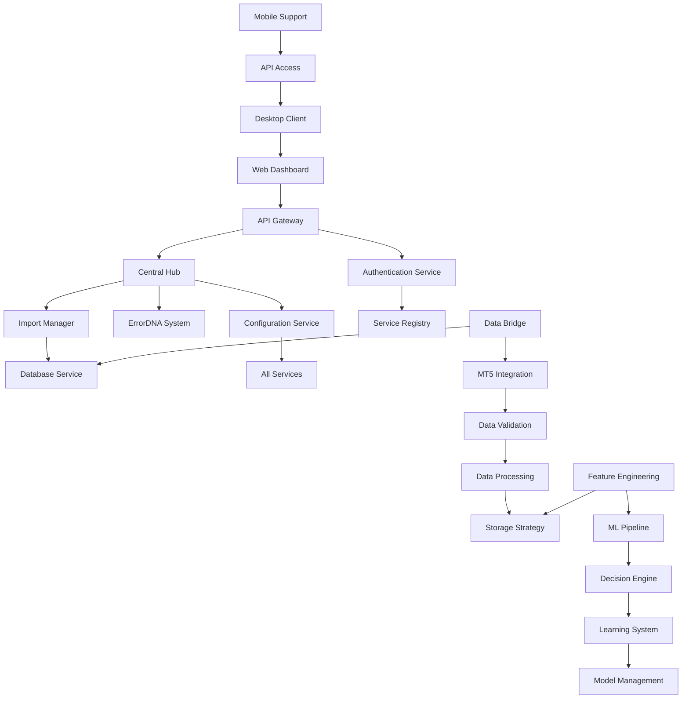

# Plan2 Implementation Roadmap: Hybrid AI Trading Platform

## Executive Summary

This implementation roadmap provides a comprehensive plan for developing the hybrid AI trading platform based on Plan2 LEVEL specifications. The approach follows a five-level architecture strategy focusing on business-ready performance targets and proven infrastructure migration.

## Architecture Design Patterns

### 1. Layered Architecture Pattern (Plan2 LEVELS)

```yaml
Architecture Levels:
  LEVEL_1_FOUNDATION:    # Infrastructure Core & Database Foundation
  LEVEL_2_CONNECTIVITY:  # API Gateway & Service Integration
  LEVEL_3_DATA_FLOW:     # MT5 Integration & Data Processing
  LEVEL_4_INTELLIGENCE:  # AI/ML Pipeline & Decision Engine
  LEVEL_5_USER_INTERFACE: # Web Dashboard & Mobile Support
```

### 2. Migration Strategy Pattern (Three-Tier Approach)

```yaml
TIER_1_DIRECT_ADOPTION:  # Existing → New (2-3 days each)
  - Central Hub (client_side/ → core/infrastructure/)
  - Database Service (Port 8006)
  - Data Bridge (Port 8001)
  - Import Manager → dependency-injection-system
  - ErrorDNA System → advanced-error-handling

TIER_2_ENHANCEMENT_INTEGRATION: # Existing → Enhanced (4-7 days each)
  - API Gateway (Port 8000) → ai-aware-gateway
  - Trading Engine (Port 8007) → ai-trading-engine
  - AI Orchestration (Port 8003) → multi-model-orchestrator
  - Performance Analytics (Port 8002) → ai-performance-analytics

TIER_3_NEW_DEVELOPMENT: # New Services (4-12 days each)
  - Configuration Service (Port 8012)
  - Feature Engineering (Port 8011)
  - ML Services (Ports 8013, 8022)
  - Pattern Validator (Port 8015)
  - Telegram Service (Port 8016)
```

### 3. Event-Driven Architecture Pattern

```yaml
Event_Streaming:
  Primary: Apache Kafka (high-throughput trading events)
  Secondary: NATS (low-latency internal messaging)

Event_Store:
  Technology: EventStore or Apache Pulsar
  Purpose: Event sourcing for audit compliance
  Retention: 7 years (regulatory requirement)

Event_Patterns:
  - Domain Events: TradingExecuted, RiskThresholdBreached
  - Integration Events: MarketDataReceived, MLPredictionGenerated
  - Command Events: ExecuteTrade, UpdateRiskLimits
```

## Service Dependencies and Integration Points

### Core Infrastructure Dependencies



### Integration Points Matrix

| Level | Component | Dependencies | Provides To | Critical Path |
|-------|-----------|-------------|-------------|---------------|
| L1 | Central Hub | None | All Services | ✅ Foundation |
| L1 | Database Service | Central Hub | Data Layer | ✅ Foundation |
| L2 | API Gateway | L1 Complete | All External Access | ✅ Critical |
| L2 | Authentication | API Gateway | Security Layer | ✅ Critical |
| L3 | MT5 Integration | L2 Complete | Market Data | ✅ Critical |
| L3 | Data Processing | MT5 + Database | AI Input | ✅ Critical |
| L4 | ML Pipeline | L3 Complete | AI Decisions | ✅ Critical |
| L4 | Decision Engine | ML Pipeline | Trading Logic | ✅ Critical |
| L5 | Web Dashboard | L4 Complete | User Interface | Standard |
| L5 | Mobile Support | Web Dashboard | Mobile Access | Optional |

## Technology Stack Requirements

### LEVEL 1 - Foundation Infrastructure

```yaml
Core_Technologies:
  Language: Python 3.9+
  Framework: FastAPI
  Database: PostgreSQL (primary), ClickHouse, DragonflyDB, Weaviate, ArangoDB
  Containerization: Docker + Docker Compose
  Message_Queue: Redis (basic), Apache Kafka (advanced)

Infrastructure_Components:
  Central_Hub:
    Purpose: Revolutionary infrastructure management pattern
    Migration: Namespace change only (client_side → core.infrastructure)
    Timeline: 2 days
    Risk: Very Low

  Database_Service:
    Purpose: Multi-DB support coordination
    Technology: PostgreSQL connection pooling
    Timeline: 1 day
    Risk: Very Low

  Import_Manager:
    Purpose: Centralized dependency injection
    Migration: Direct copy with adaptation
    Timeline: 1 day
    Risk: Very Low
```

### LEVEL 2 - Connectivity Services

```yaml
API_Gateway:
  Technology: Kong Enterprise or Envoy Proxy
  Features:
    - Rate limiting with Redis
    - Circuit breaker integration
    - OAuth2/OIDC integration
    - Multi-tenant routing
  Timeline: 5 days
  Risk: Medium

Authentication_Service:
  Technology: JWT with FastAPI
  Features:
    - Multi-factor authentication
    - Role-based access control
    - Session management
  Timeline: 3 days
  Risk: Low

Service_Registry:
  Technology: Consul or Eureka
  Purpose: Service discovery and health checks
  Timeline: 2 days
  Risk: Low
```

### LEVEL 3 - Data Flow Pipeline

```yaml
MT5_Integration:
  Technology: Python MT5 API + WebSocket
  Performance: 50+ ticks/second (target improvement from 18+)
  Features:
    - Real-time market data streaming
    - Multi-source data aggregation
    - Data validation and cleaning
  Timeline: 3 days
  Risk: Low (existing proven base)

Data_Processing:
  Technology: pandas, numpy, Apache Kafka
  Features:
    - Real-time data transformation
    - Multi-user data isolation
    - Performance optimization
  Timeline: 4 days
  Risk: Medium

Storage_Strategy:
  Primary: PostgreSQL (OLTP)
  Analytics: ClickHouse (OLAP)
  Cache: DragonflyDB (Redis-compatible)
  Vector: Weaviate (AI embeddings)
  Graph: ArangoDB (relationships)
  Timeline: 2 days
  Risk: Low
```

### LEVEL 4 - AI Intelligence Stack

```yaml
Feature_Engineering:
  Technology: Python, TA-Lib, pandas, numpy
  Indicators: RSI, MACD, SMA, EMA, Bollinger Bands
  Performance: <50ms for 5 technical indicators
  Timeline: 8 days
  Risk: Medium

ML_Pipeline:
  Supervised: XGBoost, LightGBM, Random Forest
  Deep_Learning: LSTM, Transformer, CNN models
  Technology: scikit-learn, PyTorch, TensorFlow
  Performance: <100ms supervised, <200ms deep learning
  Timeline: 10-12 days
  Risk: Medium-High

Decision_Engine:
  Technology: Python ensemble methods
  Features:
    - Real-time AI predictions
    - Risk assessment integration
    - Confidence scoring
  Performance: <15ms AI decision making
  Timeline: 6 days
  Risk: Medium
```

### LEVEL 5 - User Interface Layer

```yaml
Web_Dashboard:
  Technology: React + TypeScript, Chart.js
  Features:
    - Real-time analytics visualization
    - WebSocket updates <10ms
    - Mobile-responsive design
  Performance: <200ms load time
  Timeline: 7 days
  Risk: Low

Desktop_Client:
  Technology: Electron or Tauri
  Features:
    - Native Windows integration
    - Offline capabilities
    - Real-time synchronization
  Timeline: 5 days
  Risk: Medium

Telegram_Integration:
  Technology: python-telegram-bot
  Features:
    - 10 enhanced commands
    - Real-time notifications
    - Multi-user support
  Timeline: 5 days
  Risk: Low
```

## Performance Targets and Specifications

### Business-Ready Performance Framework

```yaml
Enhanced_Performance_Targets:
  AI_Decision_Making: "<15ms (99th percentile) [85% improvement from 100ms]"
  Order_Execution: "<1.2ms (99th percentile) [76% improvement from 5ms]"
  Data_Processing: "50+ ticks/second [178% improvement from 18+ baseline]"
  System_Availability: "99.99% [enhanced reliability]"
  Pattern_Recognition: "<25ms (99th percentile)"
  Risk_Assessment: "<12ms (99th percentile)"

Scalability_Targets:
  Concurrent_Users: "2000+ [100% increase]"
  Requests_Per_Second: "20,000+ [100% increase]"
  Memory_Efficiency: "95%+ under load"

Performance_Validation_Framework:
  Database_Performance:
    - PostgreSQL: <10ms query response
    - ClickHouse: <100ms analytics query
    - DragonflyDB: <1ms cache access

  API_Performance:
    - REST APIs: <50ms response time
    - WebSocket: <10ms message latency
    - Authentication: <20ms token validation

  ML_Performance:
    - Feature Generation: <50ms for 5 indicators
    - Model Inference: <100ms supervised, <200ms deep learning
    - End-to-end AI Decision: <15ms
```

### Resource Requirements

```yaml
Development_Environment:
  CPU: 8+ cores recommended
  RAM: 16GB+ recommended
  Storage: 100GB+ SSD
  Network: Stable internet for MT5 data

Production_Environment:
  Application_Servers: 3-node cluster
  Database_Cluster: PostgreSQL primary + 2 replicas
  Cache_Layer: Redis/DragonflyDB cluster (3 nodes)
  Load_Balancer: nginx with SSL termination
  Monitoring: Prometheus + Grafana + ELK Stack
```

## Implementation Sequence

### Phase 0: Pre-Development (Days -5 to 0)

```yaml
Week_0_Preparation:
  Day_-5: Project structure setup in /aitrading/v2/
  Day_-4: Development environment configuration
  Day_-3: Existing code audit and validation
  Day_-2: Team training and context alignment
  Day_-1: Final preparation and risk assessment
  Day_0: Project kickoff and infrastructure start
```

### Phase 1: Foundation Infrastructure (Days 1-5)

```yaml
LEVEL_1_FOUNDATION:
  Day_1:
    Morning: Central Hub migration and configuration
    Afternoon: Import Manager and ErrorDNA integration
    Deliverables: core/infrastructure/ working

  Day_2:
    Morning: Database Service integration (all 5 databases)
    Afternoon: Connection pooling and health checks
    Deliverables: Multi-DB connectivity validated

  Day_3:
    Morning: Data Bridge setup and MT5 WebSocket integration
    Afternoon: Data streaming pipeline and ChainRegistry
    Deliverables: 18+ ticks/second performance baseline

  Day_4:
    Morning: API Gateway configuration and routing
    Afternoon: Service-to-service communication testing
    Deliverables: Gateway integration complete

  Day_5:
    Morning: End-to-end infrastructure testing
    Afternoon: Performance benchmarking and optimization
    Deliverables: Foundation ready for Level 2

Phase_1_Success_Criteria:
  ✅ All services start successfully (<6 seconds)
  ✅ Health checks return green status
  ✅ MT5 data flowing to database successfully
  ✅ API Gateway routing all requests properly
  ✅ Performance benchmarks within 10% of existing
  ✅ No critical bugs or security issues
```

### Phase 2: AI Intelligence Development (Days 6-20)

```yaml
LEVEL_2_CONNECTIVITY (Days 6-10):
  Day_6: Authentication service and JWT implementation
  Day_7: Service registry and discovery setup
  Day_8: Inter-service communication optimization
  Day_9: Multi-tenant routing and rate limiting
  Day_10: Security validation and testing

LEVEL_3_DATA_FLOW (Days 11-15):
  Day_11: Enhanced MT5 integration (50+ ticks/second)
  Day_12: Data validation and cleaning pipeline
  Day_13: Multi-user data processing and isolation
  Day_14: Advanced storage strategy implementation
  Day_15: Data flow optimization and testing

LEVEL_4_INTELLIGENCE (Days 16-20):
  Day_16: Feature Engineering service (5 technical indicators)
  Day_17: ML Pipeline development (supervised models)
  Day_18: Decision Engine implementation
  Day_19: Learning System and Model Management
  Day_20: AI integration testing and optimization

Phase_2_Success_Criteria:
  ✅ AI Decision Making: <15ms achieved
  ✅ All ML services operational with >60% accuracy
  ✅ End-to-end AI workflow functional
  ✅ Multi-user data isolation working
  ✅ Performance targets met across all levels
```

### Phase 3: User Experience Development (Days 21-30)

```yaml
LEVEL_5_USER_INTERFACE (Days 21-30):
  Day_21-23: Web Dashboard development (React + TypeScript)
  Day_24-25: Real-time WebSocket integration
  Day_26-27: Telegram Bot enhancement (10 commands)
  Day_28-29: Desktop Client development
  Day_30: Mobile support and final integration

Phase_3_Success_Criteria:
  ✅ Web Dashboard: <200ms load time
  ✅ WebSocket Updates: <10ms latency
  ✅ Telegram Bot: All commands working
  ✅ Mobile-responsive design complete
  ✅ End-to-end user experience validated
```

## Risk Management Framework

### High-Priority Risks

```yaml
R001_Infrastructure_Integration:
  Description: Central Hub and Database Service integration failure
  Probability: Medium (30%)
  Impact: Critical
  Mitigation:
    - Deep code audit in Week 0
    - Parallel development track backup
    - Hybrid approach fallback
  Contingency: Switch to new development if integration fails by Day 3

R002_AI_Pipeline_Complexity:
  Description: ML pipeline development more complex than estimated
  Probability: Medium-High (40%)
  Impact: High
  Mitigation:
    - Phased ML development starting with simplest models
    - Pre-trained models as backup
    - External ML services fallback
  Contingency: Reduce complexity or defer advanced AI features

R003_Performance_Degradation:
  Description: Performance targets not met during integration
  Probability: Medium (30%)
  Impact: Medium
  Mitigation:
    - Daily performance benchmarking
    - Automated alerts for regression
    - Rollback triggers configured
  Contingency: Performance optimization sprint if targets missed
```

### Go/No-Go Decision Points

```yaml
Week_1_Infrastructure_Decision:
  Criteria:
    ✅ Central Hub successfully integrated
    ✅ Database Service connected to all databases
    ✅ Performance within 20% of existing
    ✅ No critical security vulnerabilities

Week_3_AI_Development_Decision:
  Criteria:
    ✅ At least 2 ML services operational
    ✅ Basic AI predictions >60% accuracy
    ✅ Trading Engine receiving AI inputs
    ✅ Performance targets <200ms predictions

Week_5_Production_Readiness_Decision:
  Criteria:
    ✅ All user-facing features functional
    ✅ System integration seamless
    ✅ Performance within acceptable limits
    ✅ Security validation complete
```

## Development Standards and Guidelines

### Human-AI Collaborative Development

```yaml
Development_Cycle:
  Morning_Session (4 hours):
    Phase_1 (30 min): Context Review
      - Review CLAUDE.md for project context
      - Validate previous day's changes
      - Plan tasks with human oversight

    Phase_2 (2.5 hours): AI Development
      - AI implements components with documentation
      - Generate code with testing
      - Update CLAUDE.md with decisions

    Phase_3 (1 hour): Human Validation
      - Review code quality and logic
      - Test functionality and performance
      - Approve or request modifications

Critical_Validation_Points:
  🔍 Trading Algorithm Logic: Human validation required
  🔍 Risk Management Parameters: Human review mandatory
  🔍 Financial Data Processing: Human verification essential
  🔍 Performance Critical Code: Human approval needed
```

### Task Decomposition Strategy

```yaml
DO_Manageable_Tasks:
  ✅ "Copy existing service and adapt for new functionality"
  ✅ "Add new endpoint to existing service"
  ✅ "Enhance existing configuration with new parameters"
  ✅ "Update Docker compose with new services"

AVOID_Overwhelming_Tasks:
  ❌ "Build complete system from scratch"
  ❌ "Rewrite entire architecture"
  ❌ "Create multiple services simultaneously"
  ❌ "Implement complex features without foundation"
```

### Quality Assurance Framework

```yaml
Testing_Strategy:
  Unit_Testing:
    - Coverage minimum 90% for AI-generated code
    - Mock external dependencies
    - Include edge case testing

  Integration_Testing:
    - Service-to-service communication
    - End-to-end workflow validation
    - Performance testing under load

  Performance_Testing:
    - Latency benchmarking per component
    - Throughput testing for data pipelines
    - Memory usage validation
    - Concurrent user capacity testing

Security_Validation:
  - Authentication and authorization testing
  - Input validation and sanitization
  - Data encryption verification
  - Network security validation
  - Compliance requirement validation
```

## Success Metrics and KPIs

### Technical Performance KPIs

```yaml
Performance_Metrics:
  AI_Decision_Latency: "<15ms (99th percentile)"
  Order_Execution_Speed: "<1.2ms (99th percentile)"
  Data_Processing_Rate: "50+ ticks/second"
  System_Availability: "99.99%"
  API_Response_Time: "<50ms (95th percentile)"
  Database_Query_Time: "<100ms average"

Quality_Metrics:
  Code_Coverage: ">90%"
  Bug_Density: "<1 bug per 1000 lines"
  Security_Vulnerabilities: "0 critical, <5 medium"
  Documentation_Coverage: ">80%"
  Test_Automation: ">95%"
```

### Business Success KPIs

```yaml
User_Experience_Metrics:
  User_Login_Success: ">98%"
  Feature_Adoption: ">75% for core features"
  User_Satisfaction: ">4.0/5.0 rating"
  Mobile_Compatibility: ">95% device support"

Operational_Metrics:
  Deployment_Success: ">99%"
  Mean_Time_to_Recovery: "<15 minutes"
  Change_Failure_Rate: "<5%"
  Lead_Time: "<2 days for features"
```

## Conclusion

This implementation roadmap provides a structured approach to developing the hybrid AI trading platform following Plan2 methodology. The five-level architecture ensures systematic progression from foundation infrastructure through user interface, with clear dependencies, performance targets, and risk mitigation strategies.

Key success factors:
1. **Foundation First**: Solid infrastructure migration before new development
2. **Performance Focus**: <15ms AI decisions and enhanced system performance
3. **Risk Management**: Proactive risk identification and mitigation strategies
4. **Human-AI Collaboration**: Structured validation for critical trading logic
5. **Incremental Delivery**: Phase-gate approach with clear success criteria

The roadmap balances ambitious performance targets with practical implementation strategies, leveraging existing proven components while introducing advanced AI capabilities for next-generation trading platform development.