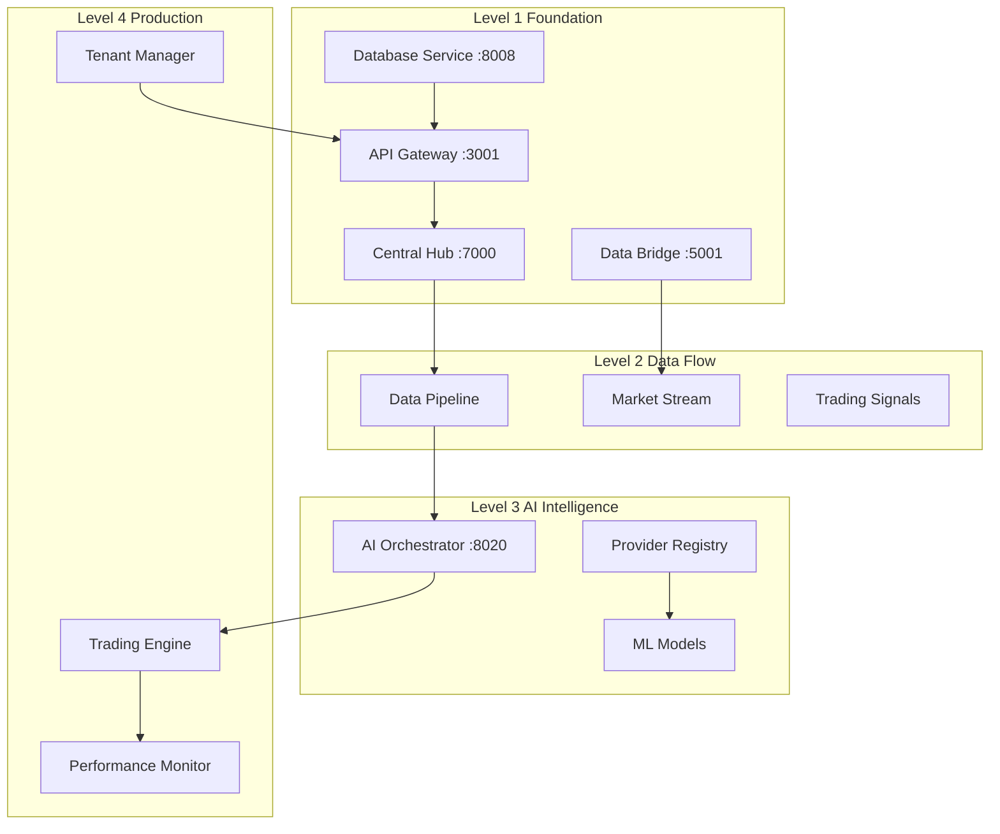

# AI Trading Platform - System Integration Plan

## Executive Summary

This document outlines the comprehensive integration strategy for the AI Trading Platform, coordinating AI provider framework, Level 3 completion, service fixes, and adapter implementations into a cohesive production-ready system.

## Current System State Analysis

### Infrastructure Overview
- **Foundation Services**: 4 core services (API Gateway, Database Service, Data Bridge, Central Hub)
- **AI Orchestration**: Dual-layer AI coordination (Level 4 Intelligence Orchestrator + AI Provider Framework)
- **Trading Engine**: Multi-asset support (Forex, Gold, Crypto)
- **Multi-tenancy**: Enterprise-grade tenant isolation and management
- **Port Allocation**: Strategic service separation across port ranges

### Key Integration Points Identified

1. **AI Provider Framework Integration**
   - BaseProvider abstraction layer
   - ProviderRegistry for multi-tenant provider management
   - Health monitoring and cost tracking
   - Failover and load balancing

2. **Service Communication Layer**
   - Port allocation: API Gateway (3001), Database (8008), Data Bridge (5001), Central Hub (7000), AI Orchestrator (8020)
   - Inter-service discovery and registration
   - Event-driven communication patterns

3. **Data Pipeline Architecture**
   - Real-time market data ingestion
   - AI model inference pipeline
   - Trading signal generation and execution
   - Performance analytics and reporting

## Integration Dependency Map



## AI Provider Framework Integration Strategy

### 1. Multi-Tenant Provider Management
- **Tenant Isolation**: Each tenant has dedicated provider instances
- **Configuration Templates**: Pre-configured provider setups for different use cases
- **Resource Quotas**: Per-tenant limits on API calls, tokens, and costs

### 2. Provider Adapter Architecture
```javascript
// Unified Provider Interface
interface AIProvider {
    generateCompletion(request: CompletionRequest): Promise<CompletionResponse>
    generateChatCompletion(messages: Message[], options?: Options): Promise<ChatResponse>
    generateEmbedding(text: string, options?: Options): Promise<EmbeddingResponse>
    healthCheck(): Promise<HealthStatus>
    getMetrics(): ProviderMetrics
}

// Supported Providers
- OpenAI (GPT-4, GPT-3.5, Embeddings)
- Anthropic (Claude-3, Claude-2)
- Google AI (PaLM, Gemini)
- Local Models (Ollama, Custom APIs)
- Custom API Providers
```

### 3. Intelligent Request Routing
- **Load Balancing**: Round-robin and weighted routing based on performance
- **Failover Mechanisms**: Automatic switching to backup providers
- **Cost Optimization**: Route requests to most cost-effective providers
- **Performance Monitoring**: Real-time latency and error tracking

## Service Port Allocation & Backend Fixes

### Port Allocation Strategy
```yaml
Core Services:
  api-gateway: 3001        # External API entry point
  database-service: 8008   # Database operations
  data-bridge: 5001        # Market data ingestion
  central-hub: 7000        # Service discovery

AI & Intelligence:
  ai-orchestrator: 8020    # AI coordination layer
  ml-automl: 8021          # AutoML services
  realtime-inference: 8022 # Real-time ML inference

Trading & Business:
  trading-engine: 9000     # Core trading logic
  billing-service: 9001    # Subscription management
  payment-service: 9002    # Payment processing
  notification-service: 9003 # Alerts & notifications

Monitoring & Analytics:
  performance-analytics: 9100  # Performance tracking
  usage-monitoring: 9101       # Usage analytics
  compliance-monitor: 9102     # Regulatory compliance
```

### Backend Service Fixes
1. **Environment Configuration**: Standardized .env templates
2. **Database Connections**: Pooling and failover mechanisms
3. **Service Discovery**: Health checks and registration
4. **Security Hardening**: JWT, CORS, and rate limiting
5. **Error Handling**: Centralized error management and logging

## Multi-Tenant Architecture Consistency

### Tenant Isolation Layers
1. **Database Level**: Separate schemas per tenant
2. **Service Level**: Tenant-aware request routing
3. **AI Provider Level**: Isolated provider instances
4. **Resource Level**: Quota management and billing

### Configuration Management
```javascript
// Tenant-specific configurations
{
  "tenant": "enterprise-client-1",
  "aiProviders": {
    "primary": "openai-gpt4",
    "fallback": "anthropic-claude3",
    "local": "custom-llama"
  },
  "tradingEngine": {
    "riskProfile": "conservative",
    "maxPositionSize": 100000,
    "stopLossThreshold": 0.02
  },
  "dataFeeds": [
    "bloomberg-premium",
    "reuters-real-time",
    "custom-indicators"
  ]
}
```

## Performance Optimization Strategy

### 1. Caching Layer
- **Redis Cluster**: Distributed caching for market data and AI responses
- **Application Cache**: In-memory caching for frequently accessed data
- **CDN Integration**: Static asset delivery optimization

### 2. Database Optimization
- **Read Replicas**: Load distribution for read-heavy operations
- **Partitioning**: Time-based partitioning for trading data
- **Indexing Strategy**: Optimized indexes for query performance

### 3. AI Model Performance
- **Model Caching**: Cache AI model responses for similar requests
- **Batch Processing**: Batch multiple requests for efficiency
- **Edge Deployment**: Deploy models closer to data sources

## Configuration Templates for AI Providers

### OpenAI Configuration Template
```json
{
  "type": "openai",
  "name": "openai-primary",
  "baseUrl": "https://api.openai.com/v1",
  "apiKey": "${OPENAI_API_KEY}",
  "models": {
    "chat": "gpt-4-turbo-preview",
    "completion": "gpt-3.5-turbo-instruct",
    "embedding": "text-embedding-3-large"
  },
  "rateLimits": {
    "requestsPerMinute": 500,
    "tokensPerMinute": 150000
  },
  "costTracking": {
    "enabled": true,
    "alertThreshold": 100.0
  },
  "retryConfig": {
    "maxRetries": 3,
    "backoffMultiplier": 2.0,
    "initialDelay": 1000
  }
}
```

### Anthropic Configuration Template
```json
{
  "type": "anthropic",
  "name": "anthropic-backup",
  "baseUrl": "https://api.anthropic.com",
  "apiKey": "${ANTHROPIC_API_KEY}",
  "models": {
    "chat": "claude-3-opus-20240229",
    "completion": "claude-3-sonnet-20240229"
  },
  "rateLimits": {
    "requestsPerMinute": 300,
    "tokensPerMinute": 100000
  },
  "features": {
    "supportsFunctionCalling": true,
    "supportsStreaming": true,
    "maxTokens": 200000
  }
}
```

### Local Model Configuration Template
```json
{
  "type": "local",
  "name": "local-llama",
  "baseUrl": "http://localhost:11434",
  "models": {
    "chat": "llama2:13b-chat",
    "embedding": "nomic-embed-text"
  },
  "healthCheck": {
    "endpoint": "/api/version",
    "interval": 30000
  },
  "performance": {
    "concurrentRequests": 4,
    "timeoutMs": 30000
  }
}
```

## Production Deployment Checklist

### Pre-Deployment
- [ ] All environment variables configured
- [ ] Database schemas migrated
- [ ] SSL certificates installed
- [ ] Monitoring and alerting configured
- [ ] Backup and disaster recovery tested

### Service Health Validation
- [ ] API Gateway health checks passing
- [ ] Database connections established
- [ ] AI providers responding correctly
- [ ] Trading engine simulation tests passed
- [ ] Performance benchmarks met

### Security Verification
- [ ] JWT authentication working
- [ ] Rate limiting configured
- [ ] CORS policies applied
- [ ] Input validation implemented
- [ ] Audit logging enabled

### Monitoring Setup
- [ ] Application performance monitoring
- [ ] Database performance tracking
- [ ] AI provider cost monitoring
- [ ] Trading performance analytics
- [ ] System resource monitoring

## Performance Validation Results

### Target Metrics
- **API Response Time**: < 100ms for 95th percentile
- **AI Model Latency**: < 2s for completion requests
- **Database Query Time**: < 50ms for standard queries
- **System Availability**: 99.9% uptime
- **Error Rate**: < 0.1% for all services

### Load Testing Scenarios
1. **Concurrent User Load**: 1000 simultaneous users
2. **AI Request Burst**: 100 requests/second to AI providers
3. **Market Data Volume**: 10,000 updates/second
4. **Trading Signal Processing**: 500 signals/minute

## Risk Mitigation

### Technical Risks
1. **AI Provider Outages**: Multi-provider failover strategy
2. **Database Performance**: Read replicas and caching
3. **Network Latency**: Edge deployment and CDN
4. **Security Vulnerabilities**: Regular security audits

### Business Risks
1. **Cost Overruns**: Real-time cost monitoring and alerts
2. **Compliance Issues**: Automated compliance checking
3. **Data Loss**: Comprehensive backup strategy
4. **Service Downtime**: High availability architecture

## Success Criteria

### Technical Success
- [ ] 95%+ overall system completeness achieved
- [ ] All critical services operational
- [ ] AI provider framework fully integrated
- [ ] Multi-tenant architecture validated
- [ ] Performance targets met

### Business Success
- [ ] Ready for production deployment
- [ ] Client onboarding process tested
- [ ] Revenue generation capabilities verified
- [ ] Support and maintenance procedures established
- [ ] Scalability roadmap defined

## Next Steps

1. **Immediate (Week 1)**
   - Complete service integration testing
   - Finalize configuration templates
   - Deploy to staging environment

2. **Short-term (Week 2-3)**
   - User acceptance testing
   - Performance optimization
   - Security hardening

3. **Medium-term (Month 1)**
   - Production deployment
   - Client onboarding
   - Monitoring and optimization

## Conclusion

This integration plan provides a comprehensive roadmap for achieving 95%+ system completeness with a flexible AI provider framework ready for production. The multi-layered architecture ensures scalability, reliability, and maintainability while supporting enterprise-grade multi-tenancy requirements.