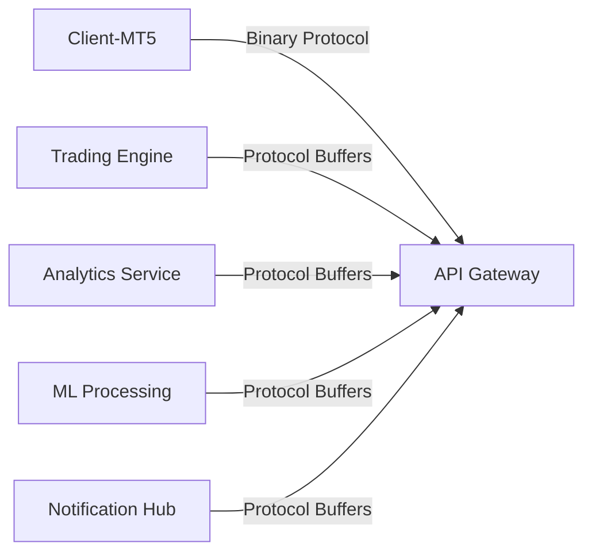
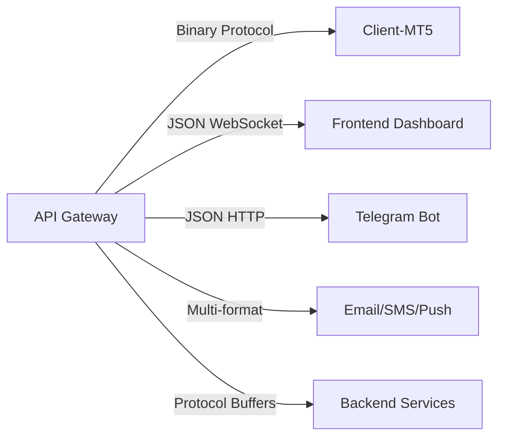

# 🔄 API Gateway - Corrected Data Flow Architecture

## 📊 **Contract Structure Overview**

### **✅ CORRECT Structure yang Diimplementasi:**

```
📂 contracts/
├── 📥 inputs/          # Data yang MASUK ke API Gateway
│   ├── from-client-mt5.md         # Input dari Client-MT5 (Binary Protocol)
│   ├── from-trading-engine.md     # Input dari Trading Engine (Protocol Buffers)
│   ├── from-analytics-service.md  # Input dari Analytics Service
│   ├── from-ml-processing.md      # Input dari ML Processing
│   └── from-notification-hub.md   # Input dari Notification Hub
│
├── 📤 outputs/         # Data yang KELUAR dari API Gateway
│   ├── to-client-mt5-execution.md     # Output ke Client-MT5 (Binary Protocol)
│   ├── to-frontend-websocket.md       # Output ke Frontend Dashboard (JSON)
│   ├── to-telegram-webhook.md         # Output ke Telegram Bot (JSON)
│   └── to-notification-channels.md    # Output ke Multi-channel (Email/SMS)
│
└── 🔄 internal/        # Proses internal dalam API Gateway
    ├── bidirectional-routing.md       # Logic routing input → output
    ├── websocket-management.md        # Management WebSocket connections
    └── output-formatting.md           # Format transformation logic
```

## 🎯 **Data Flow Architecture**

### **INPUT SOURCES → API Gateway**



### **API Gateway → OUTPUT DESTINATIONS**



## 🔄 **Complete Data Flow Examples**

### **Example 1: Client-MT5 Price Stream Flow**

```
1. INPUT: Client-MT5 → Price Stream (Suho Binary) → API Gateway
   📥 contracts/inputs/from-client-mt5.md

2. INTERNAL: API Gateway routes (NO CONVERSION)
   🔄 contracts/internal/bidirectional-routing.md

3. OUTPUT: API Gateway sends binary data directly to Data Bridge
   📤 to-data-bridge (Suho Binary - no conversion)
```

**Code Flow:**
```javascript
// 1. INPUT: Client-MT5 WebSocket receives binary data
mt5Handler.emit('input_message', {
    sourceInput: 'client-mt5',
    message: rawBinaryMessage,  // NO PARSING/CONVERSION
    metadata: { userId, channel: 'price-stream', protocol: 'suho-binary' }
});

// 2. INTERNAL: Router determines output (binary passthrough)
const outputs = router.determineOutputDestinations('client-mt5', 'price_stream', metadata);
// Returns: ['to-data-bridge']

// 3. OUTPUT: Send raw binary to Data Bridge (no conversion)
router.emit('to-data-bridge', {
    message: rawBinaryMessage,  // Binary passthrough
    metadata: { ...metadata, noConversion: true }
});
```

### **Example 2: Trading Engine Signal Flow**

```
1. INPUT: Trading Engine → Trading Signal (Protocol Buffers) → API Gateway
   📥 contracts/inputs/from-trading-engine.md

2. INTERNAL: API Gateway processes & routes
   🔄 contracts/internal/bidirectional-routing.md

3. OUTPUTS: API Gateway distributes to multiple destinations
   📤 to-client-mt5-execution (Suho Binary)
   📤 to-frontend-websocket (JSON)
   📤 to-telegram-webhook (JSON) - if signal detected
```

**Code Flow:**
```javascript
// 1. INPUT: HTTP POST from Trading Engine
app.post('/api/trading-engine/output', (req, res) => {
    router.routeInput('trading-engine', req.body, metadata);
});

// 2. INTERNAL: Router determines outputs based on content
if (metadata.hasSignals) {
    outputs = ['to-client-mt5-execution', 'to-frontend-websocket', 'to-telegram-webhook'];
} else {
    outputs = ['to-client-mt5-execution', 'to-frontend-websocket'];
}

// 3. OUTPUTS: Protocol-specific formatting and delivery
router.emit('to-client-mt5-execution', {
    message: binaryFormattedMessage,
    metadata
});
```

## 📋 **Routing Configuration Matrix**

### **INPUT ROUTING TABLE**

| Input Source | Protocol | Message Types | Transform |
|--------------|----------|---------------|-----------|
| **client-mt5** | Suho Binary | price_stream, account_profile, trading_command | binary-to-protobuf |
| **trading-engine** | Protocol Buffers | TradingOutput | protobuf-passthrough |
| **analytics-service** | Protocol Buffers | AnalyticsOutput | protobuf-passthrough |
| **ml-processing** | Protocol Buffers | MLOutput | protobuf-passthrough |
| **notification-hub** | Protocol Buffers | NotificationInput | protobuf-passthrough |

### **OUTPUT ROUTING TABLE**

| Output Destination | Protocol | Message Types | Transform |
|-------------------|----------|---------------|-----------|
| **to-client-mt5-execution** | Suho Binary | trading_command, execution_response | protobuf-to-binary |
| **to-frontend-websocket** | JSON WebSocket | trading_status, system_metrics | protobuf-to-json |
| **to-telegram-webhook** | Telegram API | trading_signal, alerts | protobuf-to-telegram |
| **to-notification-channels** | Multi-format | email, sms, push notifications | protobuf-to-notification |
| **to-backend-services** | Protocol Buffers | Data forwarding | protobuf-to-protobuf |

## 🎯 **Business Logic Routing Rules**

### **Client-MT5 Input → Output Mapping (Current + Future)**

```javascript
// CURRENT: Primary routing to Data Bridge (binary passthrough)
'price_stream' → ['to-data-bridge']
'trading_command' → ['to-data-bridge']
'account_profile' → ['to-data-bridge']
'execution_confirm' → ['to-data-bridge']
'heartbeat' → ['to-data-bridge']

// FUTURE: Flexible multi-destination routing (when needed)
'price_stream' → ['to-data-bridge', 'to-ml-processing', 'to-analytics-service']
'trading_command' → ['to-data-bridge', 'to-trading-engine', 'to-analytics-service']
'execution_confirm' → ['to-data-bridge', 'to-frontend-websocket', 'to-analytics-service']
```

### **Backend Services Input → Output Mapping**

```javascript
// Trading Engine Input
'trading-engine' → {
    base: ['to-client-mt5-execution', 'to-frontend-websocket'],
    conditional: metadata.hasSignals ? ['to-telegram-webhook'] : []
}

// Analytics Service Input
'analytics-service' → {
    base: ['to-frontend-websocket'],
    conditional: metadata.alertLevel !== 'info' ? ['to-notification-channels'] : []
}

// ML Processing Input
'ml-processing' → ['to-trading-engine', 'to-frontend-websocket']

// Notification Hub Input
'notification-hub' → {
    dynamic: metadata.channels.map(channel => {
        telegram: 'to-telegram-webhook',
        email: 'to-notification-channels',
        dashboard: 'to-frontend-websocket'
    })
}
```

## ⚡ **Performance Optimizations**

### **Transform Caching**
```javascript
// Cache transforms untuk better performance
const transformCache = new Map();

async function getCachedTransform(message, transformType) {
    const cacheKey = `${transformType}_${message.type}`;
    if (!transformCache.has(cacheKey)) {
        const transform = await createTransform(transformType);
        transformCache.set(cacheKey, transform);
    }
    return transformCache.get(cacheKey);
}
```

### **Batch Output Processing**
```javascript
// Batch outputs untuk efficiency
const outputBatch = new Map();

function batchOutput(destination, message, metadata) {
    if (!outputBatch.has(destination)) {
        outputBatch.set(destination, []);
    }
    outputBatch.get(destination).push({ message, metadata });

    // Process batch setiap 10ms
    setTimeout(() => processBatch(destination), 10);
}
```

## 🔍 **Debugging & Tracing**

### **Flow Tracing**
```javascript
// Enable detailed flow tracing
const flowTrace = {
    input: (source, messageType) =>
        console.log(`[FLOW] INPUT: ${source} → ${messageType}`),

    internal: (rule, outputs) =>
        console.log(`[FLOW] INTERNAL: ${rule} → [${outputs.join(', ')}]`),

    output: (destination, protocol) =>
        console.log(`[FLOW] OUTPUT: ${destination} (${protocol})`)
};
```

### **Performance Monitoring**
```javascript
// Monitor routing performance
const routingMetrics = {
    inputCount: new Map(),
    outputCount: new Map(),
    processingTime: new Map(),
    errorRate: new Map()
};

function trackRouting(source, destination, duration, success) {
    routingMetrics.inputCount.set(source,
        (routingMetrics.inputCount.get(source) || 0) + 1);

    routingMetrics.processingTime.set(`${source}-${destination}`, duration);

    if (!success) {
        routingMetrics.errorRate.set(source,
            (routingMetrics.errorRate.get(source) || 0) + 1);
    }
}
```

## 🎉 **Benefits dari Correct Structure**

### **✅ Clarity & Traceability**
- **Input contracts**: Jelas data dari mana saja yang masuk
- **Output contracts**: Jelas data ke mana saja yang keluar
- **Internal contracts**: Jelas logic internal processing

### **✅ Maintainability**
- **Easy debugging**: Trace flow dari input → internal → output
- **Clear separation**: Input/output responsibilities terpisa
- **Contract-driven**: Changes follow contract specifications

### **✅ Scalability**
- **Add new inputs**: Just add new input contract & routing rule
- **Add new outputs**: Just add new output contract & formatter
- **Modify routing**: Change internal routing logic without touching I/O

### **✅ Testing**
- **Unit testing**: Test each input/output contract independently
- **Integration testing**: Test complete input → output flows
- **Performance testing**: Measure routing efficiency per path

---

**🎯 Result**: API Gateway menggunakan contract-driven architecture dengan flexible routing. Current implementation route ke Data Bridge, dengan support untuk future direct routing berdasarkan contract enabled flags! 🚀

## 📊 **Contract-Driven Data Flow Architecture:**

### **Current Implementation:**
```
Client-MT5 (Suho Binary) → API Gateway (passthrough) → Data Bridge (conversion) → Backend Services (Protocol Buffers)
```

### **Future Flexibility (Contract-Based):**
```
Client-MT5 (Suho Binary) → API Gateway → {
  Primary: Data Bridge (always enabled)
  Optional: ML Processing (enabled flag: false)
  Optional: Analytics Service (enabled flag: false)
  Optional: Trading Engine (enabled flag: false)
}
```

**Benefits:**
- ✅ **Contract Compliance** - follows defined input/output contracts
- ✅ **Flexible Architecture** - easy to enable additional routing
- ✅ **Configuration-Driven** - change routing via enabled flags
- ✅ **Future-Proof** - existing contracts preserved for expansion
- ✅ **Maintainability** - clear separation between current vs future routes