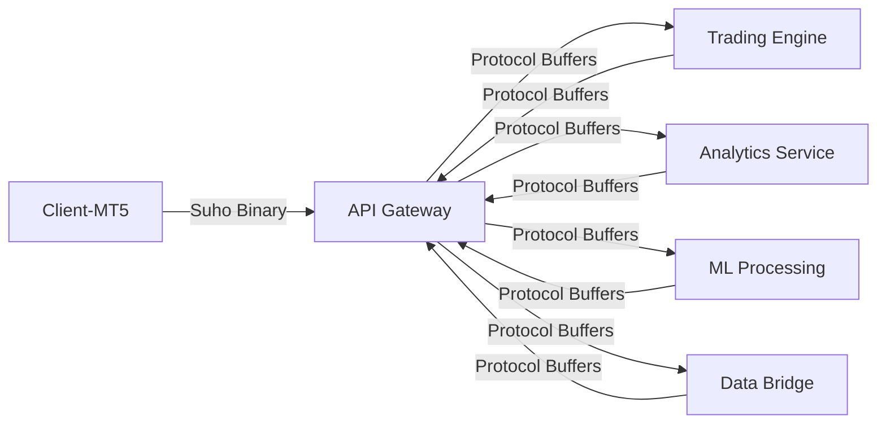

# 🔄 Shared Protocols - Suho AI Trading System

## 🎯 **Overview**

Central repository untuk semua protocol definitions yang digunakan di seluruh backend services:

- **Suho Binary Protocol**: Custom binary format untuk Client-MT5 (92% bandwidth reduction)
- **Protocol Buffers**: Standard communication untuk backend services
- **Generated Code**: Auto-generated code untuk Node.js, Python, dan Go

## 📁 **Directory Structure**

```
00-shared-protocols/
├── protobuf/                    # Protocol Buffer definitions
│   ├── trading.proto           # Core trading messages
│   ├── analytics.proto         # Analytics service messages
│   ├── ml-processing.proto     # ML service messages
│   └── notifications.proto     # Notification service messages
│
├── generated/                   # Auto-generated code
│   ├── nodejs/                 # TypeScript/JavaScript
│   ├── python/                 # Python classes
│   └── go/                     # Go structs
│
├── suho-binary/                # Suho Binary Protocol
│   ├── specs/                  # Protocol specifications
│   └── parsers/                # Language-specific parsers
│
└── package.json                # NPM package configuration
```

## 🚀 **Usage per Service**

### **Node.js Services (API Gateway, Trading Engine)**

```bash
# Install shared protocols
npm install @suho/shared-protocols

# Usage in code
import {
  PriceData,
  TradingCommand,
  ProtocolUtils,
  SuhoMessageType
} from '@suho/shared-protocols';

// Convert binary to protobuf
const price = ProtocolUtils.binaryToProtobufPrice(1095510);
console.log(price); // 10.95510
```

### **Python Services (ML Processing, Analytics)**

```bash
# Install shared protocols
pip install ./00-shared-protocols

# Usage in code
from shared_protocols import (
    SuhoSymbol,
    ProtocolUtils,
    SuhoBinaryParser,
    is_price_stream
)

# Parse binary packet
packet_data = SuhoBinaryParser.parse_price_stream(binary_packet)
if is_price_stream(packet_data):
    print(f"Received {len(packet_data['prices'])} prices")
```

### **Go Services (High-Performance Components)**

```bash
# Install shared protocols
go mod init your-service
go get ./00-shared-protocols/generated/go

# Usage in code
import "github.com/suho/trading/proto/trading/v1"

priceData := &trading.PriceData{
    Symbol: trading.Symbol_EURUSD,
    Bid:    1.09551,
    Ask:    1.09553,
}
```

## 🔧 **Protocol Conversion Flow**



## ⚡ **Performance Benefits**

### **Suho Binary Protocol**
- **92.2% bandwidth reduction** vs JSON
- **Sub-millisecond processing** (0.008ms serialize)
- **Fixed 144-byte packets** (predictable memory)
- **Native MT5 integration** (zero external dependencies)

### **Protocol Buffers**
- **3-5x faster** than JSON serialization
- **20-50% smaller** than JSON payloads
- **Type safety** across all languages
- **Backward compatibility** with versioning

## 🔄 **Data Flow Examples**

### **1. Client-MT5 Price Stream**
```
Client-MT5 → Suho Binary (144 bytes) → API Gateway → Protobuf → ML Processing
```

### **2. Trading Engine Signals**
```
Trading Engine → Protobuf → API Gateway → Suho Binary → Client-MT5
```

### **3. Analytics Reports**
```
Analytics → Protobuf → API Gateway → JSON WebSocket → Frontend Dashboard
```

## 🛠️ **Development Commands**

```bash
# Generate all language bindings
npm run generate

# Generate specific language
npm run generate:nodejs
npm run generate:python
npm run generate:go

# Build NPM package
npm run build

# Test protocols
npm run test

# Clean generated files
npm run clean
```

## 📋 **Protocol Versioning Strategy**

### **Version Format: MAJOR.MINOR.PATCH**

- **MAJOR**: Breaking changes (new message types)
- **MINOR**: New fields (backward compatible)
- **PATCH**: Bug fixes, documentation

### **Backward Compatibility Rules**

1. **Never remove fields** - mark as deprecated
2. **Always use optional fields** for new additions
3. **Maintain old enum values** when adding new ones
4. **Version check in parsers** for compatibility

### **Migration Process**

```javascript
// Version compatibility check
if (protocolVersion.major === 2) {
    // Use current protocol
    parseV2Message(data);
} else if (protocolVersion.major === 1) {
    // Convert from old protocol
    const converted = convertV1toV2(data);
    parseV2Message(converted);
}
```

## 🔧 **Integration Guidelines**

### **Adding New Message Types**

1. **Update protobuf definitions**
2. **Regenerate language bindings**
3. **Update router configurations**
4. **Add type guards and validators**
5. **Update documentation**

### **Adding New Services**

1. **Import shared protocols package**
2. **Use Protocol Buffer definitions**
3. **Follow routing conventions**
4. **Implement error handling**
5. **Add protocol tests**

## 🚨 **CRITICAL: Service Integration Rules**

### **✅ CORRECT Implementation**

**API Gateway** (`01-core-infrastructure/api-gateway`):
```javascript
import { PriceData, TradingCommand } from '@suho/shared-protocols';

// Convert Suho Binary → Protocol Buffers
const protobufMessage = convertBinaryToProtobuf(binaryData);
```

**Data Bridge** (`02-data-processing/data-bridge`):
```python
from shared_protocols import is_price_stream, ProtocolUtils

# Receive Protocol Buffers (NOT Schema Registry)
if is_price_stream(message):
    process_price_data(message)
```

**Trading Engine** (`03-trading-engine`):
```javascript
import { TradingEngineOutput } from '@suho/shared-protocols';

// Send Protocol Buffers to API Gateway
const output = new TradingEngineOutput();
output.user_id = userId;
output.signals = signals;
```

### **❌ WRONG Implementation**
```javascript
// DON'T: Use custom message formats
const customMessage = { type: 'price', data: [...] };

// DON'T: Use different protocols per service
const jsonMessage = JSON.stringify(data);
const xmlMessage = convertToXML(data);
```

## 📊 **Monitoring & Metrics**

### **Protocol Performance Tracking**

```javascript
// Add to all services
const protocolMetrics = {
    serializationTime: Date.now(),
    messageSize: Buffer.byteLength(serialized),
    protocolVersion: PROTOCOL_VERSION,
    messageType: message.constructor.name
};
```

### **Error Tracking**

```javascript
// Standardized error reporting
try {
    const parsed = parseProtocolMessage(data);
} catch (error) {
    if (error instanceof ProtocolError) {
        console.error(`Protocol Error [${error.code}]: ${error.message}`);
        metrics.protocolErrors.increment(error.code);
    }
}
```

## 🎯 **Result**

**Shared Protocols** menjamin:
- ✅ **Consistency** across semua services
- ✅ **Type safety** dengan auto-generated code
- ✅ **Performance** dengan optimized protocols
- ✅ **Maintainability** dengan centralized definitions
- ✅ **Scalability** dengan versioning strategy

---

**🚀 Next Steps**: Update semua services untuk menggunakan shared protocols package!