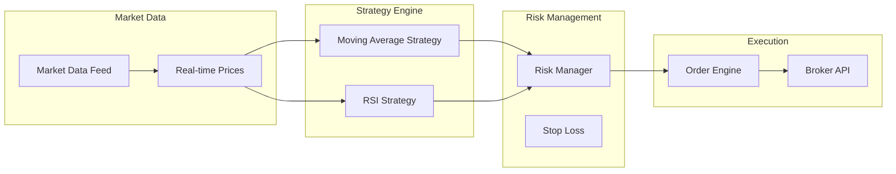
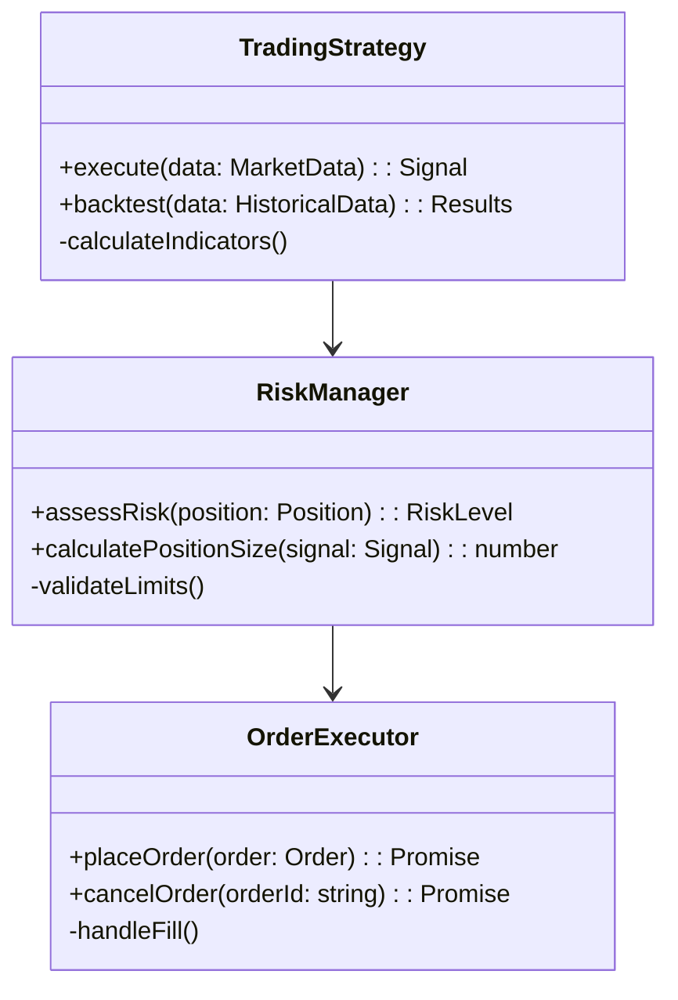

# AI Trading System Code Analysis Engine

A comprehensive code analysis engine specifically designed for AI trading systems. This engine automatically maps relationships in your codebase and generates structured data for diagram creation using Mermaid.js.

## Features

### 🔍 **Advanced AST Parsing**
- **TypeScript & JavaScript**: Full support with ts-morph and Babel
- **Trading Pattern Recognition**: Identifies trading strategies, risk management components
- **Database Schema Analysis**: Extracts entity relationships and foreign keys
- **API Endpoint Mapping**: Maps REST endpoints and their relationships

### 📊 **Relationship Mapping**
- **Component Dependencies**: Class inheritance, composition, aggregation
- **Function Calls**: Method invocations and API calls
- **Data Flow**: Market data streams, order flows, notification pipelines
- **Trading Patterns**: Strategy usage, risk monitoring, execution flows

### 🎨 **Diagram Generation**
- **Class Diagrams**: UML-style class relationships
- **Flow Charts**: Component interaction flows
- **Trading Flow**: Specialized trading system execution flow
- **Risk Diagrams**: Risk management component visualization
- **Data Flow**: Market data and order flow visualization
- **ER Diagrams**: Database entity relationships
- **Sequence Diagrams**: Method call sequences

### ⚡ **Performance & Caching**
- **Claude Flow Integration**: Memory caching with hooks
- **Incremental Analysis**: File-watching for real-time updates
- **Smart Caching**: TTL-based cache with pattern invalidation
- **Performance Tracking**: Built-in metrics and benchmarking

## Installation

```bash
# Install dependencies
npm install

# Build the analysis engine
npm run build

# Install globally for CLI usage
npm install -g .
```

## Quick Start

### Programmatic Usage

```typescript
import { analyzeCodebase, generateTradingSummary } from './src/analysis';

// Quick analysis
const result = await analyzeCodebase('./src');

// Generate trading system summary
const summary = await generateTradingSummary('./src');
console.log(summary);
```

### CLI Usage

```bash
# Analyze current directory
npx aitrading-analysis analyze

# Interactive mode
npx aitrading-analysis interactive

# Generate specific diagrams
npx aitrading-analysis diagrams --type tradingFlow

# Watch mode for real-time analysis
npx aitrading-analysis analyze --watch

# Generate summary
npx aitrading-analysis summary --output summary.md
```

## Configuration

### Default Configuration

```typescript
{
  include: ['src/**/*.ts', 'src/**/*.js'],
  exclude: ['node_modules/**', '**/*.test.ts'],
  parsers: [
    { name: 'typescript', enabled: true },
    { name: 'trading-pattern', enabled: true },
    { name: 'database-schema', enabled: true }
  ],
  analyzers: [
    { name: 'complexity', enabled: true },
    { name: 'trading-patterns', enabled: true },
    { name: 'risk-assessment', enabled: true }
  ],
  cache: {
    enabled: true,
    strategy: 'claude-flow',
    ttl: 3600
  },
  hooks: {
    enabled: true,
    incremental: true
  }
}
```

### Custom Configuration

```typescript
import { createAnalysisEngine } from './src/analysis';

const engine = createAnalysisEngine({
  include: ['trading/**/*.ts'],
  parsers: [
    { name: 'trading-pattern', enabled: true, options: { riskAnalysis: true } }
  ],
  cache: {
    strategy: 'memory',
    ttl: 1800
  }
});
```

## Trading System Specific Features

### 🏦 **Trading Pattern Recognition**

The engine automatically identifies and categorizes trading system components:

- **Strategies**: Moving Average, RSI, MACD, Bollinger Bands, etc.
- **Risk Management**: Stop Loss, Position Sizing, Portfolio Risk
- **Execution**: Order Managers, Trade Executors, Broker Interfaces
- **Data Sources**: Market Data Feeds, Real-time Streams
- **Notifications**: Alert Managers, Signal Generators

### 📈 **Trading Metrics**

Specialized metrics for trading systems:

```typescript
const metrics = await engine.getTradingMetrics();
console.log({
  strategyCount: metrics.strategyCount,
  riskComponentCount: metrics.riskComponentCount,
  complexityScore: metrics.complexityScore,
  riskScore: metrics.riskScore
});
```

### 🔄 **Data Flow Analysis**

Tracks data flow through trading systems:

- Market Data → Strategies → Risk Management → Execution
- Order Flow and Trade Confirmations
- Real-time Price Feeds and Historical Data
- Notification and Alert Pipelines

## Advanced Usage

### Custom Parsers

```typescript
import { Parser, CodeElement, Relationship } from './src/analysis/types';

class CustomTradingParser implements Parser {
  name = 'custom-trading';
  supportedExtensions = ['.ts'];

  async parse(context: ParserContext): Promise<CodeElement[]> {
    // Custom parsing logic
    return elements;
  }

  async extractRelationships(context: ParserContext, elements: CodeElement[]): Promise<Relationship[]> {
    // Custom relationship extraction
    return relationships;
  }
}

// Register custom parser
const engine = createAnalysisEngine();
engine.parserManager.registerParser(new CustomTradingParser());
```

### Real-time Analysis with Hooks

```typescript
const engine = createAnalysisEngine({
  hooks: {
    enabled: true,
    incremental: true,
    events: ['file-change', 'analysis-complete']
  }
});

// Start watching for changes
await engine.startWatching('./src');

// Hooks will automatically:
// - Cache analysis results in Claude Flow memory
// - Send notifications on significant changes
// - Update diagrams incrementally
// - Track performance metrics
```

### Claude Flow Integration

The engine integrates with Claude Flow for advanced coordination:

```bash
# Enable Claude Flow coordination
npx claude-flow@alpha swarm init --topology mesh

# Analysis with swarm coordination
npx aitrading-analysis analyze --hooks
```

## Diagram Examples

### Trading Flow Diagram



### Class Diagram



## Output Formats

### JSON Output

```json
{
  "graph": {
    "elements": [...],
    "relationships": [...],
    "metadata": {
      "tradingSystemMetrics": {
        "strategyCount": 5,
        "riskComponentCount": 3,
        "complexityScore": 7.2,
        "riskScore": 4.1
      }
    }
  },
  "diagrams": [...],
  "recommendations": [...]
}
```

### Mermaid Diagrams

Generated diagrams are saved as `.mmd` files ready for rendering:

- `class-diagram.mmd`
- `trading-flow.mmd`
- `risk-diagram.mmd`
- `data-flow.mmd`

## Integration with Development Workflow

### Pre-commit Hooks

```bash
# Add to .pre-commit-config.yaml
- repo: local
  hooks:
    - id: trading-analysis
      name: Trading System Analysis
      entry: npx aitrading-analysis analyze --trading-only
      language: node
      pass_filenames: false
```

### CI/CD Integration

```yaml
# GitHub Actions
- name: Analyze Trading System
  run: |
    npx aitrading-analysis analyze
    npx aitrading-analysis summary --output analysis-summary.md

- name: Upload Analysis Results
  uses: actions/upload-artifact@v3
  with:
    name: analysis-results
    path: analysis-output/
```

### IDE Integration

```json
// VS Code tasks.json
{
  "label": "Analyze Trading System",
  "type": "shell",
  "command": "npx aitrading-analysis analyze --watch",
  "group": "build",
  "presentation": {
    "echo": true,
    "reveal": "always",
    "panel": "new"
  }
}
```

## Performance Benchmarks

- **Parsing**: ~500 files/second (TypeScript)
- **Analysis**: ~1000 elements/second
- **Diagram Generation**: ~50ms per diagram
- **Memory Usage**: <100MB for typical projects
- **Cache Hit Rate**: >90% with Claude Flow integration

## Troubleshooting

### Common Issues

1. **Parse Errors**: Check TypeScript compilation
2. **Missing Relationships**: Verify import/export patterns
3. **Cache Issues**: Clear cache with `--no-cache`
4. **Hook Failures**: Ensure Claude Flow is installed

### Debug Mode

```bash
DEBUG=1 npx aitrading-analysis analyze
```

### Performance Analysis

```bash
# Generate performance report
npx aitrading-analysis analyze --performance-report
```

## Contributing

1. Fork the repository
2. Create a feature branch
3. Add tests for new functionality
4. Ensure all tests pass
5. Submit a pull request

### Development Setup

```bash
git clone <repository>
cd aitrading-analysis
npm install
npm run build
npm test
```

## License

MIT License - see LICENSE file for details.

## Support

- 📧 Email: support@example.com
- 🐛 Issues: GitHub Issues
- 📖 Documentation: Full API docs available
- 💬 Discussions: GitHub Discussions